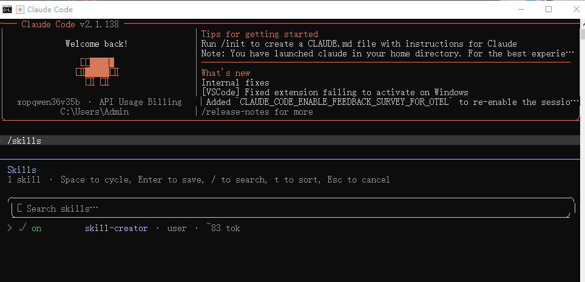
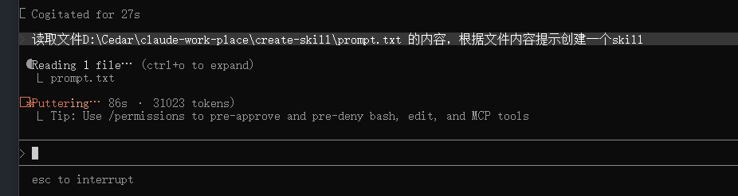
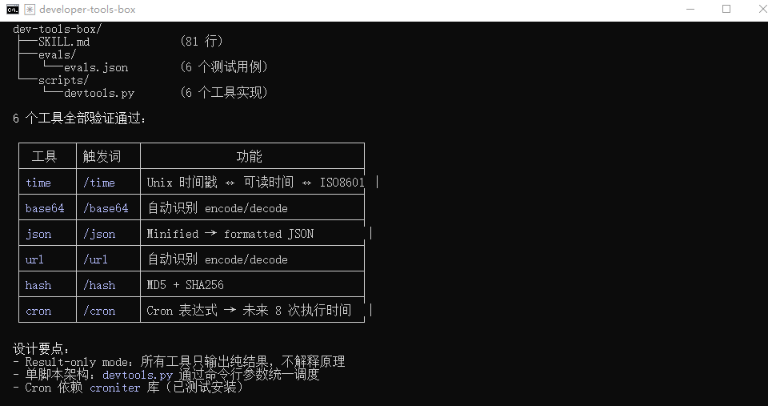
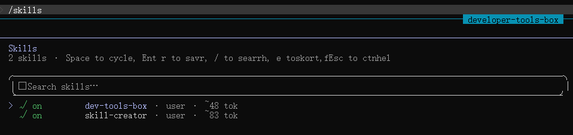
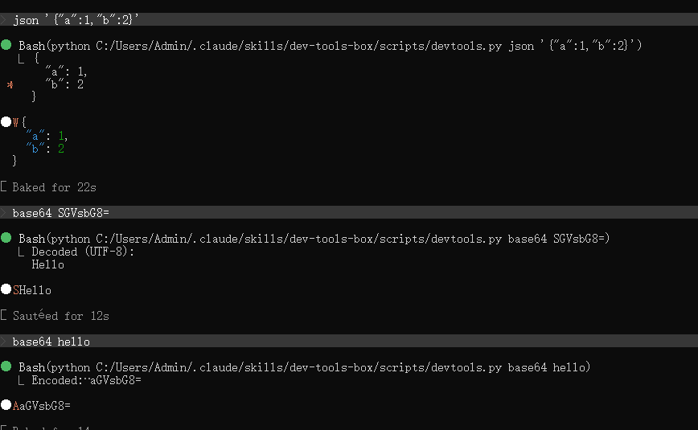

制作符合自身工作流程的 AI Agent 工作流

## 安装

CLI 工具：claude code
操作系统：Window

```
install anthropics/skills/skill-creator
```

重启claude检查是否安装成功：



或文件路径：
```
C:\Users\Admin\.claude\skills
```


## 创建skill



```md
我要创建一个“开发者工具箱 Skill”，用于替代 uTools 的常用开发者工具功能。

这个 Skill 是一个“确定性工具集合”，所有功能必须输出纯结果（result-only mode），不允许解释。

---

## 功能模块（每个功能独立触发）：

### 1. 时间戳工具 /time
功能：
- unix 时间戳 → UTC / 本地时间 / ISO8601
- 日期字符串 → unix 时间戳 + ISO

输入：
- 1700000000 或 2024-01-01 12:00:00

输出：
- UTC 时间
- 本地时间
- ISO8601

---

### 2. Base64 工具 /base64
功能：
- 自动识别 encode / decode
输入：
- 字符串 or base64
输出：
- 转换结果

---

### 3. JSON 格式化 /json
功能：
- 压缩 JSON → 格式化 JSON
输入：
- JSON string
输出：
- formatted JSON

---

### 4. URL 编码 /decode /encode
功能：
- URL encode / decode 自动识别

---

### 5. Hash 工具 /hash
功能：
- md5 / sha256 计算
输入：
- 任意字符串
输出：
- hash 值

---

### 6. Cron 表达式验证工具 /cron（新增）
功能：
- 输入 cron 表达式
- 生成未来 8 次执行时间，用于验证表达式是否正确

输入：
- * * * * *

输出：
- 按时间顺序列出 8 个触发时间（UTC时间）

---

## 设计要求：

- 所有功能必须是“工具模式”，不能解释原理
- 输出必须是纯结果（no explanation）
- 每个功能必须可通过触发词调用（/time /base64 /json /hash /cron）
- 结构必须清晰、模块化
- 如果可能，每个功能建议拆分为独立 script或python 逻辑

---

## 目标：

构建一个类似 uTools 的“开发者工具箱 Skill”，用于高频开发转换场景。
```



把生成的文件夹复制到 `C:\Users\Admin\.claude\skills`





