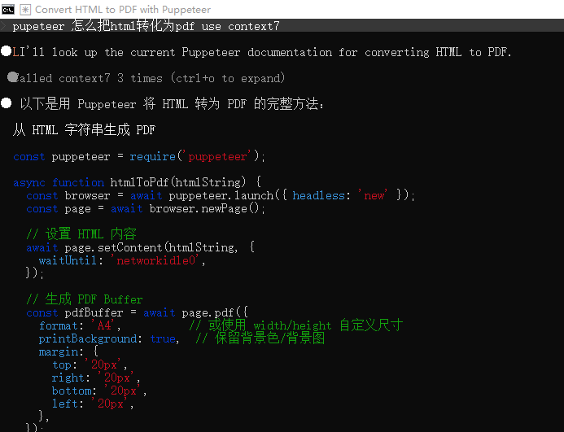

## Context7
https://context7.com/dashboard

在C:\Users\Admin\.claude.json 配置
```
{
  "mcpServers": {
    "context7": {
      "url": "https://mcp.context7.com/mcp",
      "headers": {
        "CONTEXT7_API_KEY": "API密钥"
      }
    }
  }
}

```




