## Keras和TensorFlow的关系
Keras 最初是作为一个独立的高级神经网络API开发的，用来简化深度学习模型的设计和训练流程，使用Keras就像是在写一个步骤说明书，keras可以选择执行这个步骤的后端：TensorFlow、Theano、CNTK等。

TensorFlow2.0后把keras作为官方高级API集成到TensorFlow，可以使用`tf.keras`使用keras。


TensorFlow的主力语言是python，但也可以选择其他语言：C++，java，JavaScript，go，rust等。

TensorFlow是开源机器学习中使用高阶代码为深度数据网络提供动力的，Google团队开发，它的核心是一个用于线性代数和统计学的编程库。集成很多api用于数据处理、可视化模型、评估和部署。


## 安装 TensorFlow GPU版本
需要确保计算机有可以使用gpu的条件：NVIDIA显卡
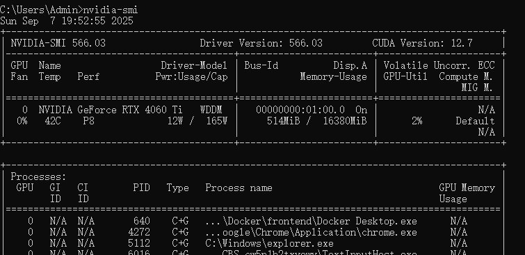

安装 CUDA Toolkit 12.1 + cuDNN 8.9

安装 CUDA Toolkit：https://developer.nvidia.com/cuda-downloads

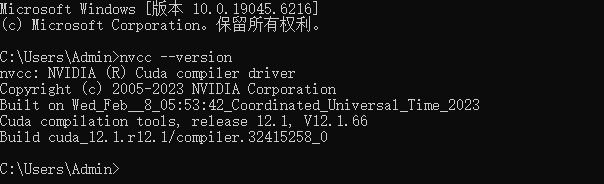

安装 cuDNN：https://developer.nvidia.com/cudnn

将 bin, include, lib 目录下的文件复制到 CUDA 安装目录`C:\Program Files\NVIDIA GPU Computing Toolkit\CUDA\v12.1`。

安装Miniconda：https://www.anaconda.com/download-success

```
conda deactivate
conda remove -n tf-gpu --all
```

```
conda tos accept --override-channels --channel https://repo.anaconda.com/pkgs/main
conda tos accept --override-channels --channel https://repo.anaconda.com/pkgs/r
conda tos accept --override-channels --channel https://repo.anaconda.com/pkgs/msys2
# 创建 Python 3.11 的虚拟环境，名字叫 tf-gpu
conda create -n tf-gpu python=3.7 -y

# 激活环境
conda activate tf-gpu

conda search cudatoolkit -c conda-forge

conda install cudatoolkit==11.0.3 -c conda-forge

conda search cudnn -c conda-forge

conda install cudnn==8.0.5.39 -c conda-forge

```

https://pypi.org/project/tensorflow-gpu/2.4.0/#files

安装TensorFlow
```
pip install --upgrade pip
pip install tensorflow==2.20

set PATH=C:\Program Files\NVIDIA GPU Computing Toolkit\CUDA\v12.3\bin;%PATH%

```

```py
import tensorflow as tf
print(tf.__version__)
print(tf.config.list_physical_devices('GPU'))
```

可恶可恶可恶 4060ti好像太高了怎么到配不好！！！！！！！！！！！！！只能先用cpu了 可恶


## 张量
深度学习中，张量是基本数据结构，可以看做是一种多为数组

- 图像 → 3 阶张量（高度 × 宽度 × 通道）
- 视频 → 4 阶张量（帧数 × 高度 × 宽度 × 通道）
- 文本 → 2 阶张量（序列长度 × 词向量维度）

张量维度：
- 0维张量：标量，`tf.constant(5)` （tf.constant 可以用来创建任意维度的张量）
- 1维张量：向量，`tf.constant([1,2,3])`
- 2维张量：矩阵，`tf.constant([[1,2],[3,4]])`
- 3维以上：高阶张量，` tf.ones((2,3,4))`  表示2个3×4的矩阵

### 张量创建
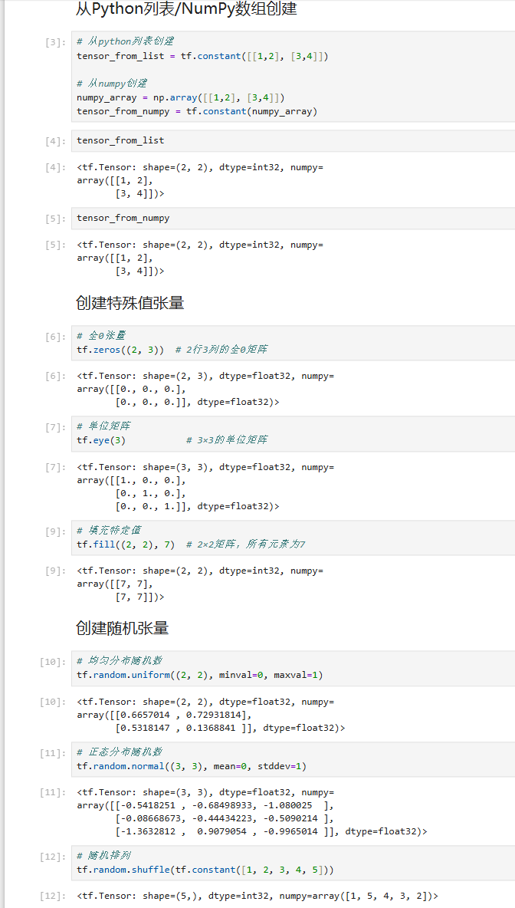

### 张量基本操作
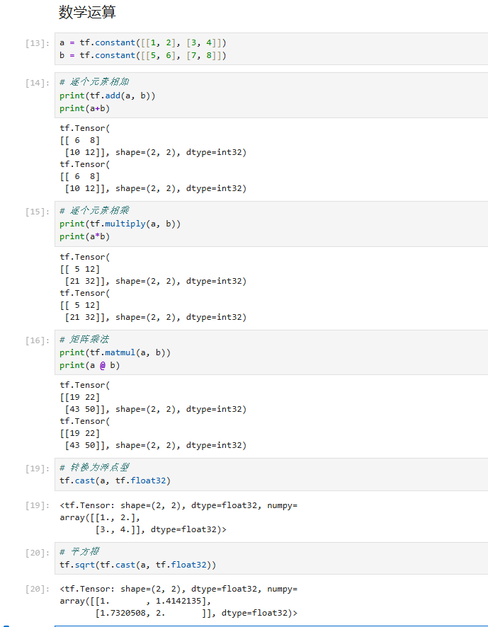

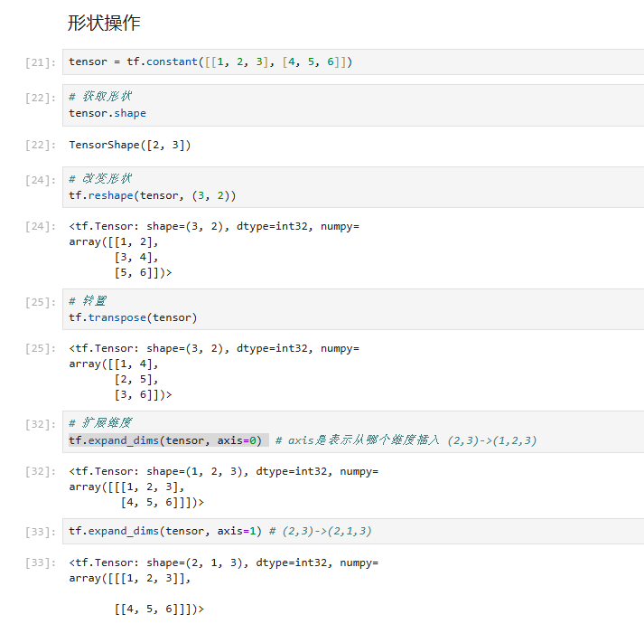


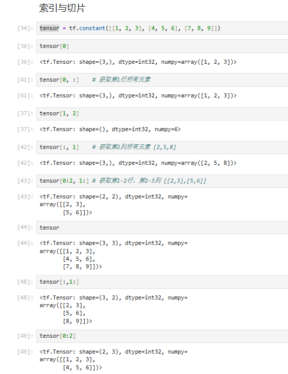

### 张量的广播机制
如果两个张量的形状不同，TensorFlow 会按照一定规则 自动扩展它们的形状，使它们兼容，然后逐元素计算。

广播规则：
- 从最后一个维度开始向前比较
  ```
  A: (4, 3, 2)
  B: (   3, 2)
  可以广播，因为 (3,2) 对 (3,2) 完全相等
  ```
- 两个维度要么相等，要么其中一个为1，要么其中一个不存在
  - 如果一个维度是 1，另一个是 n，就会在这个维度上 复制扩展
- 在缺失或为1的维度上进行复制扩展
  ```
  A: (3, 4, 5)
  B: (   4, 1)
  ```

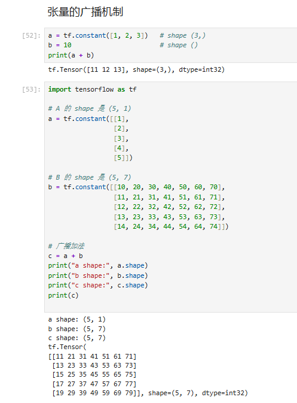

### 张量的聚合操作
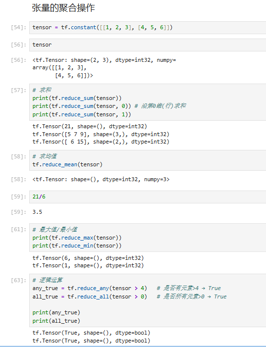

## Keras 
Keras封装了很多高层的神经网络模块，例如全连接层（Dense），卷积层（Conv2D），长短时记忆模型（LSTM）等等。它使我们不用自己再去编写这些模块，直接拿来用就可以了。


核心概念：
- 模型 Model Keras 的核心数据结构，是组织神经网络层的方式
  - Sequential 模型：层的线性堆叠
  - Functional API：构建复杂模型的有向无环图
- 层 Layer  Keras 的基本构建块，每个层接收输入数据，进行某种计算后输出结果
  - 核心层：Dense, Activation, Dropout 等
  - 卷积层：Conv2D, MaxPooling2D 等
  - 循环层：LSTM, GRU 等
- 激活函数
  - ReLU (Rectified Linear Unit)
  - Sigmoid
  - Tanh
  - Softmax (多分类问题)

一个手写数据集的demo：

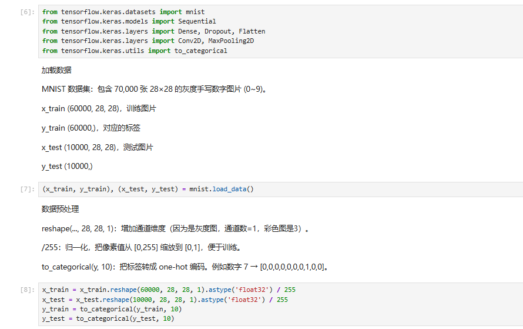


在计算机视觉里，图像通常是一个 4D 张量，结构是：
(batch, height, width, channels)
- batch：批量大小，比如一次训练多少张图片。
- height, width：图像的高和宽。
- channels：通道数。
  - 灰度图像：1 个通道（只有亮度信息）。
  - 彩色图像 (RGB)：3 个通道（红、绿、蓝）

原始一张图 (28×28)：
```
[
 [0,  255, 128, ...],
 [64, 192,  32, ...],
 ...
]
```
reshape 之后 (28×28×1)：
```
[
 [[0],   [255], [128], ...],
 [[64],  [192], [32],  ...],
 ...
]
```
每个像素从一个数字，变成了“长度为 1 的向量”
- [像素值] → [像素值在第 1 个通道]
- 如果是 RGB 图，就会是 [R,G,B] 三个通道值

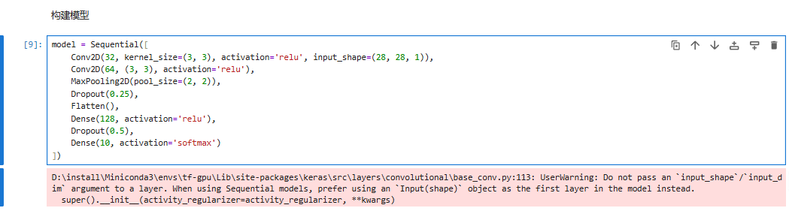

- 卷积层 Conv2D(32, (3,3), relu)
  - 提取局部特征（边缘、角点等），32 表示 32 个卷积核
  - activation='relu'：非线性变换，避免网络退化为线性
- 卷积层 Conv2D(64, (3,3), relu)
  - 进一步提取更复杂的特征（比如笔画结构）
  - 64 个卷积核，表示更多的特征图
- 池化层 MaxPooling2D((2,2))
  - 下采样，减少特征图尺寸（28x28 → 14x14）
  - 保留最显著特征，减少计算量与过拟合
- Dropout(0.25)
  - 随机“丢弃”25%神经元，防止过拟合，提高泛化能力
- Flatten()
  - 把二维特征图拉平为一维向量，便于全连接层处理
- 全连接层 Dense(128, relu)
  - 学习全局特征，128 个神经元
- Dropout(0.5)
  - 丢弃 50% 神经元，进一步防止过拟合
- 输出层 Dense(10, softmax)
  - 10 类（数字 0~9）
  - softmax 把结果转为概率分布，总和=1，输出哪个数字的概率最大

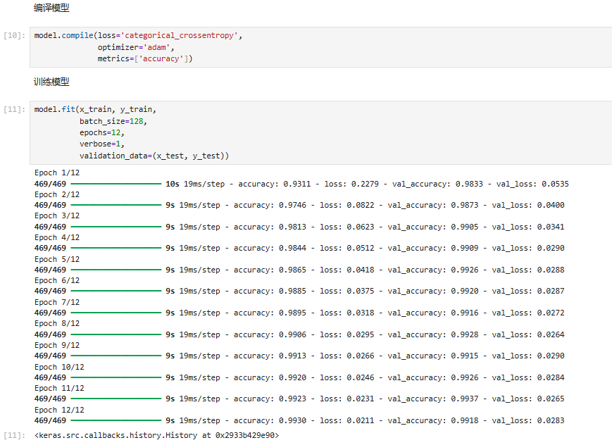

- loss='categorical_crossentropy'
  - 多分类常用的交叉熵损失函数
  - 衡量预测概率分布和真实分布的差异
- optimizer='adam'
  - 自适应学习率优化器，常用且收敛快
- metrics=['accuracy']
  - 在训练与验证时监控准确率

- batch_size=128：每次训练用 128 张图片作为一个批次
- epochs=12：完整遍历训练集 12 次
- validation_data：在训练过程中用测试集监控模型性能


### Kears常用层模型
####  Dense 全连接层
Dense是最基础的神经网络层，每个输入节点都与输出节点相连。

全连接层的每一个结点都与上一层的所有结点相连，用来把前边提取到的特征综合起来。由于其全相连的特性，一般全连接层的参数也是最多的。

```py
from keras.layers import Dense

# 创建一个具有64个神经元，使用ReLU激活函数的全连接层
dense_layer = Dense(units=64, activation='relu')
```

#### Conv2D 二维卷积层
主要用于图像处理的卷积操作，能够提取局部特征。

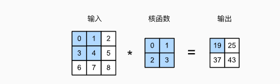

核心思想是 局部感受野 + 权值共享
- 局部感受野
  - 每次卷积只关注输入图像的一小块区域
  - 这样能保留图像的空间信息（位置、邻近关系）
- 权值共享
  - 一个卷积核在整张图上滑动时用的权重相同
- 多通道
  - 彩色图像有 3 个通道（RGB），一个卷积核会对 3 个通道分别做卷积，然后求和
  - 多个卷积核可以提取不同特征（边缘、纹理、形状等）

作用
- 特征提取
- 降维与参数减少
- 保持空间结构


```py
from keras.layers import Conv2D

# 创建一个具有32个3x3卷积核的卷积层
conv_layer = Conv2D(filters=32, kernel_size=(3, 3), activation='relu')
```

#### LSTM 长短期记忆网络层
是循环神经网络（RNN）的一种改进结构，用于处理序列数据,专门解决普通 RNN 记忆时间依赖性差、梯度消失或爆炸 的问题。是一种特殊的 RNN 层，它能在序列建模中“记住长期依赖”。

```py
from keras.layers import LSTM

# 创建一个具有128个单元的LSTM层
lstm_layer = LSTM(units=128, return_sequences=True)
```

原理
- 通过 遗忘门 决定哪些历史信息要丢弃
- 通过 输入门 决定哪些新信息要记住
- 通过 输出门 决定当前时间步输出什么


#### Dropout 随机失活层
常用的正则化方法，用来防止神经网络过拟合。

训练时：随机失活神经元，起到正则化作用。Dropout 层会在 训练过程中，随机“屏蔽掉”一部分神经元的输出，被“丢弃”的神经元在这一轮训练中不参与前向传播和反向传播。

测试时：在 测试/推理阶段，Dropout 不再随机屏蔽，而是使用全部神经元，但会把权重缩放，保证输出期望一致。

超参数：保留率 p（常用 0.5、0.7、0.8，根据任务调整）

```py
from keras.layers import Dropout

# 创建一个丢弃率为0.5的Dropout层
dropout_layer = Dropout(rate=0.5)
```

#### BatchNormalization 批量归一化层
每层参数更新后，会导致下一层输入分布发生变化，这会让训练变慢，梯度可能爆炸/消失，需要更小的学习率和复杂的参数初始化。

而BatchNormalization是用来加速训练、稳定梯度、提高模型泛化能力。

```py
from keras.layers import BatchNormalization

# 创建批量归一化层
bn_layer = BatchNormalization()
```

#### MaxPooling2D 二维最大池化层

MaxPooling2D 是卷积神经网络（CNN）里常用的一种 池化层。它的作用是在输入的局部区域里，取最大值作为输出，实现下采样，既减少计算量，又保留主要特征，还提高模型对位置偏移的鲁棒性。

```py
from keras.layers import MaxPooling2D

# 创建2x2的最大池化层
pool_layer = MaxPooling2D(pool_size=(2, 2))
```

#### Flatten 展平层
把输入的多维张量（通常是卷积层输出的特征图）拉直成一维向量，方便接到 全连接层。

常见用途：CNN → Flatten → Dense → Softmax

```py
from keras.layers import Flatten

# 创建展平层
flatten_layer = Flatten()
```


#### Embedding 嵌入层
Embedding 层是一种把离散稀疏数据（如单词、ID）映射到连续低维向量空间的神经网络层。

```py
from keras.layers import Embedding

# 创建嵌入层，词汇表大小为1000，输出维度为64
embedding_layer = Embedding(input_dim=1000, output_dim=64)
```

## 数据处理与管道
数据加载->数据预处理->数据增强->批次处理->模型训练

数据加载：
```py
import tensorflow as tf

dataset = tf.data.Dataset.from_tensor_slices([1, 2, 3, 4])
```

数据预处理:
```py
def normalize(x):
    return x / 255.0

dataset = dataset.map(normalize)
```
- map：对每个元素进行函数处理（如归一化、图像增强）


数据增强：
```py
def add_noise(x):
    noise = tf.random.uniform(shape=tf.shape(x), minval=0, maxval=0.1)
    return x + noise

dataset = dataset.map(add_noise, num_parallel_calls=tf.data.AUTOTUNE)
```

批次处理:
```py
BATCH_SIZE = 2

dataset = dataset.batch(BATCH_SIZE) \
                 .shuffle(10) \
                 .prefetch(tf.data.AUTOTUNE)
```
- batch：把数据按批次组合
- shuffle：打乱顺序，增强模型泛化能力
- prefetch：提前准备下一个 batch，减少 GPU/CPU 等待

模型训练:
```py
from tensorflow.keras import Sequential
from tensorflow.keras.layers import Dense, Flatten

# 假设输入是一维向量
model = Sequential([
    Flatten(input_shape=(1,)),  # 因为数据是一维数值
    Dense(8, activation='relu'),
    Dense(1, activation='sigmoid')
])

model.compile(optimizer='adam', loss='binary_crossentropy', metrics=['accuracy'])

# 训练
model.fit(dataset, epochs=5, steps_per_epoch=2)
```

## 图像数据处理
加载图像->解码图像数据->调整图像尺寸->应用数据增强->标准化处理->批处理

图像数据是由像素组成的二维矩阵（灰度图像）或三维张量（彩色图像）
- 灰度图像：[高度, 宽度] 或 [高度, 宽度, 1]
- 彩色图像：[高度, 宽度, 3]（3是RGB通道）

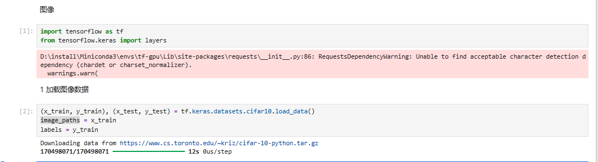

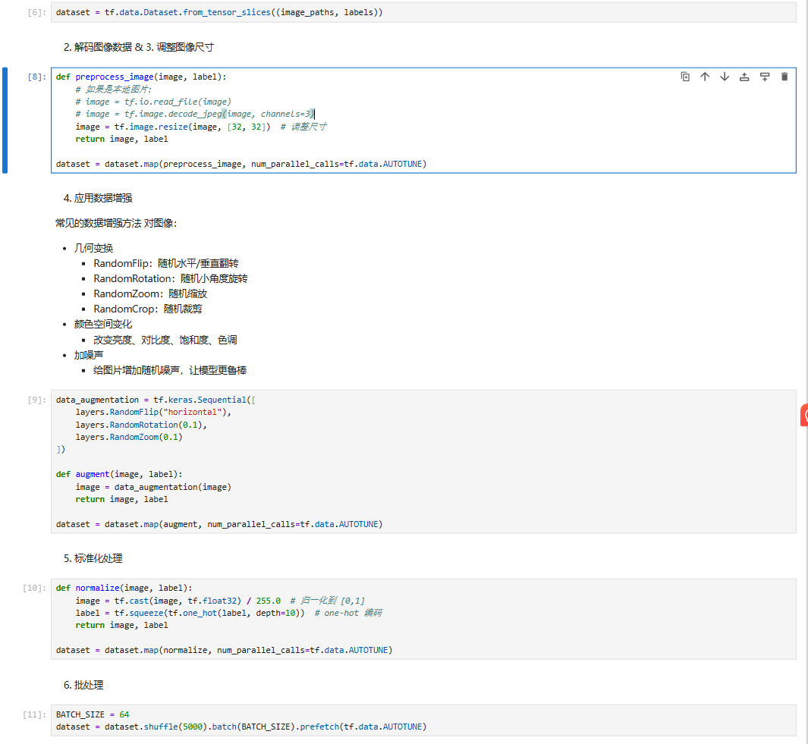

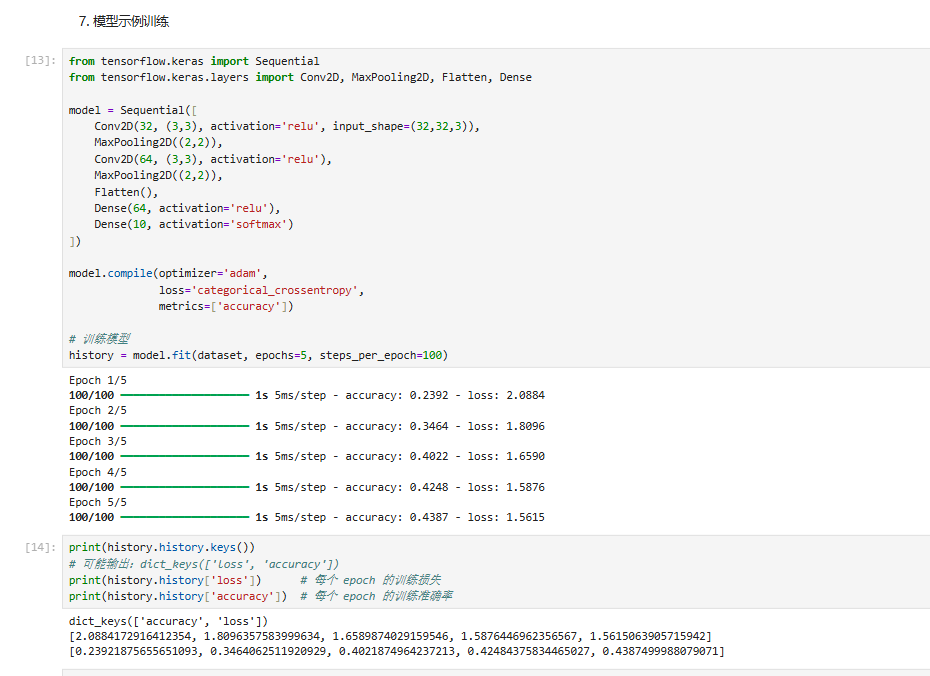


## 文本数据处理
数据加载->文本预处理->数据增强->词嵌入->批次处理->模型训练

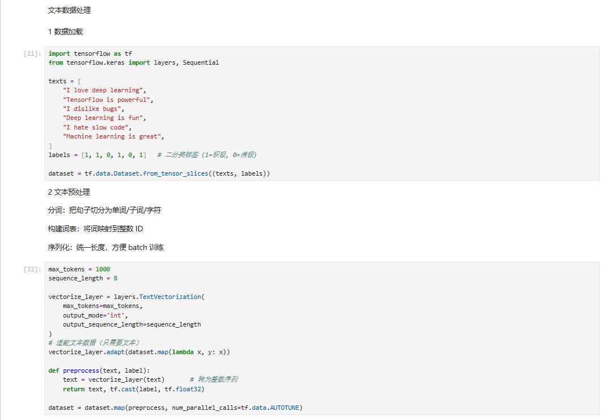

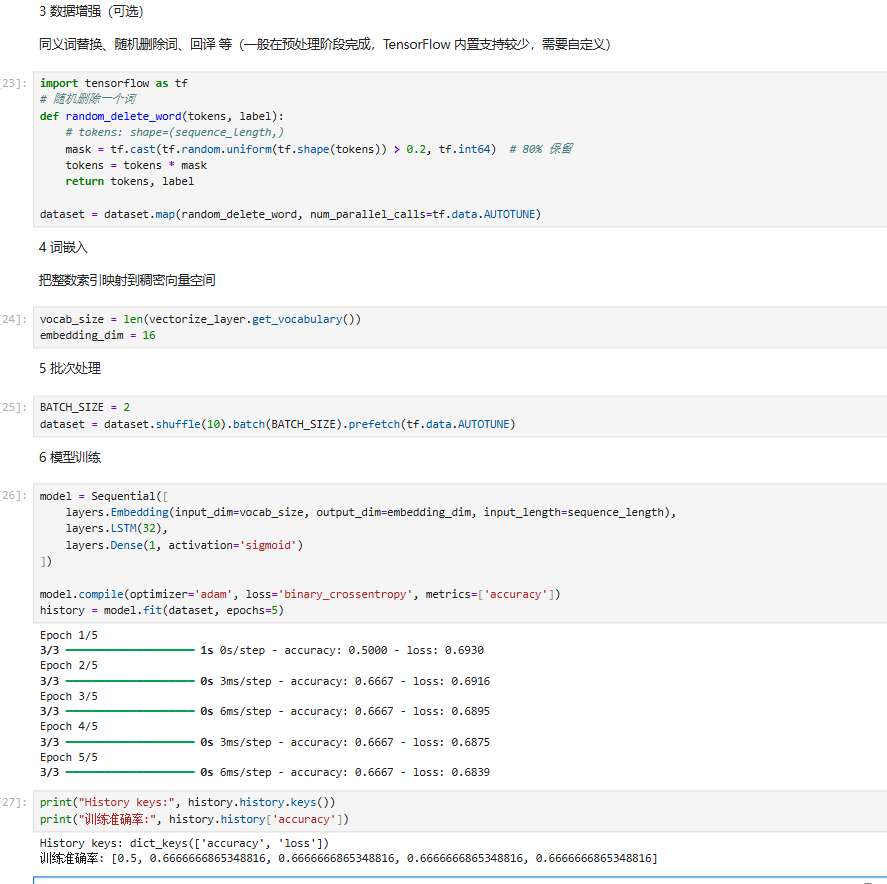

## 模型训练
模型核心要素：
- 数据
  - 训练集 用来训练模型更新参数
  - 验证集 训练中监控模型性能，调参，防止过拟合
  - 测试集 在训练后评估模型最终性能
- 模型架构
  - 指神经网络的 层结构 和 连接方式 比如 CNN/RNN/Transformer
- 损失函数
  - 衡量模型预测值与真实标签的差异
  - 常见类型
    - 分类：交叉熵
    - 回归：平均绝对误差
    - 特殊任务：对比学习的 Triplet Loss、GAN 的对抗损失
- 优化器
  - 用来调整模型参数，使损失函数下降
  - 常见优化器
    - SGD（随机梯度下降）
    - Adam（最常用，自适应学习率）
    - RMSProp、Adagrad 等
- 评估指标
  - 在训练/验证/测试时用来衡量模型性能的标准
  - 常见指标
    - 分类：准确率、精确率、召回率、F1-score
    - 回归：MSE、RMSE
    - 排序/推荐：AUC、MAP、NDCG

训练流程：
准备数据->构建模型->编译模型->训练模型->评估模型->保存模型


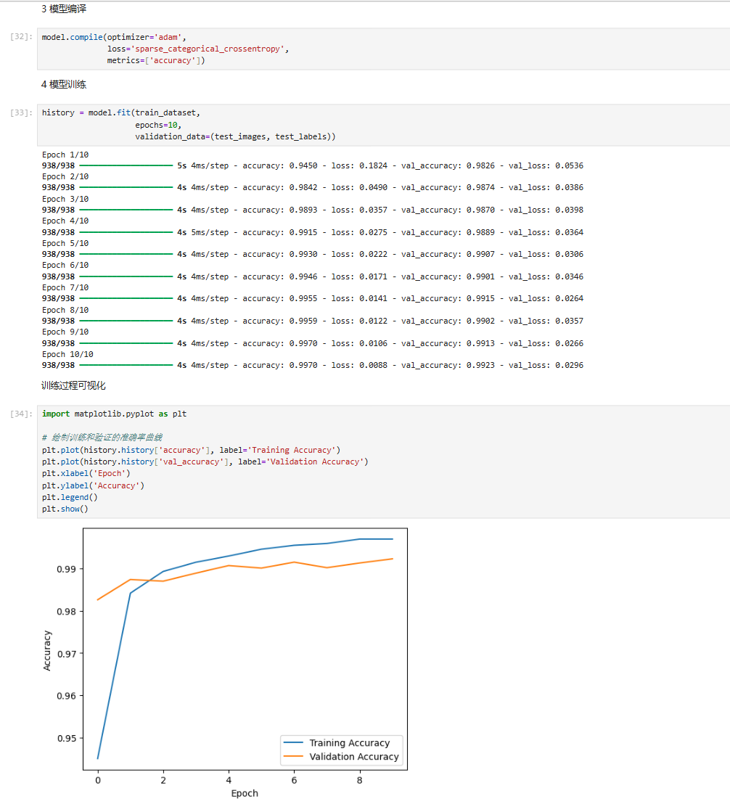


compile 编译
- optimizer 优化算法选择 'adam', 'sgd', 'rmsprop' 等 
- loss 	损失函数类型  	'mse', 'categorical_crossentropy' 等
- metrics 评估指标列表  	['accuracy'], ['mse'] 等


fix 训练
- x 输入的训练数据
- y 目标数据也就是标签
- epochs 训练轮数
- batch_size 每批数据量
- validation_data 验证数据集
- callbacks 回调函数列表


## 模型评估与监控
### 评估
tensorflow内置的评估指标
```py
import tensorflow as tf

# 常用分类指标
classification_metrics = [
    tf.keras.metrics.BinaryAccuracy(name="accuracy"),
    tf.keras.metrics.Precision(name="precision"),
    tf.keras.metrics.Recall(name="recall"),
    tf.keras.metrics.AUC(name="auc")
]

# 常用回归指标
regression_metrics = [
    tf.keras.metrics.MeanSquaredError(name="mse"),
    tf.keras.metrics.MeanAbsoluteError(name="mae"),
    tf.keras.metrics.RootMeanSquaredError(name="rmse")
]
```
评估流程
1. 编译模型时指定指标
```py
# 分类模型
model.compile(optimizer="adam",
              loss="binary_crossentropy",
              metrics=classification_metrics)

# 回归模型
model.compile(optimizer="adam",
              loss="mse",
              metrics=regression_metrics)
```
2. 使用 evaluate 方法评估
```py
test_loss, test_acc, test_auc = model.evaluate(
 test_images, test_labels, verbose=2
)
```

3. 自定义评估函数
```py
import tensorflow as tf

@tf.function
def custom_metric(y_true, y_pred):
    ...

model.compile(
    optimizer='adam',
    loss='binary_crossentropy',
    metrics=[custom_metric, 'accuracy']  # 可以同时保留标准准确率指标作为参考
)
```

### 监控
监控指标
- 损失函数
- 评估指标
- 学习率
- 权重分布
- 梯度变化

除了用Matplotlib绘制曲线，还可以用TensorBoard实时监控训练过程

```py
# 3. 配置 TensorBoard 回调

log_dir = "logs/fit"   # 日志目录
tensorboard_cb = tf.keras.callbacks.TensorBoard(
    log_dir=log_dir,
    histogram_freq=1   # 每个 epoch 记录一次权重分布直方图
)


# 4. 训练模型（启用 TensorBoard 回调）
model.fit(x_train, y_train,
          validation_data=(x_test, y_test),
          epochs=5,
          callbacks=[tensorboard_cb])
```

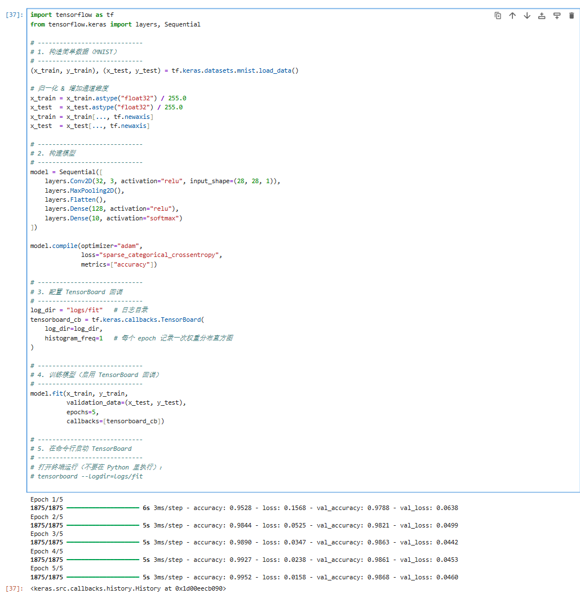

在终端运行`tensorboard --logdir=logs/fit`
访问http://localhost:6006


## 模型调优
调优主要方向
- 数据层
  - 数据清洗与标准化
  - 数据增强
  - 样本平衡
- 模型结构层
  - 选择合适的网络结构
    - 图像 CNN/ResNet
    - 序列 RNN/LSTM
  - 层数和宽度
    - 更深的网络有更强的拟合能力，但也更难训练
  - 正则化
    - Dropout
    - L2
- 序列过程层
  - 学习率调度
  - 优化器选择
  - 批大小
  - 早停
    - 防止过拟合，节省训练时间
  - 梯度裁剪
    - 解决梯度爆炸问题
- 训练后优化层
  - 模型选择
  - 集成学习
  - 蒸馏
    - 大模型指导小模型
  - 模型压缩 加速
    - 量化
    - 剪枝
- 超参数调优
  - 手动调参
      - 改 learning rate、batch size、网络深度等
  - 自动调参
    - 网格搜索、随机搜索、贝叶斯优化


### 超参数调优
静态学习率设置
```py
optimizer = tf.keras.optimizers.Adam(learning_rate=0.001)
```

使用
```py
model.compile(optimizer=tf.keras.optimizers.Adam(learning_rate=hp_learning_rate),
                  loss='mse')
```

### 模型结构
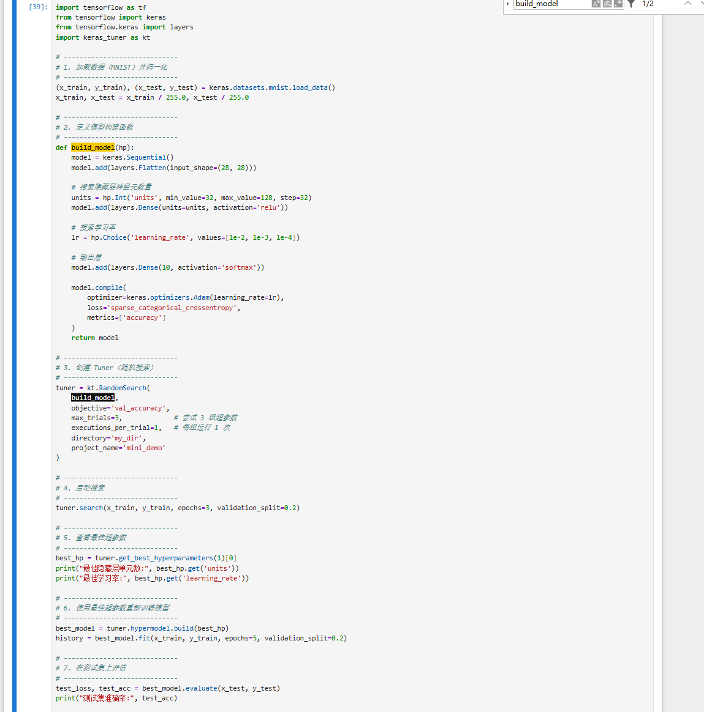

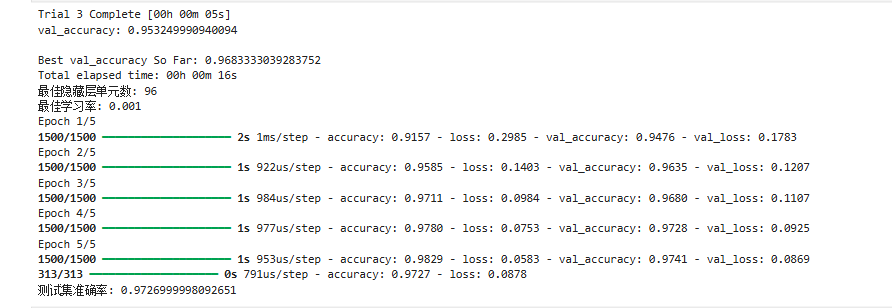

以上demo是利用Keras Tuner搜索隐藏层最合适的宽度（神经元个数）


### 训练过程
数据增强
```py
# 图像数据增强示例
data_augmentation = tf.keras.Sequential([
    tf.keras.layers.RandomFlip("horizontal"),
    tf.keras.layers.RandomRotation(0.1),
    tf.keras.layers.RandomZoom(0.1),
])

# 使用增强数据训练
model.fit(data_augmentation(x_train), y_train, epochs=10)
```

批归一化
```py
model = tf.keras.Sequential([
    tf.keras.layers.Dense(64),
    tf.keras.layers.BatchNormalization(),
    tf.keras.layers.Activation('relu'),
    tf.keras.layers.Dense(10)
])
```

## 资料：
官方文档：https://www.tensorflow.org/tutorials?hl=zh-cn

TensorFlow介绍：https://www.bilibili.com/video/BV1td4y1K71h/?spm_id_from=333.337.search-card.all.click&vd_source=c3939bba6fb53dcccb38ed988f16994c

问题解决：https://blog.csdn.net/qxyywy/article/details/145707275

https://www.runoob.com/tensorflow/tensorflow-tensor-operations.html

网络模型：https://zh.d2l.ai/chapter_recurrent-modern/lstm.html


方法 1：使用 TensorFlow 2.10 + CUDA 11.2 + cuDNN 8.1（最稳妥）

Windows 上 GPU 最稳定组合：

conda create -n tf-gpu python=3.10 -y
conda activate tf-gpu
pip install tensorflow-gpu==2.10


配套：

CUDA 11.2

cuDNN 8.1

测试 GPU：

import tensorflow as tf
print(tf.test.is_built_with_cuda())  # True
print(tf.config.list_physical_devices('GPU'))  # 显示 RTX 4060 Ti

Windows + Python 3.10 + CUDA 12.1 + cuDNN 8.9 + TF 2.20 GPU