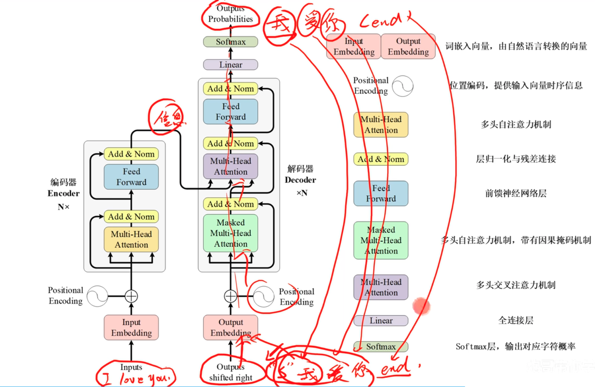
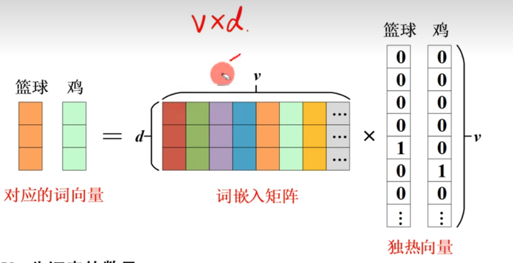
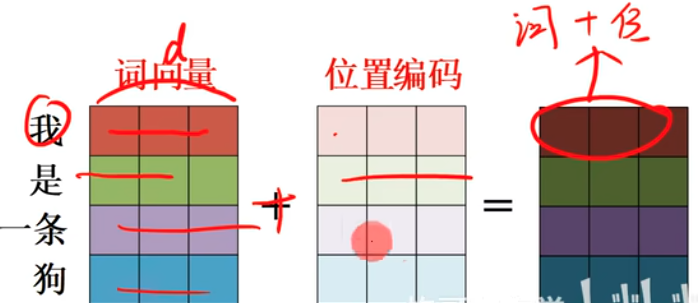
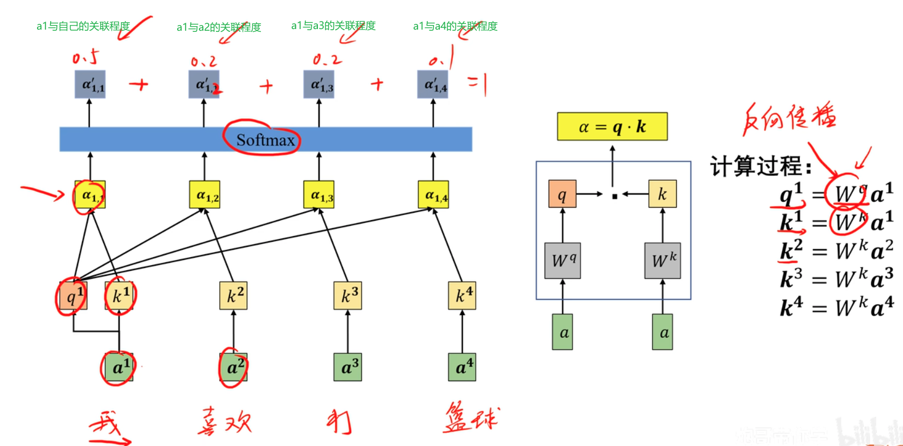
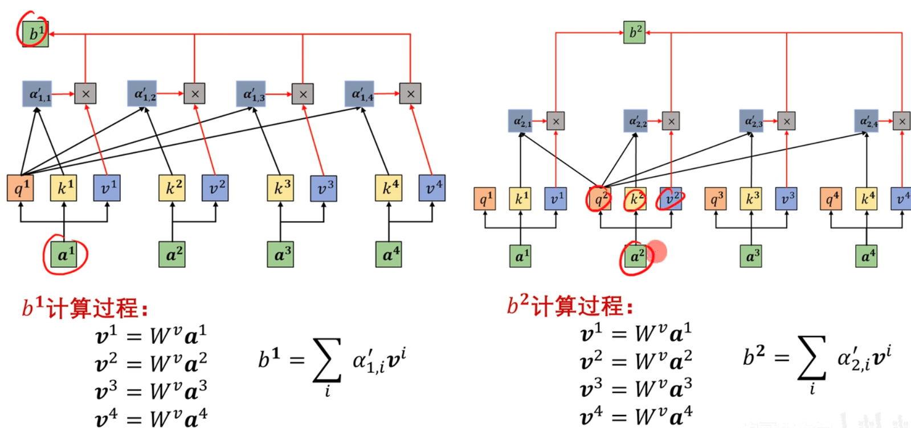
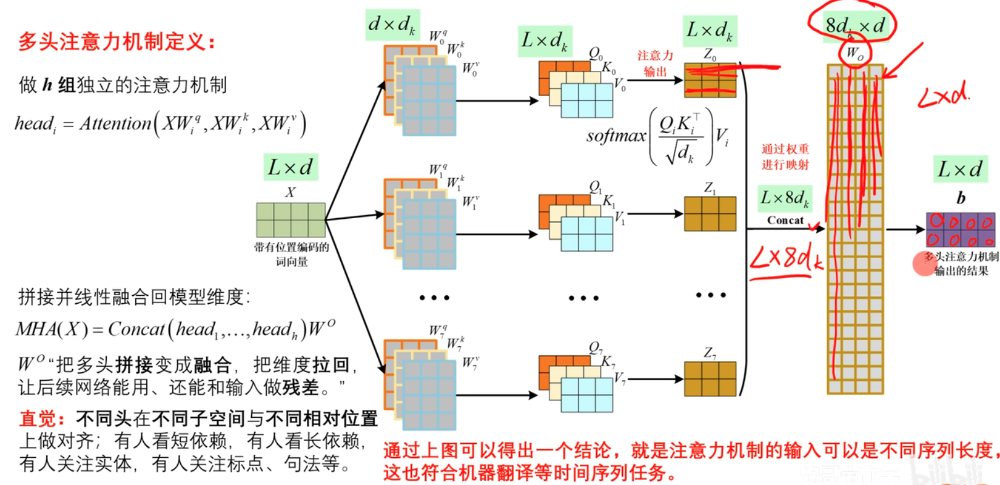

# 基础知识

## 算法背景
特点：
- 数据带有时间序列
- 并行性
- 缓解长距离依赖建模能力（能学习到的某个时间段信息，延长这个时间段）

结构：编码器与解码器结构

三种注意力（本质都是多头注意力机制，只是有点细微差别）：
- 编码器多头自注意力
- 交叉注意力
- 解码器多头自注意力（含因果掩码）

位置信息：用位置编码赋予词向量序列信息，代表时间顺序的

残差连接（ResNet）+ 层归一化 + 前馈网络（FFN）：形成标准层块，稳定深层训练

## 整体架构

## 输入文本数据数值转换

如何处理自然语言数据（翻译任务为例）
- 收集大量文本数据（中英文对照的文本）
- 把字符串切成token（单独的字或者词）
- 统计收集的样本中token的出现频次，进行排序
- 将token转换为独热向量（独热编码：缺点是向量维度巨大）

## 词嵌入方法
对于上面独热编码生成的独热向量维度巨大，实际上是不可能使用这个方法处理数据的。

基于 embedding 矩阵的静态词嵌入：

V个词，所以每个词的独热向量是1×V，词表是V×V

加入词嵌入矩阵，词嵌入矩阵 d×V, 独热向量 V×V，词表d×V (d要远小于V才有作用)

d大小是人为设置的，Transfermer中大小为512。

词嵌入矩阵是经训练得到的权重表，将词ID映射为向量，语义相近聚类，差异分散，便于在向量空间做相似度计算。词嵌入矩阵里面的权重值是通过训练得到的，所以通过对应的数值可以表达对应词的关系。

## 位置编码
句子编码后的向量包含语义信息但不包含先后顺序的信息，但作为一个句子，是需要有先后顺序的，所以需要构建位置编码。

位置编码与输入的语义信息编码融合后才能作为模型的的数据进行训练和推理。

词向量每个词是1×d，那么位置编码也应该是1×d 

Transformer位置编码公式：

$$PE(pos, 2i) = sin(\frac{pos}{10000^{\frac{2i}{d}}})$$
$$PE(pos, 2i+1) = cos(\frac{pos}{10000^{\frac{2i}{d}}})$$

d:词嵌入矩阵大小
i:0,1,...,$\frac{d}{2}-1$
pos:当前token在序列中的第几个位置 （I love you 对应位置编码是0,1,2）

e.g. 
love [0.53, 0.26, 0.17, 0.38, ...]
0.53：$sin(\frac{1}{10000^{\frac{2*0}{512}}})$
0.26: $cos(\frac{1}{10000^{\frac{2*1}{512}}})$
0.17: $sin(\frac{1}{10000^{\frac{2*2}{512}}})$
...

## 自注意力机制算法流程
自注意力机制算法模型主要功能：
- 计算数据数据x之间的关联程度（注意力权重）
  - 自然语言中，每个词或token直接都是有关联程度的，有深有浅
- 关联程度提取输入数据x的有用信息（加权求和）
- 输出包含不同注意力分配的信息（生成融合上下文信息的新的 token 表示）

a1是注意力机制得分矩阵，能看出每个词之间的关联关系。

b1包含着a1对a2、a3、a4的关联程度的一个融合。能全局看到所有信息，并且能看到所有信息对a1的影响。

## 多头注意力机制
最底层是自注意力机制算法模型，是做h组独立的注意力机制。

## 掩码注意力机制（填充掩码）
为什么需要填充：处理批次时，transformer的输入要求同一批次中所有句子的长度一致，以便在GPU上进行并行计算。

## 层归一化

# 资料
- https://www.bilibili.com/video/BV1fj6vBfEnu/?spm_id_from=333.337.search-card.all.click&vd_source=c3939bba6fb53dcccb38ed988f16994c
- https://www.bilibili.com/video/BV1ej1EBWEWu/?spm_id_from=333.337.search-card.all.click&vd_source=c3939bba6fb53dcccb38ed988f16994c
- https://transformers.run/c1/transformer/#241-%E7%BC%96%E7%A0%81%E5%99%A8%E6%A8%A1%E5%9E%8B