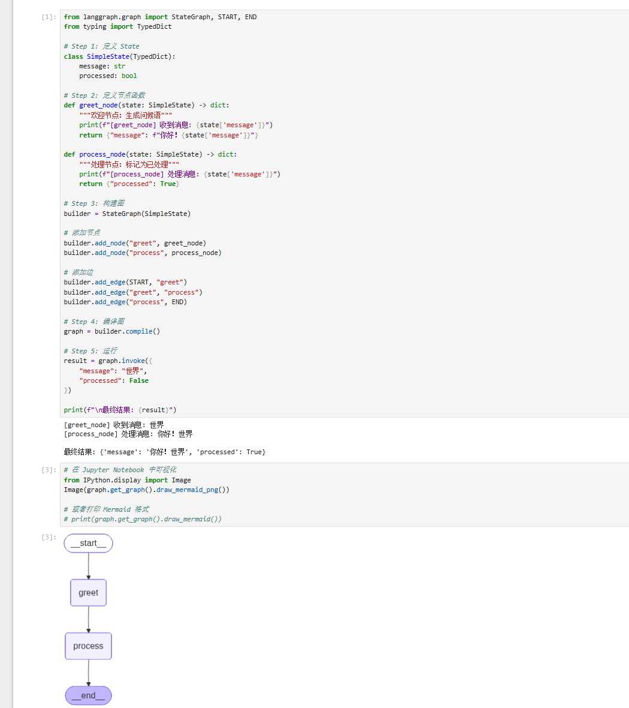
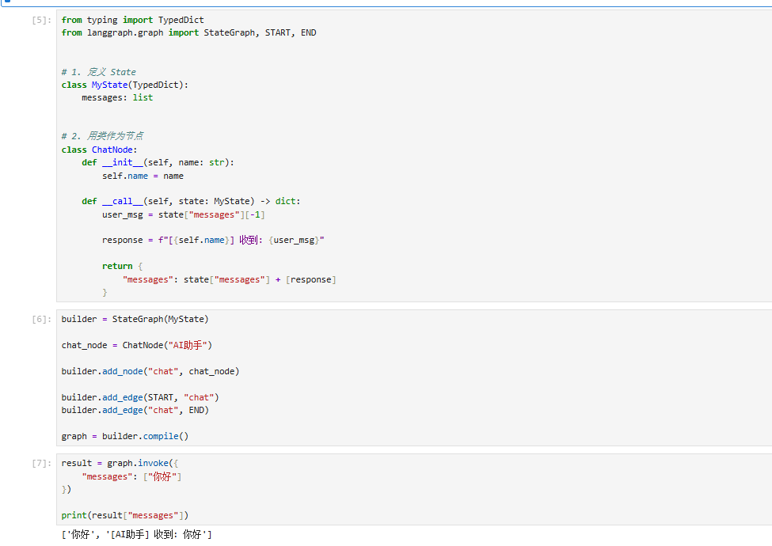
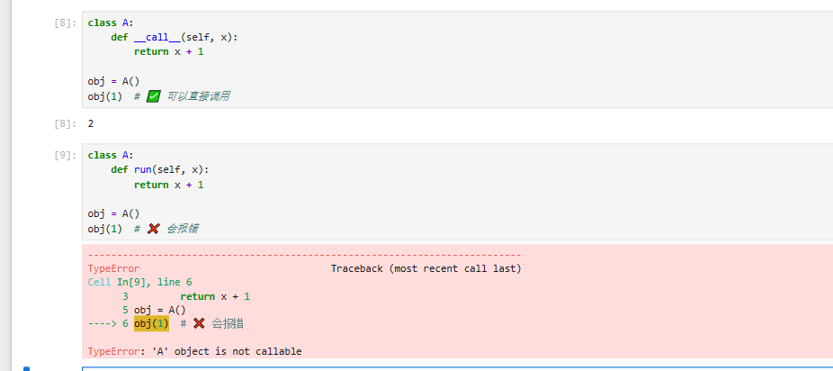
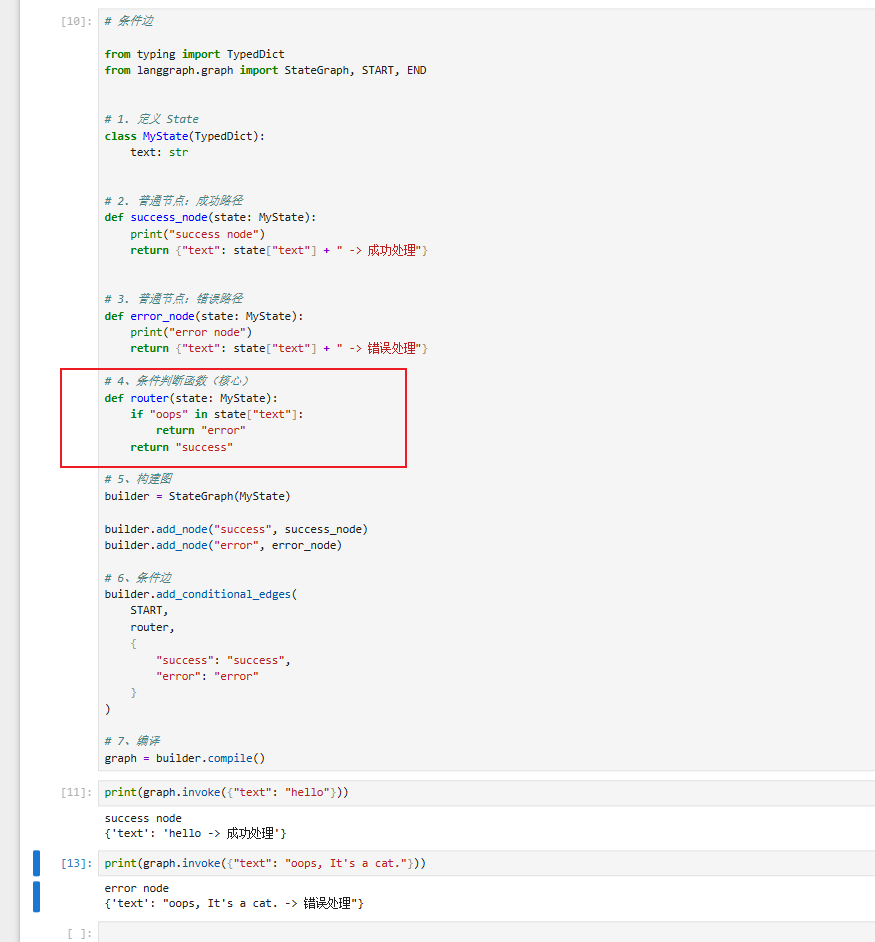
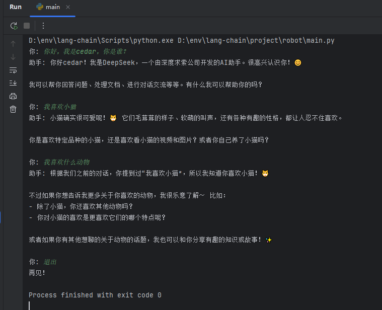

# 入门教程

LangGraph 是由 LangChain 团队开发的一个低层级 Agent 编排框架，专为构建有状态、长时运行的 AI 工作流而设计。

LangGraph 将工作流建模为有向图。

## 核心概念




ps：
class A(B):
    pass

A 继承自 B

### 图 Graph
整个工作流的蓝图，定义了 Agent 的完整逻辑结构。它由节点和边组成。

### 状态 State

是贯穿整个图的共享数据结构。每个节点可以读取和更新 State，更新后的 State 会传递给下一个节点。

只要是dic类型都可以，但是推荐继承提供的类型：

| 方式            | 本质                 |
| ------------- | ------------------ |
| MessagesState | 官方简化版              |
| TypedDict     | 结构 + 更新规则（最常用）     |
| Pydantic      | 结构 + 校验 + 默认值（生产级） |


```py
from typing import TypedDict, Annotated
from langgraph.graph import add_messages

class MyState(TypedDict):
    messages: Annotated[list, add_messages]  # 消息列表（自动追加）
    user_name: str
    step_count: int
```

- 普通类型  `messages: list`
- Annotated 类型 `messages: Annotated[list, add_messages]`
  - 类型：list
  - 附加信息：add_messages


### 节点 Nodes
节点是普通的 Python 函数，接收当前 State，返回更新后的 State（部分字段）。

```py
def my_node(state: MyState) -> dict:
    # 读取状态
    messages = state["messages"]
    
    # 执行操作...
    result = "处理结果"
    
    # 返回更新的字段（不需要返回所有字段）
    return {"messages": [{"role": "ai", "content": result}]}
```

异步节点：

```py
import asyncio

async def async_node(state: AgentState) -> dict:
    """异步节点，适合 I/O 密集型操作"""
    # 模拟异步操作（如 API 调用、数据库查询）
    await asyncio.sleep(0.1)
    
    result = await some_async_api_call(state["messages"][-1].content)
    return {"messages": [{"role": "assistant", "content": result}]}
```

用class构建：



一个python知识：__call__ 是 Python 规定的一个特殊协议，让对象可以像函数一样被调用的约定方法



### 边 Edges
边定义节点之间的流转方式：
- 普通边：固定路径，node_a -> node_b
- 条件边：根据 State 动态路由，node_a -> node_b 或 node_c
- 起始边：START -> 第一个节点
- 结束边：某节点 -> END


条件边：




并行执行：
```py
# 从一个节点并行分叉到多个节点
builder.add_edge("start_node", "branch_a")
builder.add_edge("start_node", "branch_b")
builder.add_edge("start_node", "branch_c")

# 多个节点汇聚到一个节点（Fan-in）
builder.add_edge("branch_a", "merge_node")
builder.add_edge("branch_b", "merge_node")
builder.add_edge("branch_c", "merge_node")
```

## 聊天机器人
```py
import  os
from dotenv import load_dotenv
from langgraph.graph import StateGraph, MessagesState, START, END
from langchain_openai import ChatOpenAI
from langchain_core.messages import SystemMessage, HumanMessage

load_dotenv()

# 初始化 LLM（使用 DeepSeek）
llm = ChatOpenAI(
    model=os.getenv('DEEPSEEK_MODEL', 'deepseek-chat'),
    openai_api_key=os.getenv('DEEPSEEK_API_KEY'),
    openai_api_base=os.getenv('DEEPSEEK_BASE_URL', 'https://api.deepseek.com'),
    temperature=0.7
)

SYSTEM_PROMPT = """
# 身份
- 你是一个友善、专业的 AI 助手。

# 指令
- 简洁清晰
- 使用中文回复
- 在不确定时主动询问用户
"""

def chatbot_node(state: MessagesState) -> dict:
    """系统提示词+用户提示词发送给llm"""
    system = SystemMessage(content=SYSTEM_PROMPT)
    messages = [system] + state["messages"]
    response = llm.invoke(messages)
    return {"messages": [response]}

# 构建图
builder = StateGraph(MessagesState)
builder.add_node("chatbot", chatbot_node)
builder.add_edge(START, "chatbot")
builder.add_edge("chatbot", END)

graph = builder.compile()

def chat(conversation_history: list, user_input: str) -> tuple[str, list]:
    """处理单轮对话，返回 AI 响应和更新后的历史"""
    conversation_history.append(HumanMessage(content=user_input))
    result = graph.invoke({"messages": conversation_history})
    conversation_history = result["messages"]
    ai_response = conversation_history[-1].content
    return ai_response, conversation_history


# 多轮对话示例
history = []
while True:
    user_input = input("你: ")
    if user_input.lower() in ["退出", "exit", "quit"]:
        print("再见！")
        break

    response, history = chat(history, user_input)
    print(f"助手: {response}\n")
```




# 资料
- https://docs.langchain.com/oss/python/langgraph/quickstart#full-code-example
- https://www.runoob.com/ai-agent/langgraph-quick-start.html