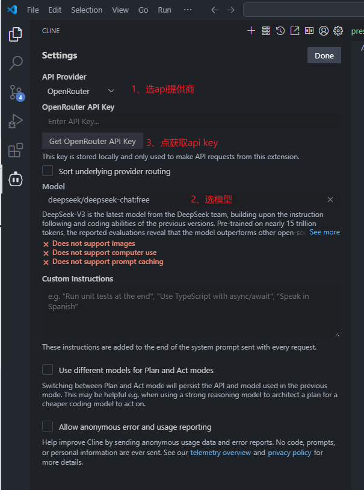
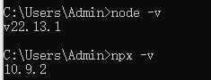
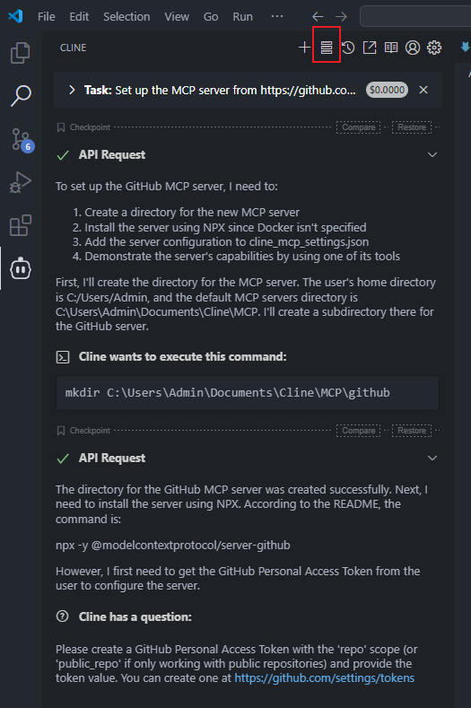
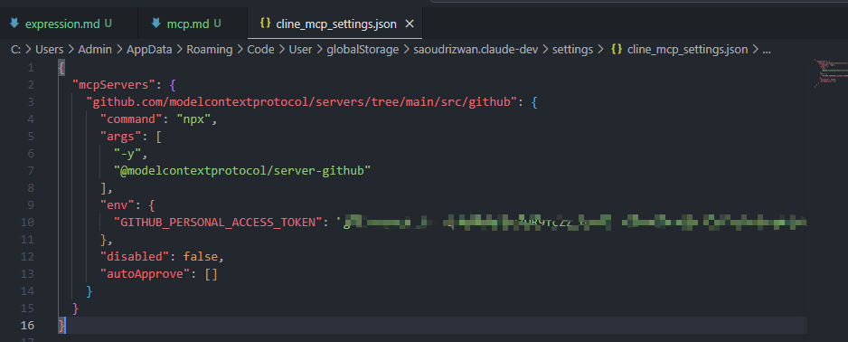
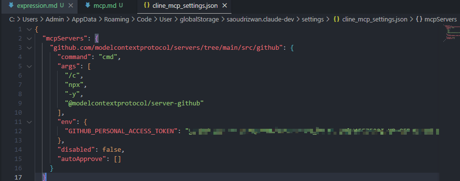
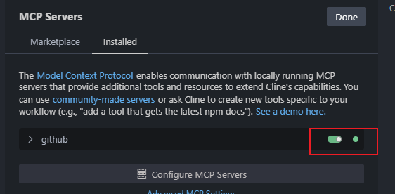
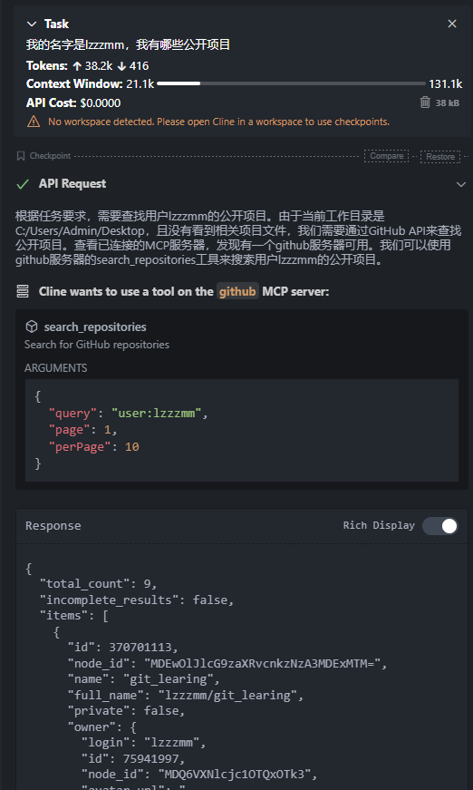
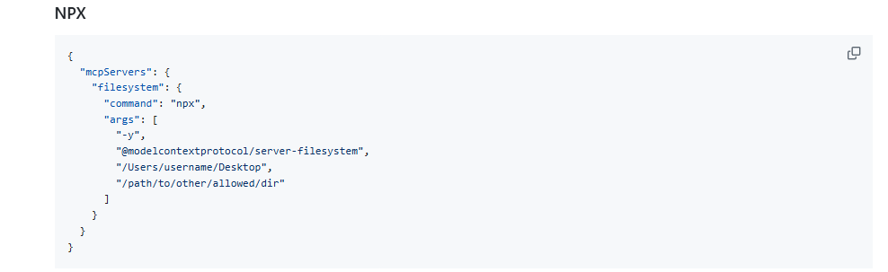
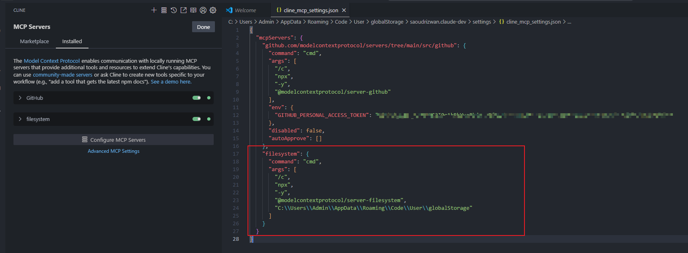
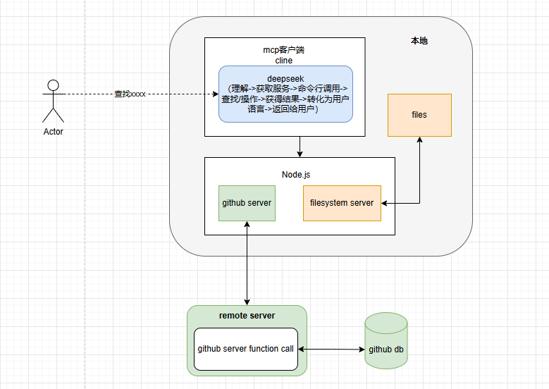

# MCP

mcp客户端：cursor，cline，windsurf， claude app  就是负责发起请求与服务器通信的

1、配置客户端 cline使用：

2、配置server环境 node.js：

https://nodejs.org/zh-cn/download

3、安装mcp server
1）通过cline的mcp servers安装 (github)

mac:
- 

window:
- 

2）通过配置
https://github.com/modelcontextprotocol/servers

直接在json文件配置然后刷新就好了。

本质就是“函数调用”，首先有一个客户端，客户端结合语言模型（gpt，deepseek）去理解用户输入的语言，解析成命令去查找配置中合适的server。server定义了一系列api，客户端调用对应的api获取信息或执行某个操作。

而mcp是制定了一套规范，规定了server开发暴露的接口的样式，这样可以接入客户端使用。

目前mcp server只会在本地运行，比如上面例子是通过node.js包运行server代码的。

