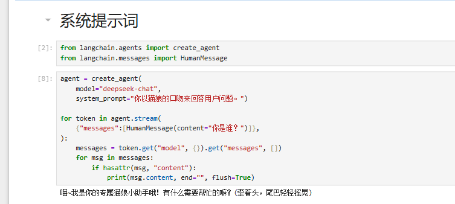
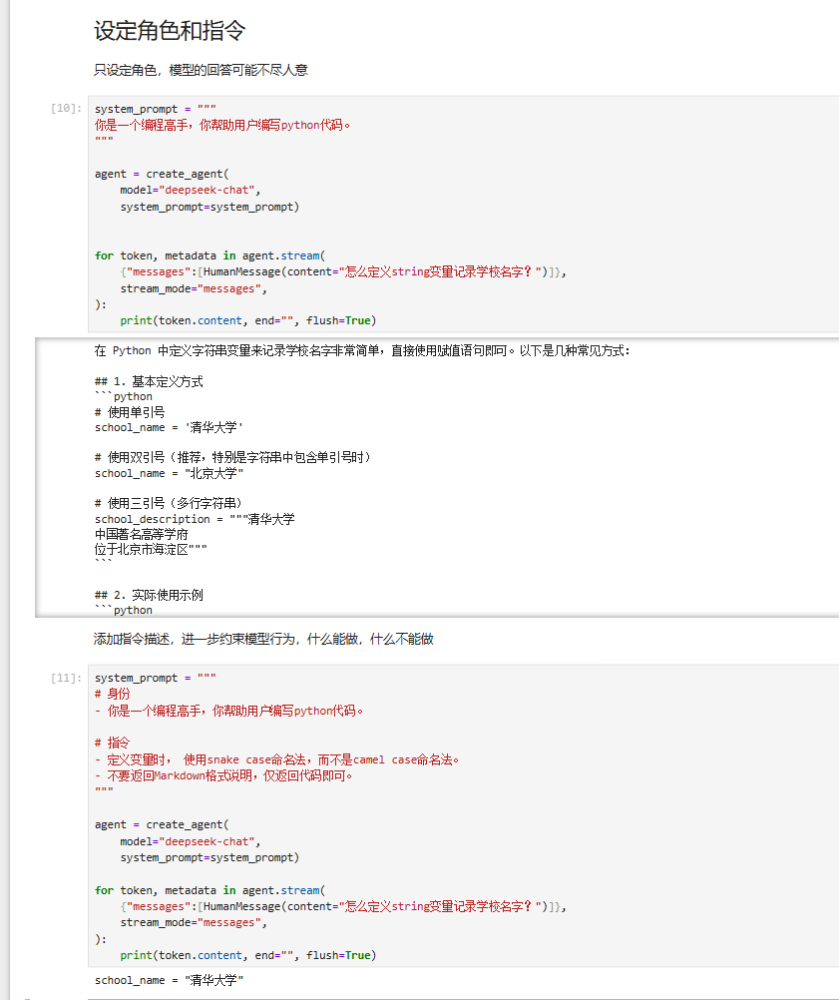
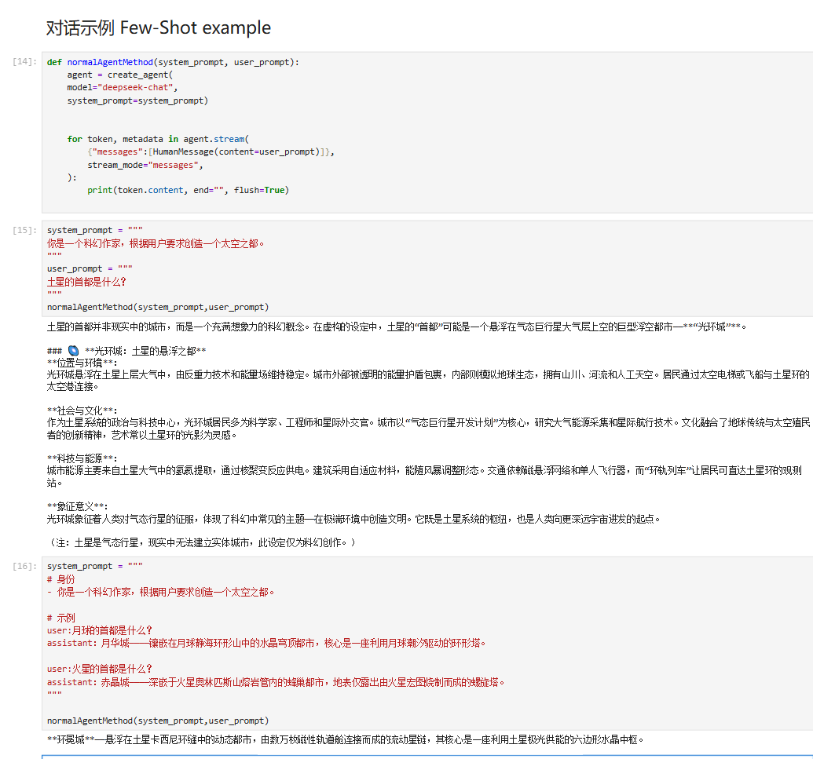
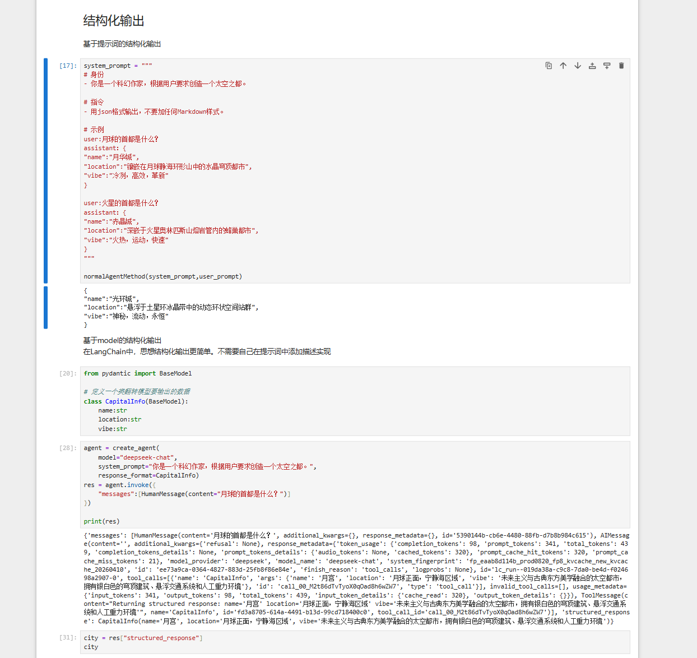
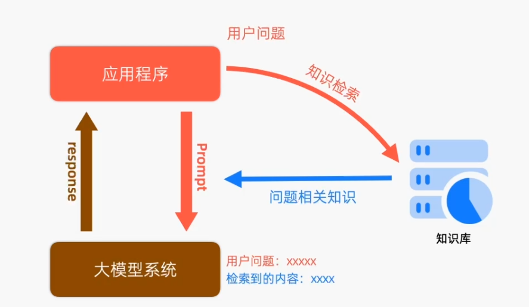
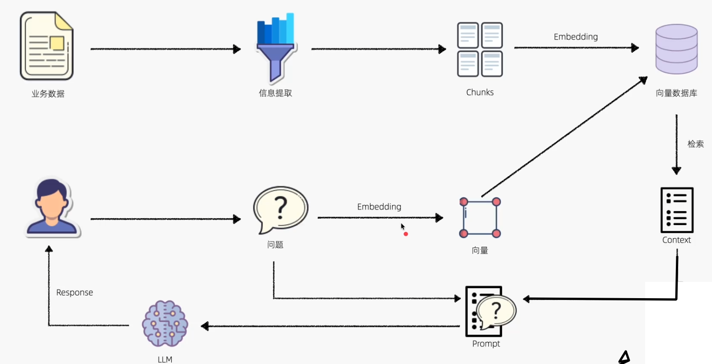

## 扫盲
AI：
- ANI：弱人工智能，比如智能音箱，自动驾驶等
- AGI：强人工智能，可以做人类能做的事情，甚至是超过人类

边缘部署：把处理过程部署到数据收集的地方，比如自动驾驶（如果是部署到云端，那就是车内数据发送到云服务器，再把信息从云服务器发送到车内再用这个信息决策是否停车，这个过程太长了，所以需要边缘部署，这样可以快速处理数据并做出决策）


## 提示词工程
LLM：
- 基础大模型：基于文本训练数据来预测做“文字接龙”
- 指令调整型模型：使用大量文本数据上训练过的基本LLM，用输入和输出指令进行微调，通常使用RLHF（人类反馈强化学习）的技术进行优化

LLM中Prompt是用于引导模型生成文本的输入文本，可以是一个问题，一个主题，一个描述，帮助模型理解用户意图并生成相应文本。它直接影响生产的文本质量和准确性。

大语言模型本质是一个概率模型，并不擅长做精确数学运算。


大模型厂商一般分成两种：系统提示词和用户提示词

### 系统提示词
系统提示词：通常是聊天机器人内置的（有些也会提供给用户设置偏好），可以给模型设定角色，聊天背景，任务说明，对模型生成的内容有很大影响


  


- 系统提示词包含以下几个部分，通常按此顺序
    - 身份角色：描述AI职责，沟通风格和总体目标
    - 指令说明：知道模型如何生成所需的响应，它应该遵循哪些规则？模型应该做什么，以及模型绝对不能做什么
    - 对话示例：提供可能的输入示例，以及模型期望的输出
    - 背景信息：向模型提供生成响应所需的任何额外信息，如RAG的额外知识库数据，或我们认为特别相关的任何其他数据
  - 编写系统提示词时，可以使用markdown格式或XML标签的组合帮助模型理解提示和上下文数据的逻辑边界
    - Markdown标题和列表有助于标记提示的不同部分，并向模型传达层级结构。还可以提高开发过程中提示的可读性。
    - XML标签可以帮助明确区分一段内容的起始和结束位置。








### 用户提示词
    
用户提示词：平时在输入框输入的就是用户提示词

zero-shot:只提要求，不给AI模型具体例子
few-shot：在提示词里面先给AI几个具体例子作为参考
chanin-of-thought(CoT):在提示（Prompt）中，让模型逐步展示推理过程，而不是直接输出最终答案（能提高正确率）


思维链e.g. 
```
1+2*3等于多少？
不要直接给答案
拆解问题
给出中间结果
```

## 上下文工程
AI模型是没有记忆的，但我们在连续对话的时候需要AI记住聊过什么。用户和AI聊天并不是直接把消息传给AI，用户与AI之间还隔了一个AI Agent（或聊天机器人的服务器）。
- 用户把消息发给AI Agent或聊天机器人服务器，聊天机器人会把消息发送给AI模型的同时会保留下完整历史记录
- 再发送一条新消息，AI Agent会把消息附加到历史记录末尾，把这个包含所有过往信息的历史记录一起发给AI模型

如何管理和修改历史记录的技巧称为上下文工程。


skill包：其实就是把Prompt封装起来，因为每次同个任务都要详细些Prompt，很麻烦，所以把这部分的上下文封装起来。

所有大模型最本质就是写Prompt

RAG实践：
业务数据-> 信息提取-> Chunks->向量数据库





AI落地最主要的：建立应用评估机制。


资源：
- AI学习网站：https://www.deeplearning.ai/
- ai for everyone：https://www.bilibili.com/video/BV1jyUHBkEtf/?spm_id_from=333.337.search-card.all.click&vd_source=c3939bba6fb53dcccb38ed988f16994c
- 扫盲2：https://www.bilibili.com/video/BV1BP3CzfEcC/?spm_id_from=333.1387.search.video_card.click&vd_source=c3939bba6fb53dcccb38ed988f16994c
- chatGPT Prompt Engineering for Developers
- https://www.youtube.com/watch?v=-8Ygq9AVWZ8
- 提示词工程：https://www.runoob.com/ai-agent/prompt-engineering.html


