# 第一章 绪论
假设空间：学习算法所考虑的所有可能的假设集合
  - 有限假设空间，如决策树
  - 无限假设空间：如线性回归的权重参数

没有免费的午餐定理：

指示函数： 是数学、概率论和机器学习中非常常用的一个工具，用来判断某个条件是否成立，并把结果表示成数值，条件成立 → 取 1；条件不成立 → 取 0

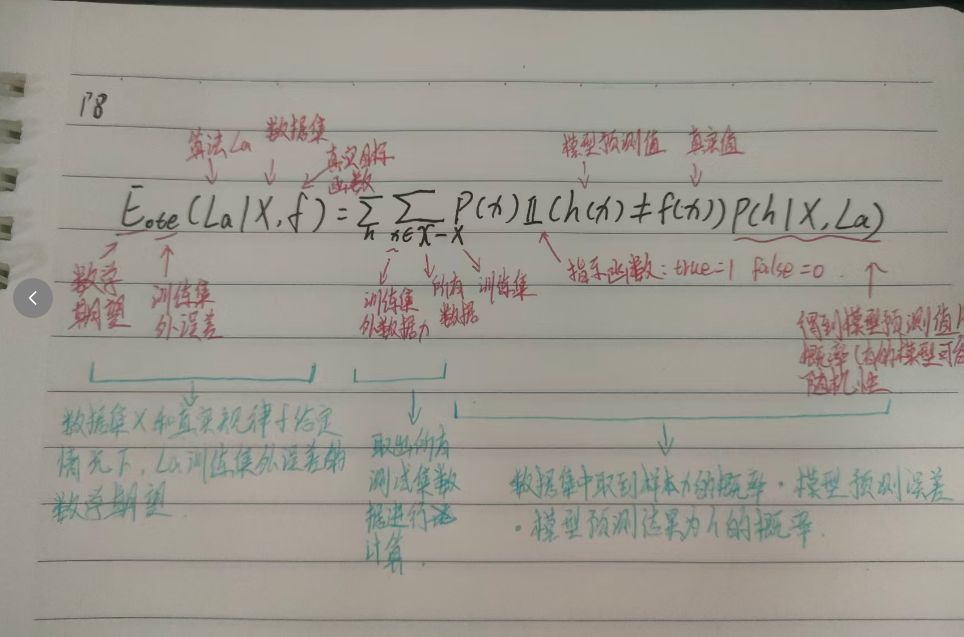

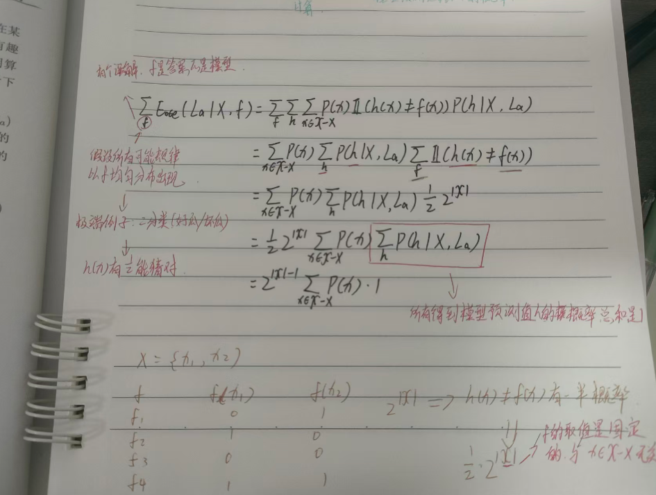

归纳偏好：从上面的定理可以推断，如果对真实规律不作任何假设，学习是不可能的。比如特征工程是“归纳偏好”的一种非常重要的实现方式。

# 第二章 模型评估与选择
## 检验误差与过拟合
错误率：分类错误的样本数占样本总数的比例
精度：1-错误率
误差：学习器实际预测输出与样本真实输出之间的差异
  - 训练误差/经验误差：训练集上的误差
  - 泛化误差：新样本上的误差

过拟合：训练集上效果好，测试集上效果不好，过拟合无法避免，只能缓解
欠拟合：训练集和测试集效果都不好

## 评估方法
- 留出法
  - 数据集划分为两个互斥集合（分层采用保留类别比例），一个作为训练集，一个作为测试集
  - 单次使用留出法的估计结果不可靠，通常是重复实验取平均作为留出法评估结果
  - 常见做法是2/3-4/5作为训练集，其他作为测试集
- 交叉验证法
  - 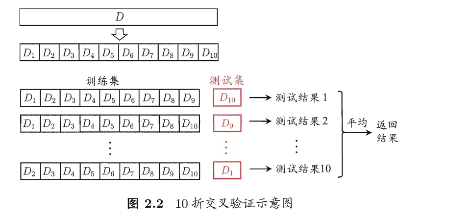
- 自助法
  - 有放回取球的例子
  - 
  - 就是仍有估计1/3的数据没有在训练集中出现用于测试
  - 缺点：自助法产生的数据集改变了初始数据集分布，会引入估计偏差
    - 估计偏差：估计方法本身带来的偏差，即使样本再多、算得再认真，结果也会偏高或偏低（假设想估计一个班学生的平均身高：你只在篮球队里抽样，算出来的平均身高：175 cm，全班真实平均身高：168 cm 这个 175 cm 系统性偏高，原因不是运气，而是抽样方式有问题这就叫 有估计偏差）
    - 在初始数据量足够情况下，留出法和交叉验证法更常用
- 调参与最终模型
  - 参数分为：超参数、模型参数
    - 超参数
      - 是算法参数，数目常在10以内
      - 由人工设定多个参数候选值后产生模型（比如决策树的深度，叶子数等）
    - 模型参数：
      - 参数数目可能很多，比如深度学习模型可能有上百亿参数
      - 通过学习产生多个候选模型
      - 在模型选择完成后，学习算法和参数配置已选定（超参数），此时，应该用数据集D（所有数据集，因为前面的实验都是用的部分数据集做训练）重新训练模型，这个模型才是最终要交给用户使用的模型

## 性能度量
- 错误率
  - 预测错误个数/样本总数
  - 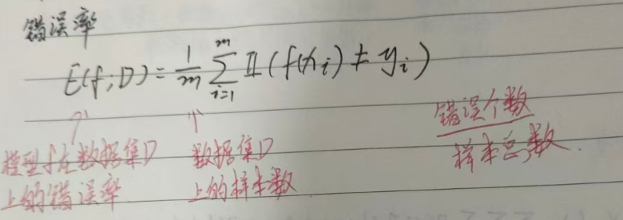
- 精度
  - 预测正确个数/样本总数
  - 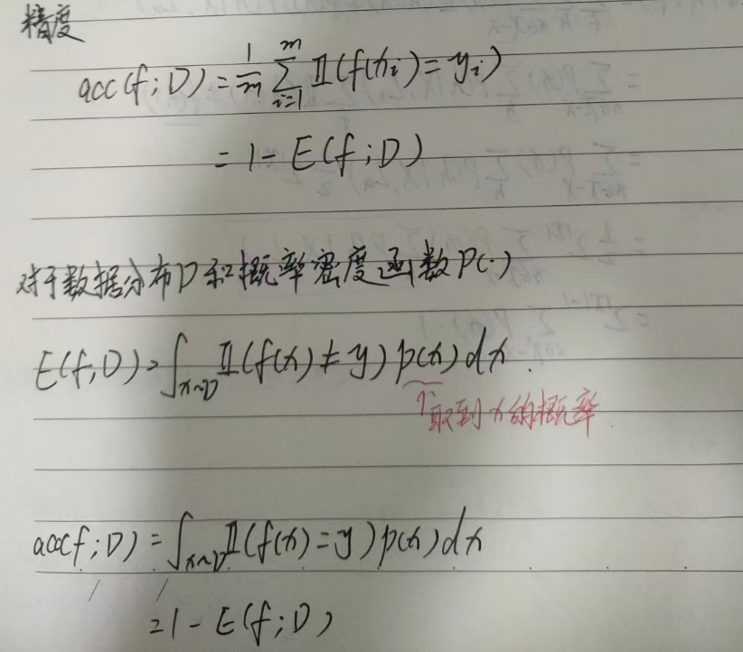
- 查准率
  - 更关心挑出来的瓜里，有多少是真的好瓜
  - 真正例/被判为正例的总数
  - 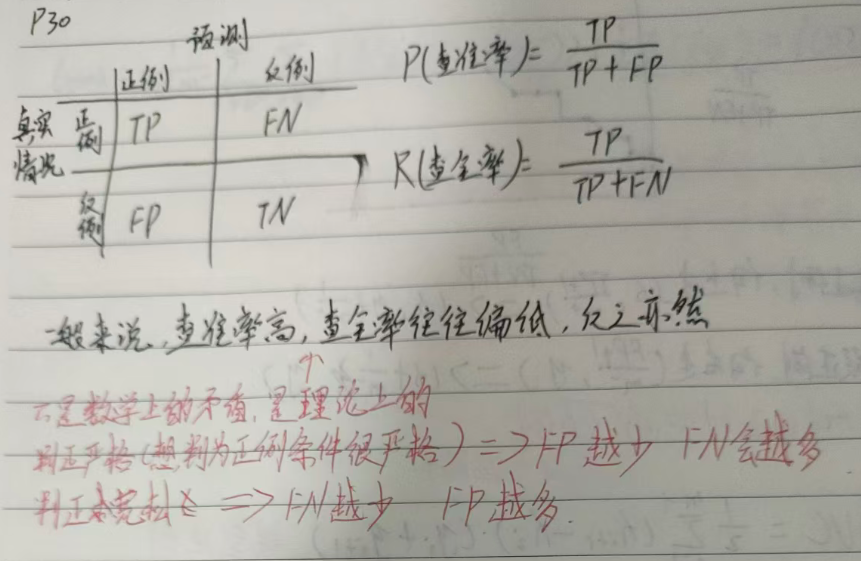
- 查全率
  - 所有好瓜中，有多少被挑出来了
  - 真正例/实际正例的总数
- P-R曲线（查准率和查全率曲线）
  - 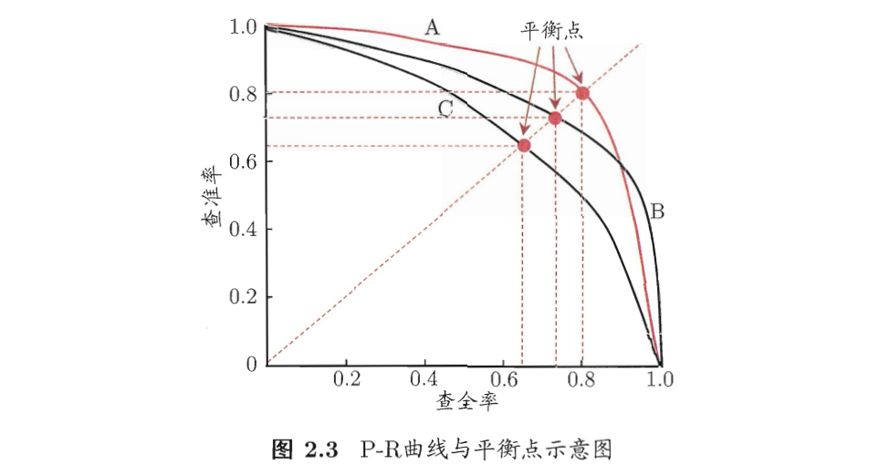
  - 一个学习器的P-R曲线被另外一个学习器包住，可以断言后者性能优于前者
  - 类似A于B要分高低
    - 可以比较P-R曲线下面积大小（计算起来比较困难）
    - 用平衡点度量（查准率=查全率），可以认为A优于B
    - 用F1度量
      - 一些应用中对查全率和查准率重视程度不同
        - 查准率更重要：为了尽可能少打扰用户，更希望推荐内容是用户感兴趣的
        - 查全率更重要：检索逃犯信息，尽可能少漏掉逃犯
        - $F_β$能表达出对查准率和查全率的不同偏好
      - 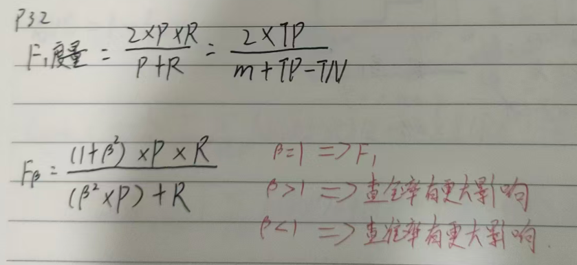
- ROC
  - 一种用于评估二分类模型性能的工具。它通过展示模型在不同分类阈值下的真正类率和假正类率之间的关系
  - 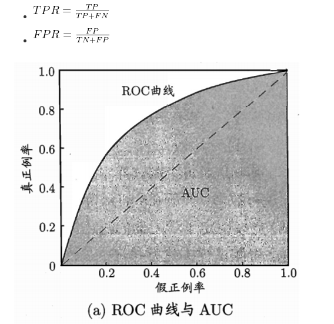
  - 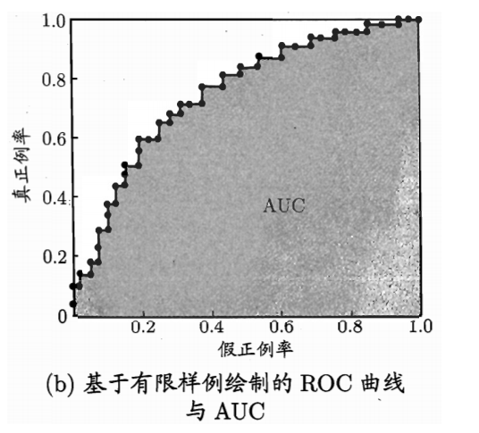
  - 
  - 学习器性能判定
    - 和P-R类似，曲线被完全包住就可以说后者性能优于前者
    - AUC
      - ROC曲线下的面积，用于量化模型的分类性能。AUC值越高，表示模型的分类性能越好
      - 
      - $L_{rank}$:AUC考虑的是原本预测排序质量，它于排序误差有加密联系，所以有 $L_{rank}$作为排序损失
        - 
- 代价敏感错误率
  - 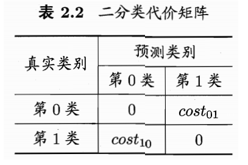
  - 如果将第0类判别为第1类所造成的损失更大，则$cost_{01} > cost_{10}$
  - 我们希望的是最小化总体代价 $E(f;D;cost)$
  - 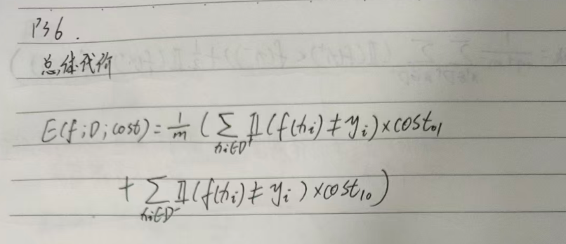
- 代价曲线
  - 非均等代价下，ROC曲线不能直接反映学习器的期望总体代价（这里有点问题，前面也没看到ROC和期望的关系），而代价曲线可达到该目的
  - 通过代价曲线，可以选择使得总代价最小的分类阈值，从而在实际应用中取得更好的性能
  - 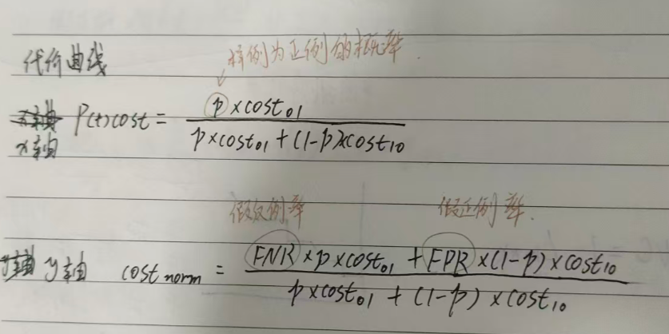

在分类任务中，常见的性能度量指标包括准确率、召回率、精确率、F1分数等

对于回归任务，常用的性能度量指标有均方误差（MSE）、均方根误差（RMSE）和平均绝对误差（MAE）

理解什么是样本预测的排序质量：
  - 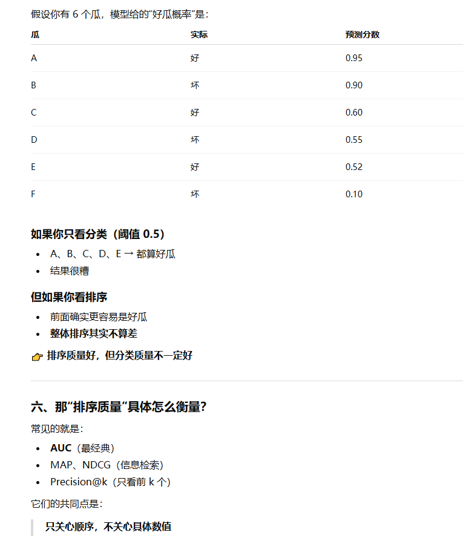

## 比较检验
性能比较中涉及的几个重要因素
- 我们希望比较的是泛化性能，但使用评估方法我们获得的是测试集上的性能，二者对比结果未必相同
- 测试集上的性能与测试集本身的选择有很大关系，即便使用相同大小测试集，包含的样例不同，测试结果也会不同
- 很多机器学习算法本身具有一定随机性，即便用相同参数设置在同一个测试集上多次运行，其结果也会有不同

假设检验为学习器性能比较提供重要依据：若在测试集上观察到学习器A比B好，则A的泛化性能是否在统计意义上由于B，这个结论的把握有多大。

- 假设检验（默认用错误率为性能度量$\epsilon$）
  - 现实中我们不知道泛化错误率，只能获取测试错误率$\hat{\epsilon}$，泛化错误率与测试错误率未必相同，但直观上，二者接近的可能性比较大，所以可根据测试错误率估推出泛化错误率的分布
  - 两种最基本的假设检验
    - 二项检验
      - 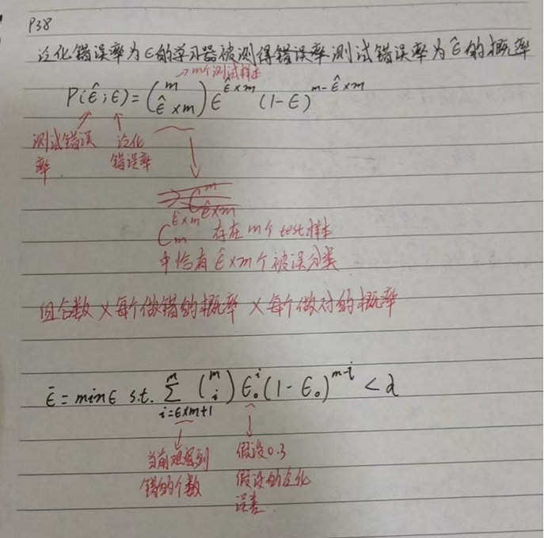
    - t检验
      - 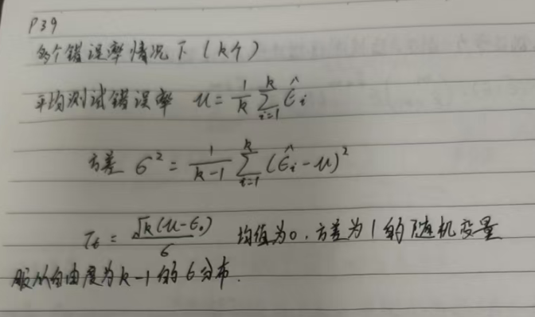

- 常用的机器学习性能比较方法
  - 交叉验证t检验
    - 比较两个模型泛化误差
    - 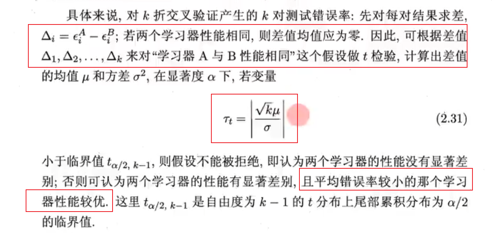
  - McNemar检验
    - 二分类
  - Friedman检验
    - 多个模型多个数据集上的比较
  - Nemenyi后续检验
    - 多个模型多个数据集上的比较
    - 用算法两两之间的比较

套路基本是构造随机变量，看某一次试验是不是会落在假设的小概率区间里面（拒绝域）

# 偏差与方差
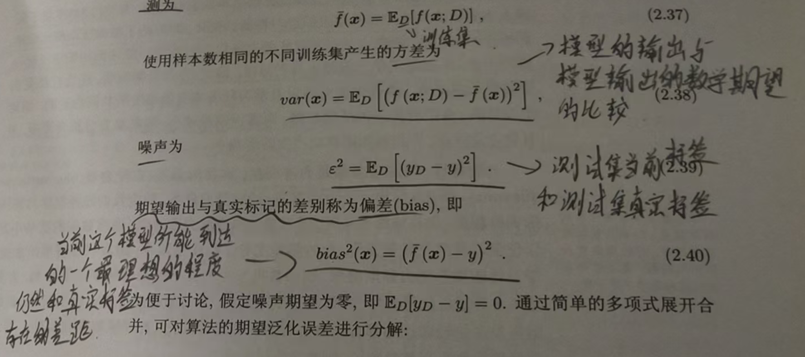

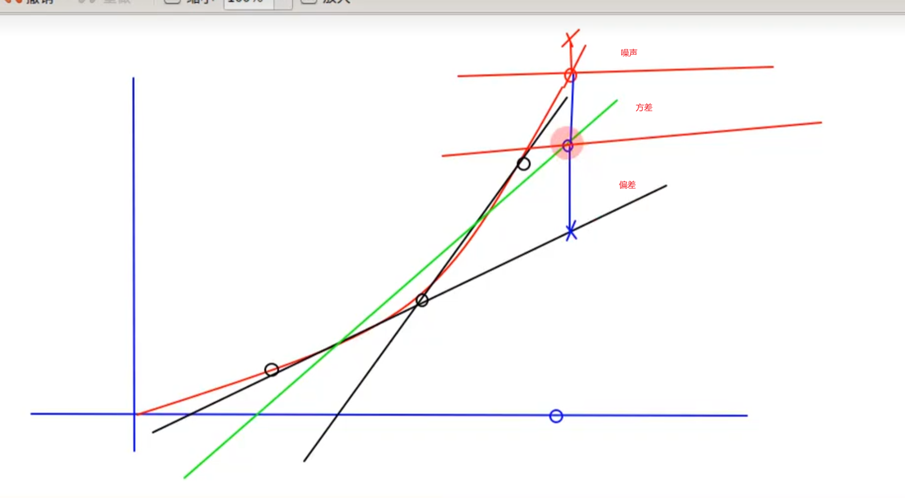

泛化误差=偏差+方差+噪声

# 第三章 线性模型
## 基本形式
$f(x) = w_1x_1+w_2x_2+...+w_dx_d+b$
写成
$f(x) = w^Tx+b$

非线性模型可由简单的线性模型拓展：比如$x_{d+1} = x_1^2$

## 回归
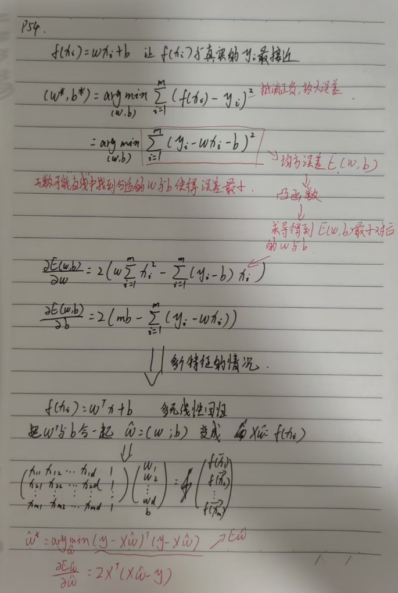

小样本/特征完全线性相关/样本数量太多都可能会有问题

y做非线性变换（将非线性引入线性模型中）：
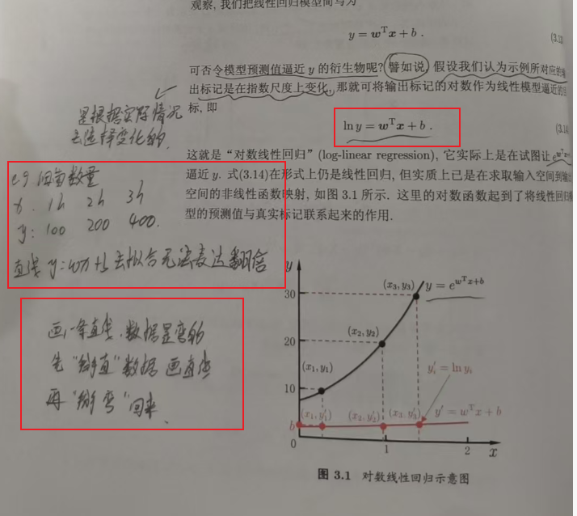

## 分类
### 对数几率回归
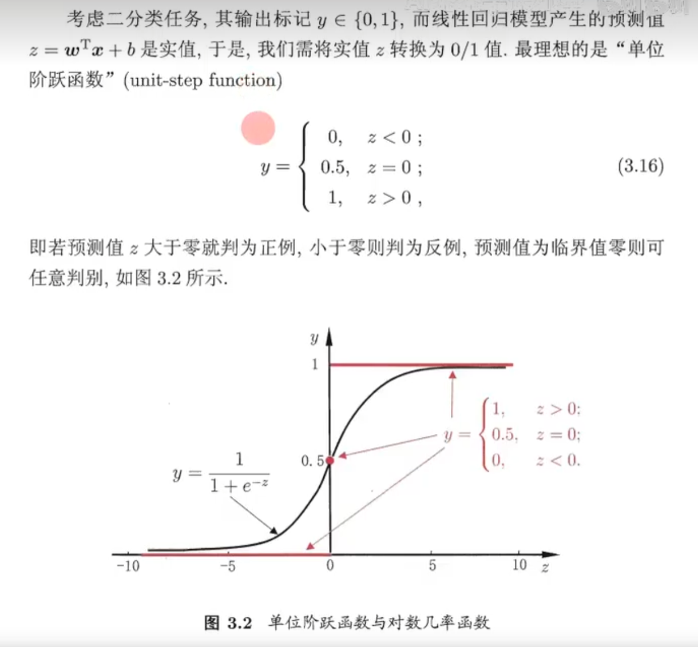

变成一个概率问题：好瓜的概率，坏瓜的概率

高阶可导连续凸函数，不值一个最小点，经典数值优化算法比如梯度下降，牛顿法等都可求得最优解（吴恩达视频里讲步长迭代求最低点的那个）

### 线性判别分析 LDA
前面对数几率回归的思想是把输出转为类别的概率，而线性判别分析的思想是作为划分类别的分类边界

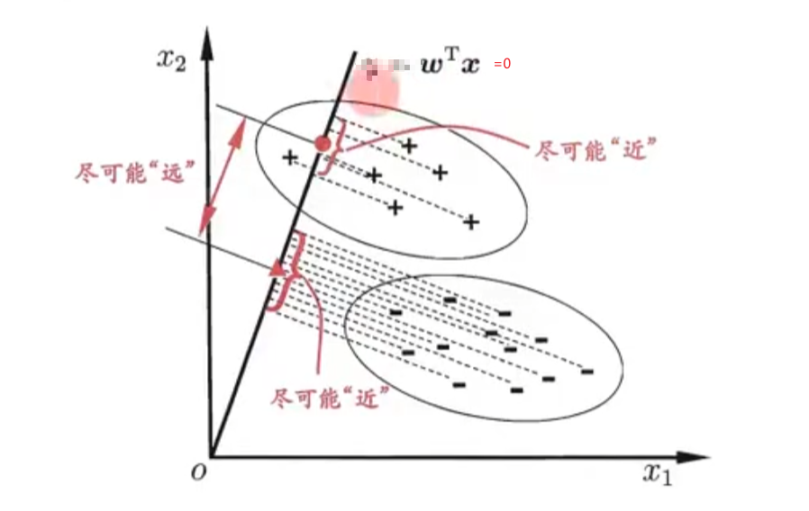

### 多分类学习
利用二分类学习器解决多分类问题

拆解策略：
- 一对一
- 一对多
- 多对多

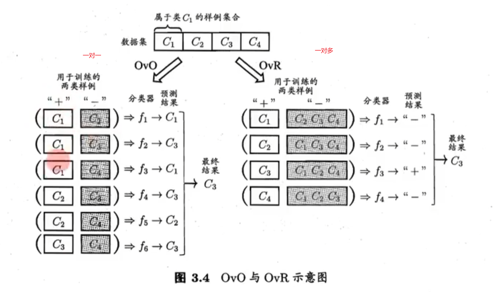

多对多：每次将若干类作为正类，若干其他类作为反类

多对多经典技术：ECOC（纠错输出码）
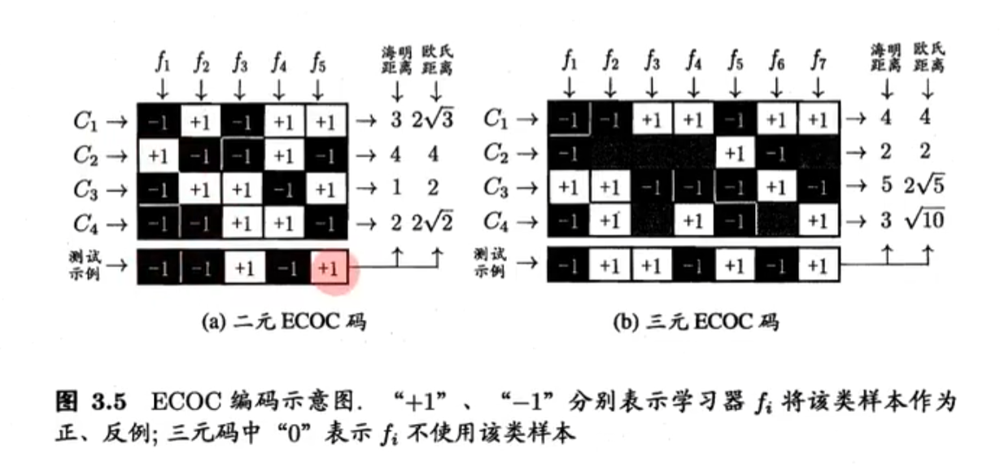

有点独热编码的意思了

测试的值就是看编码距离那个训练类别近就归为哪类

### 类别不平衡问题
正例比反例的数量大很多的情况，只要永远预测新样本为正例，准确率就特别高，但是这个是无效的模型

y作为概率，一般情况如果正反例数量差不多，决策规则是 $\frac{y}{1-y} > 1$ 预测为正例

当数目不同时，另$m^+$表示正例数，$m^-$表示反例数，只要$\frac{y}{1-y}>\frac{m^+}{m^-}$ 则预测为正例

上面两个例子就变成再缩放策略 $\frac{y^`}{1-y^`}=\frac{y}{1-y} * \frac{m^-}{m^+}$

几种比较经典的处理方式：
- 欠采样
  - 去除多的类别的数据量，让正反例数据接近
- 过采样
  - 增加一些正例/反例样本
- 阈值移动
  - 直接基于原始训练集进行学习，在用训练好的分类器进行预测时，将在缩放的公式嵌入到决策过程中

# 第四章 决策树
叶节点：决策结果
其他节点：对应一个属性测试，每个节点包含的样本集合根据属性测试结果被划分到子结点中
根节点：包含样本全集

## 划分选择
选择哪个属性作为节点进行分叉，希望决策树的分支节点所包含的样本尽可能属于同一类别，即分叉纯度越高越好

### 信息增益
熵越小，有序程度越高

n个特征，一个个计算对应的熵，选哪个熵下降最多的特征作为分叉节点

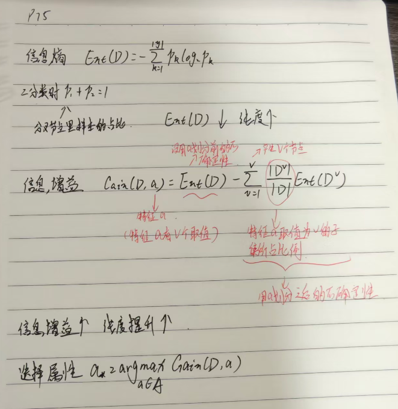

### 增益率
信息增益对可取值数目较多的属性有所偏好，为减少这种偏好可能带来的不利影响，C4.5决策树算法不直接使用信息增益，而是使用信息增益率

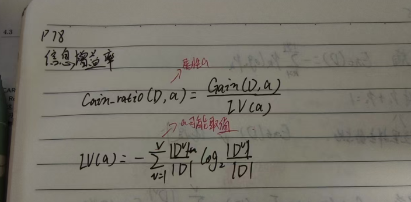

增益率准则对可取数目较少的属性有所偏好，因此，C4.5并不是直接选择增益率最大的候选划分属性，而是使用一种启发式：先从候选划分属性中找出信息增益高于平均水平的属性，再从选择中选择增益率最高的

### 基尼指数
CART决策树使用基尼指数选择划分属性

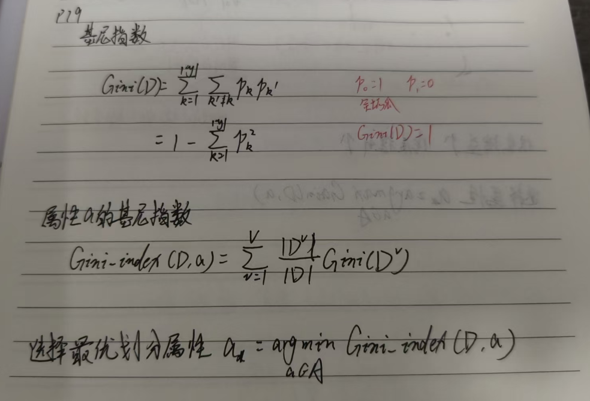

Gini(D)反映从数据集D中随机抽取两个样本，其类别标记不一致的概率，所以值越小，D纯度越高

## 剪枝处理
对付过拟合的一种手段

### 预剪枝
在决策树生成过程中，对每个结点在划分前进行估计，若当前节点的划分不能带来决策树泛化性能提升，则停止划分并将当前结点标记为叶子结点

### 后剪枝
先从训练集生成一颗完整决策树，然后从底向上对非也结点进行考察，若将该结点对应的子树替换为叶结点能带来决策树泛化性能的提升，将该子树替换为叶结点

是否应该进行这个划分，预剪枝要对划分前后的泛化性能进行估计，比如使用精度，用验证集算出划分前后的精度，如果划分后的精度有所提升，则划分，否则就作为叶子结点

## 连续值预缺失值
### 连续值处理
连续属性离散化

比如二分法（找划分点）

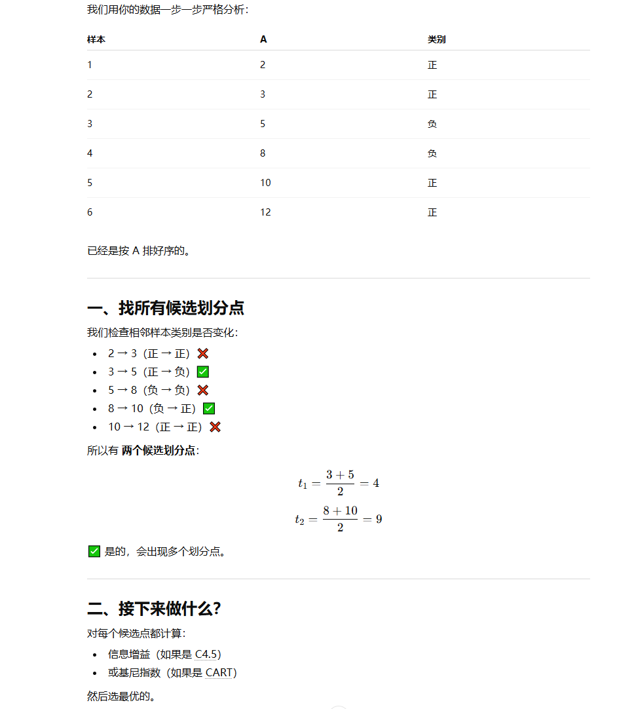

### 缺失值处理
实际情况是数据不可能完整，大量属性和样本情况下存在缺失值，需要考虑的有两个问题：
- 如何在属性值确实情况下进行划分属性选择
- 给定划分属性，若样本在该属性上的值确实，如何对样本进行划分

问题一：

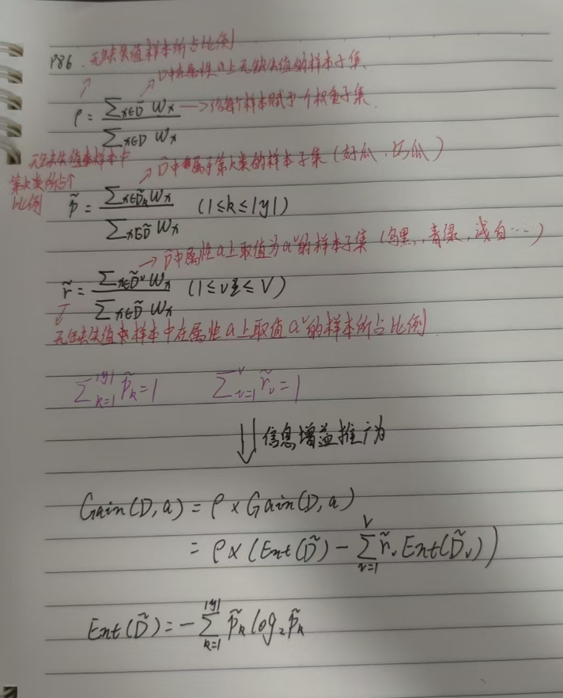

问题二：若样本x在划分属性a上的取值已知，则将x划入与其取值对应的子结点，且样本权值中保持为$w_x$，若样本x在划分属性a上取值未知，则将x同时划入所有子结点，且样本权值在与属性值$a^v$对应的子结点中调整为$\breve{r_v} · w_x$

## 多变量决策树
在一个节点的划分条件中，同时使用多个特征（变量）进行判断的决策树。

上面讨论的都是一个结点一个特征，而多变量决策树是同时使用多个特征进行判断，比如：2×年龄 + 0.5×收入 ≤ 100 ?

这是普通决策树：
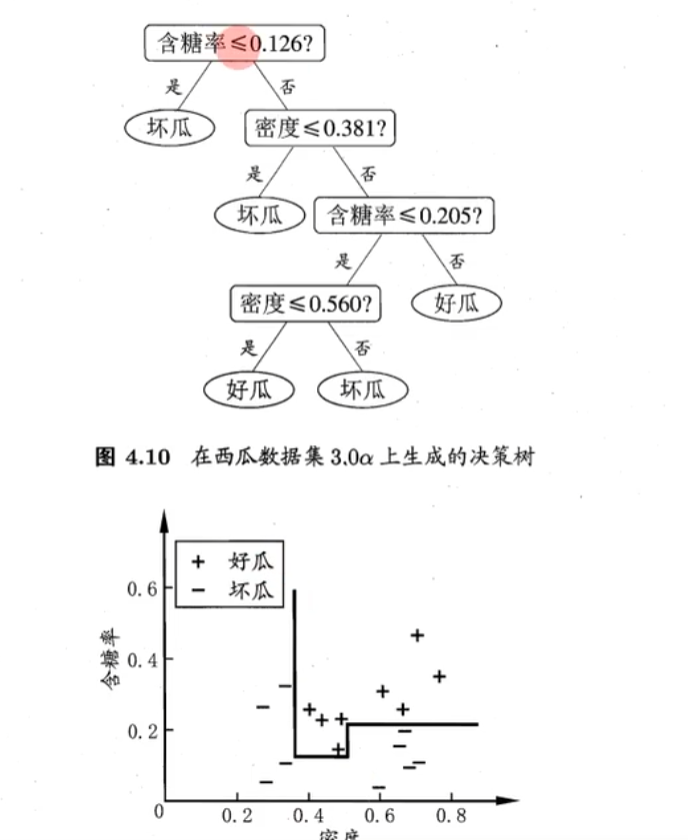

每个非叶结点是一个线性分类器：

与传统单变量决策树不同，在多变量决策树的学习过程中，不是为每个非叶结点寻找一个最优划分属性，而是试图建立一个合适线性分类器。

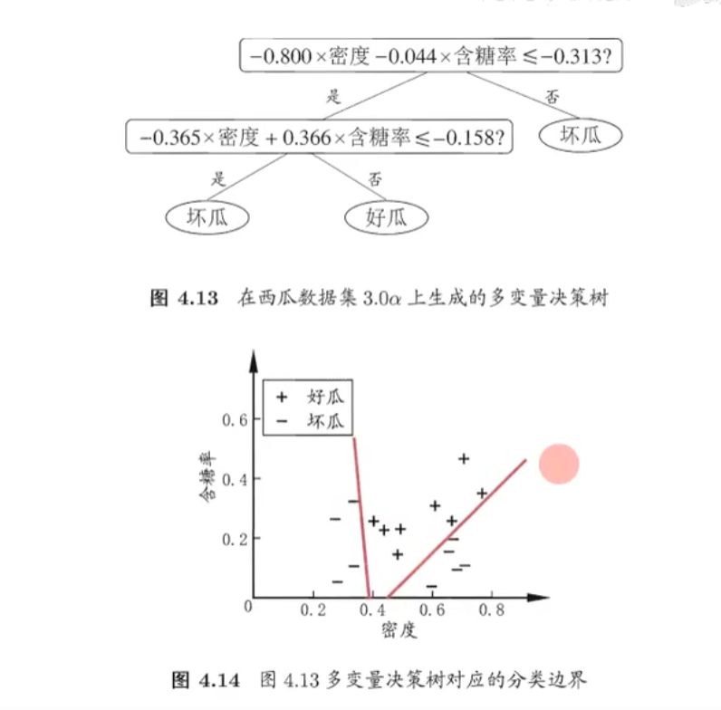

# 第五章 神经网络
## 神经元模型

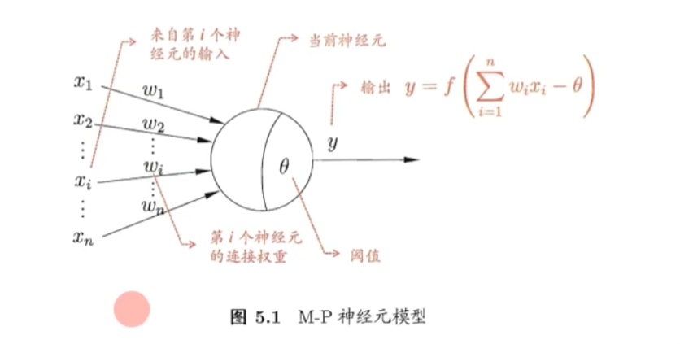

神经元将接收到的总输入值将与神经元的阈值进行比较，然后通过激活函数处理以产生神经元的输出。

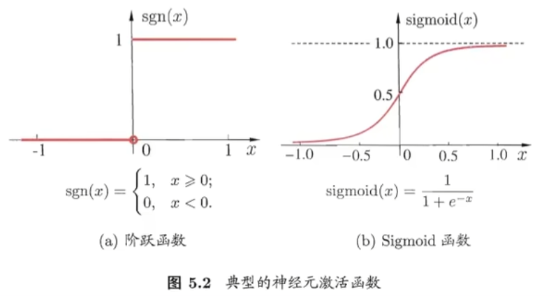

（当前现在这两个作为激活函数已经很少了）

## 感知机与多层网络
感知机由两层神经元组成。

感知机只有输出层神经元进行激活函数处理，即只拥有一层功能神经元。

如果数据是线性可分的，那么感知机一定会在有限步内收敛；如果不是线性可分，则感知机可能永远不收敛。

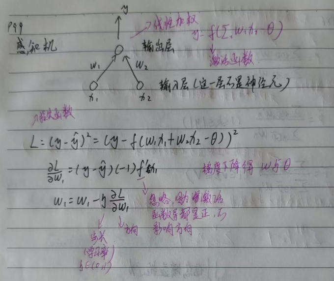

## 误差逆传播算法

## 全局最小与局部最小

## 其他常见神经网络
### RBF网络

### ART网络

### SOM网络

### 级联相关网络

### Elman网络

### Boltzmann机

## 深度学习

# 资料
- 公式推导：https://datawhalechina.github.io/pumpkin-book/#/chapter2/chapter2?id=_23-%e6%80%a7%e8%83%bd%e5%ba%a6%e9%87%8f
- 比较通俗的解释：https://blog.csdn.net/sherlockma/category_12947961.html
- 视频：https://www.bilibili.com/video/BV1LrsoezEL8?spm_id_from=333.788.player.switch&vd_source=c3939bba6fb53dcccb38ed988f16994c&p=9

