# 第一章 绪论
假设空间：学习算法所考虑的所有可能的假设集合
  - 有限假设空间，如决策树
  - 无限假设空间：如线性回归的权重参数


没有免费的午餐定理：

指示函数： 是数学、概率论和机器学习中非常常用的一个工具，用来判断某个条件是否成立，并把结果表示成数值，条件成立 → 取 1；条件不成立 → 取 0

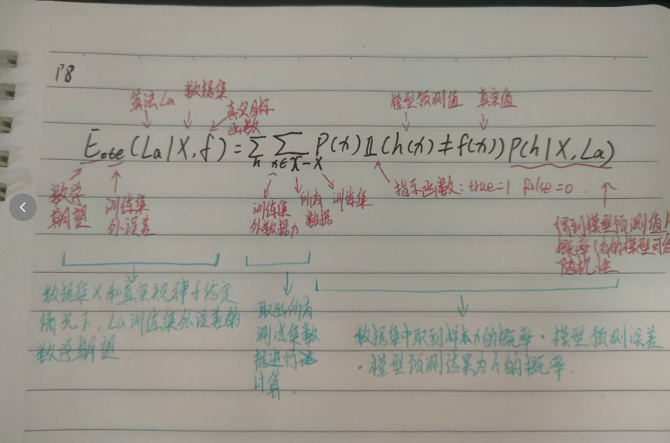

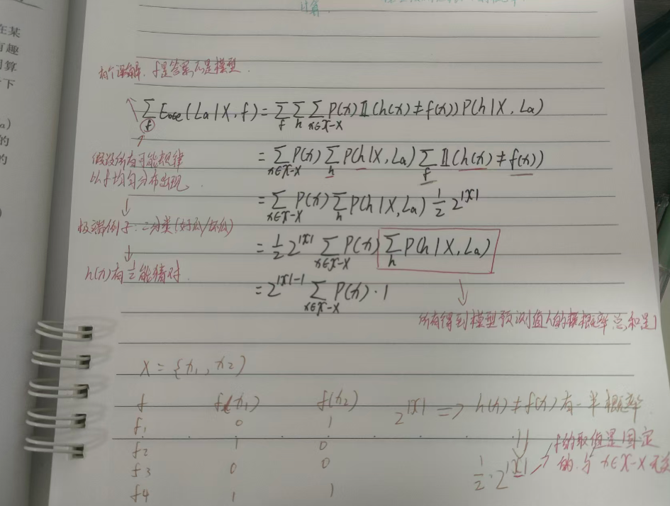

归纳偏好：从上面的定理可以推断，如果对真实规律不作任何假设，学习是不可能的。比如特征工程是“归纳偏好”的一种非常重要的实现方式。

# 第二章 模型评估与选择
## 检验误差与过拟合
错误率：分类错误的样本数占样本总数的比例
精度：1-错误率
误差：学习器实际预测输出与样本真实输出之间的差异
  - 训练误差/经验误差：训练集上的误差
  - 泛化误差：新样本上的误差

过拟合：训练集上效果好，测试集上效果不好，过拟合无法避免，只能缓解
欠拟合：训练集和测试集效果都不好

## 评估方法
- 留出法
  - 数据集划分为两个互斥集合（分层采用保留类别比例），一个作为训练集，一个作为测试集
  - 单次使用留出法的估计结果不可靠，通常是重复实验取平均作为留出法评估结果
  - 常见做法是2/3-4/5作为训练集，其他作为测试集
- 交叉验证法
  - 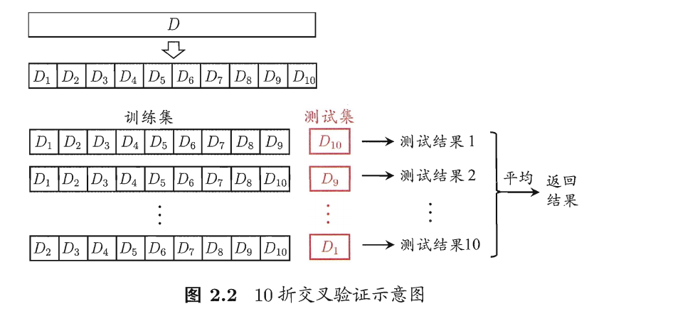
- 自助法
  - 有放回取球的例子
  - 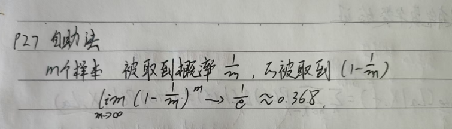
  - 就是仍有估计1/3的数据没有在训练集中出现用于测试
  - 缺点：自助法产生的数据集改变了初始数据集分布，会引入估计偏差
    - 估计偏差：估计方法本身带来的偏差，即使样本再多、算得再认真，结果也会偏高或偏低（假设想估计一个班学生的平均身高：你只在篮球队里抽样，算出来的平均身高：175 cm，全班真实平均身高：168 cm 这个 175 cm 系统性偏高，原因不是运气，而是抽样方式有问题这就叫 有估计偏差）
    - 在初始数据量足够情况下，留出法和交叉验证法更常用
- 调参与最终模型
  - 参数分为：超参数、模型参数
    - 超参数
      - 是算法参数，数目常在10以内
      - 由人工设定多个参数候选值后产生模型（比如决策树的深度，叶子数等）
    - 模型参数：
      - 参数数目可能很多，比如深度学习模型可能有上百亿参数
      - 通过学习产生多个候选模型
      - 在模型选择完成后，学习算法和参数配置已选定（超参数），此时，应该用数据集D（所有数据集，因为前面的实验都是用的部分数据集做训练）重新训练模型，这个模型才是最终要交给用户使用的模型

## 性能度量
- 错误率
  - 预测错误个数/样本总数
  - 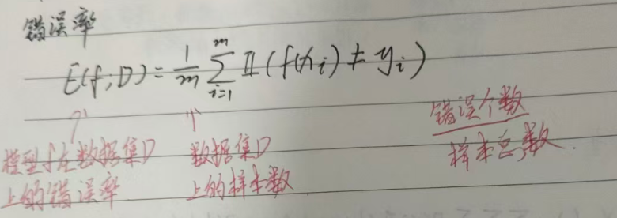
- 精度
  - 预测正确个数/样本总数
  - 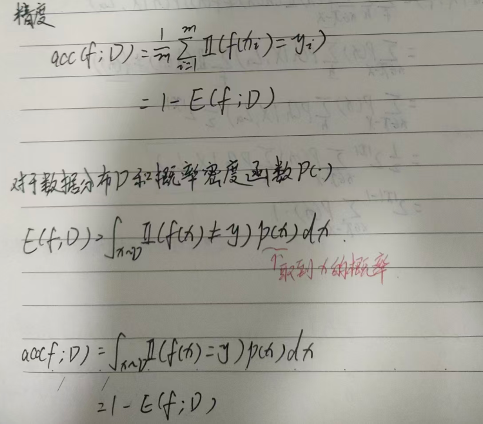
- 查准率
  - 更关心挑出来的瓜里，有多少是真的好瓜
  - 真正例/被判为正例的总数
  - 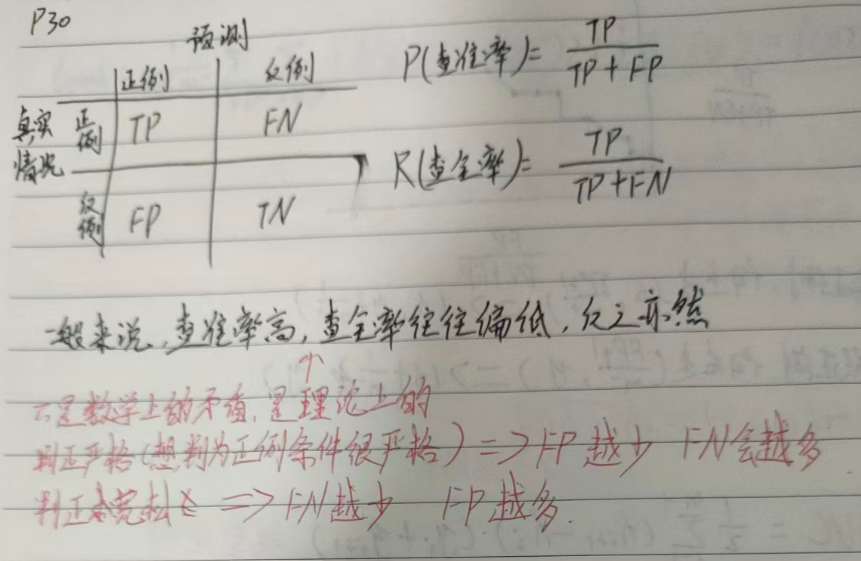
- 查全率
  - 所有好瓜中，有多少被挑出来了
  - 真正例/实际正例的总数
- P-R曲线（查准率和查全率曲线）
  - 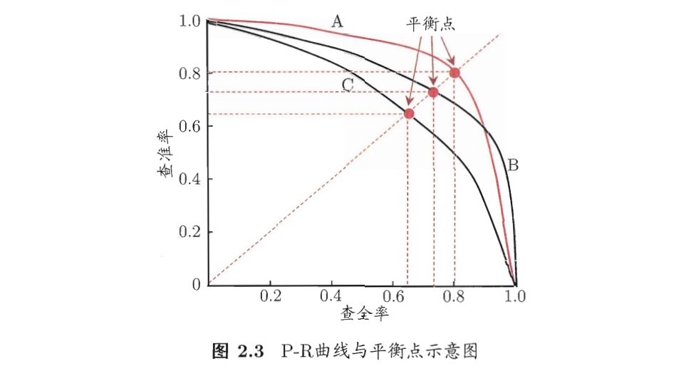
  - 一个学习器的P-R曲线被另外一个学习器包住，可以断言后者性能优于前者
  - 类似A于B要分高低
    - 可以比较P-R曲线下面积大小（计算起来比较困难）
    - 用平衡点度量（查准率=查全率），可以认为A优于B
    - 用F1度量
      - 一些应用中对查全率和查准率重视程度不同
        - 查准率更重要：为了尽可能少打扰用户，更希望推荐内容是用户感兴趣的
        - 查全率更重要：检索逃犯信息，尽可能少漏掉逃犯
        - $F_β$能表达出对查准率和查全率的不同偏好
      - 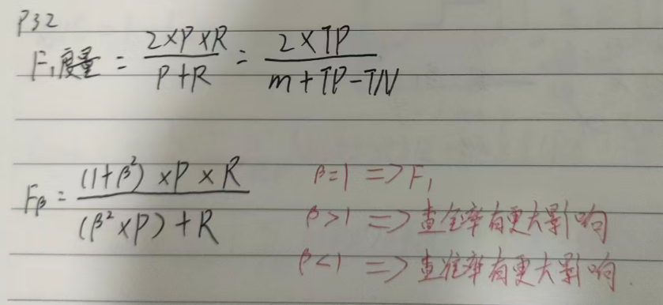
- ROC
  - 一种用于评估二分类模型性能的工具。它通过展示模型在不同分类阈值下的真正类率和假正类率之间的关系
  - 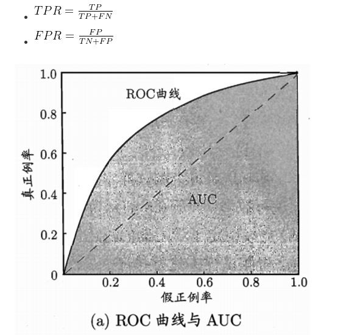
  - 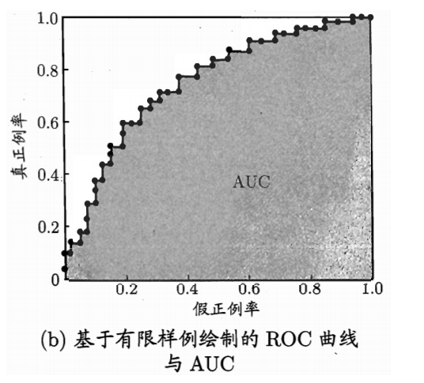
  - 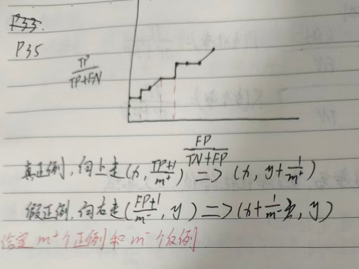
  - 学习器性能判定
    - 和P-R类似，曲线被完全包住就可以说后者性能优于前者
    - AUC
      - ROC曲线下的面积，用于量化模型的分类性能。AUC值越高，表示模型的分类性能越好
      - 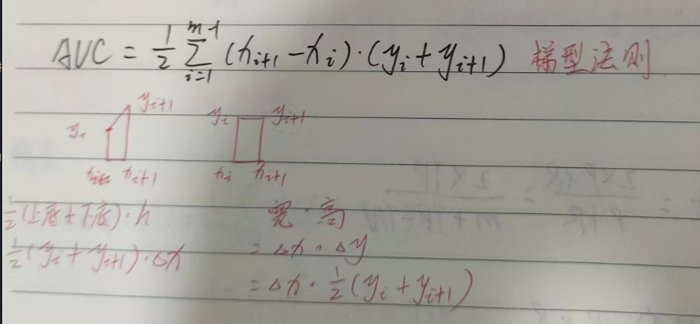
      - $L_{rank}$:AUC考虑的是原本预测排序质量，它于排序误差有加密联系，所以有 $L_{rank}$作为排序损失
        - 
- 代价敏感错误率
  - 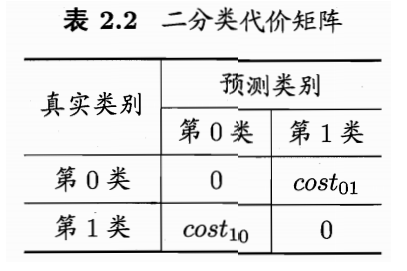
  - 如果将第0类判别为第1类所造成的损失更大，则$cost_{01} > cost_{10}$
  - 我们希望的是最小化总体代价 $E(f;D;cost)$
  - 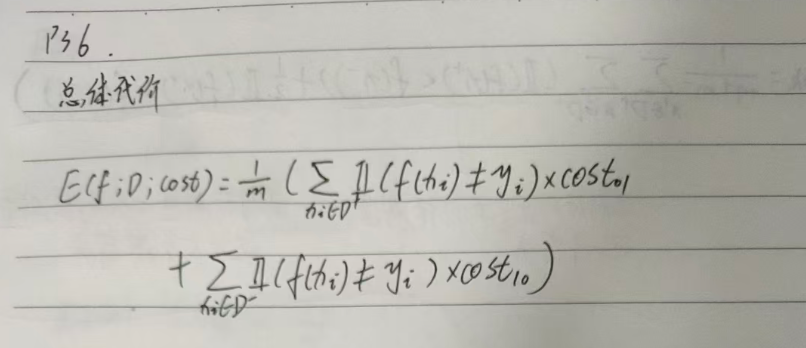
- 代价曲线
  - 非均等代价下，ROC曲线不能直接反映学习器的期望总体代价（这里有点问题，前面也没看到ROC和期望的关系），而代价曲线可达到该目的
  - 通过代价曲线，可以选择使得总代价最小的分类阈值，从而在实际应用中取得更好的性能
  - 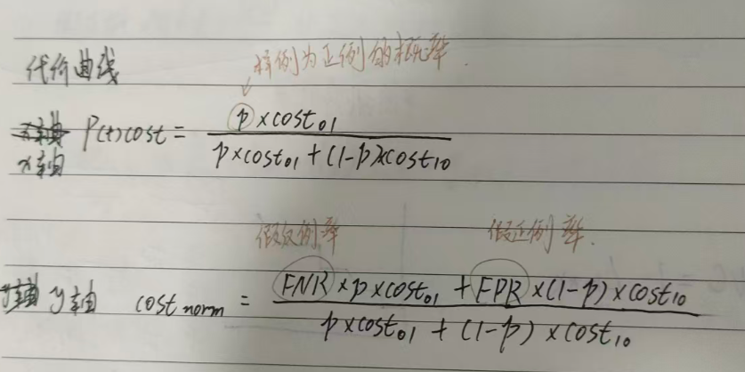


在分类任务中，常见的性能度量指标包括准确率、召回率、精确率、F1分数等

对于回归任务，常用的性能度量指标有均方误差（MSE）、均方根误差（RMSE）和平均绝对误差（MAE）

理解什么是样本预测的排序质量：
  - 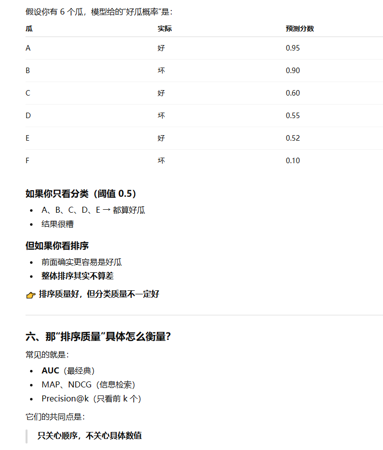


## 比较检验
性能比较中涉及的几个重要因素
- 我们希望比较的是泛化性能，但使用评估方法我们获得的是测试集上的性能，二者对比结果未必相同
- 测试集上的性能与测试集本身的选择有很大关系，即便使用相同大小测试集，包含的样例不同，测试结果也会不同
- 很多机器学习算法本身具有一定随机性，即便用相同参数设置在同一个测试集上多次运行，其结果也会有不同

假设检验为学习器性能比较提供重要依据：若在测试集上观察到学习器A比B好，则A的泛化性能是否在统计意义上由于B，这个结论的把握有多大。


- 假设检验（默认用错误率为性能度量$\epsilon$）
  - 现实中我们不知道泛化错误率，只能获取测试错误率$\hat{\epsilon}$，泛化错误率与测试错误率未必相同，但直观上，二者接近的可能性比较大，所以可根据测试错误率估推出泛化错误率的分布
  - 两种最基本的假设检验
    - 二项检验
      - 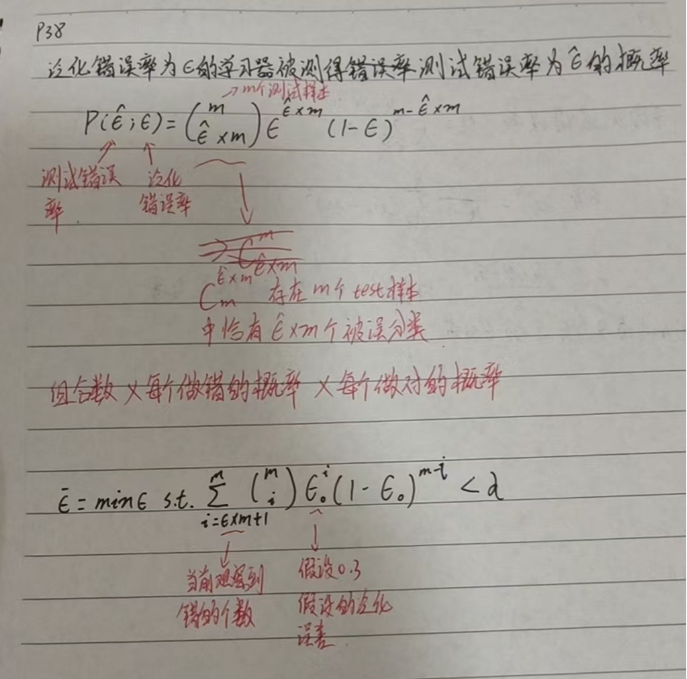
    - t检验
      - 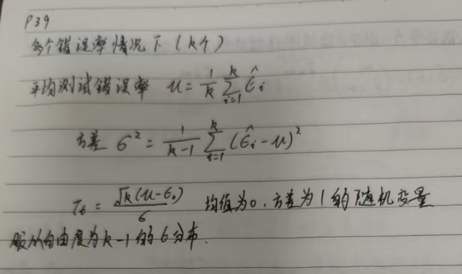

- 常用的机器学习性能比较方法
  - 交叉验证t检验
    - 比较两个模型泛化误差
    - 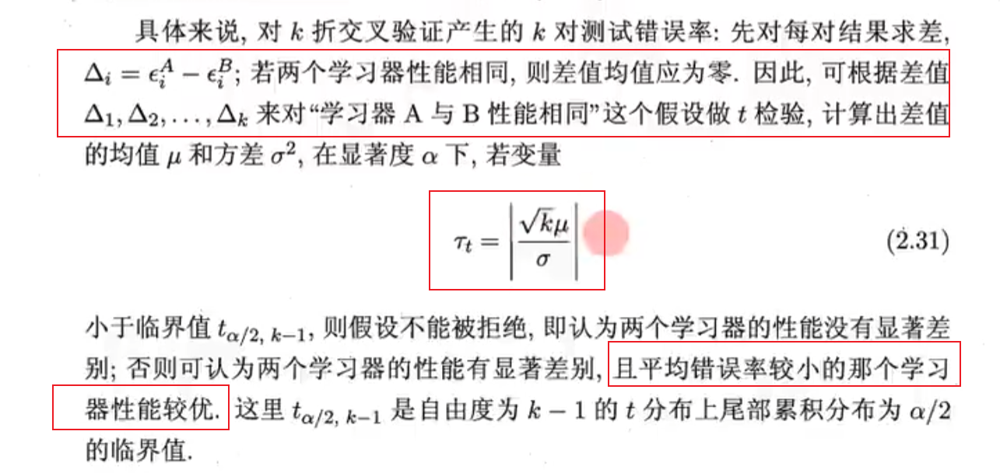
  - McNemar检验
    - 二分类
  - Friedman检验
    - 多个模型多个数据集上的比较
  - Nemenyi后续检验
    - 多个模型多个数据集上的比较
    - 用算法两两之间的比较

套路基本是构造随机变量，看某一次试验是不是会落在假设的小概率区间里面（拒绝域）

# 偏差与方差
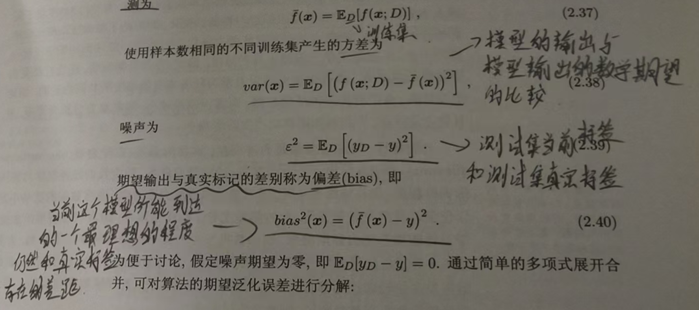

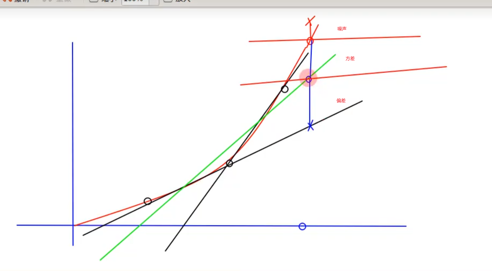

泛化误差=偏差+方差+噪声

# 第三章 线性模型
## 基本形式
$f(x) = w_1x_1+w_2x_2+...+w_dx_d+b$
写成
$f(x) = w^Tx+b$

非线性模型可由简单的线性模型拓展：比如$x_{d+1} = x_1^2$

## 回归
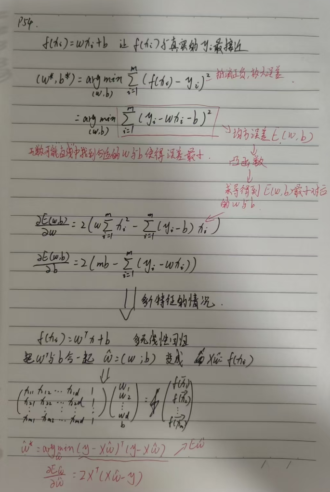

小样本/特征完全线性相关/样本数量太多都可能会有问题

y做非线性变换（将非线性引入线性模型中）：
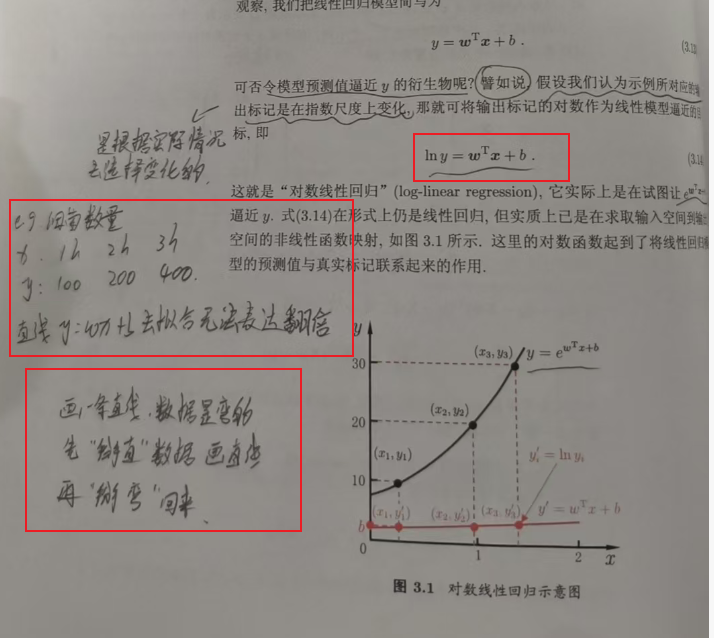

## 分类
### 对数几率回归
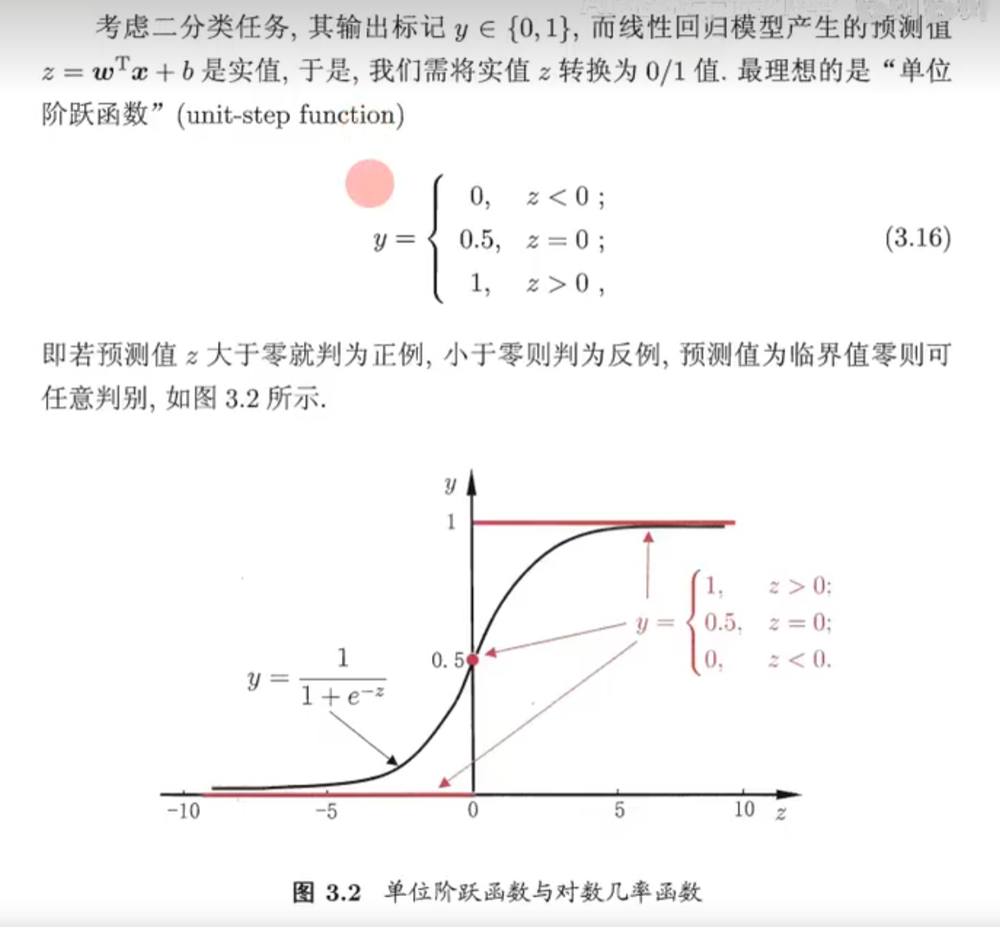

变成一个概率问题：好瓜的概率，坏瓜的概率

高阶可导连续凸函数，不值一个最小点，经典数值优化算法比如梯度下降，牛顿法等都可求得最优解（吴恩达视频里讲步长迭代求最低点的那个）

### 线性判别分析 LDA
前面对数几率回归的思想是把输出转为类别的概率，而线性判别分析的思想是作为划分类别的分类边界

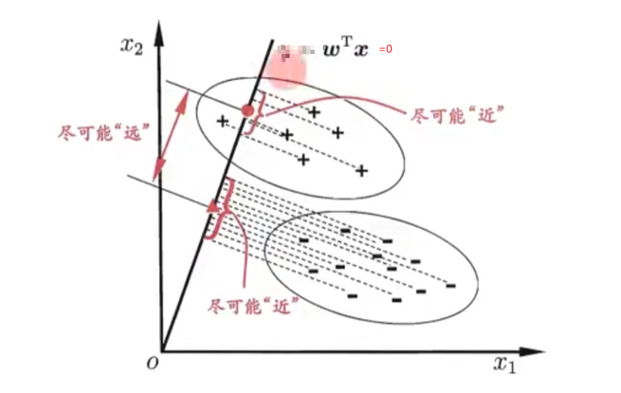


### 多分类学习
利用二分类学习器解决多分类问题

拆解策略：
- 一对一
- 一对多
- 多对多

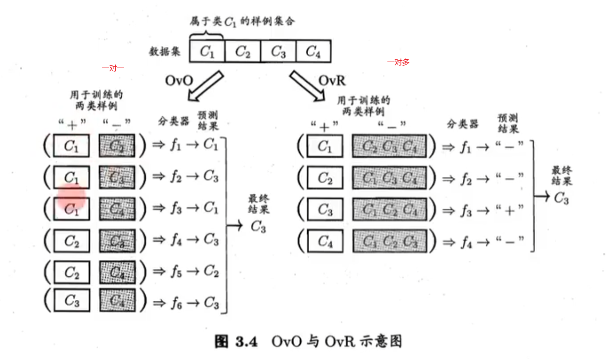


多对多：每次将若干类作为正类，若干其他类作为反类

多对多经典技术：ECOC（纠错输出码）
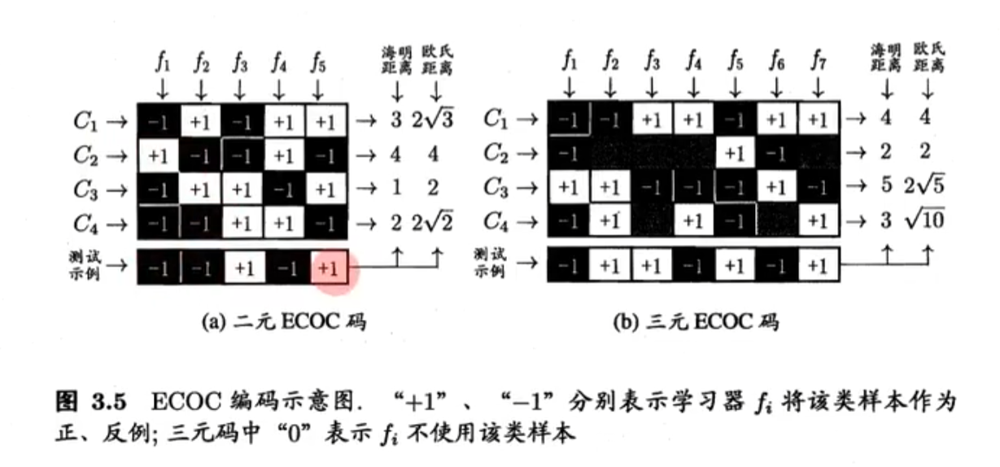

有点独热编码的意思了

测试的值就是看编码距离那个训练类别近就归为哪类


### 类别不平衡问题
正例比反例的数量大很多的情况，只要永远预测新样本为正例，准确率就特别高，但是这个是无效的模型

y作为概率，一般情况如果正反例数量差不多，决策规则是 $\frac{y}{1-y} > 1$ 预测为正例

当数目不同时，另$m^+$表示正例数，$m^-$表示反例数，只要$\frac{y}{1-y}>\frac{m^+}{m^-}$ 则预测为正例

上面两个例子就变成再缩放策略 $\frac{y^`}{1-y^`}=\frac{y}{1-y} * \frac{m^-}{m^+}$

几种比较经典的处理方式：
- 欠采样
  - 去除多的类别的数据量，让正反例数据接近
- 过采样
  - 增加一些正例/反例样本
- 阈值移动
  - 直接基于原始训练集进行学习，在用训练好的分类器进行预测时，将在缩放的公式嵌入到决策过程中

# 第四章 决策树
叶节点：决策结果
其他节点：对应一个属性测试，每个节点包含的样本集合根据属性测试结果被划分到子结点中
根节点：包含样本全集

## 划分选择
选择哪个属性作为节点进行分叉，希望决策树的分支节点所包含的样本尽可能属于同一类别，即分叉纯度越高越好

### 信息增益
熵越小，有序程度越高

n个特征，一个个计算对应的熵，选哪个熵下降最多的特征作为分叉节点

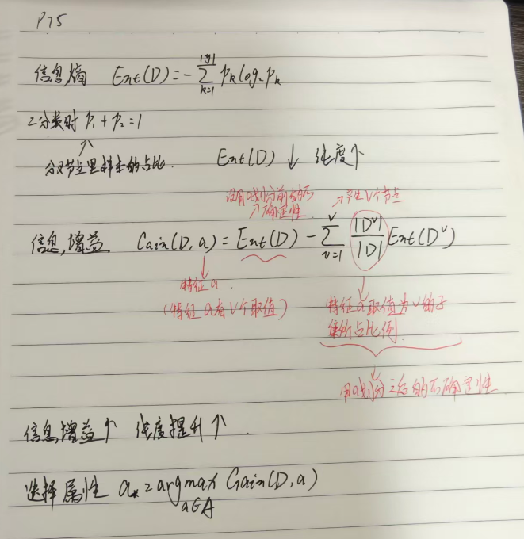


### 增益率
信息增益对可取值数目较多的属性有所偏好，为减少这种偏好可能带来的不利影响，C4.5决策树算法不直接使用信息增益，而是使用信息增益率

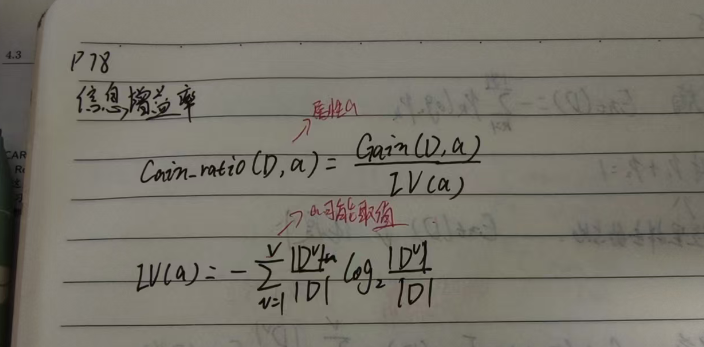

增益率准则对可取数目较少的属性有所偏好，因此，C4.5并不是直接选择增益率最大的候选划分属性，而是使用一种启发式：先从候选划分属性中找出信息增益高于平均水平的属性，再从选择中选择增益率最高的

### 基尼指数
CART决策树使用基尼指数选择划分属性

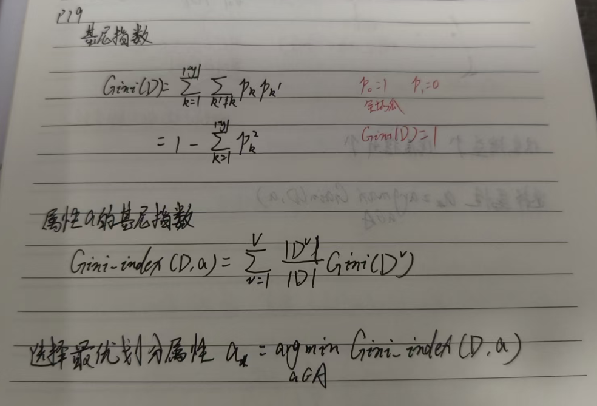

Gini(D)反映从数据集D中随机抽取两个样本，其类别标记不一致的概率，所以值越小，D纯度越高


## 剪枝处理
对付过拟合的一种手段

### 预剪枝
在决策树生成过程中，对每个结点在划分前进行估计，若当前节点的划分不能带来决策树泛化性能提升，则停止划分并将当前结点标记为叶子结点


### 后剪枝
先从训练集生成一颗完整决策树，然后从底向上对非也结点进行考察，若将该结点对应的子树替换为叶结点能带来决策树泛化性能的提升，将该子树替换为叶结点

是否应该进行这个划分，预剪枝要对划分前后的泛化性能进行估计，比如使用精度，用验证集算出划分前后的精度，如果划分后的精度有所提升，则划分，否则就作为叶子结点

## 连续值预缺失值
### 连续值处理
连续属性离散化

比如二分法（找划分点）

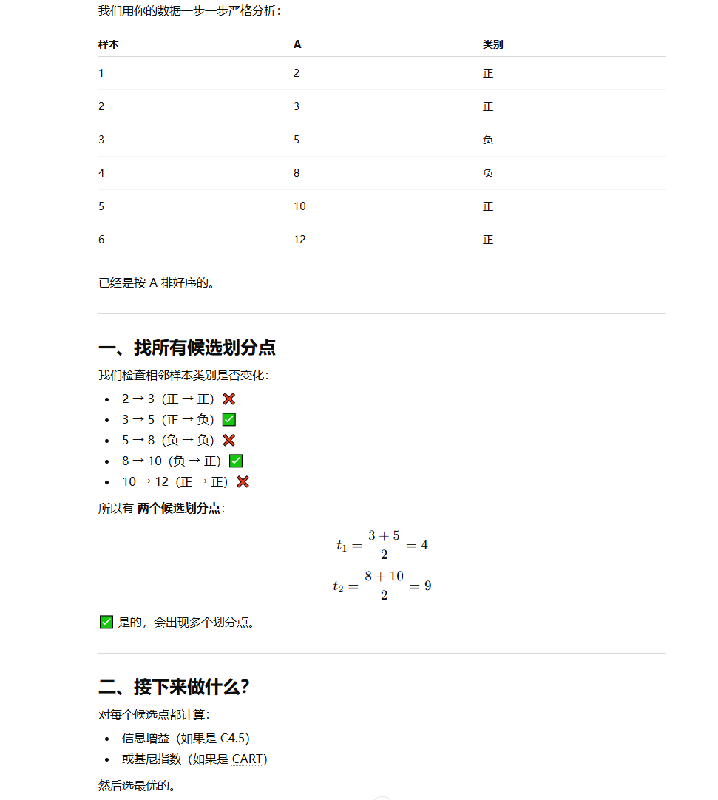

### 缺失值处理
实际情况是数据不可能完整，大量属性和样本情况下存在缺失值，需要考虑的有两个问题：
- 如何在属性值确实情况下进行划分属性选择
- 给定划分属性，若样本在该属性上的值确实，如何对样本进行划分

问题一：

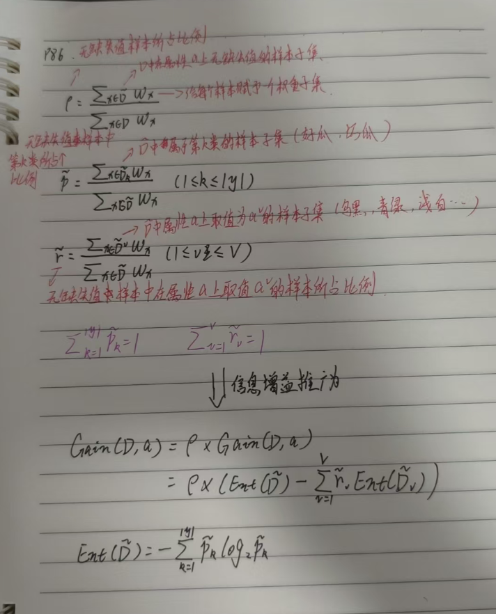


问题二：若样本x在划分属性a上的取值已知，则将x划入与其取值对应的子结点，且样本权值中保持为$w_x$，若样本x在划分属性a上取值未知，则将x同时划入所有子结点，且样本权值在与属性值$a^v$对应的子结点中调整为$\breve{r_v} · w_x$

## 多变量决策树
在一个节点的划分条件中，同时使用多个特征（变量）进行判断的决策树。

上面讨论的都是一个结点一个特征，而多变量决策树是同时使用多个特征进行判断，比如：2×年龄 + 0.5×收入 ≤ 100 ?

这是普通决策树：
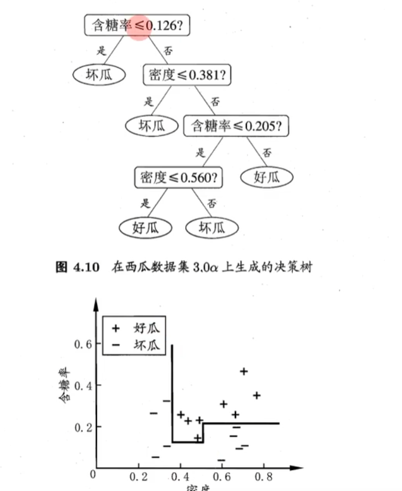

每个非叶结点是一个线性分类器：

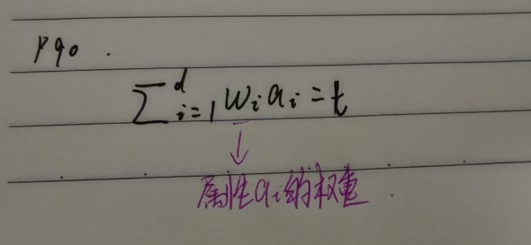

与传统单变量决策树不同，在多变量决策树的学习过程中，不是为每个非叶结点寻找一个最优划分属性，而是试图建立一个合适线性分类器。

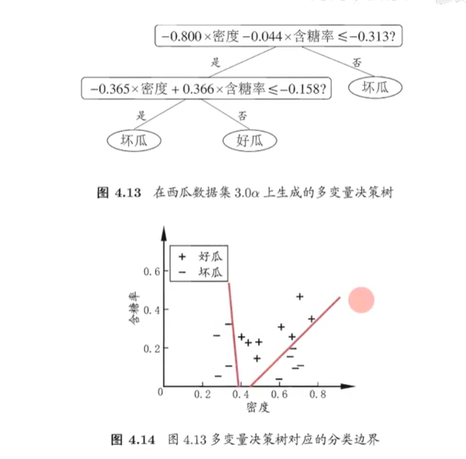

# 第五章 神经网络
## 神经元模型

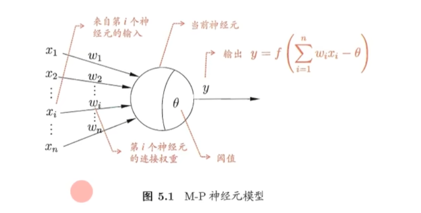

神经元将接收到的总输入值将与神经元的阈值进行比较，然后通过激活函数处理以产生神经元的输出。

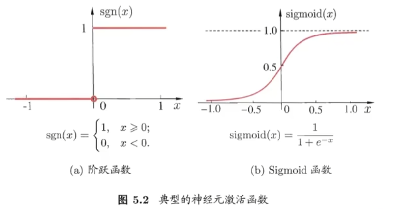

（当前现在这两个作为激活函数已经很少了）

## 感知机与多层网络
感知机由两层神经元组成。

感知机只有输出层神经元进行激活函数处理，即只拥有一层功能神经元。

如果数据是线性可分的，那么感知机一定会在有限步内收敛；如果不是线性可分，则感知机可能永远不收敛。

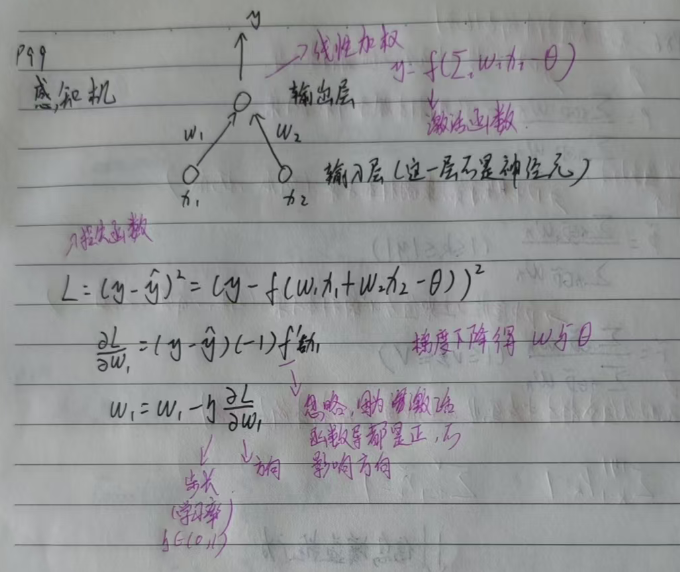

要解决非线性问题，需要考虑多层功能神经元。


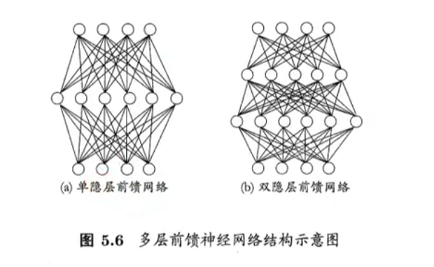

多层前馈神经网络，输入层神经元仅是接收输入，不进行函数处理，隐层与输出层包含功能神经元。

## 误差逆传播算法
多层网络的学习能力比单层感知机强。欲训练多层网络，简单感知机学习规则显然不够，需要更强大的算法。

误差逆传播（BP）算法是最杰出代表。

一般说BP网络指的是BP算法训练的多层前馈sj网络。

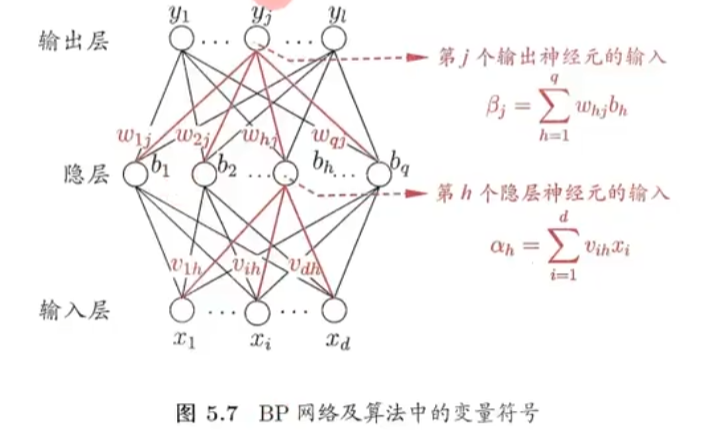

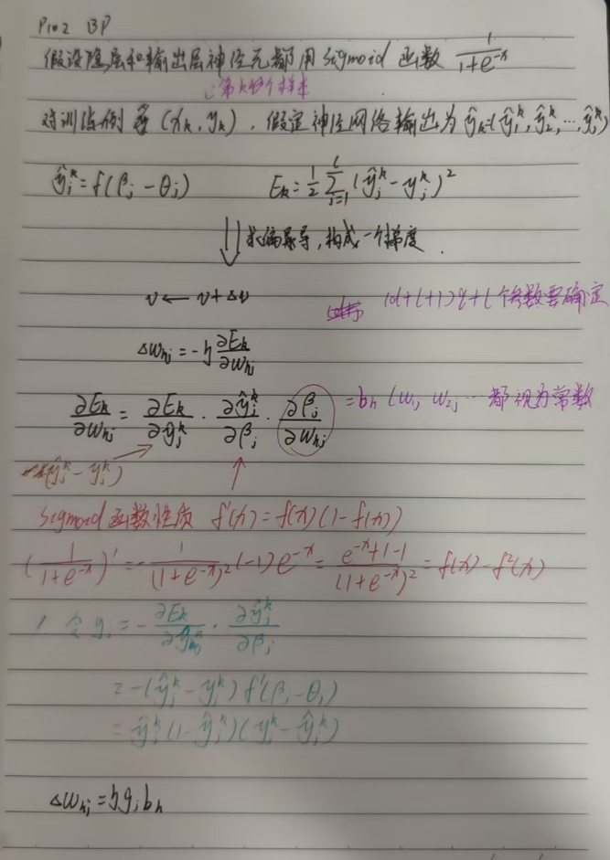

BP算法的目标是要最小化训练集D上的累计误差 $E=\frac{1}{m} \sum_{k=1}^{m} E_k$ (累积误差逆转传播算法)

BPsj网络经常遭遇过拟合，有两种策略：
- 早停，将数据分成训练集和验证集，训练集用来计算梯度、更新连接权、阈值，验证集估计误差，若训练集误差降低单验证集误差升高，则停止训练
- 正则化：在误差目标函数中增加一个用于描述网络复杂度的部分，例如连接权与阈值的平方和
- 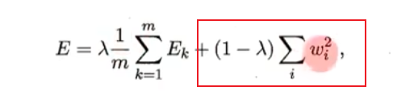
- 这样做是为了限制w的大小，因为过拟合经常出现参数非常大的情况


## 全局最小与局部最小
可能存在多个局部最小，但只会有一个全局最小

现实任务重常用以下策略跳出局部极小：
- 多组不同参数值初始化多个神经网络，按标准方法训练后取其中误差最小的解作为最终参数
- 使用模拟退火技术，在每一步都以一定概率接受比当前解更差的结果，从而有助于“跳出”局部极小
- 用随机梯度下降，随机梯度下降法在计算梯度时加入随机因素，即使陷入局部极小点，它计算出的梯度仍可能不为0，这样就有机会跳出极小继续搜索

## 其他常见神经网络（现在已经不常见了，主要是学习它的改进思路）
### RBF网络
RBF（径向基函数网络）是一种单隐层前馈神经网络，主要的改进是在激活函数上（RBF函数）

理解神经元中心：
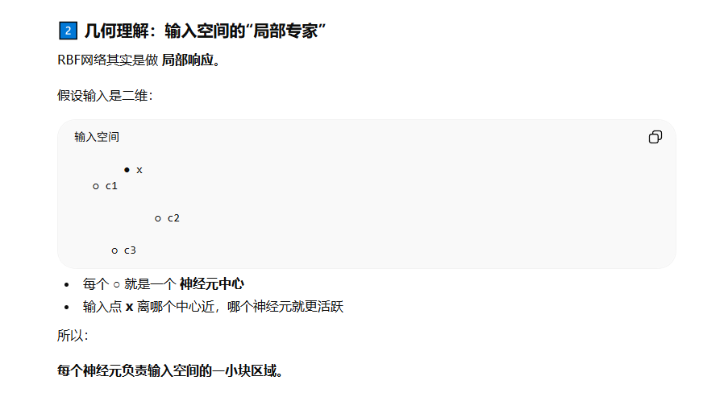

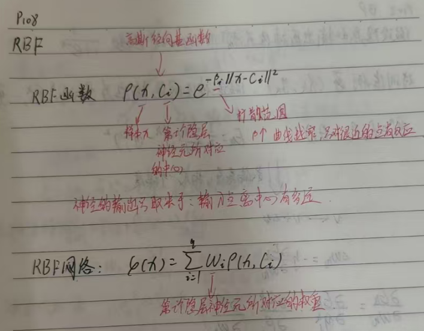


### ART网络
竞争型学习是神经网络中一种常用的无监督学习。

网络的输出神经元相互竞争，每一时刻仅有一个竞争获胜的神经元被激活。

竞争最简单方式是计算输入向量与每个识别层神经元所对应的模式类的代表向量之间的距离（相关性），距离最小者获胜。


### SOM网络
竞争学习型无监督神经网络，将高维输入数据映射到低纬空间，同时保持输入数据改为空间的拓扑结构

### 级联相关网络
可控制过拟合发生。在训练中找到最符合数据特点的网络结构。

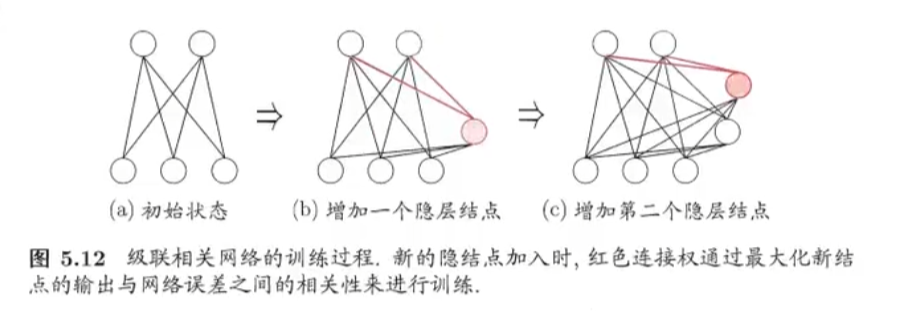

### Elman网络
循环神经网络允许网络中出现环形结构，从而让一些神经元的输出反馈回来作为输入信号

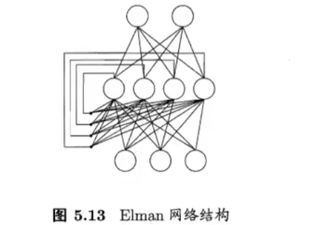

### Boltzmann机（用的少，但是理论地位高）
为网络状态定义一个“能量”，能量最小化时网络达到理想状态。

Boltzmann机的神经元都是布尔值。

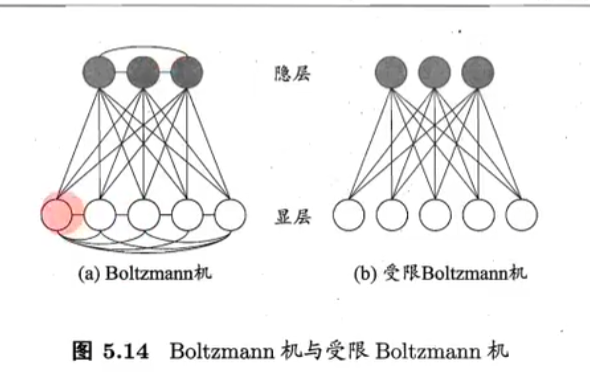

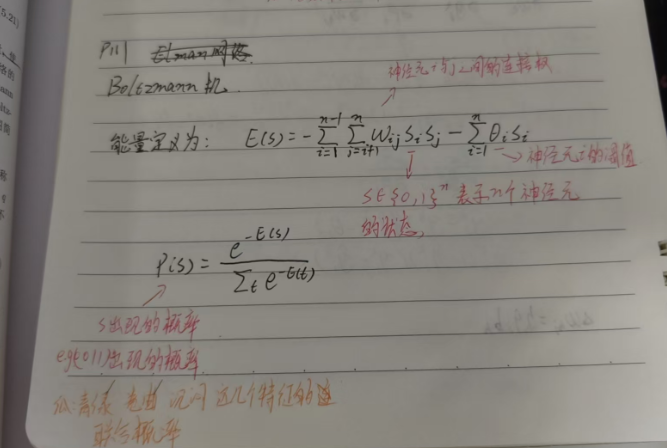


## 深度学习
典型深度学习模型就是很深层的神经网络。

从增加模型复杂度的角度看，增加隐藏层的数目显然比增加隐层神经元数目更有效。因为增加隐层数不仅增加了拥有激活函数的神经元数目，还增加了激活函数的嵌套层数。

问题：但是多隐层神经网络难以直接用经典算法进行训练，因为误差在多隐层内逆传递，往往会发散而不能收敛到稳定状态。

解决方法：
1、无监督逐层训练（预训练+微调）
- 先单层训练，再微调


2、 权共享
- 让一组神经元使用相同的连接权，这个策略在卷积神经网络发挥了重要作用


可将深度学习理解为进行“特征学习”或“表示学习”

# 第六章 支持向量机
## 间隔与支持向量
就是找到一个分类面，尽可能让点远离分类面

划分超平面可通过线性方程式描述 $w^Tx +b = 0$

$w = (w_1;w_2;...;w_d)$ 为法向量，决定超平面方向，b为位移，决定超平面与原点之间的距离

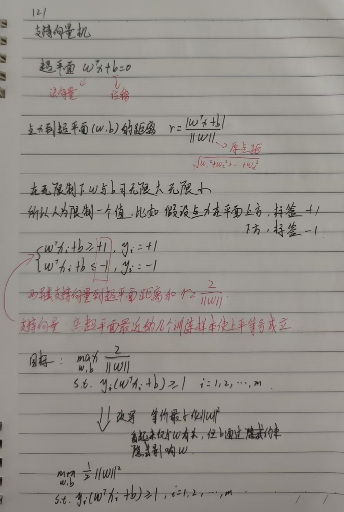

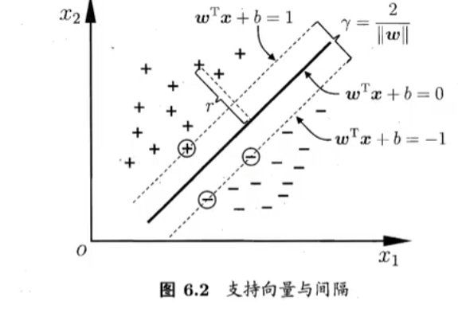

## 对偶问题
目的：降低求解复杂度
（占位，不是很懂推导过程）

## 核函数
前面是线性可分，但现实情况往往是线性不可分

解决方法：将样本从原始空间映射到一个更高维特征空间，使得样本在这个特征空间内线性可分

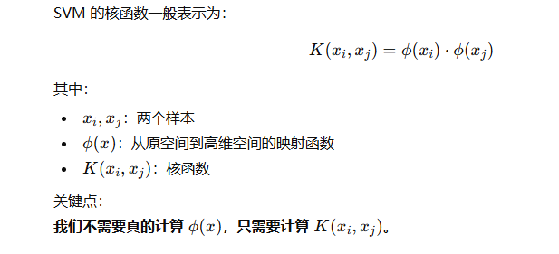

有常见的核函数可以选择

## 软间隔与正则化
事实是很难找到一个分类面，所有的样本都被正确的分类，即使有也难以判定这个结果不是过拟合造成的。

硬间隔：要求所有训练数据都被完全正确分类，并且分类间隔最大
软间隔：允许某些样本不满足约束，每个样本有一个 ξᵢ ≥ 0，表示“违反间隔的程度”

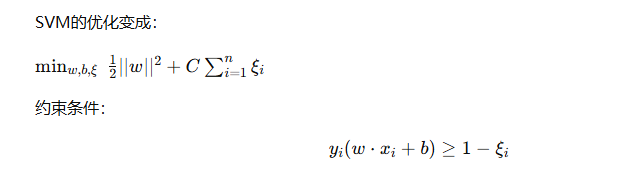

正则化：防止模型过拟合，让模型更简单（不让画太“弯曲”的线）
C:正则化常数，C越大，惩罚越大即更严格，尽量把所有点分对，容易过拟合

## 支持向量回归

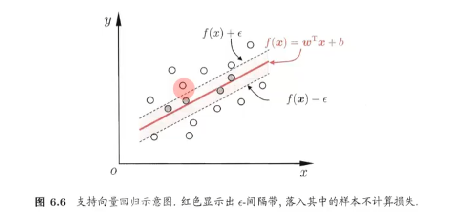

简单来说就是划定一个范围，范围内的样本作为构建模型的点，范围外的才计入损失（传统的回归模型做法是：只有当预测值和真实值一样，损失才为0）

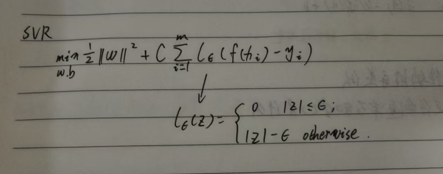


# 贝叶斯分类器
## 贝叶斯决策论
前提：所有相关概率都已知的理想情况下（包括联合概率，先验概率等）

贝叶斯决策论考虑如何基于这些概率和误判损失选择最优的类别标记

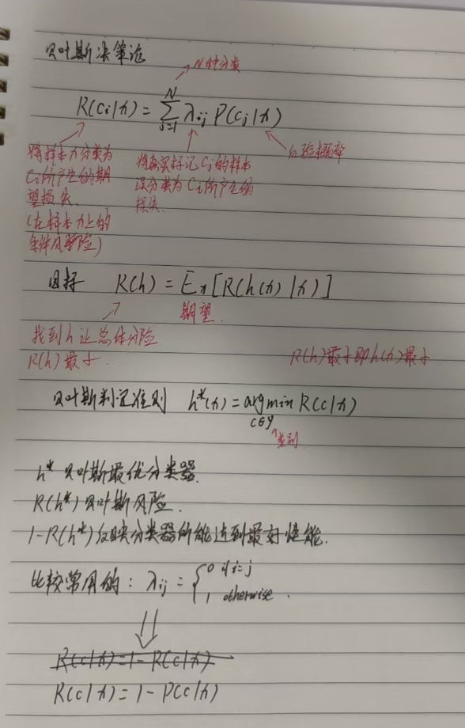

现实中后验概率难以获得，因为样本有限但特征多。

两种方法估计后验概率：
- 判别式模型：给定x，通过直接建模P(c|x)预测c
- 生成式模型：对联合概率分布P(x,c)建模，再得到P(c|x)

## 极大释然估计
目的：估计类条件概率

先假定其具有某种确定的概率分布形式，再基于训练样本对概率分布的参数进行估计。

比如假定含糖量符合高斯分布，那我们就是通过训练获得这个高斯分布的均值和方差。

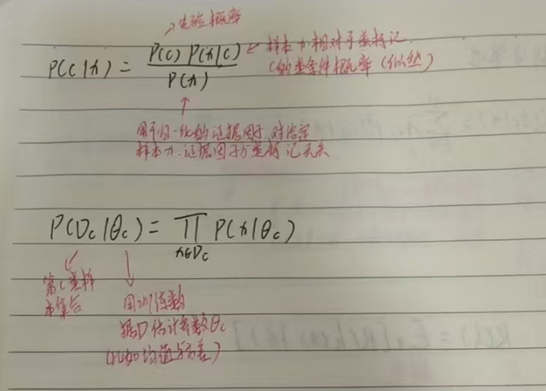

## 朴素贝叶斯分类器

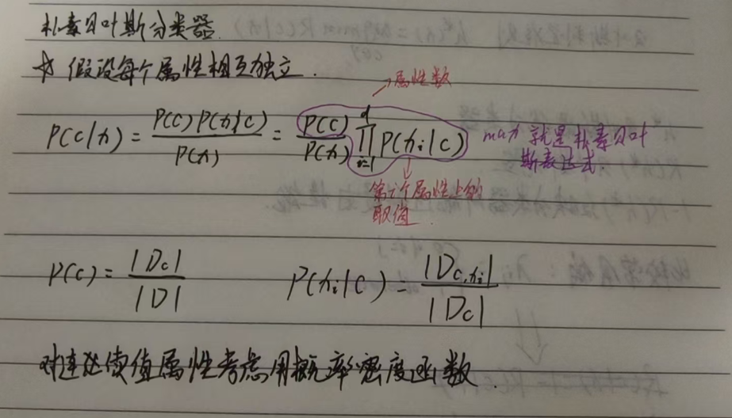


# 第十四章 概率图模型
节点表示随机变量，边表示依赖关系的概率模型

两大概率图模型
- 贝叶斯网（有向无环图）
- 马尔科夫网（无向图）

## 隐马尔可夫模型（属于贝叶斯网）
主要用于时序数据建模，语音识别，自然语言处理等领域

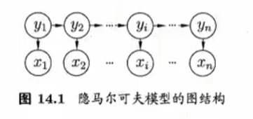

有两组变量
- y是隐藏的状态变量（比如y_i是第i时刻公司经营状况）
- x是可观测到的值 （比如x_i是第i时刻股票的价格）

马尔可夫链假设：今天的数据只依赖昨天的数据，并且今天的状态只和今天的观测有关系


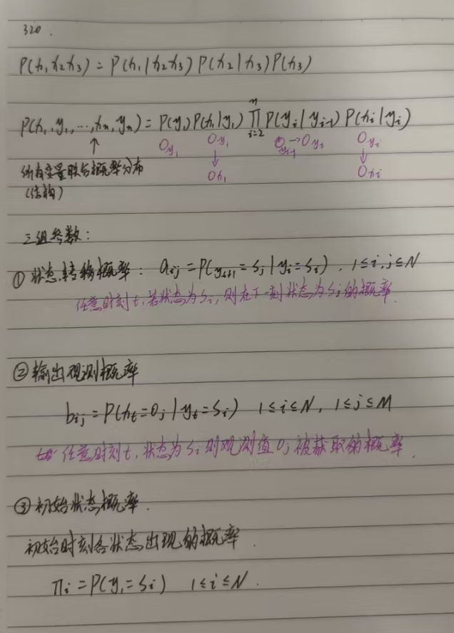

数据关系是从统计中来的


## 马尔科夫随机场（无向图）
任意两个结点间都有边连接，该结点子集为一个团。在一个团中加入另外一个结点，不再形成团，称该团为极大团。

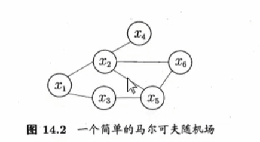

每个变量只依赖“邻居”，和其他远处变量条件独立。

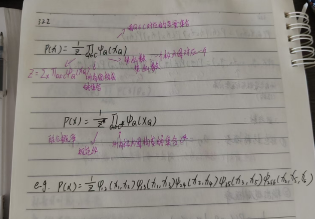


## 条件随机场（判别式无向图模型）
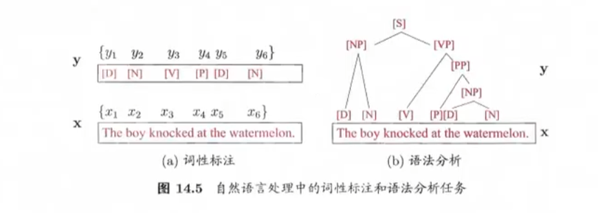

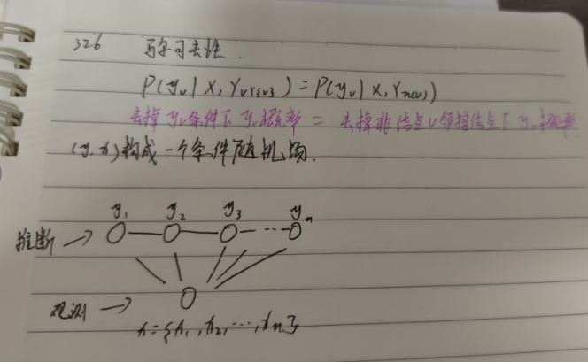

## 学习与推断
本身整个概率图模型是先学习一个图模型，利用图模型做预测。如果将参数视为待推测的变量，则参数估计的过程和推断（已知整个模型，去推断某个变量的过程）十分相似。

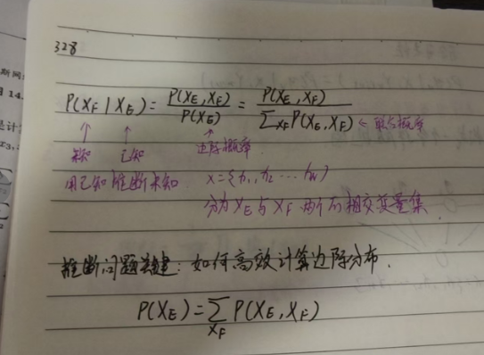

推断方法大改分两类：
- 精确推断方法
- 近似推断方法

### 精确
#### 变量消去
利用图模型所描述的条件独立性消减计算目标概率值所需计算量。

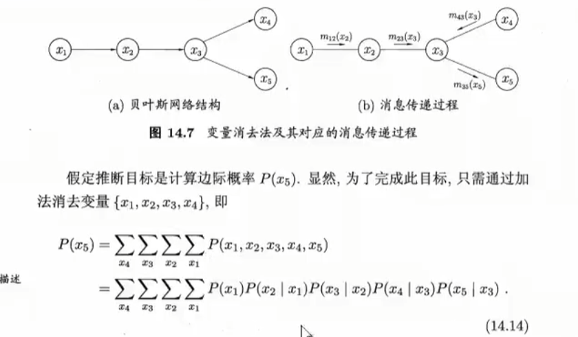
#### 信念传播
把变量消去看做是消息传递。

核心就是不断用类似下面的更新规则：“我的信念 = 自己的观测 + 邻居告诉我的信息”

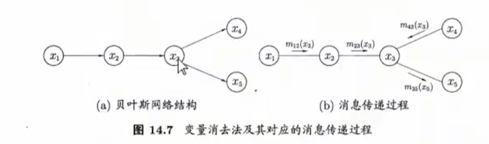

其实就是为了不重复计算m，把m保存下来重复利用的意思

### 近似
可分为两类：
- 采样，通过使用随机化方法完成近似
- 使用确定性近似完成近似推断

#### MCMC采样
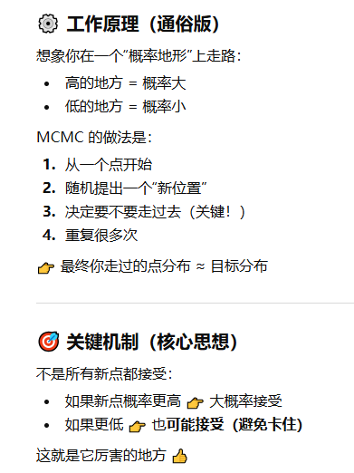

关心某些概率分布并不是对概率分布感兴趣，而是要基于它们计算期望。

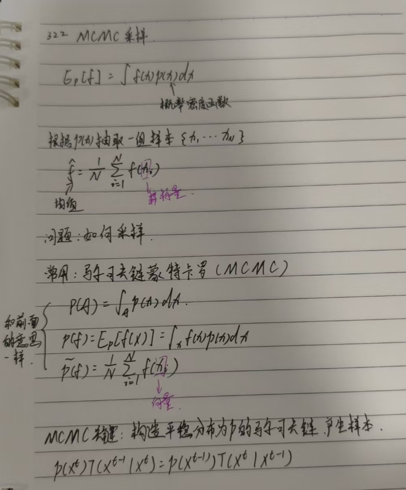

#### 变分推断

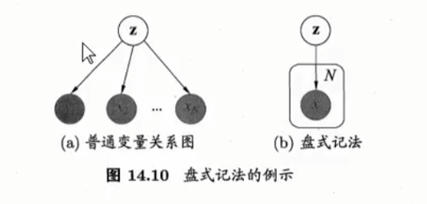

盘记法：依赖同个变量，相互独立


变分推断：用一个简单分布去“逼近”复杂分布，并把问题变成优化问题来求解，就是先定下这个分布，然后转为求参数

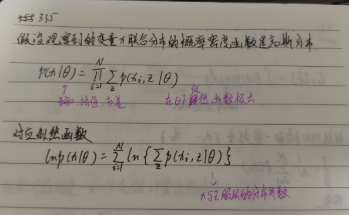

## 话题模型（举例）

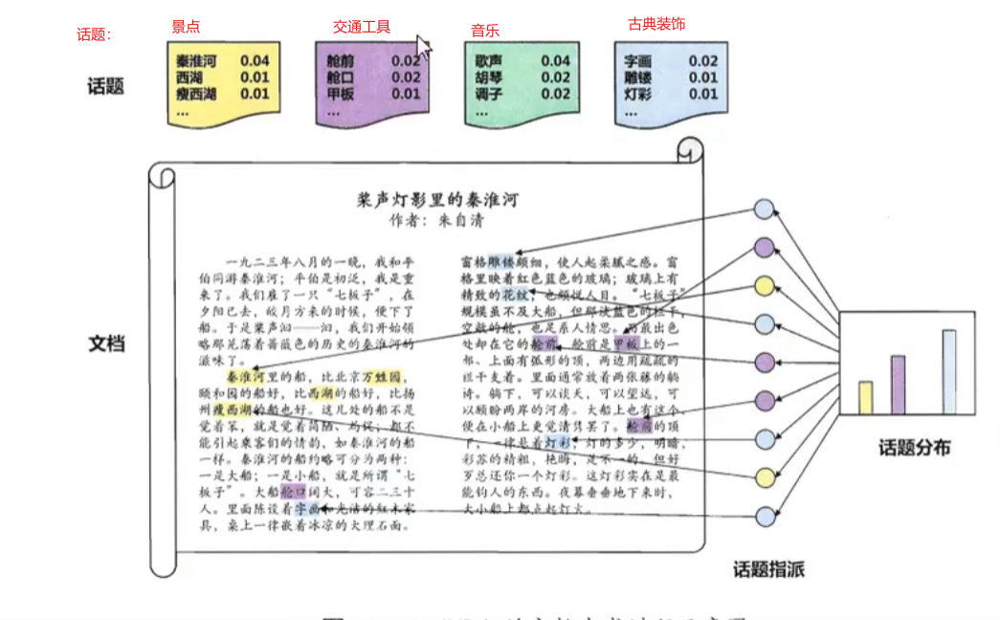

一篇文章拿过来怎么抽象成概率模型里的基本元素？

文档中的词来自一个包含N个词的词典，那么可以用N维向量表示文档，（第一个词出现的次数，第二个词出现的次数，...，第N个词出现的次数）

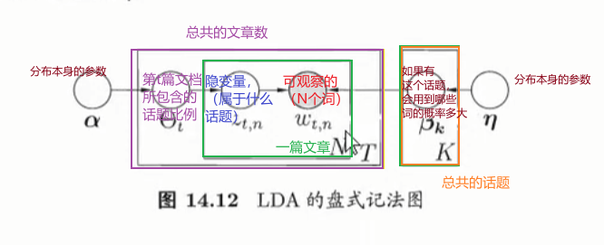

# 第十五章 规则学习
## 基本概念
从训练数据中学习出一组能用于未见示例进行判别的规则。

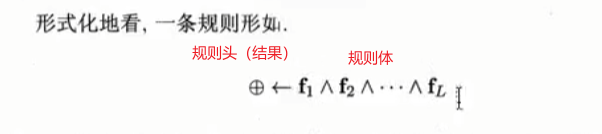

与神经网络，支持向量机这样的“黑箱模型”相比，规则学习具有更好的可解释性。

规则集合中每条规则都可看做一个子模型，规则集合是这些子模型的一个集成。当同一个示例被判别结果不同的多条规则覆盖时，称发生了冲突，“冲突消解”的方法有投票法，排序法，元规则法等。

规则分两类：
- 命题规则：简单的原子命令与逻辑连接词
- 一阶规则（关系型规则）：包含命题规则，复杂的多，相当于多了一个函数表达，能描述事务的属性或关系

## 序贯覆盖
也叫“分治策略”，在训练集上每学到一条规则，将该规则覆盖的训练样本去除，然后以剩下的训练样本组成训练集重复上述过程

最简单的方法是从空规则开始，将正例类别作为规则头，再逐个添加条件。

e.g

好瓜<-(色泽=青绿)  符合条件的存在正反例 再添加条件
好瓜<-(色泽=青绿)^(根蒂=蜷缩) 符合条件的存在正反例 换值
好瓜<-(色泽=青绿)^(根蒂=稍蜷)  以此类推，不断尝试直到规则集覆盖了所有正例


基于穷尽搜索的做法会由于组合爆炸而不可行，所以有两种策略来产生规则：
- 自顶向下
  - 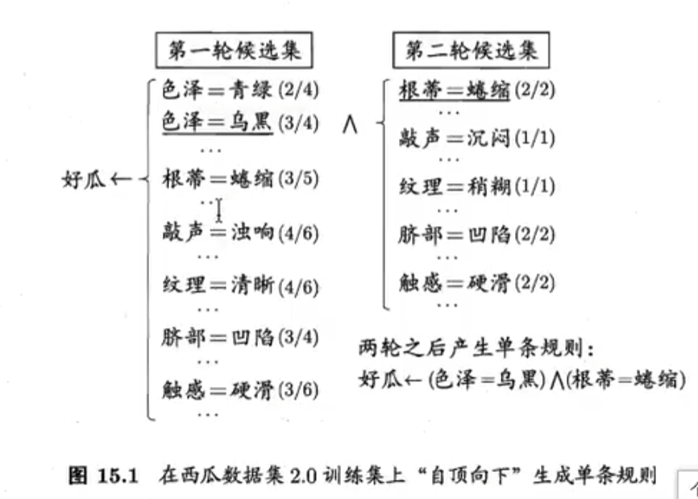
  - 贪心算法的通病：容易陷入局部最优
  - 解决方法：采用集束搜索
- 自底向上
  - IF 色泽=青绿 AND 敲声=浊响 AND 纹理=清晰 → 好瓜
  - 泛化规则：删除一个条件 IF 敲声=浊响 AND 纹理=清晰 → 好瓜 依然正确就再删除
  - 得到规则： IF 纹理 = 清晰 → 好瓜  然后删除覆盖样本，再继续学习下一条规则

## 剪枝优化
规则生成本质是贪心算法，需要有一定的机制缓解过拟合风险，常见是剪枝。

预剪枝：
例如用CN2算法，用似然统计量LRS衡量规则集覆盖样例的分布与训练集经验分布的差别。LRS越大，说明采用规则集进行预测与直接使用训练集正、反例比率进行猜测的差别越大。


后剪枝：
常用“减错剪枝”，划分训练集和验证集，从训练集上学得到规则进行多轮剪枝，每轮删除某个或多个文字，然后用验证集对将至参数的所有候选规则进行评估，保留最好的规则集进行下一轮剪枝。

## 一阶规则学习
假设有以下事实：
Father(张三, 李四)
Father(李四, 王五)

一阶规则学习可以学习出规则：
Father(x,y) ∧ Father(y,z) → Grandfather(x,z)

这样系统就能推理：
Grandfather(张三, 王五)

对于瓜：要选择更好的瓜就是两两比较，于是要定义（这个定义来自人类的知识）
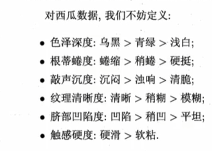

常见一阶规则学习算法：FOIL算法（和上面的剪枝相似）
- 先学习一条规则
- 逐渐添加谓词条件
- 覆盖正例
- 移除已覆盖样本
- 学习下一条规则

## 归纳逻辑程序设计
在一阶规则学习中引入函数和逻辑表达式嵌套。

引入函数和嵌套后，前面那种枚举式的筛选就变得不可行，所以需要有新的规则生成策略。

### 最小一般泛化

初始规则：
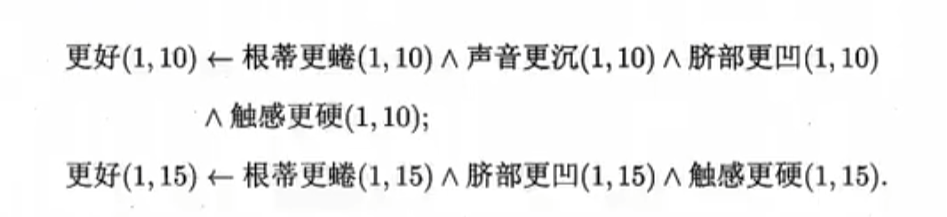
一般化两规则：
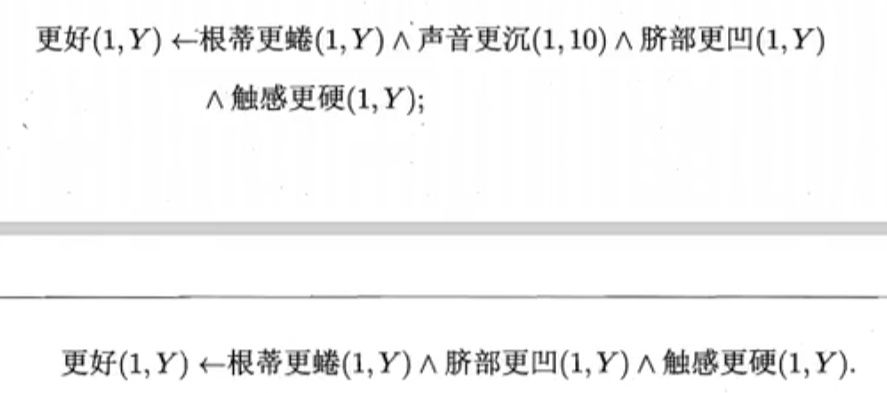
忽略不含共同谓词的文字：
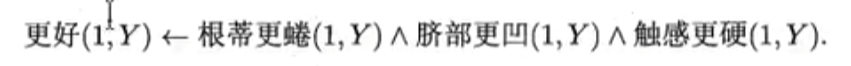


系统收集到两个垃圾邮件样本：
Email(发件人=unknown, 主题=中奖, 含链接=yes)
Email(发件人=unknown, 主题=免费, 含链接=yes)

找到一个规则同时描述这两个垃圾邮件：
按照 LGG 的规则：
- 相同属性 → 保留
- 不同属性 → 用变量

得到 Email(发件人=unknown, 主题=x, 含链接=yes)

于是结论是生成规则

```
IF 发件人=unknown AND 含链接=yes
THEN 垃圾邮件
```


### 逆归结
演绎：从一般规律出发探讨具体事物
归纳：从个别事物出发概况一般规律

归结：规则 + 事实 → 结论
已知规则：Parent(x,y) ∧ Parent(y,z) → Grandparent(x,z)
已知事实：Parent(张三, 李四)   Parent(李四, 王五)
可以推出：Grandparent(张三, 王五)


逆归结：事实 + 结论  → 规则
已知事实：Parent(张三, 李四)   Parent(李四, 王五)
观察到的结论：Grandparent(张三, 王五)
通过 逆归结 推测规则：Parent(x,y) ∧ Parent(y,z) → Grandparent(x,z)

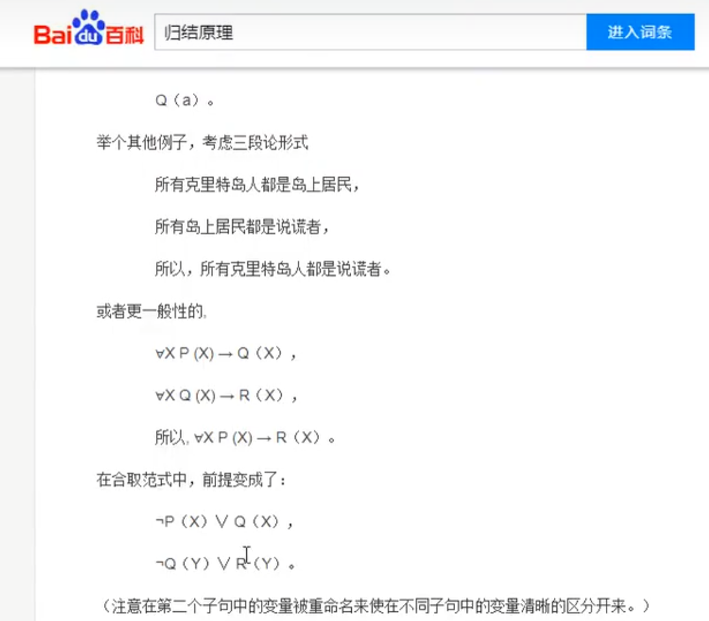

# 第十六章 强化学习
## 任务与鉴赏
有监督无监督学习都是根据已有数据总结规则。

强化学习则通过与环境不断交互，通过试错和奖励反馈逐步学习最优策略，适用于难以直接判断每个动作对最终结果影响的问题。

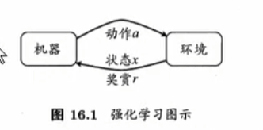

对于奖励，看的是累积奖励，因为像阿尔法狗下围棋，某一步在当前来说可能是最优的，可是对于全局来说可能是一个败子。

强化学习是要对环境进行建模。

每种状态下需要做什么动作，做了这个动作后状态直接会有一个什么样的迁移，会有一个转移状态概率。

强化学习任务对应四元组  E = {X, A, P, R}
- X 状态的集合
- A 动作
- P 当前状态选择当前动作后状态会有一个怎样的转移，X * A * X => 实数 指定状态转移概率
- R 收益  X * A * X => 实数 奖赏函数也可能仅和状态转移有关 X * X => 实数


机器要做的是通过环境中不断地尝试而学的一个策略$\pi$

根据策略，在状态x下能得知要执行的动作 $a = \pi(x)$

策略有两种表示方法：
- 将策略表示为函数$\pi:X=>A$
- 概率表示 $\pi:X \times A => \mathcal{R}$
 
$\pi(x, a)$ 为状态x下选择动作的概率，于是有 $\sum_a \pi(x, a) = 1$

学习目的：找到能使长期累积奖赏最大化的策略

长期累积奖赏常用方式：
- T步累积奖赏
- r折扣累积奖赏

## K-摇臂赌博机
### 探索与利用
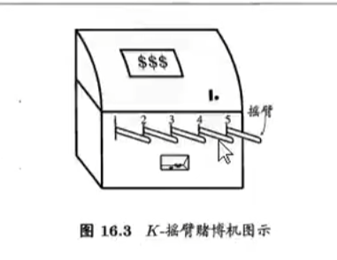

手中的银币有限，每次选择摇臂需要投入10个银币，每个摇臂摇出银币个数的概率是确定的，当前摇出的收益只跟当前的选择有关系与上一次选择和下一次选择都没有关系。

探索：不知道每个摇臂收益的概率，每个都摇100次计算概率
利用：得出哪个概率最高后一直选择最高收益的摇臂以此获得高收益

但是探索和利用是矛盾的，因为尝试次数有限，加强一方就会削弱一方。所以有了下面的算法。

### ع -贪心

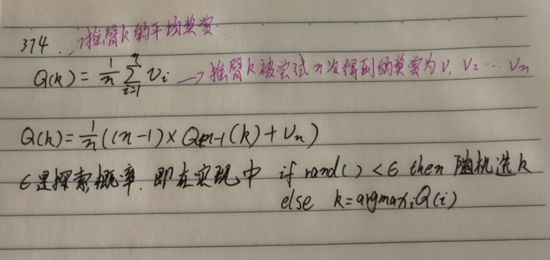

### softmax

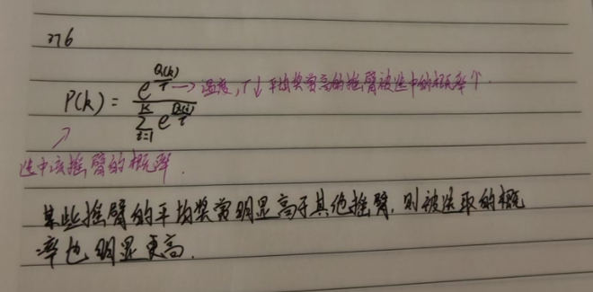

## 有模型学习
现实是我们的动作会对环境产生影响，这是摇臂赌博机没有体现到的。

模型已知：机器已对环境进行建模，能在机器内部模拟出于环境相同或近似的情况。在已知模型的环境中学习称为“有模型学习”。

假设：
- 知道做了动作a，环境从什么状态转化为什么状态 转化的概率P是知道的
- 知道环境所处状态，做了动作a会得到什么奖赏 带来的奖赏R也是知道的

目的：累积奖励表达出来，并极大化它

### 策略评估

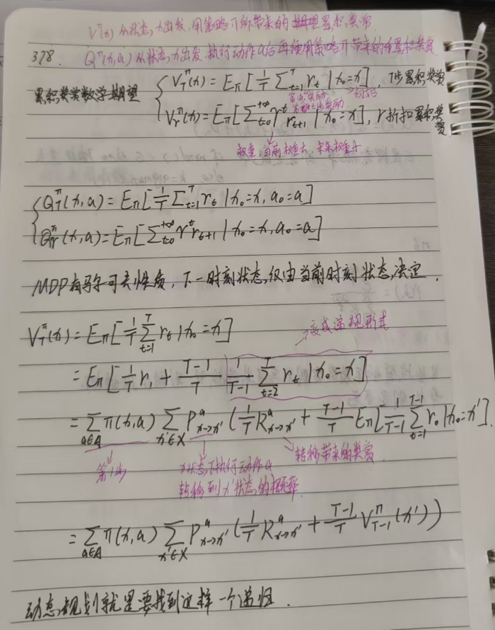

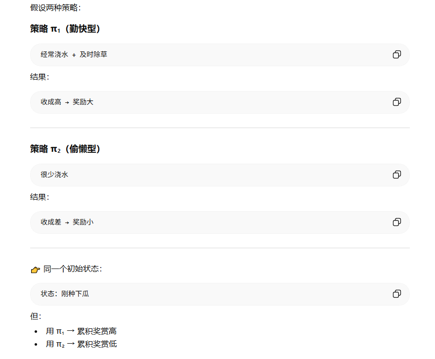

### 策略改进
对某个策略的累计奖赏评估后，若发现它不是最优策略，当然希望对其进行改进，离线的策略应能最大化累计奖赏。

策略 π：干了就浇水，杂草多就除草
策略评估做的事是：这个种法 → 平均收成是多少？

已有价值函数
        ↓
更新策略，让它更优

发现：中午浇水效果不好，晚上浇水更好
修改策略：改成晚上浇水

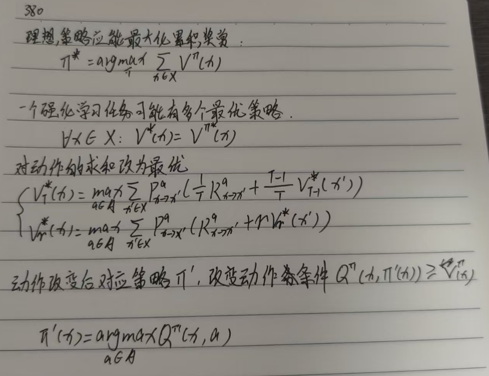


## 免模型学习
加强假设：环境未知，转移函数未知，奖赏函数未知，一共多少状态未知

### 蒙特卡洛强化学习


对于K摇臂赌博机也是环境未知，是利用一定概率尝试摇臂，然后统计。

蒙特卡洛对于环境未知也是这样的做法：以一定概率探索这个环境，把探索的环境总结出来用于策略的更新

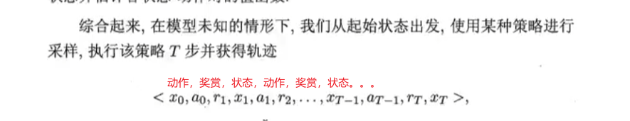

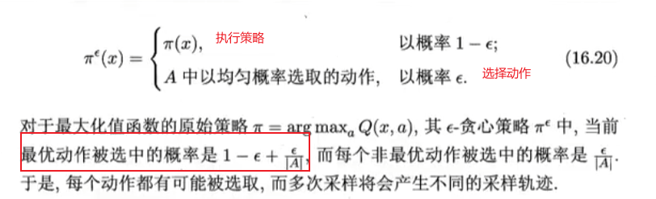

有了轨迹之后就可以算Q函数


### 时序差分学习
蒙特卡洛是多次尝试后求平均作为期望累积奖赏的近似，是批处理进行，在一个完整采样轨迹完成后再对所有的状态-动作进行更新

其实可以得到一个奖励就更新上去。

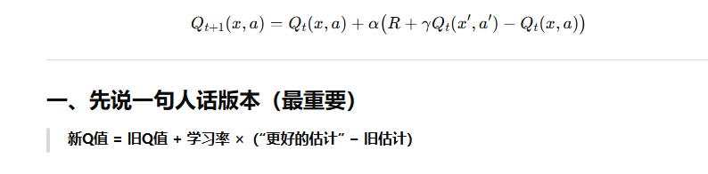

Q值更新 = 原来的认知 + 一点点修正
修正方向 = 当前奖励 + 未来估计 − 原来的认知

## 值函数近似
前面讨论的值函数都是离散的，因为状态有限，得到的是表格值函数。

现实任务面临的状态空间往往是连续无穷多个。

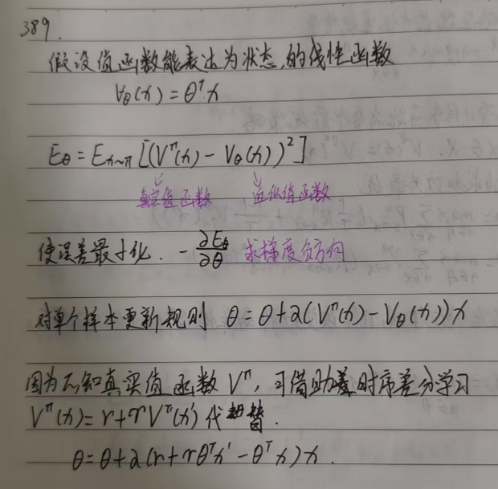


## 模仿学习
前提：有人类示范告诉AI什么环境下该做什么。

### 直接模仿学习
给的数据很全，所以直接用可监督学习学的符合人类增加决策轨迹数据的决策。

状态作为特征，动作作为标记，学的策略模型。

### 逆强化学习
从人类专家提供的范例数据中反推出奖赏函数。

前面是从奖励函数出发得到决策。这里是从专家给出的决策反推奖励函数。

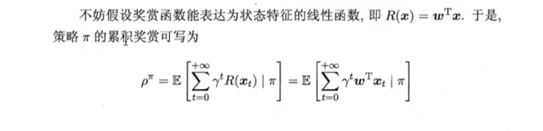

观察一个经验丰富的农民：他什么时候浇水，什么时候施肥，什么时候除草
并不知道：他的“评分标准”（奖励函数）
逆强化学习：通过观察他的行为，推测什么样的结果对他来说是“好”的
结果：他可能在最大化  产量 - 用水成本 - 劳动成本（奖励函数）

作用：直接模仿是看到什么做怎么，一旦环境变了就无法做出判断。得到奖励函数的话，环境改变还能自己决策。


# 资料
- 公式推导：https://datawhalechina.github.io/pumpkin-book/#/chapter2/chapter2?id=_23-%e6%80%a7%e8%83%bd%e5%ba%a6%e9%87%8f
- 比较通俗的解释：https://blog.csdn.net/sherlockma/category_12947961.html
- 视频：https://www.bilibili.com/video/BV1LrsoezEL8?spm_id_from=333.788.player.switch&vd_source=c3939bba6fb53dcccb38ed988f16994c&p=9


