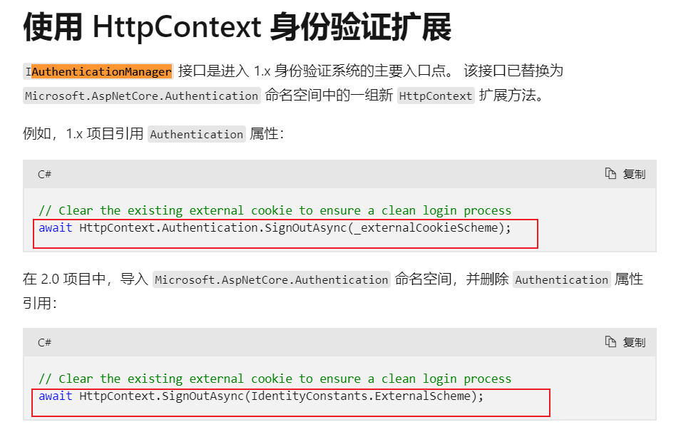

# 基础
## 1、Identity
### 1.1 名词介绍


1、Claims
```cs
public class Claim
{
    public string ClaimType { get; set; }

    public string ClaimValue { get; set; }
}
```
ClaimType 就是Key，ClaimValue就代表一个Value。这样的话，刚好可以存储一个键值对。username：cedar。
微软提供了默认的ClaimType，命名空间是System.Security.Claims。Claim存储的是最小的信息单元。

2、ClaimsIdentity
一个人有很多信息：username，gender， phone等，这些信息组合起来就是个人的身份证明。

```cs
public class ClaimsIdentity
{
    public ClaimsIdentity(IEnumerable<Claim> claims){}
    
    // 重要类型的字段为不可set
    public virtual string Name { get; }
    public string Label { get; set; }
    // AuthenticationType身份证明的类型（比如身份证实体，复印件或电子码等）
    public virtual string AuthenticationType { get; }
    
    public virtual void AddClaim(Claim claim);
    
    public virtual void RemoveClaim(Claim claim);
    
    public virtual void FindClaim(Claim claim);
}
```
ClaimsIdentity需要一个抽象出来的接口进行约束：
```cs
// 定义证件对象的基本功能。
public interface IIdentity
{
    //证件名称
    string Name { get; }
    
    // 用于标识证件的载体类型。
    string AuthenticationType { get; }
    
    //是否是合法的证件。
    bool IsAuthenticated { get; }
}
```
```cs
public class ClaimsIdentity : IIdentity
{
    //......
}
```

3、ClaimsPrincipal
一个人不止一个身份，同理一个人在一个系统上也不止一个身份：A部门管理员、B项目负责人等。
ClaimsPrincipal是包含所有身份ClaimsIdentity。
```cs
public class ClaimsPrincipal : IPrincipal
{
    public ClaimsPrincipal(IEnumerable<ClaimsIdentity> identities){}
    
    //主身份
    public virtual IIdentity Identity { get; }
    
    public virtual IEnumerable<ClaimsIdentity> Identities { get; }
    
    public virtual void AddIdentity(ClaimsIdentity identity);
}
```
同理也有一个接口：
```cs
public interface IPrincipal
{
    //身份
    IIdentity Identity { get; }
    
    //在否属于某个角色
    bool IsInRole(string role);
}

```


### 1.2 Authentication
Identity 是 Authentication 的一个具体使用。

<hr>
<p style="color: grey;">介绍Identity的文章里面提到的AuthenticationManager是早期的 ASP.NET（如 MVC 5 或 Web API 2）中的，AuthenticationManager 是 HttpContext 的一部分。用于处理身份验证和授权。现在的ASP.NET Core 中，身份验证系统已经重构，使用了中间件的方式。可以通过依赖注入来访问身份验证服务。</p>

<p style="color: grey;">但是还是很推荐看一下原文章的，比较了解整个验证过程和Identity的关系。</p>

微软断性变更文档：https://learn.microsoft.com/zh-cn/dotnet/core/compatibility/aspnetcore



所以直接看HttpContext里面的方法就行啦。
<hr>

#### 1.2.1 HttpContext中与Authentication有关的方法：
- AuthenticateAsync(AuthenticateContext context)：认证方法，是其一个核心功能，不能没有。AuthenticateContext包含需要认证的上下文
- ChallengeAsync(string authenticationScheme, AuthenticationProperties properties, ChallengeBehavior behavior)：在用户未通过身份验证时，发起一个身份验证挑战，提示用户提供凭证（如用户名和密码），它更多地是单向的：服务器请求用户进行身份验证，而用户则需要响应这个请求。
- SignInAsync(string authenticationScheme, ClaimsPrincipal principal, AuthenticationProperties properties)：登入
- SignOutAsync(string authenticationScheme, AuthenticationProperties properties)：登出

#### 1.2.2 IAuthenticationHandler


如果需要重写认证相关的东西，实现IAuthenticationHandler就可以了。

#### 1.2.3 Authentication 中间件
对 IAuthenticationHandler 的初步实现，封装了 AuthenticationHandler 这个抽象类，把具体的核心功能都交给下游去实现了，而类似CookieAuthentication 中间件核心类 CookieAuthenticationHandler 就是继承自AuthenticationHandler。我们编写中间件的时候也是继承AuthenticationHandler这个抽象类。

## 2、Authentication身份验证概述
HTTP 协议是无状态的，服务端如果想知道此次请求的用户是哪个登录的用户，就需要有一种标识每次都被传递到服务端，那么这个标识就是 Cookie。

身份验证（Authentication）是确定用户 identity 的过程。 授权（Authorization）是确定用户是否有权访问资源的过程。

验证流程：


在 `new ClaimsIdentity` 的时候第二个参数是 `AuthenticationType`，载体类型。

在使用程序创建一个身份的时候，需要就指定这个载体了，在HTTP验证中，我们将载体设置为Cookies，代码如下：
```cs
var cookieIdentity = new ClaimsIdentity(claims, "Cookies");
```

接下来还需要一个载体携带各种证件。
```cs
var principal = new ClaimsPrincipal(cookieIdentity)
```

上面的 cookieIdentity 算是一种身份，那么可能还有比如接入 OAuth的时候使用的 bearer身份证，接入第三方登录时候使用过的 google身份证，facebook身份证，microsoft身份证 等等，这就叫**多重身份**。

多种身份种的每一种身份都有一个 AuthenticationType 对应一个认证方式。


## 3、验证类型


### 3.1 Cookie 
```cs
services.AddAuthentication(option =>
    {
        option.DefaultAuthenticateScheme = "Cookies";
        option.DefaultChallengeScheme = "Cookies";

    })
    .AddCookie("Cookies", option => { option.Cookie.Name = "Cookies"; });
```
### 3.2 JWT 
```cs
.AddJwtBearer("jwt-test", options => // 添加 JWT Bearer 认证的方法
{
    options.RequireHttpsMetadata = false; // 是否需要使用 HTTPS 来传输 JWT。在开发阶段通常设置为 false
    options.SaveToken = true; // 是否将接收到的 JWT 令牌保存到 HttpContext.User 中。通常设置为 true，以便在控制器和其他服务中访问该令牌
    options.TokenValidationParameters = new TokenValidationParameters() // 用于配置验证 JWT 令牌的参数
    {
        ValidateIssuerSigningKey = true, //是否验证颁发令牌的签名密钥
        IssuerSigningKey =
            new SymmetricSecurityKey(Encoding.ASCII.GetBytes("my_secret_key_here_AAABBBBBBBBBBBBBB")) // 加密解密Token的密钥
                { KeyId = "1" }, // 表示密钥的标识符，用于标识这个密钥，通常在多密钥场景下使用
        ValidateIssuer = false, // 是否验证颁发者（Issuer）声明
        ValidateAudience = false // 是否验证接收者（Audience）声明
    };
})
```
### 3.3 OAuth and OpenID Connect
用于第三方身份验证，如 Google、Facebook、Microsoft 等，支持 OAuth 2.0 和 OpenID Connect。
```cs
public class CustomTokenRequestHandler  : IOpenIddictServerHandler<OpenIddictServerEvents.HandleTokenRequestContext>
{
    public async ValueTask HandleAsync(OpenIddictServerEvents.HandleTokenRequestContext context)
    {
        // 验证客户端是否为密码授权类型
        if (!context.Request.IsPasswordGrantType())
        {
            return;
        }

        // 获取客户端提交的用户名和密码
        string username = context.Request.Username;
        string password = context.Request.Password;
        
        if (username != "admin")
        {
            context.Reject(
                error: OpenIddictConstants.Errors.InvalidGrant,
                description: "Invalid username or password.");
            return;
        }

        // 验证用户密码
        if (password != "123456")
        {
            context.Reject(
                error: OpenIddictConstants.Errors.InvalidGrant,
                description: "Invalid username or password.");
            return;
        }

        var identity = new ClaimsIdentity(TokenValidationParameters.DefaultAuthenticationType,
            OpenIddictConstants.Claims.Name, OpenIddictConstants.Claims.Role);

        // Use the client_id as the subject identifier.
        identity.SetClaim(OpenIddictConstants.Claims.Subject, "1111111111111");
        identity.SetClaim(OpenIddictConstants.Claims.Name, username);
        identity.SetClaim(OpenIddictConstants.Claims.Role, "Admin");
        identity.SetDestinations(claim =>
        {
            switch (claim.Type)
            {
                case OpenIddictConstants.Claims.Name:
                    if (claim.Subject.HasScope(OpenIddictConstants.Permissions.Scopes.Profile))
                    {
                        return new[] { OpenIddictConstants.Destinations.AccessToken, OpenIddictConstants.Destinations.IdentityToken };
                    }

                    break;

                // Default case: only store the claim in the access tokens.
                default:
                    return new[] { OpenIddictConstants.Destinations.AccessToken };
            }

            return null; // If no destination is returned, the claim will not be included in any token.
        });
        context.SignIn(new ClaimsPrincipal(identity));
    }
}
```

```cs
options.AddEventHandler<OpenIddictServerEvents.HandleTokenRequestContext>(builder =>
        {
            // 使用 builder 配置处理程序
            builder.UseSingletonHandler<CustomTokenRequestHandler>();
        });
```
### 3.4 Windows Authentication
用于在企业环境中进行身份验证，通常与 Active Directory 集成。

### 3.5 Custom Authentication


创建Attribute：
```cs
public class CustomAttribute : AuthorizeAttribute
{
    public const string PolicyPrefix = "Custom";
    public CustomAttribute(int customValue) => CustomValue = customValue;

    public int CustomValue
    {
        get
        {
            if (int.TryParse(Policy.Substring(PolicyPrefix.Length), out var value))
            {
                return value;
            }

            return default(int);
        }
        set { Policy = $"{PolicyPrefix}{value.ToString()}"; }
    }
}
```

创建AuthorizationRequirement：
```cs
public class CustomRequirement : IAuthorizationRequirement
{
    public CustomRequirement(int customValue)
    {
        CustomValue = customValue;
    }

    public int CustomValue { get; set; }
}
```

创建验证逻辑AuthorizationHandler：
```cs
public class CustomAuthorizationHandler : AuthorizationHandler<CustomRequirement>
{
    protected override async Task HandleRequirementAsync(AuthorizationHandlerContext context, CustomRequirement requirement)
    {
        if (requirement.CustomValue == 2)
        {
            context.Fail();
            return;
        }
        context.Succeed(requirement);
    }
}
```

创建策略IAuthorizationPolicyProvider：
```cs
public class CustomAuthorizationProvider : IAuthorizationPolicyProvider
{
    private readonly DefaultAuthorizationPolicyProvider _defaultPolicyProvider; // 默认实现
    private const string TestA = "A";

    public CustomAuthorizationProvider(IOptions<AuthorizationOptions> options)
    {
        _defaultPolicyProvider =  new DefaultAuthorizationPolicyProvider(options);;
    }

    // 返回给定名称的授权策略
    public Task<AuthorizationPolicy?> GetPolicyAsync(string policyName)
    {
        var a = TestA;
        if (policyName.StartsWith(CustomAttribute.PolicyPrefix, StringComparison.OrdinalIgnoreCase))
        {
            var policy = new AuthorizationPolicyBuilder();
            policy.AddRequirements(new CustomRequirement(int.Parse(policyName[(CustomAttribute.PolicyPrefix.Length)..])));
            return Task.FromResult(policy.Build());
        }

        return _defaultPolicyProvider.GetPolicyAsync(policyName);
    }
    
    // 返回默认授权策略（在未指定策略的情况下用于 [Authorize] 属性的策略）
    public Task<AuthorizationPolicy> GetDefaultPolicyAsync()
    {
        return _defaultPolicyProvider.GetDefaultPolicyAsync();
    }

    // 返回回退授权策略（在未指定策略时由授权中间件使用的策略）
    public Task<AuthorizationPolicy?> GetFallbackPolicyAsync()
    {
        return _defaultPolicyProvider.GetFallbackPolicyAsync();
    }
}
```

注册：
```cs
 // 注册自定义授权处理器
services.AddScoped<IAuthorizationHandler, CustomAuthorizationHandler>();

// 注册自定义授权策略提供者
services.AddSingleton<IAuthorizationPolicyProvider, CustomAuthorizationProvider>();
```

使用：
```cs
[Route("attribute/test"), HttpGet]
// [AllowAnonymous] //这个加上后会跳过Authentication与Authorization
[Custom(3)]
public Task<IActionResult> AttributeTest()
{
    return Task.FromResult<IActionResult>(Ok());
}
```


