# 第三方身份认证实践
## Google身份认证
### 1、准备工作
注册项目地址：https://console.cloud.google.com/
新建项目：

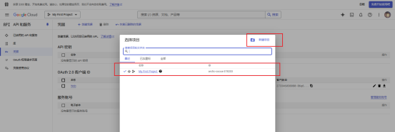

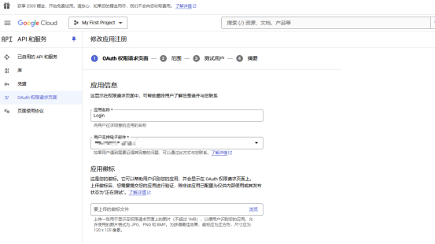

创建凭据提供链接Google使用：

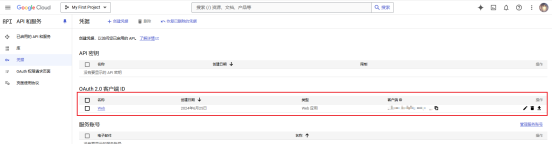

添加需要的服务：

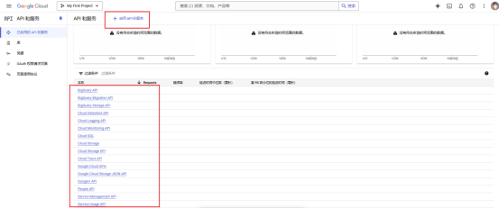

### 2、前端登录
```js
import React from 'react';

const GoogleLoginButton = () => {

    const handleGoogleLogin = () => {
        // Replace with your Google OAuth URL or any other Google login URL
        const oauth2Endpoint = 'https://accounts.google.com/o/oauth2/v2/auth';
        const form = document.createElement('form');
        form.setAttribute('method', 'GET'); // Send as a GET request.
        form.setAttribute('action', oauth2Endpoint);
        const params = {'client_id': 'xxx',
            'redirect_uri': 'https://localhost:44337/api/Login/signin-google',
            'response_type': 'token',
            'scope': 'profile email',
            'include_granted_scopes': 'true',
            'state': 'pass-through value'};
        for (const p in params) {
            const input = document.createElement('input');
            input.setAttribute('type', 'hidden');
            input.setAttribute('name', p);
            input.setAttribute('value', params[p]);
            form.appendChild(input);
        }
        document.body.appendChild(form);
        form.submit();
    };

    return (
        <button onClick={handleGoogleLogin}>
            Login with Google
        </button>
    );
};

export default GoogleLoginButton;
```

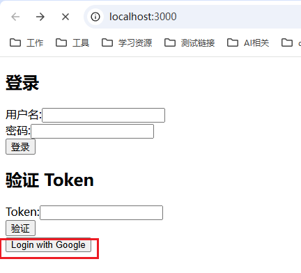

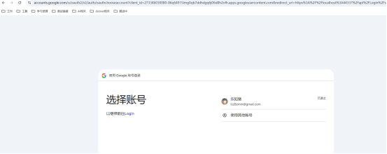

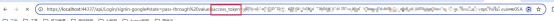

### 3、后端验证
```cs
public class GoogleValidateHandler : AuthenticationHandler<AuthenticationSchemeOptions>
{
    private readonly  IHttpClientFactory _httpClientFactory;
    public GoogleValidateHandler(IOptionsMonitor<AuthenticationSchemeOptions> options, ILoggerFactory logger,
        UrlEncoder encoder, ISystemClock clock, IHttpClientFactory httpClientFactory) : base(options, logger, encoder, clock)
    {
        _httpClientFactory = httpClientFactory;
    }

    protected override async Task<AuthenticateResult> HandleAuthenticateAsync()
    {
        var token = Request.Headers["Authorization"].ToString().Replace("Bearer ","").Trim();
        // 构建验证访问令牌的请求
        var tokenValidationUrl = $"https://www.googleapis.com/oauth2/v3/tokeninfo?access_token={token}";

        // 使用 HttpClient 发送请求验证访问令牌
        var httpClient = _httpClientFactory.CreateClient();
        var response = await httpClient.GetAsync(tokenValidationUrl);

        if (!response.IsSuccessStatusCode)
        {
            // 处理验证失败的情况
            return  AuthenticateResult.NoResult();
        }
        return AuthenticateResult.Success(new AuthenticationTicket(Context.User, Scheme.Name));
    }
}
```

```cs
services.AddAuthentication(option =>
{
    option.DefaultAuthenticateScheme = "google";
    option.DefaultChallengeScheme = "google";

})
.AddScheme<AuthenticationSchemeOptions, GoogleValidateHandler>("google", options => new AuthenticationSchemeOptions());
```

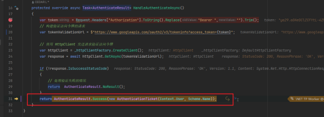

## Facebook身份认证
实现其实和Google差不多。

对于Facebook的应用创建：https://learn.microsoft.com/zh-tw/aspnet/core/security/authentication/social/facebook-logins?view=aspnetcore-8.0

### 1、准备工作
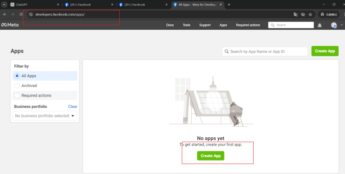
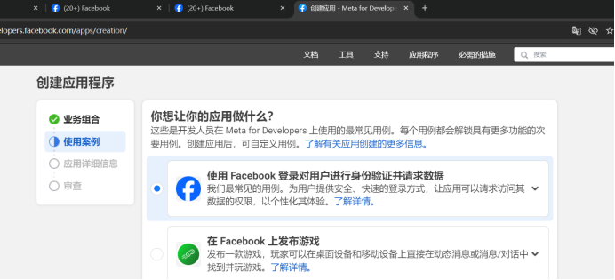
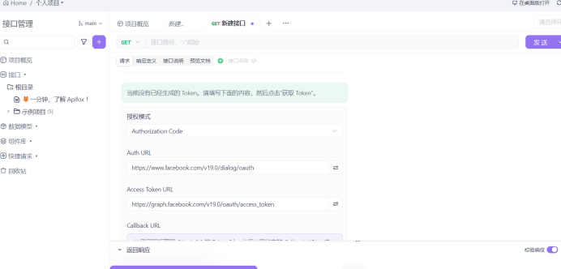


### 2、前端登录
```js
import React from 'react';
const FBButton = () => {

    const handleFBLogin = () => {
        // Replace with your Google OAuth URL or any other Google login URL
        const oauth2Endpoint = 'https://www.facebook.com/v10.0/dialog/oauth';
        const form = document.createElement('form');
        form.setAttribute('method', 'GET'); // Send as a GET request.
        form.setAttribute('action', oauth2Endpoint);
        const params = {
            'client_id': '',
            'redirect_uri': 'https://www.baidu.com/',
            'response_type': 'token',
            'scope': 'public_profile,email',
            'state': 'pass-through value'};
        for (const p in params) {
            const input = document.createElement('input');
            input.setAttribute('type', 'hidden');
            input.setAttribute('name', p);
            input.setAttribute('value', params[p]);
            form.appendChild(input);
        }
        document.body.appendChild(form);
        form.submit();
    };

    return (
        <button onClick={handleFBLogin}>
            Login with Facebook
        </button>
    );
};

export default FBButton;
```
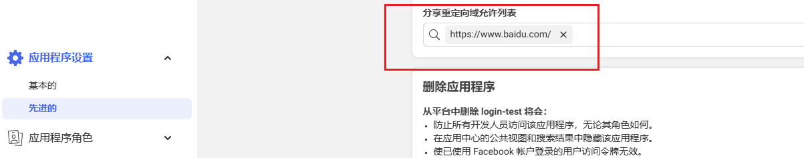

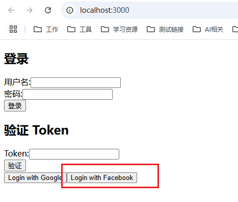

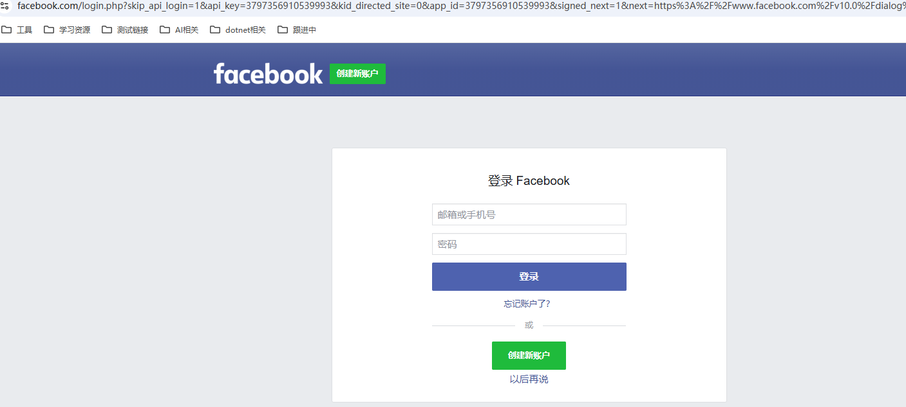

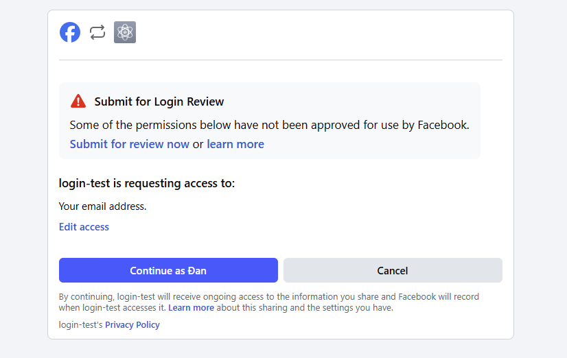

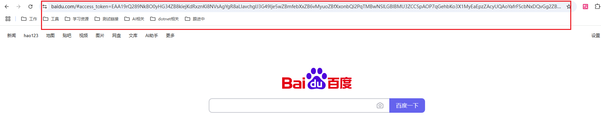
### 3、后端验证
```cs
public class FaceBookValidateHandler : AuthenticationHandler<AuthenticationSchemeOptions>
{
    private readonly  IHttpClientFactory _httpClientFactory;
    public FaceBookValidateHandler(IOptionsMonitor<AuthenticationSchemeOptions> options, ILoggerFactory logger,
        UrlEncoder encoder, ISystemClock clock, IHttpClientFactory httpClientFactory) : base(options, logger, encoder, clock)
    {
        _httpClientFactory = httpClientFactory;
    }
    
    protected override async Task<AuthenticateResult> HandleAuthenticateAsync()
    {
        var token = Request.Headers["Authorization"].ToString().Replace("Bearer ","").Trim();
        // 构建验证访问令牌的请求
        var tokenValidationUrl = $"https://graph.facebook.com/me?access_token={token}&fields=id,name,email";
        // 使用 HttpClient 发送请求验证访问令牌
        var httpClient = _httpClientFactory.CreateClient();
        var response = await httpClient.GetAsync(tokenValidationUrl);

        if (!response.IsSuccessStatusCode)
        {
            // 处理验证失败的情况
            return  AuthenticateResult.NoResult();
        }
        return AuthenticateResult.Success(new AuthenticationTicket(Context.User, Scheme.Name));
    }
}
```

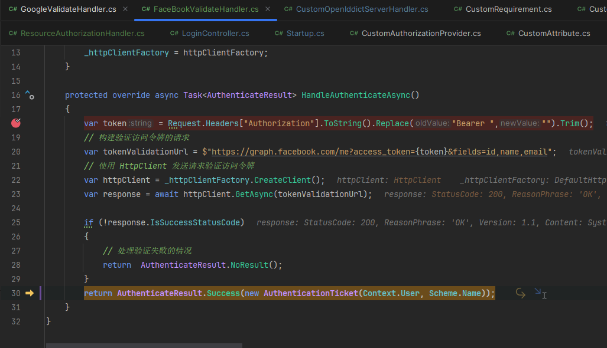

ps:也可以用 Microsoft.AspNetCore.Authentication.Facebook 

