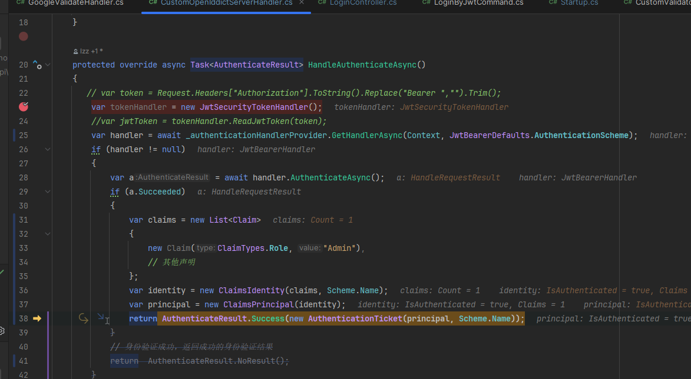
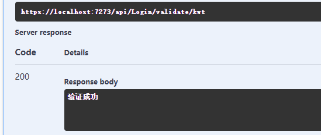
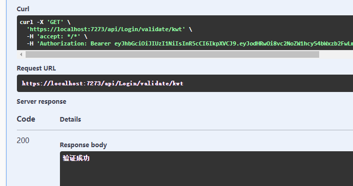
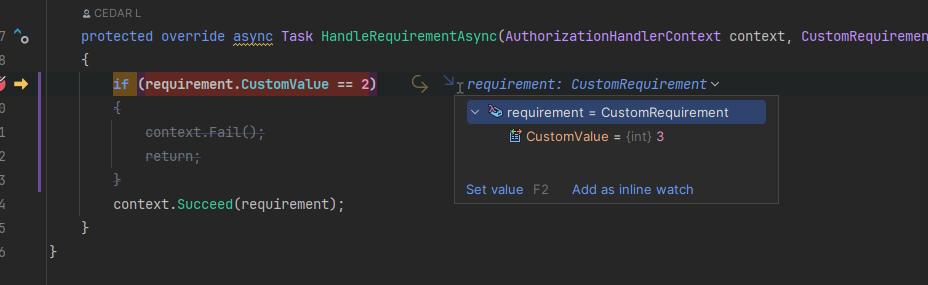
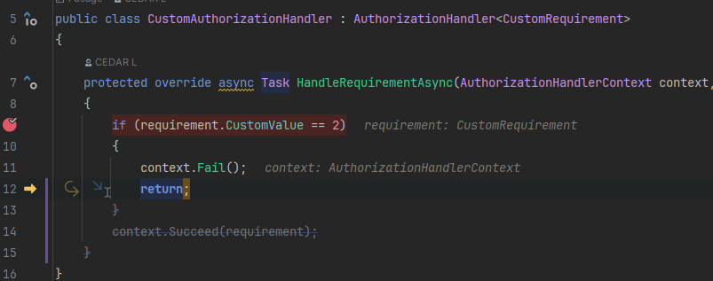
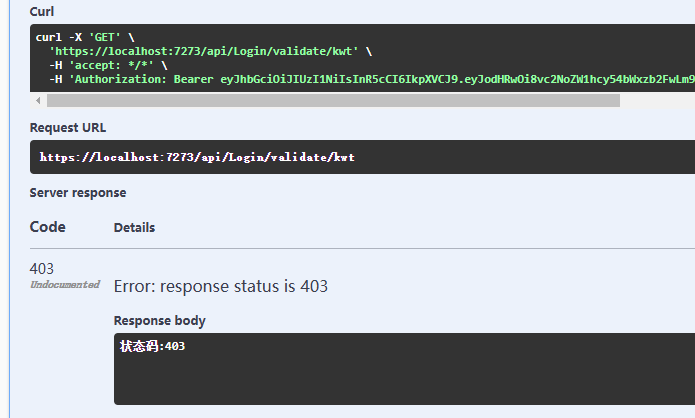
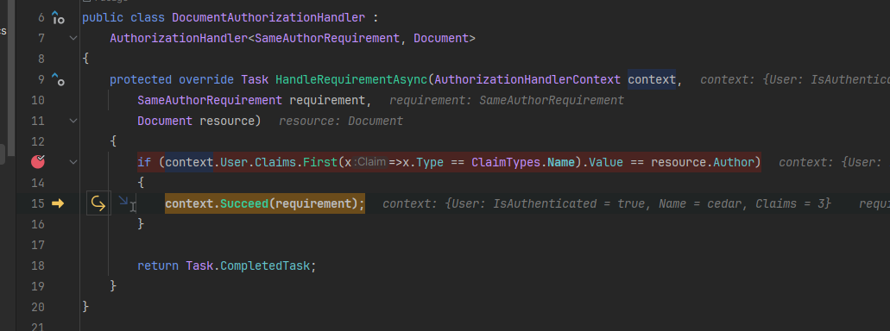

# Authorization
授权是指判断用户可执行的操作的过程。 例如，允许管理用户创建文档库和添加、编辑以及删除文档。 

简单的说，验证是看当前用户有没有账号，这个账号有没有效，相当于检验门票。授权是当前用户可以进去做哪些事情，相当于凭借这个门票所能参加的项目。


## 1、AuthorizeAttribute
AuthorizeAttribute 是 `ASP.NET Core` 中用于实现授权的一个过滤器属性。它可以用来限制对控制器或操作方法的访问，确保只有经过身份验证并满足授权要求的用户才能访问这些资源。

```cs
[Authorize]  // 仅允许经过身份验证的用户访问
public IActionResult SecureAction()
{
    return View();
}
```

```cs
[Authorize(Roles = "Admin,Manager")]  // 仅允许“Admin”和“Manager”角色的用户访问
public IActionResult AdminAction()
{
    return View();
}
```

```cs
[Authorize(Policy = "CanViewReports")]  // 使用授权策略
public IActionResult Reports()
{
    return View();
}

services.AddAuthorization(options =>
{
    options.AddPolicy("CanViewReports", policy =>
        policy.RequireRole("Admin").RequireClaim("Department", "Finance"));
});
```

另外有属性[AllowAnonymous]可以覆盖[Authorize],允许未经过身份验证的用户访问特定的操作方法。

## 2、授权方式
### 2.1 基于角色授权
基于角色的授权就是检查用户是否拥有指定角色，如果是则授权通过，否则不通过。

先给一个获取token的接口：
```cs
    [Route("login/kwt"), HttpPost]
    public async Task<IActionResult> LoginByCookies(LoginByJwtCommand command, CancellationToken cancellationToken)
    {
        // 定义用户信息
        var claims = new Claim[]
        {
            new Claim(ClaimTypes.Name, command.UserName),
            new Claim(JwtRegisteredClaimNames.Email, "66666666666@qq.com"),
            new Claim(ClaimTypes.MobilePhone, "1234456"),
            new Claim(ClaimTypes.Role, "Admin")
        };
        var key = new SymmetricSecurityKey(Encoding.UTF8.GetBytes("my_secret_key_here_AAABBBBBBBBBBBBBB")); // 这个要与配置的一样
        var token = new JwtSecurityToken(
            claims: claims,
            notBefore: DateTime.Now,
            expires: DateTime.Now.AddMinutes(30),
            signingCredentials: new SigningCredentials(key, SecurityAlgorithms.HmacSha256)
        );
        var jwtToken = new JwtSecurityTokenHandler().WriteToken(token);
        return Ok(new { jwtToken });
    }
```


编写验证逻辑：
```cs
public class CustomOpenIddictServerHandler : AuthenticationHandler<OpenDicAuthenticationSchemeOptions>
{
    private readonly IAuthenticationHandlerProvider _authenticationHandlerProvider;
    public CustomOpenIddictServerHandler(IOptionsMonitor<OpenDicAuthenticationSchemeOptions> options, ILoggerFactory logger, 
        UrlEncoder encoder, ISystemClock clock, IAuthenticationHandlerProvider authenticationHandlerProvider) : base(options, logger, encoder, clock)
    {
        _authenticationHandlerProvider = authenticationHandlerProvider;
    }

    protected override async Task<AuthenticateResult> HandleAuthenticateAsync()
    {
       // var token = Request.Headers["Authorization"].ToString().Replace("Bearer ","").Trim();
        var tokenHandler = new JwtSecurityTokenHandler();
        //var jwtToken = tokenHandler.ReadJwtToken(token);
        var handler = await _authenticationHandlerProvider.GetHandlerAsync(Context, JwtBearerDefaults.AuthenticationScheme);
        if (handler != null)
        {
            var a = await handler.AuthenticateAsync();
            if (a.Succeeded)
            {
                var claims = new List<Claim>
                {
                    new Claim(ClaimTypes.Role, "Admin"),
                    // 其他声明
                };
                var identity = new ClaimsIdentity(claims, Scheme.Name);
                var principal = new ClaimsPrincipal(identity);
                return AuthenticateResult.Success(new AuthenticationTicket(principal, Scheme.Name));
            }
            // 身份验证成功，返回成功的身份验证结果
            return  AuthenticateResult.NoResult();
        }
        return  AuthenticateResult.NoResult();
    }
}
```
注册：
```cs
        services.AddAuthentication(option =>
            {
                option.DefaultAuthenticateScheme = "kk";
                option.DefaultChallengeScheme = JwtBearerDefaults.AuthenticationScheme;

            })
            .AddScheme<OpenDicAuthenticationSchemeOptions, CustomOpenIddictServerHandler>("kk",
                options => options = new OpenDicAuthenticationSchemeOptions())
            .AddJwtBearer(JwtBearerDefaults.AuthenticationScheme, options =>
            {
                options.RequireHttpsMetadata = false; // 是否需要使用 HTTPS 来传输 JWT。在开发阶段通常设置为 false
                options.SaveToken = false; // 是否将接收到的 JWT 令牌保存到 HttpContext.User 中。通常设置为 true，以便在控制器和其他服务中访问该令牌
                options.TokenValidationParameters = new TokenValidationParameters() // 用于配置验证 JWT 令牌的参数
                {
                    ValidateIssuerSigningKey = true, //是否验证颁发令牌的签名密钥
                    IssuerSigningKey =
                        new SymmetricSecurityKey(Encoding.ASCII.GetBytes("my_secret_key_here_AAABBBBBBBBBBBBBB")) // 加密解密Token的密钥
                            { KeyId = "1" }, // 表示密钥的标识符，用于标识这个密钥，通常在多密钥场景下使用
                    ValidateIssuer = false, // 是否验证颁发者（Issuer）声明
                    ValidateAudience = false // 是否验证接收者（Audience）声明
                };
            });
```


写验证角色授权接口：
```cs
[Authorize(Roles = "Admin")]
[Route("validate/kwt"), HttpGet]
public async Task<IActionResult> ValidateJwt()
{
    return Ok("验证成功");
}
```



### 2.2 基于声明授权
声明就是claims，例如：
- ClaimTypes.Name：用户的名称
- ClaimTypes.Role：用户的角色
- ClaimTypes.Email：用户的电子邮件地址

角色（Role）授权可以被视为基于声明授权的一种特殊情况。而基于声明的授权，是在基于策略的授权基础上实现的。我们需要通过添加策略来使用声明。

注册：
```cs
services.AddAuthorization(options =>
{
    options.AddPolicy("CanReadData", policy => policy.RequireClaim(ClaimTypes.Country, "China"));
});
```

接口：
```cs
[Authorize(Policy = "CanReadData")]
[Route("validate/kwt"), HttpGet]
public async Task<IActionResult> ValidateJwt()
{
    return Ok("验证成功");
}
```

Authentication给的结果：
```cs
protected override async Task<AuthenticateResult> HandleAuthenticateAsync()
{
    var tokenHandler = new JwtSecurityTokenHandler();
    var handler = await _authenticationHandlerProvider.GetHandlerAsync(Context, JwtBearerDefaults.AuthenticationScheme);
    if (handler != null)
    {
        var a = await handler.AuthenticateAsync();
        if (a.Succeeded)
        {
            var claims = new List<Claim>
            {
                new Claim(ClaimTypes.Role, "Admin"),
                new Claim(ClaimTypes.Country, "China")
                // 其他声明
            };
            var identity = new ClaimsIdentity(claims, Scheme.Name);
            var principal = new ClaimsPrincipal(identity);
            return AuthenticateResult.Success(new AuthenticationTicket(principal, Scheme.Name));
        }
        // 身份验证成功，返回成功的身份验证结果
        return  AuthenticateResult.NoResult();
    }
    return  AuthenticateResult.NoResult();
}
```




### 2.3 基于策略授权
当业务场景比较复杂时，我们必须能够设计更加自由的策略，也就是基于策略的授权。

基于策略的授权可以分成两种：简单策略和动态策略。

#### 2.3.1 简单策略
制定要求：
```cs
public class CustomRequirement : IAuthorizationRequirement
{
    public CustomRequirement(int customValue)
    {
        CustomValue = customValue;
    }

    public int CustomValue { get; set; }
}
```

创建授权处理器，验证用户是否达到指定值：
```cs
public class CustomAuthorizationHandler : AuthorizationHandler<CustomRequirement>
{
    protected override async Task HandleRequirementAsync(AuthorizationHandlerContext context, CustomRequirement requirement)
    {
        if (requirement.CustomValue == 2)
        {
            context.Fail();
            return;
        }
        context.Succeed(requirement);
    }
}
```

注册授权处理器：
```cs
// 注册自定义授权处理器
services.AddScoped<IAuthorizationHandler, CustomAuthorizationHandler>();
```

添加策略：
```cs
services.AddAuthorization(options =>
{
    options.AddPolicy("Custom", policy => policy.Requirements.Add(new CustomRequirement(3)));
});
```

接口：
```cs
[Authorize(Policy = "Custom")]
[Route("validate/kwt"), HttpGet]
public async Task<IActionResult> ValidateJwt()
{
    return Ok("验证成功");
}
```




#### 2.3.2 动态策略
上面可以看到，传入CustomRequirement的值是在策略上固定的，不能根据接口的改变而改变。所以我们可以添加自定义授权特性。

自定义授权特性：
```cs
public class CustomAttribute : AuthorizeAttribute
{
    public const string PolicyPrefix = "Custom";
    public CustomAttribute(int customValue) => CustomValue = customValue;

    public int CustomValue
    {
        get
        {
            if (int.TryParse(Policy.Substring(PolicyPrefix.Length), out var value))
            {
                return value;
            }

            return default(int);
        }
        set { Policy = $"{PolicyPrefix}{value.ToString()}"; }
    }
}
```

动态创建策略：
```cs
public class CustomAuthorizationProvider : IAuthorizationPolicyProvider
{
    private readonly DefaultAuthorizationPolicyProvider _defaultPolicyProvider; // 默认实现
    private const string TestA = "A";

    public CustomAuthorizationProvider(IOptions<AuthorizationOptions> options)
    {
        _defaultPolicyProvider =  new DefaultAuthorizationPolicyProvider(options);;
    }

    // 返回给定名称的授权策略
    public Task<AuthorizationPolicy?> GetPolicyAsync(string policyName)
    {
        var a = TestA;
        if (policyName.StartsWith(CustomAttribute.PolicyPrefix, StringComparison.OrdinalIgnoreCase))
        {
            var policy = new AuthorizationPolicyBuilder();
            policy.AddRequirements(new CustomRequirement(int.Parse(policyName[(CustomAttribute.PolicyPrefix.Length)..])));
            return Task.FromResult(policy.Build());
        }

        return _defaultPolicyProvider.GetPolicyAsync(policyName);
    }
    
    // 返回默认授权策略（在未指定策略的情况下用于 [Authorize] 属性的策略）
    public Task<AuthorizationPolicy> GetDefaultPolicyAsync()
    {
        return _defaultPolicyProvider.GetDefaultPolicyAsync();
    }

    // 返回回退授权策略（在未指定策略时由授权中间件使用的策略）
    public Task<AuthorizationPolicy?> GetFallbackPolicyAsync()
    {
        return _defaultPolicyProvider.GetFallbackPolicyAsync();
    }
}
```

注入动态创建策略的服务：
```cs
// 注册自定义授权策略提供者
services.AddSingleton<IAuthorizationPolicyProvider, CustomAuthorizationProvider>();
```

接口：
```cs
[Custom(2)]
[Route("validate/kwt"), HttpGet]
public async Task<IActionResult> ValidateJwt()
{
    return Ok("验证成功");
}
```




### 2.4 基于资源授权
有些场景下，授权需要依赖于要访问的资源，例如：每个资源通常会有一个创建者属性，我们只允许该资源的创建者才可以对其进行编辑，删除等操作，这就无法通过[Authorize]特性来指定授权了。因为我们需要知道访问的是哪个资源，当前的用户是谁再判断是否有权限访问资源。这时候就用到基于资源的授权了。

在资源授权中，通常需要根据每个资源的特性（如拥有者、状态等）动态检查权限。因此，资源授权通常不能像角色授权那样直接使用 [Authorize] 属性在控制器或方法上统一处理，而是需要在具体方法中显式调用授权检查。

创建资源授权处理器：
```cs
public class DocumentAuthorizationHandler : 
    AuthorizationHandler<SameAuthorRequirement, Document>
{
    protected override Task HandleRequirementAsync(AuthorizationHandlerContext context,
        SameAuthorRequirement requirement,
        Document resource)
    {
        if (context.User.Claims.First(x=>x.Type == ClaimTypes.Name).Value == resource.Author)
        {
            context.Succeed(requirement);
        }

        return Task.CompletedTask;
    }
}

public class SameAuthorRequirement : IAuthorizationRequirement { }

public class Document
{
    public string Author { get; set; }
}
```

注册：
```cs
services.AddScoped<IAuthorizationHandler, DocumentAuthorizationHandler>();

services.AddAuthorization(options =>
{
    options.AddPolicy("ResourcePolicy", policy => policy.Requirements.Add(new SameAuthorRequirement()));
});
```

接口：
```cs
[Route("validate/kwt"), HttpGet]
public async Task<IActionResult> ValidateJwt()
{
    // 获取资源
    var authorizationResult = await _authorizationService
        .AuthorizeAsync(User, new Document(){Author = "cedar"}, "ResourcePolicy");
    if (!authorizationResult.Succeeded)
    {
        return Unauthorized();
    }
    return Ok("验证成功");
}
```




