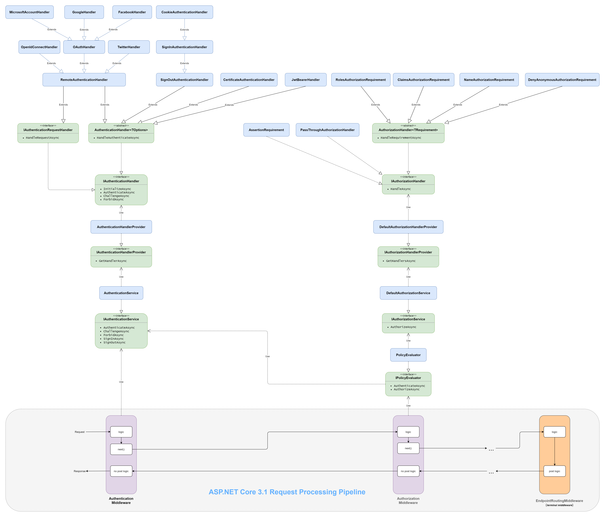
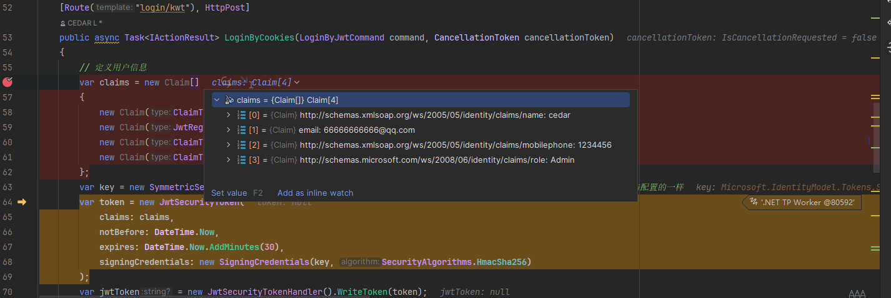
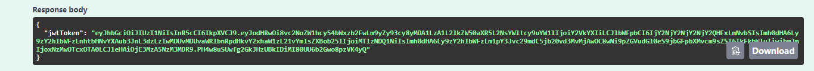

# Authorization
授权是指判断用户可执行的操作的过程。 例如，允许管理用户创建文档库和添加、编辑以及删除文档。 

简单的说，验证是看当前用户有没有账号，这个账号有没有效，相当于检验门票。授权是当前用户可以进去做哪些事情，相当于凭借这个门票所能参加的项目。



## 1、AuthorizeAttribute
AuthorizeAttribute 是 `ASP.NET Core` 中用于实现授权的一个过滤器属性。它可以用来限制对控制器或操作方法的访问，确保只有经过身份验证并满足授权要求的用户才能访问这些资源。

```cs
[Authorize]  // 仅允许经过身份验证的用户访问
public IActionResult SecureAction()
{
    return View();
}
```

```cs
[Authorize(Roles = "Admin,Manager")]  // 仅允许“Admin”和“Manager”角色的用户访问
public IActionResult AdminAction()
{
    return View();
}
```

```cs
[Authorize(Policy = "CanViewReports")]  // 使用授权策略
public IActionResult Reports()
{
    return View();
}

services.AddAuthorization(options =>
{
    options.AddPolicy("CanViewReports", policy =>
        policy.RequireRole("Admin").RequireClaim("Department", "Finance"));
});
```

另外有属性[AllowAnonymous]可以覆盖[Authorize],允许未经过身份验证的用户访问特定的操作方法。

## 2、授权方式
### 2.1 基于角色授权
基于角色的授权就是检查用户是否拥有指定角色，如果是则授权通过，否则不通过。

先给一个获取token的接口：
```cs
    [Route("login/kwt"), HttpPost]
    public async Task<IActionResult> LoginByCookies(LoginByJwtCommand command, CancellationToken cancellationToken)
    {
        // 定义用户信息
        var claims = new Claim[]
        {
            new Claim(ClaimTypes.Name, command.UserName),
            new Claim(JwtRegisteredClaimNames.Email, "66666666666@qq.com"),
            new Claim(ClaimTypes.MobilePhone, "1234456"),
            new Claim(ClaimTypes.Role, "Admin")
        };
        var key = new SymmetricSecurityKey(Encoding.UTF8.GetBytes("my_secret_key_here_AAABBBBBBBBBBBBBB")); // 这个要与配置的一样
        var token = new JwtSecurityToken(
            claims: claims,
            notBefore: DateTime.Now,
            expires: DateTime.Now.AddMinutes(30),
            signingCredentials: new SigningCredentials(key, SecurityAlgorithms.HmacSha256)
        );
        var jwtToken = new JwtSecurityTokenHandler().WriteToken(token);
        return Ok(new { jwtToken });
    }
```



### 2.2 基于声明授权
声明就是claims，例如：
- ClaimTypes.Name：用户的名称
- ClaimTypes.Role：用户的角色
- ClaimTypes.Email：用户的电子邮件地址

角色（Role）授权可以被视为基于声明授权的一种特殊情况。而基于声明的授权，是在基于策略的授权基础上实现的。我们需要通过添加策略来使用声明。

### 2.3 基于策略授权
当业务场景比较复杂时，我们必须能够设计更加自由的策略，也就是基于策略的授权。

基于策略的授权可以分成两种：简单策略和动态策略。

#### 2.3.1 简单策略


#### 2.3.2 动态策略


### 2.4 基于资源授权
有些场景下，授权需要依赖于要访问的资源，例如：每个资源通常会有一个创建者属性，我们只允许该资源的创建者才可以对其进行编辑，删除等操作，这就无法通过[Authorize]特性来指定授权了。因为我们需要知道访问的是哪个资源，当前的用户是谁再判断是否有权限访问资源。这时候就用到基于资源的授权了。


