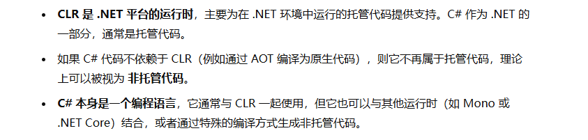
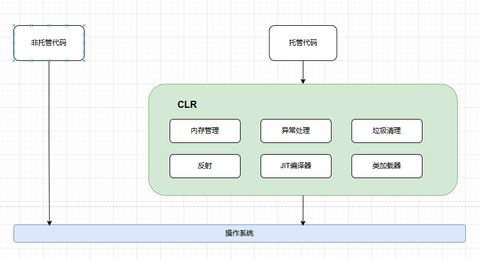

# 资料合集

## 查漏补缺
### 托管代码与非托管代码
托管代码就是把有关内存管理（内存申请，内存释放，垃圾回收之类的）交由虚拟环境管理。比如：C#的虚拟环境是CLR，Java的虚拟环境是JVM。

使用托管的代码把底层的一些操作都封装起来了，不能直接进行内存的读取之类的和硬件相关的操作。

优点：比较安全，不会出现诸如内存泄露之类的问题
缺点：不能直接读取内存，性能上会有损失，使用起来有时也不够灵活

非托管代码可以直接进行硬件操作，性能比较高，但是对开发人员的要求也比较高。比如：C#使用垃圾回收，C++要手动释放对象。

### JIT
JIT（Just-In-Time）编译器是一种 运行时编译 技术，在程序执行期间将中间代码（通常是 IL 代码）转换为目标平台的机器代码。对于 .NET 应用程序，JIT 编译器是 CLR（Common Language Runtime） 的一部分，它负责将中间语言（IL）在程序运行时即时编译成机器码，然后执行该机器码。

## 参考资料
- 《CLR VIA C#》：https://www.yuque.com/fhlsteven/clr_via_csharp/uvs479
- CLR十分钟：https://www.bilibili.com/video/BV177411f74d/?spm_id_from=333.337.search-card.all.click
- 托管代码与CLR的理解：https://www.bilibili.com/video/BV19q4y157eV/?spm_id_from=333.337.search-card.all.click
- CLR托管模块理解图解：https://juejin.cn/post/7343506152448229386