# CLR基础
虽然\.NET Framework已经逐渐淘汰了，转而被\.Net Core 替代，而\.Net Core使用的是CoreCLR，但CLR与CoreCLR有很多相似的地方，并且CLR有《CLR Via C#》讲解，所以先了解CLR再学习CoreCLR会方便很多。

## 1 CLR执行模型
CLR（Common Language Runtime， 公共语言运行时）是  .NET Framework  框架的核心组件，它为 .NET 应用程序提供了一个运行时环境。CLR 扮演了虚拟机的角色，主要负责内存管理、程序集加载、安全性、异常处理和线程同步等功能。

CLR 是 .NET 平台独有的，而不是 C# 独有的。它是为整个 .NET 生态系统设计的运行时环境，不局限于任何特定语言。CLR 支持多种 .NET 语言，包括：
- C#
- VB\.NET
- F#
- 其他 .NET 兼容语言

**CLR主要组成部分：**

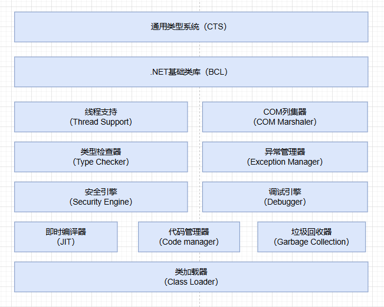

- `CTS`：定义了所有 .NET 支持的类型和规则，提供了一个完整的类型系统。也就是定义了我们设计的编程语言可以做什么，不可以做什么，具有哪些特征。
- `BCL`：集成具有支持\.NET Framework 类库运行时的代码
- `Thread Support`：提供了多线程编程的类和接口
- `COM`：处理与COM之间的配置
- `Type Checker`：检查并禁止非安全的类型转换以及未初始化的变量的使用
- `Exception Manager`:提供结构化的异常处理，与Windows结构化异常处理机制（SHE）集成，改进了错误报告
- `Security Engine`:提供基于认证的安全机制
- `Debugger`:使开发者能调试和跟踪应用程序代码
- `JIT`：负责将IL翻译成本机执行代码 (CPU指令)
- `Code Manager`：管理代码的执行
- `Garbage Collection`：负责整个.NET运行时托管代码的内存分配与释放任务，它通过一定的优化算法选择收集对象和时间，并进行自动的垃圾收集
- `Class Loader`：将应用程序的汇编加载到内存中。汇编包括IL、描述应用程序中组件的元数据（类和类的布局描述），以及其他应用程序所需的组件


**CLR工作原理：**

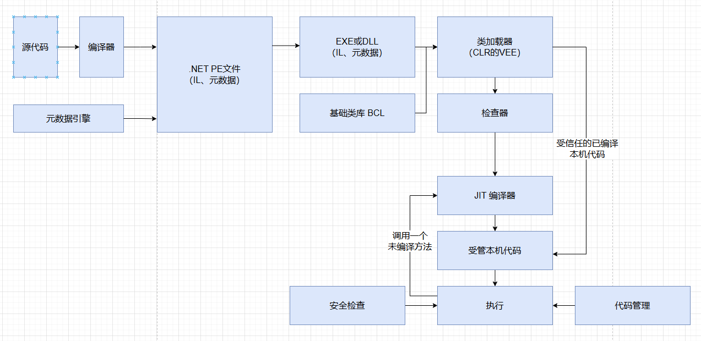

### 1.1 将源代码编译成托管模块

运行时CLR不关心开发人员用的哪一种语言写代码，意味着我们可以选择任何一种编程语言，只要编译器是面向CLR的。事实上，编译器可以视为是语法检查器和“正确代码”分析器。编译器检测源代码并根据我们的意图（我们自己写的代码）输出描述代码（中间代码/目标代码 等等）。编译过程中，无论选择哪个编译器，结果都是托管模块。

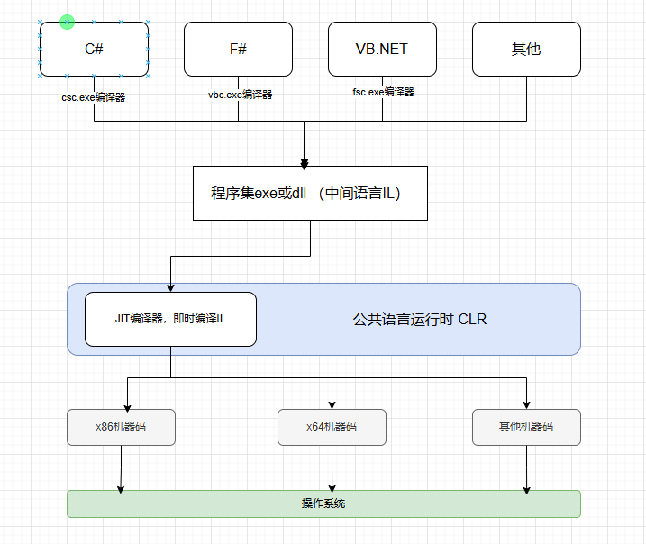

面向CLR的编译器除了生成IL，还在每个托管模块中生成完整的元数据（一个数据表集合，描述模块中定义了什么，引用了什么）。

### 1.2 将托管模块合并成程序集

<hr>
<div style="color:grey">
托管模块与程序集概念理解：
一个开发团队有多个成员与一个负责人，外部人员只需要知道负责人即可，负责人知道团队内部一切情况。这时候：
团队 = 程序集、
负责人 = 托管主模块、
成员 = 普通托管模块
</div>
<hr>

托管模块组成部分（以文件结构区分）：

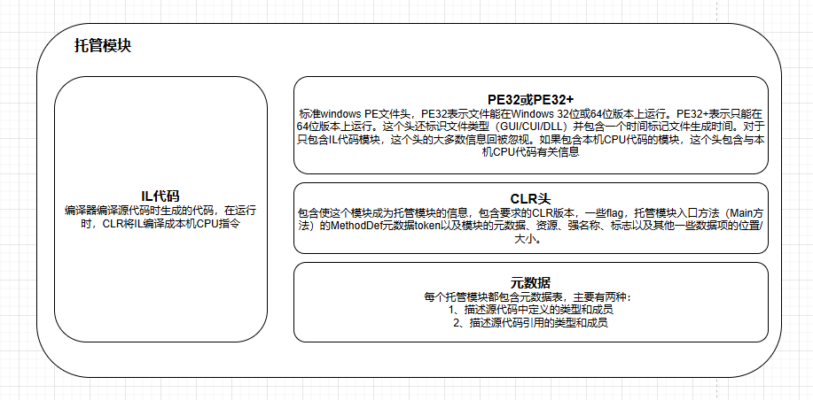

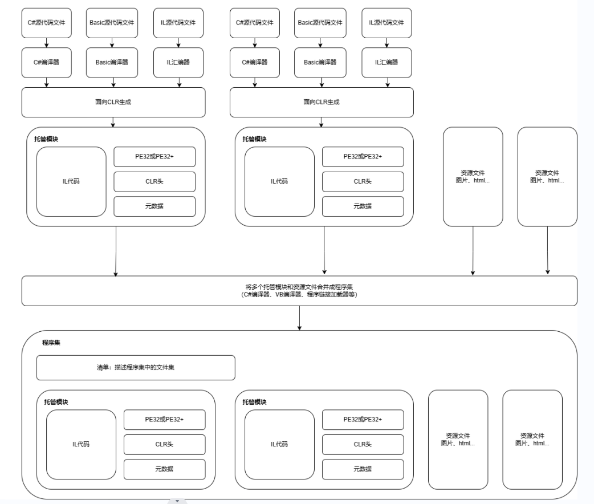

### 1.3 加载公共语言运行时
生成的每个程序集可以是可执行应用程序，也可以是DLL。

由CLR管理程序集中的代码的执行，所以目标机器必须安装好\.NET Framework。一些版本的Windows在发售的时候就已经打包好了\.NET Framework。


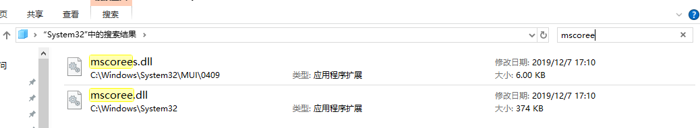

如果程序集文件值包含类型安全的托管代码，代码在32位和64位Windows上都能正常工作，源代码无需任何改动。

Microsoft发布SDK命令行实用程序DumpBin.exe和CorFlags.exe，可用它们检查编译器生成的托管模块所嵌入的信息。

**CLR具体加载步骤：**

- Windows检查文件头
    - 判断需要32位还是64位空间
    - 检查嵌入的CPU架构信息，确保当前计算机CPU符合要求
- Windows的64位版本通过WoW64（Windows on Windows64）技术运行32位windows应用程序
- windows检查EXE文件头
    - 决定是32位还是64位进程后，会在检查地址空间加载MSCorEE.dll的x86，x64或ARM版本
        - x86/ARM版本：MSCorEE.dll的x86版本在`%SystemRoot%\System32`目录中
        - x64版本：MSCorEE.dll的x86版本在`%SystemRoot%\SysWow64`目录中，64位版本则在`%SystemRoot%\System32`目录中（为了向后兼容）
- 进程主线程调用MSCorEE.dll中定义的一个方法
    - 初始化CLR
    - 加载EXE程序集
    - 调用入口Main方法
- 托管应用程序启动并运行    

### 1.4 执行程序集的代码
托管程序集同时包含元数据和IL。

IL是与CPU无关的机器语言，能访问和操作对象类型，提供指令创建和初始化对象，调用对象上的虚方法以及直接操作数组元素。提供了抛出和捕捉异常指令实现错误处理。可将IL视为一种面向对象的机器语言。

高级语言通常只公开CLR全部功能的一个子集，而IL汇编语言允许开发人员访问CLR全部功能。（如果语言A隐藏我们需要的一个CLR功能，那么我们可以使用IL或提供了所需功能的语言B来写那部分代码，反正最后都转化为IL汇编语言）。`混合语言编程`是一个值得考虑的选择。

JIT 编译是在程序执行时（而不是编译时）将中间语言（IL）编译为机器指令。它是在程序和用户交互过程中动态完成的。

一个方法首次调用：
- CLR检测出Main的代码引用的所有类型
    - 导致CLR分配一个内部结构管理对引用类型的访问
- Main方法引用一个Console类型
    - 导致CLR分配一个内部结构，在这个内部结构中，Console类型定义的每个方法都有一个对应的记录项
    - 每个记录项都含有一个地址，根据地址找到方法实现
    - 初始化时，CLR将每个记录项都指向包含在CLR内部的一个未编档函数JITCompiler（负责将方法的IL代码编译成本机CPU指令）
- Main首次调用WriteLine，调用JITCompiler
    - JITCompiler被调用时知道要调用的是哪个方法，以及具体是什么类型定义该方法
    - JITCompiler在该类型的程序集元数据中查找被调用方法的IL
    - JITCompiler验证IL代码，并翻译成本机CPU指令
    - 本机CPU指令保存到动态分配的内存块
    - JITCompiler回到CLR为类型创建的内部数据结构，找到与被调用方法对应的记录，修改最初对JITCompiler的引用，使其指向内存块地址
    - JITCompiler跳转到内存块中代码，这些代码是WriteLine(string)方法具体实现 
    - 执行完代码后回到Main

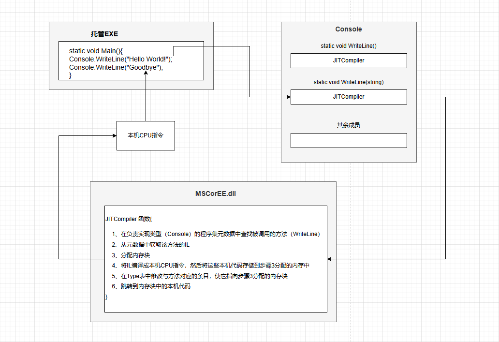

一个方法第二次调用：
- Main第二次调用WwriteLine
    - 直接执行内存块中的代码
    - 执行后再次回到Main

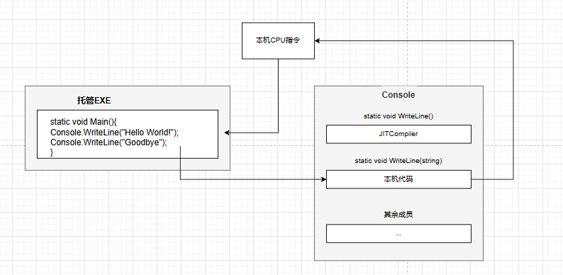

#### 1.4.1 IL与验证
IL特点：
- IL基于栈
- IL没有提供操作寄存器的指令
- IL指令是无类型（typeless）的
    - IL 指令本身不明确指示变量的具体类型（int,string,...）
        - <p style="color:grey">IL 只关心数据的“形态”，例如，IL 会将 int 视作一个特定大小的“数据单元”，但它不会明确地使用 int 这个类型名称，而是用一个更通用的指令（如 ldc.i4）来表示加载一个整数</p>
    - IL 不直接包含类型信息，但它的元数据（metadata）中包含了类型的具体定义。元数据中会描述类、方法、字段、参数等的具体类型，JIT 编译器会根据这些元数据来处理类型信息并生成相应的机器代码。

将IL编译成本机CPU指令时，CLR执行**验证**过程：检查高级IL代码，确保代码所做的一切是安全的。

Windows每个进程都有自己的虚拟空间，将每个Windows进程都放到独立地址空间，进程之间互不干扰。然而通过验证托管代码，确保了代码不会不正确地访问内存，不会干扰另一个应用程序的代码，这样就可以放心地将多个托管代码放到同一个Windows虚拟地址空间运行。

CLR提供在一个操作系统进程中执行多个托管应用程序的能力。每个托管应用程序都在一个AppDomain中执行。


#### 1.4.2 不安全代码
Microsoft C#编译器允许开发人员写不安全代码。不安全代码允许直接操作内存地址。C#编译器要求包含不安全代码的所有方法都用`unsafe`关键字标记。并且C#编译器要求使用/unsafe编译器开关编译源代码。

### 1.5 本机代码生成器：NGen.exe
用\.NET Framework提供的NGen.exe根据，可以提前将IL代码编译成本机代码。所以CLR的JIT编译器不需要在运行时编译IL代码。

优点：
- 提高应用程序启动速度
- 减小应用程序的工作集
    - NGen.exe将IL编译成本机代码，将这些代码保存到单独文件中，文件通过“内存映射”方式，同时映射到多个进程地址空间中，使代码得到共享

缺点：
- 没有知识产权保护
    - 运行时，CLR要求访问程序集的元数据，这要求发布包含IL和元数据的程序集
- NGen生成的文件可能失去同步
- 较差的执行性能
    - NGen无法像JIT编译器那样对执行环境进行许多假定，这会造成NGen.exe生成较差的代码
### 1.6 Framework类库
FCL 包含了 BCL，并扩展了更多高级功能，如图形界面、网络通信和数据访问。

### 1.7 通用类型系统 CTS
类型是CLR的根本，Microsoft制定一个正式规范描述类型的定义和行为，这就是CTS。

CTS和\.NET Framework的其他组件形成的标准称为“公共语言基础结构”CLI。

CTS规范规定：
- 字段 Field
- 方法 Method
- 属性 Property
- 事件 Event

CTS规定的可见性规则和类型成员访问规则：
- private
    - 成员只能由同一个类类型中的其他成员访问
- family
    - 成员可由派生类型访问，不管哪些类型是否在同一个程序集中，C#用的是protected修饰
- family and assembly
    - 成员可由派生类型访问，但这些派生类型必须在同一个程序集中定义，C#没有提供这种访问控制
- assembly
    - 成员可由同一个程序集中的任何代码访问，C#使用internal标识
- family or assembly
    - 成员可由任何程序集中的派生类型访问，成员也可由同一个程序集中的任何类型访问。C#用protected internal实现
- public
### 1.8 公共语言规范
不同语言创建的对象可通过COM相互通信。

COM（Component Object Model） 是微软开发的一种 组件对象模型 技术，用于支持不同语言之间的对象交互。

语言集成棘手的问题就是各种编程语言存在极大区别。Microsoft定义了“公共语言规范”（CLS）。定义了一个最小功能集，任何编译器只有支持这个功能集，生成的类型才能兼容由其他符合CLS，面向CLS的语言生成的组件。


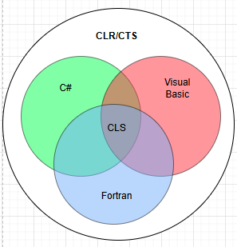

详细的CLS规则，查看微软文档：https://learn.microsoft.com/zh-cn/previous-versions/visualstudio/visual-studio-2008/730f1wy3(v=vs.90)?redirectedfrom=MSDN


### 1.9 与非托管代码的互操作性
CLR支持三种互操作情形：
- 托管代码能调用DLL中的非托管函数
- 托管代码可以使用现有COM组件（服务器）
- 非托管代码可以使用托管类型（服务器）


## 2 生成、打包、部署和管理应用类型及程序

### 2.1 将类型生成到模块中

一个将源代码文件转变味可以部署文件的例子：

如果找不到csc.exe，可以在C:\Windows\Microsoft.NET\Framework64\v4.0.30319 查看有没有，如果有的话，把路径添加到系统环境变量里。

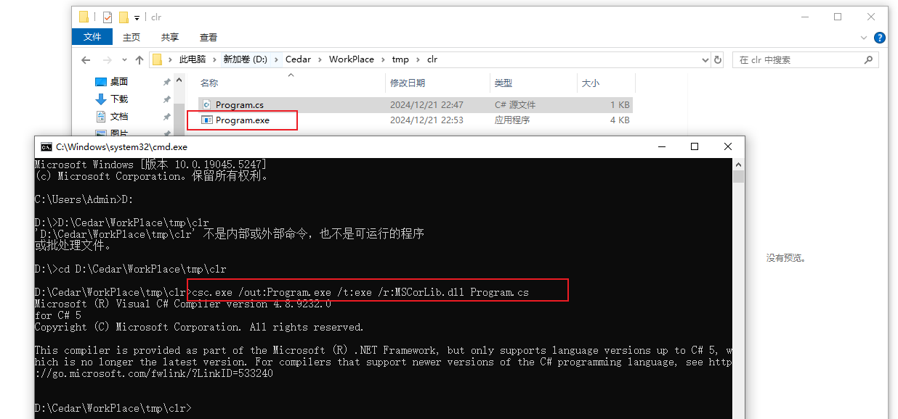

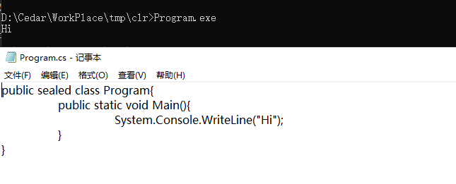

这个命令行指示C#编译器生成，名为Program.exe的可执行文件（/out:Program.exe）生成的文件是Win32控制台应用程序类型（/t[arget]:exe）

C#编译器处理源文件，发现引用了System.Console类型的WriteLine，需要做的是核实该类型存在并有WriteLine方法并且传递实参与方法形参是匹配的。因为源代码没有定义，要通过编译，需要先C#编译器提供一组程序集，使他能够解析对外部的引用。这也是为什么添加了/r[eference]:MSCorLib.dll开关，能够告诉编译器在MSCorLib.dll程序集中查找外部类型。

MSCorLib.dll是特殊文件，包含所有核心类型，包括Byte、Char、String等。用的频繁，所以C#编译器会自动引用MSCorLib.dll程序集，所以上面的命令行也可以去掉/r[eference]:MSCorLib.dll。

由于/out:Program.exe和/t:exe是C#编译器默认设定，所以可以简化成`csc.exe Program.cs`。

Windows支持三种应用程序：
- /t:exe : 控制台用户界面（CUI）应用程序
- /t:winexe : 图形用户界面（GUI）应用程序
- /t:appcontainerexe : Windows Store应用

先了解一下 *相应文件* 的概念：
相应文件是包含一组编译器命令行开关的文本文件。就是一个命令行参数文本，加上这个文本就不用重复在命令行指定了。

比如现在有一个MyProject.rsp文件有以下文本
```
/out:MyProject.exe
/target:winexe
```

那么上面的例子可以这样写：
```
csc.exe @MyProject.rsp Program.cs
```

这样Program.cs就删除了GUI应用程序。

C#编译器支持多个响应文件，除了命令行显示指定，编译器会自动查找名为CSC.rsp文件。\.NET Framework 安装时会在%SystemRoot%\Microsoft.NET\Framework\vxxx里安装默认全局CSC.rsp。

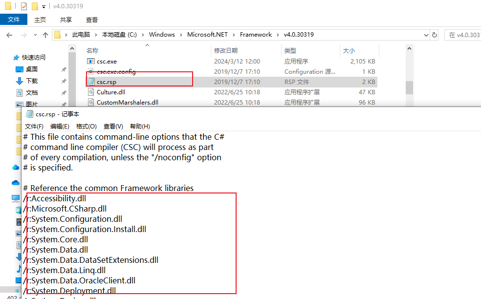

因为使用全局csc.rps所以在编写代码时不用using System也不会报错。

指定/noconfig命令行开关，编译器会忽略本地和全局CSC.rsp文件。

### 2.2 元数据概述
托管PE文件由4部分构成：
- PE32（+）头
    - Windows要求的标准信息
- CLR头
    - 需要CLR模块特有的，包含模块生成时所面向的CLR的major（主）和minor（次）版本号、一些标志（flag），一个MethodDef token、一个可选的强类型名称数字签名、模块内部一些元数据表的大小和偏移量
    - 可以查看CorHdr.h头文件定义的`IMAGE_COR20_HEADER`了解CLR头具体格式
- 元数据
    - 由几个表构成二进制数据块
        - 定义表
        - 引用表
        - 清单表
            - 主要包含作为程序集组成部分的哪些文件名称，描述了程序集的版本、语言文化、发布者、公开导出的类型以及构成程序集的所有文件
- IL


常用定义表：
- ModuleDef：对模块进行标识的一个记录项
- TypeDef：模块定义的每个类型在这个表中都有一个记录项，每个记录项有一些索引，指向MethodDef表中该类型的方法，FieldDef表中该类型的字段、PropertyDef表中该类型的属性以及EventDef表中该类型的事件
- MethodDef：模块定义的每个方法在这个表中都有一个记录项
- FieldDef：模块定义的每个字段在这个表中都有一个记录项
- ParamDef：模块定义的每个参数在这个表中都有一个记录项，每个记录项都包含标志（in，out，retval等）、类型和名称
- PropertyDef：命令定义的每个属性在这个表中都有一个记录项
- EventDef：模块定义的每个事件在这个表中都有一个记录项


常用引用元数据表：
- AssemblyRef：模块引用的每个程序集在这个表中都有一个记录项（一组dll）
- ModuleRef：实现该模块所引用的类型的每个PE模块在这个表中都有一个记录项（一个dll或exe就是一个模块）
- TypeRef：模块引用的每个类型在这个表中都有一个记录项
- memberRef：模块引用的每个成员（字段和方法，以及属性方法和事件方法）在这个表中都有一个记录项


清单元数据表：
- AssemblyDef：如果模块标识的是程序集，这个元数据表就包含单一记录项列出程序集名称、版本、语言文化、标志、哈希算法以及发布者公钥（可为null）
- FileDef：作为程序集一部分的每个PE文件和资源文件在这个表中都有一个记录项（清单本省所在文件除外，该文件在AssemblyDef表的单一记录项中列出）
- ManifestResourceDef：作为程序集一部分的每个资源在这个表中都有一个记录项
- ExportedTypesDef：从程序集的所有PE模块中导出的每个public类型在这个表中都有一个记录项

### 2.3 将模块合并成程序集
Program.exe不止含有元数据的PE文件，它还是程序集。程序集是一个或多个类型定义文件及资源文件的集合。在程序集所有文件中，有一个文件容纳了清单（可以理解为接口）。

CLR操作的是程序集，首先加载包含清单元数据表的文件，在根据清单获取程序集中其他文件的名称。

为什么引入“程序集”概念：因为使用程序集可将类型的逻辑表示与物理表示分开。比如，程序集可能包含多个类型，可以把常用的类型放到一个文件中，不常用的放另一个文件，如果程序集要从Internet下载并部署，对于不常用的类型文件，如果客户端永远不使用，该文件就永远不会下载到客户端。

配置应用程序下载程序集文件：在应用程序配置文件中指定codeBase元素。codeBase定义的URL所指位置可找到程序集的所有文件。试图加载程序集的一个文件时，CLR获取codeBase元素的URL，检查机器的下载缓存，判断是否存在，存在直接加载文件，不存在则CLR去URL指向的位置将文件下载到缓存。如果还找不到文件，抛出FileNotFoundException。

指定以下任何命令行开关，C#编译器都会生成程序集：
- /t[arget]:exe  生成CUI执行体
- /t[arget]:winexe   GUI执行体
- /t[arget]:appcontainerexe  Windows Store执行体
- /t[arget]:library  类库
- /t[arget]:winmdobj  WINMD库

以上开关都会造成编译器生成含有清单元数据表的PE文件。

C#编译器还支持/t[arget]:module开关，生成一个不包含清单元数据表的PE文件。这样生成的肯定是一个DLL PE文件，CLR想访问其中的任何类型，必须先将该文件添加到一个程序集中。

可通过多种方式将模块添加到程序集，如果用C#编译器生成含清单的PE文件，可以使用/addmodule开关。（有例子，需要再看会书里内容 42）


客户端代码执行时会调用方法：
- 方法首次调用时，CLR检测作为参数、返回值或局部变量而被方法引用的类型
- CLR尝试加载所应用程序集中含有清单的文件
    - 要访问的类型恰好在这个文件中：CLR执行内部登记工作，允许使用该类型
    - 清单支出被引用的类型在不同文件中：CLR尝试加载需要的文件，同样执行内部登记，允许使用该类型

### 2.5 程序集版本资源信息

### 2.6 语言文化


## 3 共享程序集合强命名程序
