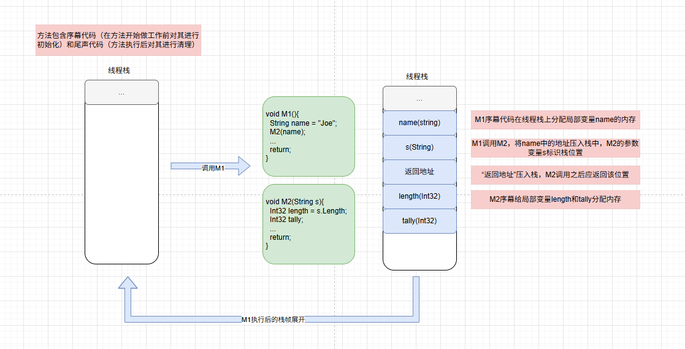
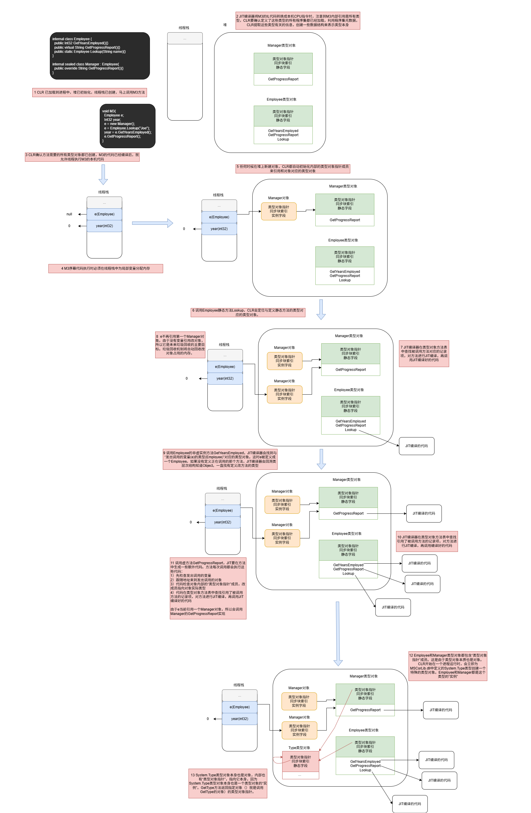
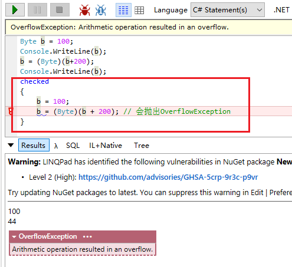
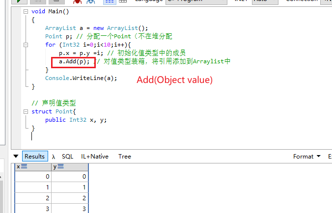
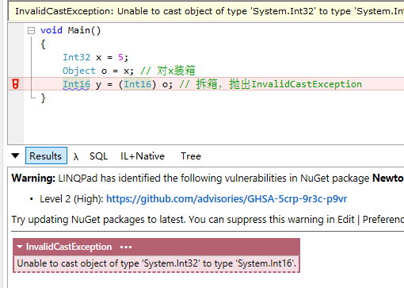
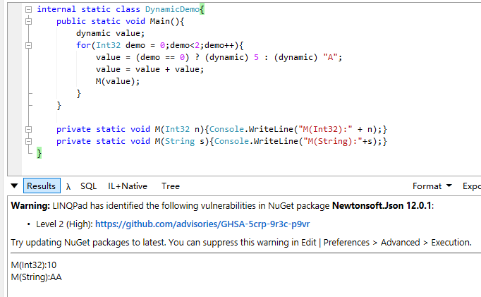
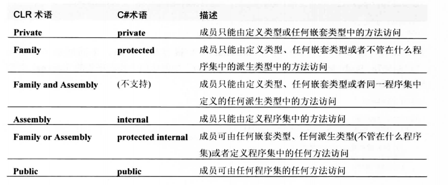

# 设计类型
## 1 类型基础 *
### 1.1 所有类型都从System.Object派生
```cs
class Employee{
    ...
}

class Employee : System.Object{
    ...
}

//上面这两种定义完全一致
```

System.Object公共方法：
- Equals 如果两个对象具有相同的值（引用相等），返回true
- GetHashCode 返回对象哈希码（int），引用相等
- ToString 返回类型完整名称 this.GetType().FullName
- GetType 

System.Object受保护方法（只能在该类自身或派生类中访问的方法）：
- MemberwiseClone 浅拷贝
- Finalize 垃圾回收器判断对象应该作为垃圾被回收之后，在对象内存被实际回收之前会调用这个虚方法

```cs
public class User{
  public User Copy(){
    return (User) this.MemberwiseClone();
  }
  public int Id{get;set;}
  public int sort{get;set;}
}
```

### 1.2 类型转换
CLR最重要的特性之一就是类型安全，GetType是非虚方法，所以一个类型不可能伪装成另一个类型。

CLR允许对象转换为它的实际类型或它的任何基类型。

`is` 操作符检查对象是否兼容于指定类型，永远不会抛出异常。
`as` 操作符将对象转换为指定类型，也是永远不会抛异常，转换失败输出的是null `Employee e = o as Employee`

### 1.3 命名空间和程序集
命名空间对相关的类型进行逻辑分组，开发人员可通过命名空间方便地定位类型。

如果编译器在源码或引用的任何程序集中找不到指定名称的类型，就会在类型名称附加`System.IO.前缀`检查是否匹配，找不到继续附加`System.Text.前缀`。

### 1.4 运行时的相互关系





## 2 基元类型、引用类型和值类型
### 2.1 基元类型
```cs
// 以下生成完全相同的IL

int a = 0;    // 最方便的语法
System.Int32 a = 0; // 方便的语法
int a = new int(); // 不方便的语法
System.Int32 a = new System.Int32(); // 最不方便的语法
```
对于某些常用数据类型，包括C#在内的许多编译器都允许使用方便的写法。编译器直接支持的数据类型成为基元类型，基元类型直接映射到FCL中存在的类型。例如C#的int直接映射到System.Int32类型。

从另一个角度讲，可认为C#编译器自动假定所有源代码文件都添加了using指令
```cs
using int = System.Int32;
```


```cs
Int32 i = 5; // 32位值
Int64 l = i; // 隐式转型为64位
```
Int32和Int64相互不存在派生关系，但是C#编译器却能正确编译上述代码，这是因为C#编译器非常熟悉基元类型，会在编译代码时应用自己的特殊规则。

只有在转换安全（不会发生数据丢失的情况）时，C#才允许隐式转型。

不同编译器可能生成不同代码来处理这些转型。

除了转型，基本类型还能写成字面值（literal），字面值可被看成是类型本身实例，所以可以像下面的例子：
```cs
Console.WriteLine(123.ToString() + 456.ToString());
```

如果表达式由字面值组成，编译器在编译时就能完成表达式求值，从而增强应用程序性能。

**checked和unchecked基元类型操作**
对基元类型执行的许多算术运算都可能造成溢出。不同语言处理溢出方式不同。CLR提供一些特殊的IL指令。

CLR有一个add指令，作用是两个值相加但不执行溢出检查。还有一个add.ovf指令，作用是两个值相加但发生溢出时抛出System.OverflowException异常。（类似的还有减乘除）

/checked+是C#编译器控制溢出的一个开关。

除了全局打开或关闭溢出检查，程序员可在特定区域控制溢出检查。



### 2.2 引用类型和值类型
CLR支持两种类型：
- 引用类型 new操作符返回对象内存地址
    - 内存必须从托管堆分配
    - 堆上分配的每个对象都有一些额外成员，这些成员必须初始化
    - 对象中的其他字节总是设为零
    - 从托管堆分配对象时，可能强制执行一次垃圾回收
- 值类型
    - 实例一般在线程栈上分配
    - 没有指针、垃圾回收、额外成员这些

看文档时，任何称为“类”的类型都是引用类型，称为“结构”（从System.ValueType派生）或“枚举”（从System.Enum派生）的是值类型。

不能在定义值类型时为它选择基类型，但值类型可实现一个或多个接口。
所有值类型都隐式密封，目的是防止值类型用作其他引用类型或值类型的基类型。

```cs
class SomeRef {
  public Int32 x;
}

struct SomeVal{
  public Int32 x;
}

static void ValueTypeDemo(){
  SomeRef r1 = new SomeRef(); // 堆上分配
  SomeVal v1 = new SomeVal(); // 栈上分配
  r1.x = 5; // 通过指针
  v1.x = 5; // 在栈上修改
  Console.WriteLine(r1.x); // 5
  Console.WriteLine(v1.x); // 5
  
  SomeRef r2 = r1;
  SomeVal v2 = v1;
  r1.x = 8;
  v1.x = 9;
  Console.WriteLine(r1.x); // 8
  Console.WriteLine(r2.x); // 8
  Console.WriteLine(v1.x); // 9
  Console.WriteLine(v2.x); // 5
}
```


### 2.3 值类型的装箱和拆箱


Add获取的是Object，而Point是值类型，所以需要将值类型转换成引用类型，这个叫做装箱。

装箱的步骤：
- 在托管堆中分配内存。分配的内存是值类型各字段需要的内存量，加上托管堆所有对象都有的两个成员（类型对象指针和同步块索引）所需的内存量
- 值类型的字段复制到新分配的堆内存
- 返回对象地址，值类型成了引用类型


```cs
Point p = (Point) a[0]; 
```
为完成上面的表达式，CLR先获取已装箱Point对象中各个Point字段地址，这个过程称为**拆箱**，然后将字段包含的值从堆复制到基于栈的值类型实例中。

拆箱代价比装箱低很多。

拆箱出来的类型只能是装箱时的类型，不然会报错InvalidCastException



正确做法是`Int16 y = (Int16)(Int32) o`

额外的装箱步骤会从托管堆中分配一个额外的对象，就来必须对其进行垃圾回收。

像writeLine会定义多个重载避免装箱，但是如果不存在与值类型对应的重载版本，调用的肯定是获取一个Object参数的重载版本。将值类型实例作为Object传递会造成装箱，从而对性能造成不利影响。定义自己的类时，可将类中的方法定义为泛型，这样方法就可以获取任何值类型而不必装箱。

由于未装箱值类型没有同步索引，所以不能使用System.Threading.Monitor类型的方法（或C# lock语句）让多个线程同步对实例的访问。

**使用接口更改已装箱值类型中的字段**
```cs
internal interface IChangeBoxedPoint{
  void Change(Int32 x, Int32 y);
}

internal struct Point : IChangeBoxedPoint{
  private Int32 m_x, m_y;
  public Point(Int32 x, Int32 y){
    m_x = x;
    m_y = y;
  }

  public void Change(Int32 x, Int32 y){
    m_x = x;
    m_y = t;
  }

  public override String ToString(){
    return String.Format("{0}, {1}", m_x.ToString, m_y.ToString)
  }
}

public sealed class Program{
  public static void Main(){
    Point p = new Point(1,1);

    Console.WriteLint(p); // 装箱 1,1

    p.Change(2,2);
    Console.WriteLint(p); // 装箱 2,2

    Object o = p; // 装箱
    Console.WriteLint(o); // 2,2

    ((Point) o).Change(3,3);//拆箱
    Console.WriteLint(o); // 2,2

    ((IChangeBoxedPoint) p).Change(4,4); // 装箱，更改的是已装箱的对象，然后垃圾回收了
    Console.WriteLint(p); // 2,2

    ((IChangeBoxedPoint) o).Change(5,5);
    Console.WriteLint(o);   // 5,5
  }
}
```

**对象相等性和同一性**
同一性：两个引用是否指向同一内存对象
相等性：两个对象内容或值相同

### 2.4 对象哈希码
FCL设计者认为，如果能将任何对象的任何实例放在哈希表集合中，会有很多好处，所以，System.Object提供虚方法GetHashCode，获取任意对象的Int32哈希码。

如果自定义类型重写Equals方法，就需要重新GetHashCode方法，否则编译会有警告信息。因为System.Collections.Hashtable类型、System.Collections.Generic.Dictionary类型以及其他一些集合实现中，要求两个对象必须具有相同哈希码才被视为相等。

千万不要对哈希码进行持久化，因为哈希码很容易改变。比如将密码调用GetHashCode生成的哈希码存入数据库，CLR升级版本后同样的密码调用GetHashCode可能会有不一样的哈希码。

### 2.5 dynamic 基元类型
运行中才能推断类型的情况。C#编译器允许将表达式的类型标记为dynamic，还可将表达式的结果放到变量中，并将变量标记为dynamic




dynamic其实就是Object，方法签名不能仅靠dynamic和Object的变化来区分。字段，方法参数或方法返回值的类型是dynamic，编译器会在元数据中，对字段、参数或返回类型应用System.Runtion.CompilerServices.DynamicAttribute的实例。

如果dynamic被指定为foreach语句中的集合，编译器会生成代码将表达式转型为System.IEnumberable接口。

如果dynamic被指定为using语句中的资源，编译器会生成代码将表达式转型为System.IDisposable接口。

String调用Contains方法：
```cs
Object target = "Jeffrey";
Object arg = "ff";

// 在目标上查找和希望的实参类型匹配的方法
Type[] argTypes = new Type[] { arg.GetType() };
MethodInfo method = target.GetType().GetMethod("Contains", argTypes);

// 在目标上调用方法，传递希望的实参
Object[] arguments = new Object[] { arg };
Boolean result = Convert.ToBoolean(method.Invoke(target, arguments));
Console.WriteLine(result);
```

C#内建的动态求值功能所产生的额外开销不容忽视，动态功能简化语法，但也需要看是否值得。加载所有的程序集以及额外的内存消耗会对想你能造成额外影响。然后程序中只是一两个地方需要动态行为，传统做法（调用反射）或进行手动类型转换（如果是COM对象）或许更高效。

## 3 类型和成员基础
### 3.1 类型的各种成员
类型可定义多个以下种类的成员：
- 常量
- 字段
- 实例构造器
- 类型构造器
- 方法
- 操作重载符
- 转换操作符
- 属性
- 事件
- 类型

<p style="color:gray">类是类型的子集</p>

```cs
public sealed class SomeType
{
	// 嵌套类
	private class SomeNestedType { }
	// 常量 只读字段 静态字段
	private const Int32 c_SomeConstant = 1;
	private readonly String m_SomeReadOnlyFiled = "2";
	private static Int32 s_SomeReadWriteFiled = 3;
	// 类型构造器
	static SomeType(){}
	// 实例构造器
	public SomeType(Int32 x) { }
	public SomeType() {}
	// 实例方法和静态方法
	private String InstanceMethod() { return null; }
	public static void Main() {}
	// 实例属性
	public Int32 SomeProp{
		get{return 0;}
		set{}
	}
	// 实例有参属性（索引器）
	public Int32 this[String s]{
		get { return 0; }
		set {}
	}
	// 实例事件
	public event EventHandler SomeEvent;
}
```

### 3.2 类型可见性


