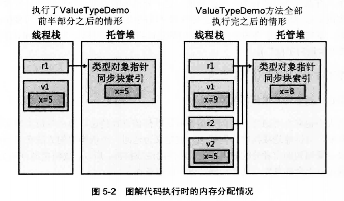
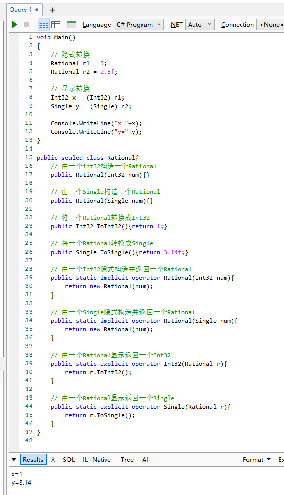
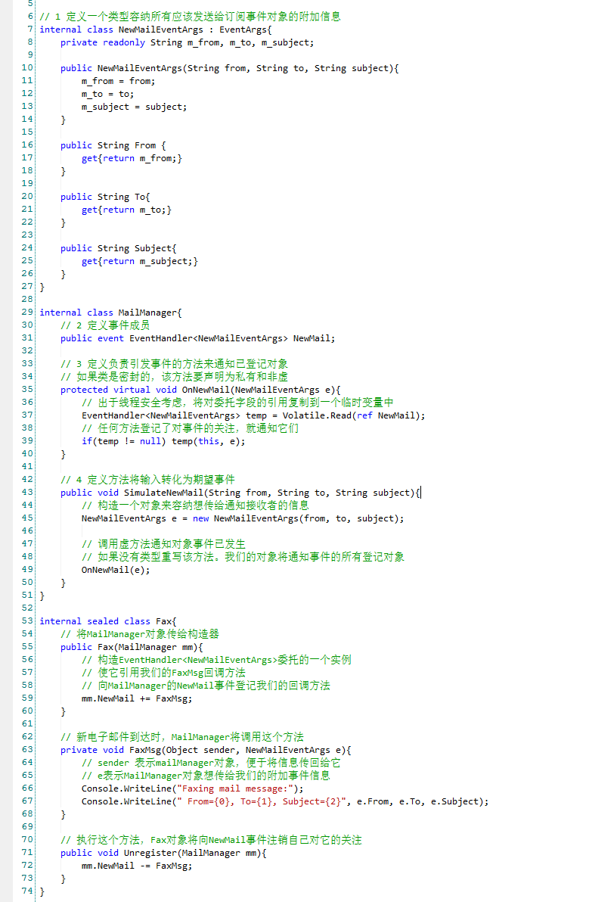

# 设计类型
## 1 类型基础 *
### 1.1 所有类型都从System.Object派生
```cs
class Employee{
    ...
}

class Employee : System.Object{
    ...
}

//上面这两种定义完全一致
```

System.Object公共方法：
- Equals 如果两个对象具有相同的值（引用相等），返回true
- GetHashCode 返回对象哈希码（int），引用相等
- ToString 返回类型完整名称 this.GetType().FullName
- GetType 

System.Object受保护方法（只能在该类自身或派生类中访问的方法）：
- MemberwiseClone 浅拷贝
- Finalize 垃圾回收器判断对象应该作为垃圾被回收之后，在对象内存被实际回收之前会调用这个虚方法

```cs
public class User{
  public User Copy(){
    return (User) this.MemberwiseClone();
  }
  public int Id{get;set;}
  public int sort{get;set;}
}
```

### 1.2 类型转换
CLR最重要的特性之一就是类型安全，GetType是非虚方法，所以一个类型不可能伪装成另一个类型。

CLR允许对象转换为它的实际类型或它的任何基类型。

`is` 操作符检查对象是否兼容于指定类型，永远不会抛出异常。
`as` 操作符将对象转换为指定类型，也是永远不会抛异常，转换失败输出的是null `Employee e = o as Employee`

### 1.3 命名空间和程序集
命名空间对相关的类型进行逻辑分组，开发人员可通过命名空间方便地定位类型。

如果编译器在源码或引用的任何程序集中找不到指定名称的类型，就会在类型名称附加`System.IO.前缀`检查是否匹配，找不到继续附加`System.Text.前缀`。

### 1.4 运行时的相互关系


## 2 基元类型、引用类型和值类型
### 2.1 基元类型
```cs
// 以下生成完全相同的IL

int a = 0;    // 最方便的语法
System.Int32 a = 0; // 方便的语法
int a = new int(); // 不方便的语法
System.Int32 a = new System.Int32(); // 最不方便的语法
```
对于某些常用数据类型，包括C#在内的许多编译器都允许使用方便的写法。编译器直接支持的数据类型成为基元类型，基元类型直接映射到FCL中存在的类型。例如C#的int直接映射到System.Int32类型。

从另一个角度讲，可认为C#编译器自动假定所有源代码文件都添加了using指令
```cs
using int = System.Int32;
```


```cs
Int32 i = 5; // 32位值
Int64 l = i; // 隐式转型为64位
```
Int32和Int64相互不存在派生关系，但是C#编译器却能正确编译上述代码，这是因为C#编译器非常熟悉基元类型，会在编译代码时应用自己的特殊规则。

只有在转换安全（不会发生数据丢失的情况）时，C#才允许隐式转型。

不同编译器可能生成不同代码来处理这些转型。

除了转型，基本类型还能写成字面值（literal），字面值可被看成是类型本身实例，所以可以像下面的例子：
```cs
Console.WriteLine(123.ToString() + 456.ToString());
```

如果表达式由字面值组成，编译器在编译时就能完成表达式求值，从而增强应用程序性能。

**checked和unchecked基元类型操作**
对基元类型执行的许多算术运算都可能造成溢出。不同语言处理溢出方式不同。CLR提供一些特殊的IL指令。

CLR有一个add指令，作用是两个值相加但不执行溢出检查。还有一个add.ovf指令，作用是两个值相加但发生溢出时抛出System.OverflowException异常。（类似的还有减乘除）

/checked+是C#编译器控制溢出的一个开关。

除了全局打开或关闭溢出检查，程序员可在特定区域控制溢出检查。


### 2.2 引用类型和值类型
CLR支持两种类型：
- 引用类型 new操作符返回对象内存地址
    - 内存必须从托管堆分配
    - 堆上分配的每个对象都有一些额外成员，这些成员必须初始化
    - 对象中的其他字节总是设为零
    - 从托管堆分配对象时，可能强制执行一次垃圾回收
- 值类型
    - 实例一般在线程栈上分配
    - 没有指针、垃圾回收、额外成员这些

看文档时，任何称为“类”的类型都是引用类型，称为“结构”（从System.ValueType派生）或“枚举”（从System.Enum派生）的是值类型。

不能在定义值类型时为它选择基类型，但值类型可实现一个或多个接口。
所有值类型都隐式密封，目的是防止值类型用作其他引用类型或值类型的基类型。

```cs
class SomeRef {
  public Int32 x;
}

struct SomeVal{
  public Int32 x;
}

static void ValueTypeDemo(){
  SomeRef r1 = new SomeRef(); // 堆上分配
  SomeVal v1 = new SomeVal(); // 栈上分配
  r1.x = 5; // 通过指针
  v1.x = 5; // 在栈上修改
  Console.WriteLine(r1.x); // 5
  Console.WriteLine(v1.x); // 5
  
  SomeRef r2 = r1;
  SomeVal v2 = v1;
  r1.x = 8;
  v1.x = 9;
  Console.WriteLine(r1.x); // 8
  Console.WriteLine(r2.x); // 8
  Console.WriteLine(v1.x); // 9
  Console.WriteLine(v2.x); // 5
}
```



### 2.3 值类型的装箱和拆箱


Add获取的是Object，而Point是值类型，所以需要将值类型转换成引用类型，这个叫做装箱。

装箱的步骤：
- 在托管堆中分配内存。分配的内存是值类型各字段需要的内存量，加上托管堆所有对象都有的两个成员（类型对象指针和同步块索引）所需的内存量
- 值类型的字段复制到新分配的堆内存
- 返回对象地址，值类型成了引用类型


```cs
Point p = (Point) a[0]; 
```
为完成上面的表达式，CLR先获取已装箱Point对象中各个Point字段地址，这个过程称为**拆箱**，然后将字段包含的值从堆复制到基于栈的值类型实例中。

拆箱代价比装箱低很多。

拆箱出来的类型只能是装箱时的类型，不然会报错InvalidCastException


正确做法是`Int16 y = (Int16)(Int32) o`

额外的装箱步骤会从托管堆中分配一个额外的对象，就来必须对其进行垃圾回收。

像writeLine会定义多个重载避免装箱，但是如果不存在与值类型对应的重载版本，调用的肯定是获取一个Object参数的重载版本。将值类型实例作为Object传递会造成装箱，从而对性能造成不利影响。定义自己的类时，可将类中的方法定义为泛型，这样方法就可以获取任何值类型而不必装箱。

由于未装箱值类型没有同步索引，所以不能使用System.Threading.Monitor类型的方法（或C# lock语句）让多个线程同步对实例的访问。

**使用接口更改已装箱值类型中的字段**
```cs
internal interface IChangeBoxedPoint{
  void Change(Int32 x, Int32 y);
}

internal struct Point : IChangeBoxedPoint{
  private Int32 m_x, m_y;
  public Point(Int32 x, Int32 y){
    m_x = x;
    m_y = y;
  }

  public void Change(Int32 x, Int32 y){
    m_x = x;
    m_y = t;
  }

  public override String ToString(){
    return String.Format("{0}, {1}", m_x.ToString, m_y.ToString)
  }
}

public sealed class Program{
  public static void Main(){
    Point p = new Point(1,1);

    Console.WriteLint(p); // 装箱 1,1

    p.Change(2,2);
    Console.WriteLint(p); // 装箱 2,2

    Object o = p; // 装箱
    Console.WriteLint(o); // 2,2

    ((Point) o).Change(3,3);//拆箱
    Console.WriteLint(o); // 2,2

    ((IChangeBoxedPoint) p).Change(4,4); // 装箱，更改的是已装箱的对象，然后垃圾回收了
    Console.WriteLint(p); // 2,2

    ((IChangeBoxedPoint) o).Change(5,5);
    Console.WriteLint(o);   // 5,5
  }
}
```

**对象相等性和同一性**
同一性：两个引用是否指向同一内存对象
相等性：两个对象内容或值相同

### 2.4 对象哈希码
FCL设计者认为，如果能将任何对象的任何实例放在哈希表集合中，会有很多好处，所以，System.Object提供虚方法GetHashCode，获取任意对象的Int32哈希码。

如果自定义类型重写Equals方法，就需要重新GetHashCode方法，否则编译会有警告信息。因为System.Collections.Hashtable类型、System.Collections.Generic.Dictionary类型以及其他一些集合实现中，要求两个对象必须具有相同哈希码才被视为相等。

千万不要对哈希码进行持久化，因为哈希码很容易改变。比如将密码调用GetHashCode生成的哈希码存入数据库，CLR升级版本后同样的密码调用GetHashCode可能会有不一样的哈希码。

### 2.5 dynamic 基元类型
运行中才能推断类型的情况。C#编译器允许将表达式的类型标记为dynamic，还可将表达式的结果放到变量中，并将变量标记为dynamic


dynamic其实就是Object，方法签名不能仅靠dynamic和Object的变化来区分。字段，方法参数或方法返回值的类型是dynamic，编译器会在元数据中，对字段、参数或返回类型应用System.Runtion.CompilerServices.DynamicAttribute的实例。

如果dynamic被指定为foreach语句中的集合，编译器会生成代码将表达式转型为System.IEnumberable接口。

如果dynamic被指定为using语句中的资源，编译器会生成代码将表达式转型为System.IDisposable接口。

String调用Contains方法：
```cs
Object target = "Jeffrey";
Object arg = "ff";

// 在目标上查找和希望的实参类型匹配的方法
Type[] argTypes = new Type[] { arg.GetType() };
MethodInfo method = target.GetType().GetMethod("Contains", argTypes);

// 在目标上调用方法，传递希望的实参
Object[] arguments = new Object[] { arg };
Boolean result = Convert.ToBoolean(method.Invoke(target, arguments));
Console.WriteLine(result);
```

C#内建的动态求值功能所产生的额外开销不容忽视，动态功能简化语法，但也需要看是否值得。加载所有的程序集以及额外的内存消耗会对想你能造成额外影响。然后程序中只是一两个地方需要动态行为，传统做法（调用反射）或进行手动类型转换（如果是COM对象）或许更高效。

## 3 类型和成员基础
### 3.1 类型的各种成员
类型可定义多个以下种类的成员：
- 常量
- 字段
- 实例构造器
- 类型构造器
- 方法
- 操作重载符
- 转换操作符
- 属性
- 事件
- 类型

<p style="color:gray">类是类型的子集</p>

```cs
public sealed class SomeType
{
	// 嵌套类
	private class SomeNestedType { }
	// 常量 只读字段 静态字段
	private const Int32 c_SomeConstant = 1;
	private readonly String m_SomeReadOnlyFiled = "2";
	private static Int32 s_SomeReadWriteFiled = 3;
	// 类型构造器
	static SomeType(){}
	// 实例构造器
	public SomeType(Int32 x) { }
	public SomeType() {}
	// 实例方法和静态方法
	private String InstanceMethod() { return null; }
	public static void Main() {}
	// 实例属性
	public Int32 SomeProp{
		get{return 0;}
		set{}
	}
	// 实例有参属性（索引器）
	public Int32 this[String s]{
		get { return 0; }
		set {}
	}
	// 实例事件
	public event EventHandler SomeEvent;
}
```

### 3.2 成员可访问性


C#不支持Family and Assembly的可访问性，因为开发团队认为这种可访问性基本没用。

C#编译器要求原始成员和重写成员具有相同可访问性，这是C#限制不是CLR，CLR允许放宽但不允许收紧成员的可访问性。

### 3.3 静态类
永远不需要实例化的类，如Console，Math，ThreadPool等。

C#编译器对静态类的限制：
- 必须直接从基类System.Object派生
- 静态类不能实现任何接口
- 静态类智能定义静态成员
- 静态类不能作为字段、方法参数或局部变量使用

用static定义类，将导致C#编译器将该类标记为abstract和sealed

### 3.4 分部类（partial）、结构和接口
用partial，编译器会合并代码，在最后的.exe或.dll程序集文件中生成单个类型。这完全由C#编译器实现，CLR对该功能一无所知，这解释一个类型的所有源代码文件为什么必须使用相同变成语言，且必须作为一个编译单元编译在一起。

### 3.5 组件、多态和版本控制
组件软件编程（CSP）将系统分解为松耦合、可重用的“组件”。比如JAVA的JAR包，.NET CORE的类库、Nuget包、DLL

组件在版本升级时尽量做到向后兼容、允许新功能扩展、控制哪些类或成员可以被继承/重写/隐藏，所以需要通过一些关键字控制继承、重写、隐藏的行为，从而达到更稳定、可控的API涉及。


```cs
public abstract class Animal {
    public abstract void Speak();        // 子类必须实现
    public virtual void Walk() {}        // 子类可以选择重写
    public void Sleep() {}               // 普通方法
}

public class Dog : Animal {
    public override void Speak() { }     // 实现抽象方法
    public override void Walk() { }      // 重写虚方法
    public new void Sleep() { }          // 隐藏父类方法（非重写！）
}
```

用C#编写一个方法，编译器会在程序集的方法定义表中写入一个记录项，用一组标志（flag）指明方法是实例方法、虚方法还是静态方法。

CLR提供两个方法调用指令：
- call
  - 该IL指令可调用静态方法、实例方法和虚方法
  - 调用静态方法必须指定方法的定义类型
  - 调用实例方法或虚方法必须指定引用了对象的变量，call假定该变量不为null
  - call指令经常用于以非虚方式调用虚方法（所以不会有多态行为）
- callvirt
  - 该IL指令可调用实例方法和虚方法
  - 调用实例方法或虚方法必须指定引用了对象的变量
  - 调用非虚实例方法，变量的类型指明了方法的定义类型
  - 调用虚实例方法，编译时JIT编译器会生成代码验证变量的值是不是nul，如果是会抛出一次。因为这种额外检查，callvirt指令执行速度比call稍慢


- console的writeLine是静态方法所以用call
- GetHashCode是虚方法所以用callvirt
- GetType不是虚方法但却用了callvirt，这是可行的，C#团队认为JIT编译器应生成代码验证发出调用的对象不为null

```cs
public static void Main(){
  Program p = null;
  Int32 x = p.GetType(); // C#中抛出NullReferenceException
}
```

上面代码理论无问题，call指令不会抛出异常，但用callvirt在运行时就会抛出异常

编译器有时用call而不是callvirt调用虚方法，像下面base.SayHello()的例子，如果用callvirt方式调用，因为是会实现多态的，比如当前对象时someClass,那么调用base.SayHello()相当于someClass.SayHello()所以会无限循环直到栈溢出。用call的话就不再走虚调用，直接调用的是父类的版本。


<hr>

**解释什么是以非虚方式调用虚方法：**

```cs
// 虚方法的正常调用
public class Base
{
    public virtual void SayHello() => Console.WriteLine("Hello from Base");
}

public class Derived : Base
{
    public override void SayHello() => Console.WriteLine("Hello from Derived");
}

Base b = new Derived();
b.SayHello();  // 输出：Hello from Derived（虚方法的多态行为）
```

非虚方式调用虚方法就是强行绕开这个机制，调用基类的实现，哪怕实际运行的是子类。

C# 本身语法不允许你直接调用基类版本的虚方法，但可以通过反射或委托来做到这一点

方法1 用 base. 在子类中调用（合法用法，但仅限于类内部）：
```cs
public class Derived : Base
{
    public override void SayHello()
    {
        base.SayHello(); // ← 非虚方式调用
    }
}
```

方法2 用反射或委托调用（危险用法，仅用于底层框架或调试）
- 通过构造一个方法指针直接绑定到基类方法地址，不再走虚函数表（vtable）


<hr>


设计类型时基类减少虚方法的数量：
- 调用虚方法的速度比调用非虚方法慢
- JIT编译器不能内嵌（Inlining）虚方法，影响性能
- 虚方法使组件版本控制变得更脆弱
- 定义基类型时，经常要提供一组重载的简便方法，如果希望这些方法是多态的，最好的方法就是使复杂的方法称为虚方法，使所有重载的简便方法成为非虚方法

```cs
public class Logger
{
    // 简便重载方法
    public void Log(string message) => Log(message, LogLevel.Info);
    public void Log(string message, Exception ex) => Log($"{message}: {ex.Message}", LogLevel.Error);

    // 核心虚方法（复杂版本）
    public virtual void Log(string message, LogLevel level)
    {
        Console.WriteLine($"[{level}] {message}");
    }
}

// 简便方法（非虚）只是组装好参数,实际干活的是那个“复杂版本的虚方法”
// 避免多个重载都被子类分别 override，导致混乱和重复逻辑
// 子类只需要覆盖复杂核心方法，就能让所有重载都自动拥有多态行为！
```


**对类型进行版本控制时的虚方法的处理**

```cs
namespace CompanyA{
  public class Phone{
    pubilc void Dial(){
      Console.WriteLine("Phone.Dial")
    }
  }
}

public class BetterPhone : CompanyA.Phone{
  public void Dial(){
    Console.WriteLine("BetterPhone.Dial")
    base.Dial();
  }
}
```
上面编译时会有警告


处理方法是增加new关键字：
```cs
public class BetterPhone : CompanyA.Phone{
  public new void Dial(){ // 添加new关键字，新的Dial方法变得与Phone的Dial方法无关了
    Console.WriteLine("BetterPhone.Dial")
    base.Dial();
  }
}
```

关键字new告诉编译器生成元数据，让CLR知道BetterPhone类型的方法被视为由BetterPhone类型引入的新函数，这样CLR就知道Phone和BetterPhone这两个类中的方法无任何关系。

如果编译器像原生C++编译器那样默认将方法视为重写，BetterPhone的开发者就不能使用Dial方法名了。


如果BetterPhone和Phone的方法要相关，那么BetterPhone重写方法要添加override。


## 4 常量和字段
### 4.1 常量
常量是值从不变化的符号，编译器将值嵌入生成的IL代码中，所以在运行时不需要任何内存。
C#不允许为常量指定static关键字，因为常量总是隐式为static

常量在生成了应用程序程序集后，运行时根本不会加载DLL程序集，因为常量编译时就替换了，所以运行时就不依赖DLL程序集。

如果开发人员更改常量值，并且只是重新生成DLL程序集，那么应用程序程序集不受任何影响，应用程序要得新值，必须重新编译。
<hr>
应用程序重新生成DLL程序集和重新编译是什么关系:
- 重新编译是指完全重新编译整个项目或解决方案，包括所有源代码文件（无论是否修改过）
- 重新生成DLL通常指重新生成动态链接库文件（.dll），可能是通过重新编译或增量编译实现的


<hr>

### 4.2 字段
字段是一种数据成员，其中容纳了一个值类型的实例或者对一个引用类型的引用。

CLR支持类型（静态）字段和实例（非静态）字段：
- 类型字段
  - 容纳字段数据所需的动态内存是在类型对象中分配的，而类型对象时在类型加载到一个AppDomain时创建的（通常是在引用了该类型的任何方法首次进行JIT编译的时候）
- 实例字段
  - 容纳字段数据所需的动态内存是在构造类型的实例时分配的
  - 字段存储在动态内存中，所以它们的值在运行时才能获取
  - 解决了常量存在的版本控制问题

当某个字段是引用类型，并且该字段被标记为readonly时，不可改变的是引用，而非字段引用的对象。

## 5 方法
### 5.1 实例构造器和类（引用类型 class）
构造器是将类型的实例初始化的特殊方法

如果类的修饰符是abstract，，那么编译器生成的默认构造器可访问性是protected，如果类的修饰符为static（sealed和abstract）编译器不会在类的定义中生成默认构造器

少数时候可以在不调用实例的前提下创建类型的实例，例外是Object的MemberwiseClone方法，运行时序列化器反序列化对像时

```cs
internal sealed class SomeType{
  private Int32 m_x = 5;
  private String m_s="hello";

  public SomeType(){}
  public SomeType(Int32 x) {...}
  ...
}
```
每个构造器方法开始位置都会包含上面初始化的字段，所以需要注意代码的膨胀效应。按平时写代码那种先声明字段，在构造器里面给字段赋值的方式可以避免膨胀效应，减少生成的代码。

### 5.2 实例构造器和结构（值类型 struct）
这里书里对于值类型的描述与现在版本的C#有很大出入，所以不做参考。

### 5.3 类型构造器
类型构造器可用于接口（C#编译器不允许）、引用类型和值类型（永远不要用，因为CLR有时不会调用值类型的静态类型构造器）

实例构造器作用是设置类型的实例的初始状态，类型构造器作用是设置类型的初始状态。

类型构造器是 `.cctor`

```cs
internal sealed class SomeRefType{
  static SomeRefType(){
    // 类型构造器，SomeRefType被首次访问时，执行这里的代码
  }

  public SomeRefType(){
    // 实例构造器，new实例时执行这里的代码
  }
}
```

类型构造器总是私有的，类型构造器的调用比较麻烦：
- JIT编译器编译一个方法时，查看代码中引用哪些类型
- 任何一个类型定义了类型构造器，JIT检查针对当前AppDomain，是否已执行这个类型构造器
- 未执行时，JIT在它生成的本机代码中添加对类型构造器的调用，执行了就不再调用
- 在多线程下，为保证只调用一次，使用了互斥线程同步锁

类型构造器中的代码只能访问类型的静态字段，并且它的常规用途就是初始化这些字段。

```cs
internal sealed class SomeType{
  private static int x = 5;
}

// 初始化静态字段
internal sealed class SomeType{
  private static int x;
  static SomeType(){
  x = 5;
  }
}
```


### 5.4 操作符重载方法
CLR规范要求操作符重载方法必须是public和static方法。C#要求操作符重载方法至少有一个参数的类型与当前定义这个方法的当前类型相同。（如果你在一个 class Vector 里定义 operator +，那么 Vector 就是这个操作符的 “当前类型”）

编译器为名为op_Addition的方法生成元数据方法定义项，这个方法定义项还设置了specialname标志，表明这是一个特殊方法。编程语言的编译器看到源代码中出现一个+操作符时，会检查是否有一个操作符的类型定义了名为op_Addition的specialname方法。


当在 C# 中重载 + 运算符时，编译器会生成一个 CLR 方法，名字固定为 op_Addition（而不是 +），这个方法会被编译成 IL，并在元数据（metadata）中存储。

### 5.5 转换操作符方法
就是从一个类型转换成另外一个类型（byte转换成int），类型都是基元数据时，编译器知道怎么去转换，否则编译器会生成代码，要求CLR执行转换（强制转型）

以Rational为例（C#并没有内置Rational这个类型，需要自己定义）
```cs

```

转换操作符是将对象从一种类型转换成另外一种类型的方法，有些变成语言会提供转换操作符重载。
- 重载方法必须是public和static方法
- 参数类型和返回类型二者必有其一与定义转换方法的类型相同




### 5.6 扩展方法
```cs
public static class StringBufferExtensions{
  public static Int32 IndexOf(this StringBuffer sb, Char value){
    for(Int32 index = 0; index < sb.length; index ++){
      if(sb[index] == value) return index;
    }
    return -1;
  }
}
```

就是调用静态类的静态方法，多一个this用于编译器生成相应的IL代码来调用这个静态方法，主要是为了方便直观的使用静态方法。

扩展方法实际是对一个静态方法的调用，所以CLR不会生成代码对调用方法的表达式的值进行null检查。
```cs
StringBuffer sb = null;
sb.IndexOf("C");//这是错误的，但是编译时是通过的
```

在C#中，一旦用this关键字标记了某个静态方法的第一个参数，编译器会在内部向该方法应用一个定制特性，这个特性会在最终生成的文件的元数据中持久性地存储下来。该特性在System.Core.dll程序集中定义。

### 5.7 分部方法
场景：想定制类的行为，必须从基类派生并定义自己的类，通过重写虚方法来实现自己想要的行为


问题：
- 类型必须是非密封的类（sealed修饰，不能被继承）
- 定义一个类型只是为了重写一个方法，会浪费少量系统资源
- 即使不想重写OnNameChanging方法，基类代码仍然会调用一个什么也不做、直接返回的虚方法
- 无论OnNameChanging是否访问实参，编译器都会生成对ToUpper进行调用的IL代码

解决方法：用分部方法 partial


- 可用于密封类，静态类
- 对应上面问题第3、4点，如果没有实现分部方法，编译器不会生成任何代表分部方法的元数据，即没有实现下面第二个`internal partial class Base`那么最终编译器生成的代码等同于：


分部方法规则：
- 只能在分部类或结构（struct）中声明
- 分部方法的返回类型始终是void，任何参数都不能用out修饰符标记
- 分部方法的声明和实现必须具有完全一致的签名
- 如果没有对应的实现部分，不能在代码中创建一个委托来引用这个分部方法
  ```c
    partial class MyClass
    {
        partial void MyPartialMethod(string message); // 仅声明，未实现

        public void Test()
        {
            // 尝试创建委托（编译错误！）
            Action<string> action = MyPartialMethod; // 错误 CS0762: 无法为未实现的分部方法创建委托
        }
    }
  ```
- 分部方法总是被视为private方法，C#禁用在分部方法声明之前添加private关键字


## 6 参数
不要混淆dynamic和var
- var 声明局部变量只是一种简化语法，要求编译器根据表达式推断具体数据类型，只能声明方法内部局部变量
- dynamic适用于局部变量、字段和参数
- 表达式不能转型为var，但能转型为dynamic
- 必须显示初始化用var声明的变量，无需初始化用dynamic声明的变量

C#用关键字out或ref告诉编译器生成元数据来指明该参数是传引用的。编译器将生成代码来传递参数的地址而非参数本身。
CLR不区分out和ref，无论用哪个关键字都会生成相同的IL代码。

但是C#是区分out和ref的：
- 如果方法参数用out，表明不指望调用者在调用方法之前初始化好对象，被调用的方法不能读取参数的值，并且在返回前必须向这个值写入
- 如果方法参数用ref，调用者必须在调用该方法前初始化参数的值，被调用的方法可以读取值以及向值写入

从IL和CLR角度看，out和ref是一样的，但从编译器角度看是区别于什么时候初始化数据的。

CLR允许根据使用的是out还是ref参数对方法进行重载，以下代码在C#中是合法的：
```cs
public sealed class Point{
  static void Add(Point p){}
  static void Add(ref Point p){}
}
```

对于以传引用的方式ref传给方法的变量，它的类型必须与方法签名中声明的类型相同。也就是说声明的参数是ref Object，那么ref String就不能作为实参，即使String是继承了Object。

向方法传递可变数量的参数：
```cs
static Int32 Add(params Int32[] values){}

Add(2,3,4,5);
```

只有方法最后一个参数才可以用params关键字，这个参数只能标识一维数组，可为这个参数传递null值或传递对包含零个元素的一个数组的引用。如果要获取任意类型的，用Object[]类型就可以了。

调用参数数量可变的方法对性能是有所影响的，要减少对性能的影响，可考虑定义几个没有使用params关键字的重载版本。


参数和返回类型的设计规范：
- 声明方法的参数类型时，尽量指定最弱的类型，宁愿要接口也不要基类
- 最好将方法的返回类型声明为最强的类型，防止所限于特定类型

CLR不提供常量性，即无法做到将方法或参数声明为常量，从而禁止实例方法中的代码更改对象的任何字段。

## 7 属性
属性本质上就是方法，也可以看做是智能字段。相当于一个private字段，然后自己定义公开的setXXX和getXXX方法。

属性唯一好处是提供简化的语法，和调用普通方法相比属性不仅不会提升代码性能，还会妨碍对代码的理解。

get访问器不接受参数，称为无参属性。编程语言还支持有参属性，get访问器方法接受一个或多个参数，set访问器方法接受两个或多个参数。C#称有参属性为索引器。


CLR本身不区分有参属性和无参属性。对CLR来说，每个属性都只是类型中定义的一对方法和一些元数据。

对于简单的get和set访问器方法，JIT编译器会将代码内联，这样使用属性就没有性能上的损失。内联指将方法的代码直接编译到调用它的方法中，避免在运行时发出调用所产生的开销，代价是编译好的方法变得很大。不过属性访问器方法包含的代码一般很少，所以对内联会使生成的本机代码变得更小，执行更快。（JIT调试代码时不会用内联，因为内联代码会变得难以调试）

可以有不同的访问性，不过不能大于属性本身的声明
```cs
public class SomeType{
  private String m_name;
  public String Name{
    get{return m_name;}
    protected set {m_name = value}
  }
}
```

## 8 事件
类型之所以能提供事件通知功能，是因为类型维护了一个已登记方法的列表，事件发生后，类型将通知列表中所有已登记的方法。

CLR事件模型以委托为基础，委托是调用回调方法的一种类型安全方式，对象拼接回调方法接收它们订阅的通知。

更加通俗的理解：事件是一种特殊的委托类型，用于实现发布-订阅机制。当对象订阅某个事件时，它会将一个回调方法（委托）注册到该事件。当事件被触发时，系统会依次调用所有已注册的回调方法，从而实现响应机制。

### 8.1 设计要公开事件的类型

1、定义类型容纳所有需要发送给事件通知接收者的附加信息
引发事件的对象可能希望向订阅的对象传递一些附加信息。
根据约定，这种类应该从System.EventArgs派生，类名以EventArgs结束

```cs

// 1 定义一个类型容纳所有应该发送给订阅事件对象的附加信息
internal class NewMailEventArgs : EventArgs{
    private readonly String m_from, m_to, m_subject;
    
    public NewMailEventArgs(String from, String to, String subject){
        m_from = from;
        m_to = to;
        m_subject = subject;
    }
    
    public String From {
        get{return m_from;}
    }
    
    public String To{
        get{return m_to;}
    }
    
    public String Subject{
        get{return m_subject;}
    }
}
```
如何不需要附加信息，直接使用EventArgs.Empty就可以了，不用构造新的对象。


2、定义事件成员
事件成员用C#关键字event定义。每个事件成员都要指定以下内容：
- 可访问型标识符 (punlic)
- 委托类型，指出要调用方法的原型 (EventHandler<\NewMailEventArgs> )
- 名称 (NewMail)

```cs
internal class MailManager{
    // 2 定义事件成员
    public event EventHandler<NewMailEventArgs> NewMail;
}
```

3、定义负责引发事件的方法来通知事件的登记对象
```cs
internal class MailManager{
    // 2 定义事件成员
    public event EventHandler<NewMailEventArgs> NewMail;
    
    // 3 定义负责引发事件的方法来通知已登记对象
    // 如果类是密封的，该方法要声明为私有和非虚
    protected virtual void OnNewMail(NewMailEventArgs e){
        // 出于线程安全考虑，将对委托字段的引用复制到一个临时变量中
        EventHandler<NewMailEventArgs> temp = Volatile.Read(ref NewMail);
        // 任何方法登记了对事件的关注，就通知它们
        if(temp != null) temp(this, e);
    }
    
}
```

以下是EventHandler方法的原型，所以后面订阅的对象写的回调也需要时这个样子
```cs
public delegate void EventHandler<TEventArgs>(object sender, TEventArgs e)
    where TEventArgs : EventArgs;
```

4、定义方法将输入转化为期望事件
```cs
internal class MailManager{
    // 4 定义方法将输入转化为期望事件
    public void SimulateNewMail(String from, String to, String subject){
        // 构造一个对象来容纳想传给通知接收者的信息
        NewMailEventArgs e = new NewMailEventArgs(from, to, subject);
        
        // 调用虚方法通知对象事件已发生
        // 如果没有类型重写该方法。我们的对象将通知事件的所有登记对象
        OnNewMail(e);
    }
}
```

### 8.2 编译器如何实现事件
对于代码定义事件成员：`public event EventHandler<NewMailEventArgs> NewMail;`
C#编译器会转化成3个构造：
- 一个被初始化为null的私有委托字段：`private EventHandler<NewMailEventArgs> NewMail = null`
- 一个公共add_xxx方法，允许方法登记对事件的关注
- 一个公共remove_xxx方法，允许方法注销对事件的关注

除了生成上述3个构造，编译器还会在托管程序集的元数据中生成一个事件定义记录项，这个记录项包含了一些标志和基础委托类型，还引用了add和remove访问器方法

### 8.3 设计侦听事件的类型
如何定义一个类型使用另一个类型提供的事件
```cs
internal sealed class Fax{
    // 将MailManager对象传给构造器
    public Fax(MailManager mm){
        // 构造EventHandler<NewMailEventArgs>委托的一个实例
        // 使它引用我们的FaxMsg回调方法
        // 向MailManager的NewMail事件登记我们的回调方法
        mm.NewMail += FaxMsg;
    }
    
    // 新电子邮件到达时，MailManager将调用这个方法
    private void FaxMsg(Object sender, NewMailEventArgs e){
        // sender 表示mailManager对象，便于将信息传回给它
        // e表示MailManager对象想传给我们的附加事件信息
        Console.WriteLine("Faxing mail message:");
        Console.WriteLine(" From={0}, To={1}, Subject={2}", e.From, e.To, e.Subject);
    }
    
    // 执行这个方法，Fax对象将向NewMail事件注销自己对它的关注
    public void Unregister(MailManager mm){
        mm.NewMail -= FaxMsg;
    }
}
```




## 12 泛型
泛型是CLR和编程语言提供的一种“算法重用”

比如开发成员并不设定某个算法要操作什么数据类型，该算法可以应用于不同类型的对象。

泛型参数变量要么称为T，要么至少以大写T开头（TKey，TValue...）

```cs
//System.Collections.Generic中定义的
[Serializable]
public class List<T> : IList<T>, ICollection<T>, IEnumerable<T>, IList, ICollection, IEnumerable{
  ...
}
```

优势：
- 源代码保护
- 类型安全
- 更清晰的代码
- 更佳的性能
  - 不需要类型转换，所以不需要装箱

使用泛型类型或方法时指定的具体数据类型称为类型实参

### 12.2 泛型基础结构
#### 12.2.1 开放类型和封闭类型
```cs
public class MyClass<T>
{
    public T Value { get; set; }
}

var obj = new MyClass<>();  // MyClass<>是开放类型，错误，不能创建为对象

var obj = new MyClass<int>(); // MyClass<int> 是封闭类型  
```

#### 12.2.3 泛型类型同一性
因为源码中有大量\<>, 开发人员可能会定义下面类以减少\<>的书写：
```cs
internal sealed class DateTimeList : List<DateTime>{}
```

但是这样写有个问题`var sameType = (typeof(List<DateTime>)) == typeof(DateTimeList))` 得到的sameType是false，因为不是同一个类型，这样就会丧失类型同一性和相等性

C#允许用简化语法同时不会影响类型相等性，要求在源文件顶部使用传统using指令：
```cs
using DateTimeList = System.Collections.Generic.List<System.DateTime>;
```

### 12.3 泛型接口
没有泛型接口，每次用非泛型接口（如IComparable）来操纵值类型都会发生装箱，而且会失去编译时的类型安全性。

以下是非泛型接口，只能接受引用类型参数
```cs
public interface IComparable
{
    int CompareTo(object obj);
}
```
当值类型作为 object 传入时，就会装箱
```cs
int a = 5;
int b = 10;
IComparable c = a;       // 装箱：int -> object
int result = c.CompareTo(b); // b 也要装箱成 object
```
失去类型安全
```cs
// 因为参数是 object，没有编译期约束
int x = 5;
IComparable c = x;
c.CompareTo("hello"); // 编译可以过，运行时才抛异常！
```

下面例子解释为什么泛型接口能解决?
```cs
public interface IComparable<T>
{
    int CompareTo(T other);
}
```

```cs
// 参数 T 是 int，不用转换成 object，所以不装箱。
int a = 5;
IComparable<int> c = a;     // 不需要装箱
int result = c.CompareTo(10); // 没有装箱，编译期保证是 int
```

### 12.4 泛型委托
泛型委托保证任何类型的对象都能以类型安全的方式传给回调方法，允许值类型实例在传给回调方法时不进行任何装箱。

### 12.5 委托和接口的逆变和协变泛型类型实参
泛型类型参数可以是以下任何一种形式：
- 不变量：泛型类型参数不能更改
- 逆变量：泛型类型参数可以从一个类更改为它的某个派生类，C#是用in关键字标记逆变量形式的泛型类型参数
- 协变量：泛型类型参数可以从一个类更改为它的某个基类，C#用哪个out关键字标记协变量形式的泛型类型参数

用以下委托定义
```cs
public delegate TResult Func<int T, out TResult>(T arg);
```
如果有以下定义
```cs
Func<Object, ArgumentException> fn2 = null;
```
那么可以转型为另外一个泛型类型参数不同的Func类型
```cs
Func<String, Exception> fn2 = fn1; // 不需要显示转型
Exception e = fn2("");
```


方法可以不跟类用一样的泛型。

### 12.8 可验证性和约束

约束, T必须实现同类型（T）的泛型IComparable接口：
```cs
public static T min<T>(T o1, T o2) where T : IComparable<T>{
  if(o1.CompareTo(o2) < 0>) return o1;
  return o2;
}
```
如果没有上面Where约束，是编译不通过的，因为CompareTo不是什么类型都有的，所以编译器无法判断是否正确。

主要约束：类型参数可以指定零个或一个主要约束，主要约束可以代表非密封类的一个引用类型。不能指定以下特殊类型：System.Object，System.Array, System.Delegate, System.MulticastDelegate, System.ValueType, System.Enum, System.Void

```cs
internal sealed class PrimaryConstraintOfStream<T> where T : Stream{
  public void M(T stream){
    stream.Close();// 正确
  }
}
```

两个特殊约束：class（引用类型）、struct（值类型）

次要约束：类型参数可以指定零个或多个次要约束，次要约束代表接口类型。这种类型向编译器承诺类型实参实现了接口。
```cs
// 主要约束 + 次要约束
public class Repository<T> where T : EntityBase, IAuditable, new()
{
    // T必须是EntityBase或其派生类（主要约束）
    // 必须实现IAuditable接口（次要约束）
    // 必须有公共无参构造函数（次要约束）
}

// 另一个例子
public T Create<T>() where T : class, new()
{
    // T必须是引用类型（主要约束）
    // 必须有公共无参构造函数（次要约束）
    return new T();
}
```

构造器约束：类型参数可以指定零个或一个构造器约束（例子看上面的new()）

只需要记住一点，只要编译器无法确定是否所有可能类型都满足该操作的情况下，都是不被允许的。


## 13 接口
CLR不支持多继承，只提供了通过接口提供的“缩水版”多继承（就是方法需要自己实现）。

### 13.3 继承接口
CLR要求将接口方法标记为virtual。
不将方法显示标记为virtual，编译器会将它们标记为virtual和sealed，这会阻止派生类重写接口方法。
将方法显示标记为virtual，编译器会将该方法标记为virtual，使派生类能重写它。

### 13.5 隐式和显示接口方法实现
```cs
// 隐式实现（既是公共方法，也是接口实现）
internal sealed class SimpleType:IDisposable{
  public void Dispose(){
    Console.WriteLine("Dispose");
  }
}

public sealed class Program{
  public static void Main(){
    SimpleType st = new SimpleType();

    // 调用的是SimpleType实现的Dispose方法
    st.Dispose();

    // 调用的是IDisposable实现的Dispose方法
    IDisposable d = st;
    d.Dispose();
  }
}
```
因为C#要求公共Dispose方法同时是IDisposable的Dispose方法实现，所以会执行相同代码。

```cs
public class SimpleType : IDisposable
{
    // 显式实现 IDisposable.Dispose
    void IDisposable.Dispose()
    {
        Console.WriteLine("IDisposable.Dispose() called");
    }

    // 类自身的 Dispose 方法（不是接口实现）
    public void Dispose()
    {
        Console.WriteLine("SimpleType.Dispose() called");
    }
}
```
这样的话调用的方法就是不同的

### 13.8 实现多个具有相同方法名和签名的接口
```cs
public interface IWindow{
  Object GetMenu();
}

public interface IRestaurant{
  Object GetMenu();
}

public sealed class MarioPizzeria : IWindow, IRestaurant{
  // 这种叫做EIMI（显示接口方法）
  // IWindow 的GetMenu方法实现
  // 建议少用EIMI
  Object IWindow.GetMenu(){}

  // IRestaurant 的GetMenu方法实现
  Object IRestaurant.GetMenu(){}

  // 可选，与接口无关
  Object GetMenu(){}
}
```

