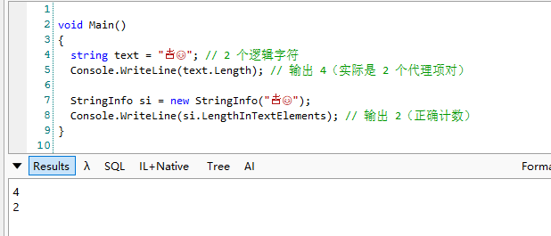
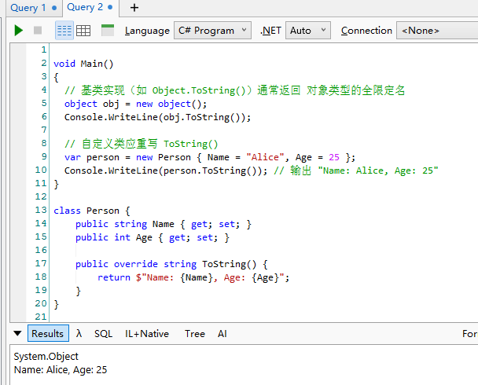
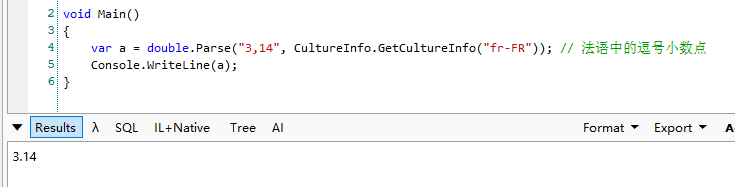
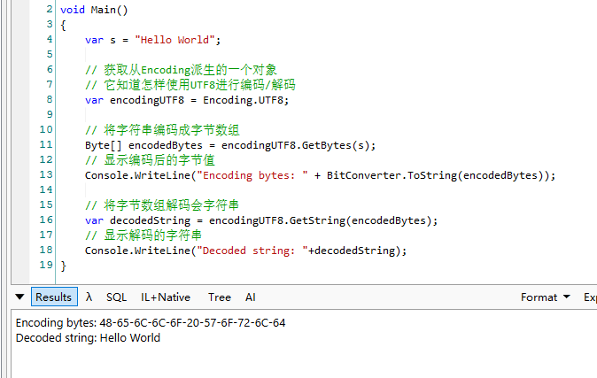
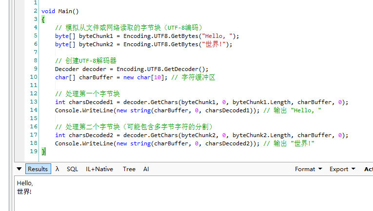
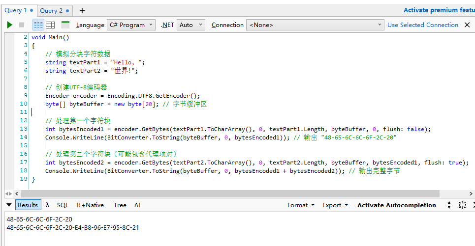

# 基本类型
## 字符、字符串、文本处理
### 14.1 字符 Char
字符总是表示成16位Unicode代码值，每个字符都是System.Char结构（一个值类型）的实例。

Char类型提供几个静态方法：IsDigit, IsLtter, IsUpper等

可以使用三种技术实现各种数值类型与Char实例的相互转换：
- 转型（强类型转型）
  - 效率最高
  - (Char) 1   (Int32) '1'
- Convert类型
  - Convert.ToChar(65)
- IConvertible接口
  - 效率最差，在值类型上调用接口方法要求对实例进行转箱，而Char和所有数值类型都是值类型
  - ((IConvertible) 65).ToChar(1000)

### 14.2 System.String
一个String代表一个不可变的顺序字符集，String直接派生自Object，是引用类型。所以String对象总是存在于堆上，永远不会跑到线程栈上。

#### 14.2.1 构造字符串

许多语言都将String视为基元类型，也就是说编译器允许在源代码中直接使用字面值（literal）字符串。

<hr>

字面值字符串(Literal String)：指直接在代码中书写、用引号括起来的字符串值，例如：

```cs
var a = "Hello World"
```

底层实现：
- 编译器会在二进制文件中创建一个字符串常量表
- 相同内容的字面值字符串可能被合并存储
- 程序运行时这些字符串通常位于只读内存段

对比其他类型，字符串字面值的使用特别方便，因为：
- 数字字面值（如 123）虽然也直接使用，但不需要特殊存储管理
- 其他复杂对象通常需要通过构造函数显式创建

<hr>

1、
```cs
// 包含回车符和换行符的字符串
String s = "Hi \r\nthere.";
```

上面代码虽然在字符串中硬编码了回车符和换行符，但一般不建议这样做。System.Environment类型定义了只读NewLine属性，NewLine堆平台敏感，会工具底层平台返回恰当的字符串，使得代码可以在任何平台上正确工作

```cs
String s = "Hi" + Envirinment.NewLine + "there.";
```

2、

运行时连接不要使用+操作符，因为这样会在堆上创建多个字符串对象，而堆事需要垃圾回收的，对性能有影响。相反，应该使用System.Text.StringBuilder类型。

使用 + 拼接字符串的性能影响：
```cs
string result = "";
for (int i = 0; i < 1000; i++)
{
    result += i.ToString(); // 每次循环都会创建一个新字符串！
}
```

在 C#（或 Java）中，字符串（string）是 不可变（immutable） 的，这意味着：
- 每次使用 + 拼接字符串时，都会在 堆（Heap） 上创建一个新的字符串对象。
- 旧的字符串对象会变成垃圾，需要 垃圾回收器（GC） 清理。

解决方案：使用 StringBuilder
- 它在内部维护一个 可变的字符缓冲区（buffer），避免频繁分配新对象
- 只有在最终调用 .ToString() 时，才会生成最终的字符串

```cs
var sb = new System.Text.StringBuilder();
for (int i = 0; i < 1000; i++)
{
    sb.Append(i.ToString()); // 不会创建新字符串，仅修改缓冲区
}
string result = sb.ToString(); // 最终只生成一个字符串
```

像这种少量明确的拼接：
```cs
String s = "Hi" + " " + "there.";
```
不会在运行时涉及堆内存分配，因为编译器会进行优化，直接合并为一个完整的字符串常量。在编译的时候已经形成字面量将"Hi there"放在模块的元数据中了。

3、
C#提供特殊字符串声明'@',用这种方式，引号之间所有字符串都被视为字符串的一部分，这种特殊声明称为“逐字字符串”。
```cs
// 指定应用程序路径
String file = "C:\\Window\\System32";

// 使用逐字祖父穿指定应用程序路径
String file = @"C:\Window\System32";
```

#### 14.2.2 字符串是不可变的
因为不可变性，如果执行大量字符串操作，会在堆上创建大量String对象，造成频繁的垃圾回收，从而影响应用程序性能。要高效执行大量字符串，建议使用StringBuilder类。 看上面的例子。

字符串不可变性意味着在操作或访问字符串时不会发生线程同步问题。

#### 14.2.3 比较字符串
在编程中，字符串比较不仅仅是简单的逐字符对比（如 == 或 strcmp），因为不同语言、文化（Culture）对字符的排序、大小写、重音符号（如 é vs e）等有不同的规则。

“以语言文化正确的方式比较字符串” 指的是：
- 遵循特定语言/地区的排序规则（如英语、法语、中文等）。
- 正确处理大小写、重音、连字符等特殊字符。
- 避免因文化差异导致的错误比较（如土耳其的 i/İ 问题）。

```cs
using System.Globalization;

string s1 = "café";
string s2 = "cafe\u0301";

// 文化敏感的比较（适用于排序、显示）
bool equal1 = s1.Equals(s2, StringComparison.CurrentCulture); // True（考虑语言规则）
bool equal2 = string.Equals(s1, s2, StringComparison.InvariantCulture); // True（非语言特定，但标准化）

// 忽略大小写的文化敏感比较
bool ignoreCase = s1.Equals("CAFÉ", StringComparison.CurrentCultureIgnoreCase); // True
```

用到了再查。只需要知道有这种区分就行。

#### 14.2.4 字符串留用
核心思想：相同值的字符串只保存一份，所有引用共享该副本，利用的是哈希表，命中就返回引用

String方法提供两个方法访问内部哈希表：
- Intern
  - 命中返回引用，不命中添加进哈希表
  - 垃圾回收器不能释放内部哈希表引用的字符串，因为哈希表正在容纳对它们的引用
- IsInterned
  - 命中返回引用，不命中返回null，不添加


```cs
void Main()
{
    var s1 = "Hello";
    var s2 = "Hello";
    Console.WriteLine(Object.ReferenceEquals(s1, s2)); // CLR4.5前是false，4.5后是true，自动留用了
    
    s1 = String.Intern(s1);
    s2 = String.Intern(s1);
    Console.WriteLine(Object.ReferenceEquals(s1, s2)); // true
}
```

#### 14.2.6 检查字符串中的字符和文本元素
Unicode 最初设计时用 16 位（2 字节）表示一个字符（共 65,536 个码位），但后来发现不够用，于是扩展了 辅助平面（Supplementary Planes），范围是 U+10000 到 U+10FFFF。这些字符无法用单个 char 表示，必须用 两个 char（即代理项对） 组合表示。

代理项对的组成
- 高代理项（High Surrogate）：U+D800 到 U+DBFF
- 低代理项（Low Surrogate）：U+DC00 到 U+DFFF
- 两者组合表示一个辅助平面字符（如 Emoji、生僻汉字等）

为了正确处理文本元素，应当使用System.Globalization.StringInfo类型



### 14.3 高效率构造字符串
上面也提到，FCL提供System.Text.StringBuilder类型对字符串和字符进行高效动态处理，返回处理好的String对象。

逻辑上StringBuilder对象包含一个字段，该字段引用Char结构构成的数组。利用StringBuilder的各个成员操作该字符数组。如果字符串变大，超过事先分配的字符数组大小，StringBuilder会自动分配一个新的，更大的数组，复制字符，并开始使用新数组。前一个数组被垃圾回收。

### 14.3 获取对象的字符串表示：ToString



#### 14.3.1 指定具体的格式和语言文化
为了对字符串格式进行更多的控制，重写ToString方法应该允许指定具体的格式和语言文化信息。
为了使调用者能选择格式和语言文化，类型应该实现System.IFormattable接口
```cs
public interface IFormattable{
  String ToString(String format, IFormatProvider formatProvider);
}
```

- format:告诉方法如何格式化
- formatProvider:实现了System.IFormatProvider接口的一个类型实例，为ToString方法提供具体的语言文化信息

```cs
public interface IFormatProvider{
  Object GetFormat(Type formatType);
}
```
格式化数字时，ToString方法检查为formatProvider参数传递的值，如果传递null，读取System.Globalization.CultureInfo.CurrentCulture属性判断与调用线程关联的语言文化。

IFormatProvider接口基本思路：当一个类型实现了该接口，就认为该类型的实例能提供对语言文化敏感的格式信息，与调用线程关联的语言文化应被忽略。

FCL的类型只有少数实例了IFormatProvider接口。System.Globalization.CultureInfo类型就是其中之一。

```cs
void Main()
{
    Console.WriteLine("指定格式");
    var temp = new Temperature { Celsius = 25 };
    // 默认格式（调用 ToString()）
    Console.WriteLine(temp); // 输出 "25.0 °C"
    // 指定格式
    Console.WriteLine(temp.ToString("C", null)); // "25.0 °C"
    Console.WriteLine(temp.ToString("F", null)); // "77.0 °F"
    
    Console.WriteLine("指定语言文化");
    
    // 使用美国文化（小数点用 "."，千位分隔符用 ","）
    var usCulture = CultureInfo.GetCultureInfo("en-US");
    Console.WriteLine(temp.ToString("C", usCulture)); // "25.0 °C"

    // 使用德国文化（小数点用 ","，千位分隔符用 "."）
    var deCulture = CultureInfo.GetCultureInfo("de-DE");
    Console.WriteLine(temp.ToString("C", deCulture)); // "25,0 °C"
    
    Console.WriteLine("结合字符串格式化");
    Console.WriteLine(String.Format(usCulture, "Temp: {0:C}", temp)); // "Temp: 25.0 °C"
    Console.WriteLine(String.Format(deCulture, "Temp: {0:C}", temp)); // "Temp: 25,0 °C"
}

class Temperature : IFormattable {
    public double Celsius { get; set; }

    // 实现 IFormattable
    public string ToString(string? format, IFormatProvider? formatProvider) {
        // 处理空格式或默认格式
        if (string.IsNullOrEmpty(format)) 
            format = "G"; // 通用格式

        // 确保 formatProvider 不为 null（默认使用当前文化）
        formatProvider ??= CultureInfo.CurrentCulture;

        switch (format.ToUpperInvariant()) {
            case "G": // 通用格式（如 "25 °C"）
            case "C":
                return $"{Celsius.ToString("F1", formatProvider)} °C";
            case "F": // 华氏度
                double fahrenheit = Celsius * 9 / 5 + 32;
                return $"{fahrenheit.ToString("F1", formatProvider)} °F";
            default:
                throw new FormatException($"Unsupported format: {format}");
        }
    }

    // 重写 ToString()，默认调用 IFormattable 的实现
    public override string ToString() => ToString("G", null);
}
```

### 14.5 解析字符串来获取对象：Parse
能解析字符串的任何类型都提供了公共静态方法Parse



### 14.6 编码：字符和字节的相互转换
很多场景需要字符和字节相互转换：字符串保存在文件中、网络参数、读取文件等。

System.IO.BinaryWriter或System.IO.StreamWriter类型将字符串发生给文件或网络流时需要编码。不显示指定一种编码方案，所有这些类型默认使用UTF-8.

FCL提供一些类型简化字符编码和解码：
- UTF-16
- UTF-8
- UTF-32
- UTF-7
- ASCII编码

除非必须和使用其他编码方案的遗留文件或程序兼容，否则应该总是选择UTF-16或UTF-8



#### 14.6.1 字符和字节流的编码解码
- GetBytes(string)	
  - 字符串→字节数组	
  - Encoding.UTF8.GetBytes("文本")
- GetString(byte[])	
  - 字节数组→字符串	
  - Encoding.UTF8.GetString(bytes)
- GetEncoder()/GetDecoder()	
  - 流式逐块处理	
  - 适用于大文件分块读写

字节流 → 字符:



字符流 → 字节:




#### 14.6.2 Base-64字符串编码和解码
- Convert.ToBase64String（二进制数据 → Base64 字符串）
- Convert.FromBase64String（Base64 字符串 → 二进制数据）

### 14.7 安全字符串
String对象可能包含敏感信息，如果允许执行不安全或非托管代码，这些代码可以扫描进程的地址空间，找到敏感数据的字符串，并以非授权的方式加以利用。

FCL有一个更安全的类，System.Security.SecureString，这个知道就好，因为不建议使用，后续可能被废弃。

## 15 枚举类型和为标志


