# 核心机制
## 20 异常和状态管理
### 20.6 定义自己的异常类
从Exception派生的所有类型都应该是可序列化的，使它们能穿越APPDomain边界或写入日志/数据库。

.NET 的 Exception 类已经是 [Serializable] 的，并且实现了 ISerializable 接口：
```cs
[Serializable]
public class Exception : ISerializable
{
    // ...
}
```
所以只是
```cs
public class MyException : Exception
{
    // 没有任何字段或属性
}
```
完全不需要你做任何额外操作，它就是可序列化的。

但是如果要添加自定义字段的话：
```cs
[Serializable]
public class UserNotFoundException : Exception
{
    public string UserId { get; }

    public UserNotFoundException(string userId)
        : base($"User '{userId}' not found.")
    {
        UserId = userId;
    }

    // 反序列化构造函数
    protected UserNotFoundException(SerializationInfo info, StreamingContext context)
        : base(info, context)
    {
        UserId = info.GetString(nameof(UserId));
    }

    // 自定义序列化
    public override void GetObjectData(SerializationInfo info, StreamingContext context)
    {
        info.AddValue(nameof(UserId), UserId);
        base.GetObjectData(info, context); // 不可省略
    }
}

```

## 21 托管堆和垃圾回收
### 21.1 托管堆基础
每个程序都要使用资源，包括文件、内存缓冲区、屏幕空间、网络连接、数据库资源等。在面向对象环境中，每个类型都代表可供程序使用的一种资源。要使用这些资源，必须为代表资源的类型分配内存。

以下是访问一个资源所需的步骤：
- 1、调用IL指令newobj，为代表资源的类型分配内存（C#用new）
- 2、初始化内存，设置资源的初始状态并使资源可用。类型的实例构造器负责设置初始状态
- 3、访问类型的成员来使用资源（有必要可以重复）
- 4、摧毁资源状态以进行清理
- 5、释放内存，垃圾回收器独自负责这一步

为简化变成，现在开发人员经常使用的大多数类型都不需要步骤4，所以托管堆能避免程序员忘记释放内存而造成内存泄露和使用已释放的内存造成程序错误和安全漏洞的问题，也为程序员提供一个简化的编程模型：分配并初始化资源并直接使用。大多数类型都无需资源清理，垃圾回收器会自动释放内存。

使用需要特殊清理的类型时，编程模型还像市民啊描述的那样。只是有时需要尽快清理资源而不是等着GC（垃圾回收，垃圾回收器都可以简称为GC）介入。可在这些类中调用一个额外的方法（Dispose），按自己的节奏清理资源。

#### 21.1.1 从托管堆分配资源

CLR要求所有对象都从托管堆分配。进程初始化时，CLR划出一个地址空间区域作为托管堆。CLR要维护一直指针NextObjPtr。这个指针指向下一个对象在堆中的分配位置。

一个区域被非垃圾对象堆满后，CLR会分配更多区域，知道整个地址空间都被填满。所以，应用程序的内存受进程虚拟地址空间限制。

new操作符导致CLR执行以下步骤：
- 1、计算类型的字段所需的字节数
- 2、加上对象的开销所需的字节数，每个对象都有两个开销字段：类型对象指针和同步块索引
- 3、CLR检查区域总是否有分配对象所需的字节数。有的话，在NextObjPtr指针指向的地址处放入对象，为对象分配的字节会被清零。接着调用类型的构造器，new操作符返回对象引用。在返回这个引用前，NextObjPtr指针的值会加上对象张勇的字节数来得到一个新值作为下个对象放入托管堆的地址

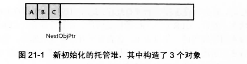

由于托管堆在内存中连续分配这些对象，所以会因为引用的“局部化”而获得性能上的提升。

CLR总是能分配新对象，但内存不可能无限，所以CLR通过称为“垃圾回收”（GC）的技术“删除”堆中应用程序不再需要的对象。

#### 21.1.2 垃圾回收算法
应用程序调用new操作符创建对象时，可能没有足够地址空间来分配该对象，发现空间不够，CLR就执行垃圾回收。

对象生存期的管理，有的系统曹勇的是某种引用计数：堆上的每个对象都维护一个内存字段统计程序中多少“部分”正使用对象。随着每一“部分”到达代码中某个不再需要对象的地方，就递减对象的计数字段，直到为0，对象就可以从内存中删除了。

引用计数系统最大的问题是处理不好循环引用。基于这个问题，CLR改为使用一种引用跟踪算法：只关心引用类型的变量，因为只有这种变量才能引用堆上的对象。

只类型变量直接包含值类型实例，而应用类型变量可以包括类的静态和实例字段，方法的参数和局部变量，将所有引用类型的变量称为“根”。

GC步骤：
- 1、暂停进程中所有线程
- 2、CLR进入GC的标记阶段，CLR遍历堆中所有对象，将同步索引字段中的一位设为0，这表明所有对象都应删除（GC 不知道哪些对象还“活着”、哪些是“垃圾”。所以它假设全部对象都是垃圾）
- 3、CLR检查所有活动根，查看它们引用了哪些对象，如果一个根包含null，CLR忽略这个根并继续检查下一个根
- 4、任何根如果引用了堆上的对象，CLR都会标记那个对象，就是将该对象的同步块索引中的位设为1
- 5、一个对象被标记后，CLR检查那个对象中的根，标记它们引用的对象，如果发现对象已经标记，就不重新检查对象的字段，避免因为循环引用而产生死循环


看下面例子：应用程序的根直接引用对象A，C，D，F。所有对象都已标记。标记对象D时，垃圾回收器发现这个对象含有一个引用对象H的字段，造成对象H也被标记。标记过程会持续，直到应用程序所有根所有检查完毕。

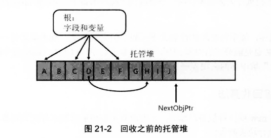

已标记的对象不能被垃圾回收，我们说这种对象时可达的，因为引用程序代码可通过仍在引用它的变量抵达（访问）它。

- 6、CLR知道哪些对象可以幸存，哪些可以删除后就进入GC压缩阶段
- 7、压缩所有幸存下来的对象，使它们占用连续内存空间。（这里的压缩接近于碎片整理）
- 8、压缩后对象在内存中的位置移动了，那就有一个问题，需要更改根引用对象的位置，不然造成内存损坏。所以CLR要从每个根减去所引用的对象在内存中便宜的字节数，这样就能保证每个根还是引用和之前一样的对象，只是对象在内存中变换了位置。

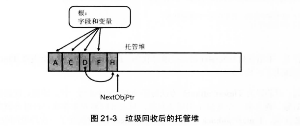

如果CLR在一次GC后回收不了内存，而且进程中没有空间分配新的GC区域，说明该进程内存耗尽，这时，new操作会抛出OutOfMemoryException。

因为这个机制，所以前面指出的忘记释放的bug不存在了：
- 内存不可能泄露，我从应用程序的根访问不了任何对象，都会在某个时间被垃圾回收
- 不可能因为访问被释放的内存而造成内存损坏，因为现在只能引用活动对象，非活动对象时引用不了的

静态字段引用的对象一直存在，直到用于加载类型的AppDomain卸载为止，所以应该尽量避免使用静态字段。

#### 21.1.3 垃圾回收和调试
一旦根离开作用域，它引用的对象就会变得不可达，GC会回收其内存，不保证对象在方法的生存期中自始至终第存货。
如以下例子：
```cs
using System;
using System.Threading;

class Program
{
    public static void Main()
    {
        // 创建每2000毫秒就调用一次TimerCallback方法的Timer对象
        Timer t = new Timer(TimerCallback, null, 0, 2000);

        // 等待用户按Enter键
        Console.ReadLine();
    }

    private static void TimerCallback(object o)
    {
        // 当调用该方法， 显示日期和时间
        Console.WriteLine("In TimerCallback: " + DateTime.Now);

        // 出于演示目的，强制执行一次垃圾回收
        GC.Collect();
    }
}
```

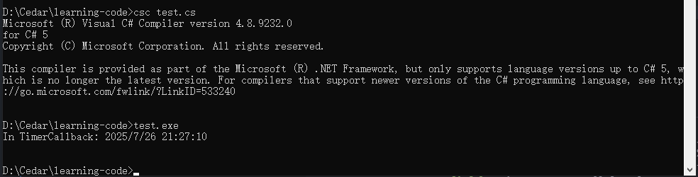

只要计时器对象存在，计时器就应该一直触发，注意，TimerCallback方法调用GC.Collect()强制执行一次垃圾回收。
可以看到结果是只调用一次TimerCallback。

这是因为强制执行一次垃圾回收后，垃圾回收器会检查应用程序的根，发现在初始化之后，Main方法再也没有用过变量t，既然应用程序没有任何变量引用Timer对象，垃圾回收自然会回收分配给它的内存，计时器就停止触发了。


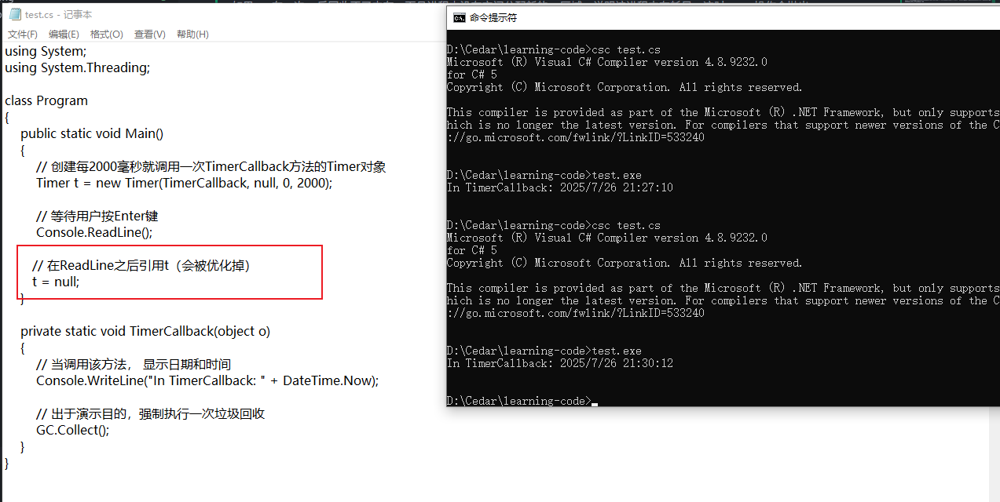

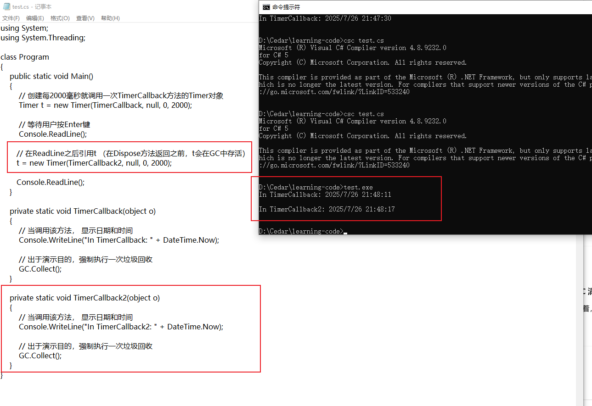

因为`new Timer(TimerCallback, null, 0, 2000);`在后续没有被引用，所以都不会继续执行计时器。

正确修改方式：

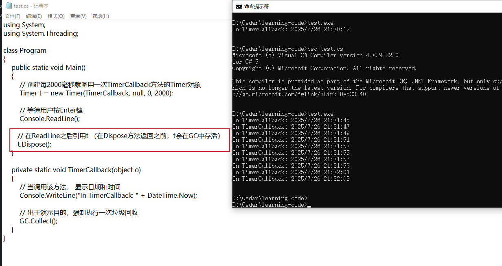

### 21.2 代：提升性能
CLR的GC是基于代的垃圾回收器，它对代码做出了以下几点假设：
- 对象越新，生存期越短
- 对象越老，生存期越长
- 回收堆的一部分，速度快于回收整个堆

托管堆在初始化时不包含对象，添加到堆的对象称为第0代对象。简单地说，第0代对象就是那些新构造的对象，垃圾回收器从未检查过它们。


CLR初始化时为第0代对象选一个预算容量（KB为单位），如果分配一个新对象造成第0代超过预算，就必须启动一次垃圾回收。

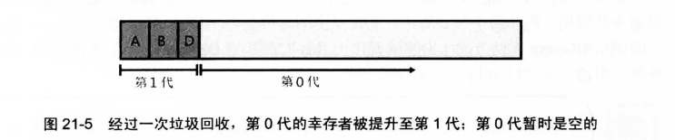

一次垃圾回收后，第0代就不包含任何对象了，应用继续运行

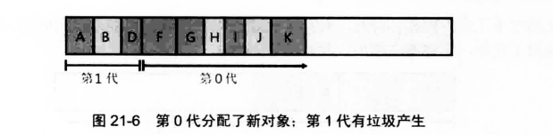

内存将在某一时刻回收，假定分配新对象会造成第0代超出预算，造成必须启动垃圾回收。开始垃圾回收时，垃圾回收器必须决定检查哪些代。

工具第一个假设越新的对象活的越短，所以第0代包含更多垃圾的可能性越大，所以忽略第1代只回收第0代，这样加快了垃圾回收速度。

当然老对象的字段也可能引用新对象，为了确保堆老对象的已更新字段进行检查，垃圾回收器利用JIT编译器内部一个机制，这个机制在对象的引用字段发生变化时，会设置一个对应的位标志。

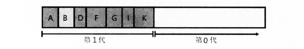

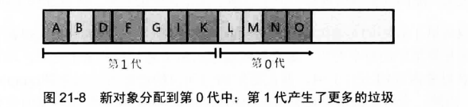

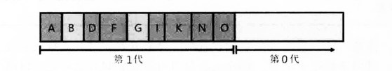

可以看到，第1代随着程序的运行正在缓慢增长。

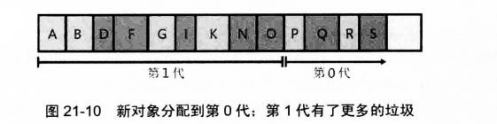

应用程序试图分配对象时，由于第0代已满，开始垃圾回收，这次回收发现第1代占用太多内存，以至于用完预算。所以这次会检查第1和第0代所有对象。

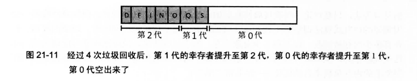

垃圾回收后，第0代幸存者提升为第1代，第1代幸存者提升至第2代。

托管堆只支持三代，CLR初始化会为每一代选择预算，CLR的垃圾回收器是自调节的，意味着垃圾回收器会在执行垃圾回收的过程中了解程序行为，自动调整预算。

如果没有回收到足够的内存，垃圾回收器会执行一次完整回收，如果还是不够，会抛出OutOfMemoryException.

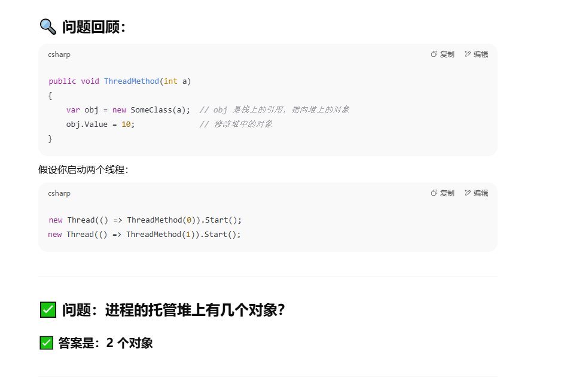

#### 21.2.1 垃圾回收触发条件
- CLR在检测超过预算时会触发一次GC
- 代码显示调用System.GC的静态Collect方法
- Windows报告低内存情况
    - CLR内部使用Win32函数CreateMemoryResourceNotification和QueryMemoryResourceNotification监视系统的总体内存情况
- CLR正在卸载AppDomain
    - CLR认为其中一切都不是根
- CLR正在关闭
    - CLR在进程正常终止时关闭，关闭期间，CLR认为进程中一切都不是根，回收进程全部内存

#### 21.2.2 大对象
还有一个性能提升的举措，CLR将对象氛围大对象（>= 85000字节）和小对象：
- 大对象不是在小对象的地址空间分配，而是在进程地址空间的其他地方分配
- 大对象总是第2代，绝不可能是第0代或第1代，所以只能为需要长时间存活的资源创建大对象，分配短时间存活的大对象会导致第2代更频繁地回收，损害性能

#### 21.2.5 监视应用程序的内存使用情况
```cs
using System;

Console.WriteLine("总内存（字节）: " + GC.GetTotalMemory(forceFullCollection: false));
Console.WriteLine("第0代收集次数: " + GC.CollectionCount(0));
Console.WriteLine("第1代收集次数: " + GC.CollectionCount(1));
Console.WriteLine("第2代收集次数: " + GC.CollectionCount(2));
```

### 21.3 需要特殊清理的类型
有的类型除了内存还需要本机资源。

例如System.IO.FileStream类型需要打开一个文件（本机资源）并保存文件句柄。然后，类型的Read和Write方法用句柄操作文件。

包含本机资源的类型被GC时，GC会回收对象在托管堆中的内存，这样会造成本机资源（GC对它一无所知）的泄露。所以CLR提供称为终结的机制，允许对象在被判定为垃圾后，在对象内存被回收前执行一些代码。

任何包装了本机资源（文件、网络连接、套接字、互斥体）的类型都支持终结。

System.Object定义了受保护方的虚方法Finalize。垃圾回收器判定对象时垃圾后，会调用对象的Finalize方法（如果重写就会调用）。

C#要求在类名前添加~符号定义Finalize方法：
```cs
internal sealed class SomeType{
    // 这是一个Finalize方法
    ~SomeType(){
        // 这里的代码会进入Finalize方法
    }
}
```

CLR不保证多个Finalize方法的调用顺序，所以在Finalize方法中不要访问定义了Finalize方法的其他类型的对象，哪些对象可能已经终结。

Finalize方法问题较多，使用需要谨慎。它们是为释放本机资源而设计的，强烈建议不要重写Object的Finalize方法。使用Microsoft在FCL中提供的辅助类，这些辅助类重写了Finalize方法并添加一些特殊的CLR“魔法”。我们可以从这些辅助类派生出自己的类，从而继承CLR的魔法。

创建封装了本机资源的托管类型时，应该先从System.Runtime.InteropServices.SafeHandle这个特殊基类派生出一个类。
```cs
public abstract class SafeHandle : CriticalFinalizerObject, IDisposable{
    ...
}
```

#### 21.3.1 使用包装了本机资源的类型
以System.IO.FileStream类为例，可利用它打开一个文件，从文件中读取字节，向文件写入字节，然后关闭文件。

```cs
using System;
using System.IO;

public static class Program {
    public static void Main() {
        // 创建要写入临时文件的字节
        Byte[] bytesToWrite = new Byte[] { 1, 2, 3, 4, 5 };

        // 创建临时文件
        FileStream fs = new FileStream("Temp.dat", FileMode.Create);

        // 将字节写入临时文件
        fs.Write(bytesToWrite, 0, bytesToWrite.Length);

        // 删除临时文件 删除不需要句柄
        File.Delete("Temp.dat"); // 抛出 IOException 异常
    }
}

```

一般上述代码会报错，因为执行删除方法的时候该文件大概率还打开着。

可能执行成功是因为：如果垃圾回收刚好在调用Write之后，调用Delete之前发生，那么FileStream的SafeFileHandle字段的Finalize方法就会被调用，就会关闭文件，随后Delete操作也就可以正常运行。但发生这种概率很小。

类如果向允许使用者控制类所包装的本机资源的生存期，就必须实现IDisposable接口。

```cs
using System;
using System.IO;

public static class Program {
    public static void Main() {
        // 创建要写入临时文件的字节
        Byte[] bytesToWrite = new Byte[] { 1, 2, 3, 4, 5 };

        // 创建临时文件
        FileStream fs = new FileStream("Temp.dat", FileMode.Create);

        // 将字节写入临时文件
        fs.Write(bytesToWrite, 0, bytesToWrite.Length);

        // 写入结束后显示关闭文件
        fs.Dispose();

        // 删除临时文件
        File.Delete("Temp.dat"); 
    }
}
```

现在，当调用Delete方法时，Window发现该文件没有打开，所以能成功删除它。

本机资源的清理最终会发生，调用Dispose只是控制这个清理动作的发生时间。另外调用Dispose不会将托管对象从托管堆中删除，只有在垃圾回收之后，托管堆中的内存才会得以回收。

一般不赞成在代码中显示调用Dispose。Dispose的设计规范指出Dispose不一定要线程安全，原因是代码只有在确定没有别的线程使用对象时才应调用Dispose。

如果决定显示调用Dispose，强烈建议将调用放到一个异常处理finally块中：
```cs
public static class Program {
    public static void Main() {
        // 创建要写入临时文件的字节
        Byte[] bytesToWrite = new Byte[] { 1, 2, 3, 4, 5 };

        // 创建临时文件
        FileStream fs = new FileStream("Temp.dat", FileMode.Create);
        try{
            // 将字节写入临时文件
            fs.Write(bytesToWrite, 0, bytesToWrite.Length);
        }
        finally{
            // 写入结束后显示关闭文件
            if(fs != null) 
                fs.Dispose();
        }
        // 删除临时文件
        File.Delete("Temp.dat"); 
    }
}
```

C#提供了一个using语句，允许用简化的语法获得和上述代码相同的结果。

```cs
public static class Program {
    public static void Main() {
        // 创建要写入临时文件的字节
        Byte[] bytesToWrite = new Byte[] { 1, 2, 3, 4, 5 };

        // 创建临时文件
        using (FileStream fs = new FileStream("Temp.dat", FileMode.Create)){
            // 将字节写入临时文件
            fs.Write(bytesToWrite, 0, bytesToWrite.Length);
        }

        // 删除临时文件
        File.Delete("Temp.dat"); 
    }
}
```

#### 21.3.2 一个有趣的依赖性问题
FileStream类型允许用户打开文件进行读写。为提高性能，该类型的实现利用内存缓冲区，只有缓冲区满，类型才将缓冲区中的数据刷入文件。

FileStream类型只支持字节写入，写入字符和字符串可以使用一个System.IO.StreamWriter
```cs
FileStream fs = new FileStream("DataFile.dat", FileMode.Create);
StreamWriter sw = new StreamWriter(fs);
sw.Write("Hi there");

// 不要忘记写下面这个 Dispose 调用
sw.Dispose(); // 会自动 Dispose 掉 fs

```

不需要在FileStream对象上显示调用Dispose，因为StreamWriter会调用

垃圾回收器不保证对象的终结顺序，所以如果FileStream对象先终结，先关闭文件，然后当StreamWriter对象终结时，会试图向已关闭的文件写入数据，造成抛出异常。相反，如果是StreamWriter先终结，数据会安全写入文件。

让垃圾回收器以特定顺序终结对象时不可能的，因为不同对象可能包含相互之间的引用，垃圾回收器无法正确猜出这些对象的终结顺序。Microsoft的解决方案是：StreamWriter类型不支持终结，所以永远不会将它的缓冲区中的数据flush到底层FileStream对象。所以开发人员需要显示调用对StreamWriter的Dispose。

再次强调：Dispose不会执行终结，而是垃圾回收前会执行终结。

#### 21.3.4 终结的内部工作原理
创建新对象时，new操作符会从堆中分配内存，如果对象的类型定义了Finalize方法，那么在改类型的实例构造器被调用之前，会指向该对象的指针放到一个终结列表。列表中的每一项都指向一个对象————回收该对象的内存前应调用它的Finalize方法。

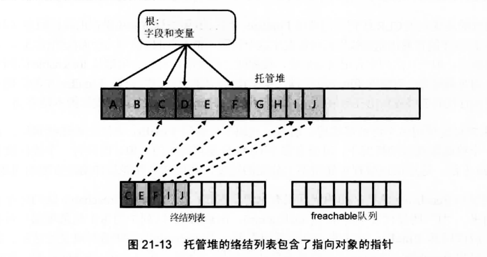

B,E,G,H,I,J被判定为垃圾，垃圾回收器扫描终结列表以查找对这些对象的引用，找到一个引用后，该引用会从终结列表中移除，并附加到freachable队列。队列中的每个引用都代表其Finalize方法已准备好调用的一个对象。

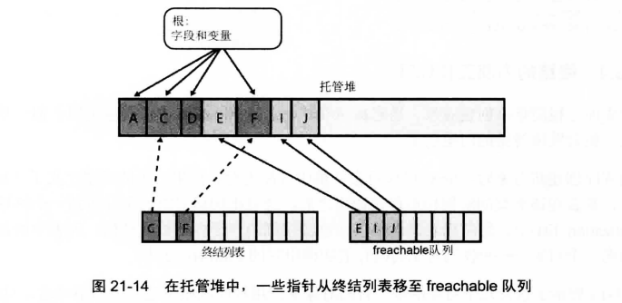

对象B,G,H占用的内存已被回收，因为他们没有Finalize方法。但对象E,I,J占用的内存暂时不能回收，因为他们的Finalize方法还没有调用。

一个特殊的高优先级CLR线程专门调用Finalize方法。

当垃圾回收器将对象的引用从终结列表移至freachable队列时，对象不再被视为垃圾，不能回收它的内存，对象被视为垃圾又变得不是垃圾，对象复活了。

现在特殊的终结线程情况freachable对象，执行每个对象的Finalize方法。下次对老一代进行垃圾回收时，会发现已终结的对象成为真正的垃圾。所以这些对象的内存会直接回收。

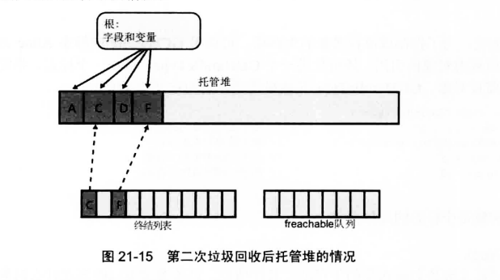

## 22 CLR寄宿和AppDomain
### 22.1 CLR寄宿
.net core后变化很大，这里不以书本为准。

CLR（Common Language Runtime）寄宿，是指创建并初始化一个 CLR 实例，把它“嵌入”进某个应用程序进程中运行 .NET 代码。

通俗来说：
“不是 CLR 启动你的程序，而是你的程序启动并控制 CLR。”

例如用 C++ 写了一个原生程序，想在其中运行一些 C# 脚本或逻辑：
- 加载 .NET CLR
- 初始化 AppDomain
- 执行托管代码
- 获取结果

这就叫做“寄宿 CLR”。

https://github.com/dotnet/samples/tree/main/core/hosting


### 22.2 AppDomain
可以理解是一个Window进程可以运行多个app，每个app就是一个AppDomain隔离开而实现的。

因为是framework的内容，dotnet core不再支持完整的AppDomain，所以这里也不记录了。

重点关注AssemblyLoadContext。


我创建一个.NET Core Web API 项目，运行时，所在的应用程序就是一个默认的 AppDomain，但这个 AppDomain 是 唯一的、不可自定义创建或卸载的。


## 23 程序集加载和反射
### 23.1 程序集加载
JIT编译器将方法的IL代码编译成本机代码时，会查看IL代码中引用了哪些类型。在运行时，JIT编译器利用程序集的TypeRef和AssemblyRef元数据表确定哪一程序集定义了所引用的类型。

```cs
var result = new MyService().DoSomething();
```

上面这个代码编译后会是这样的指令

```cs
newobj instance void MyNamespace.MyService::.ctor()
callvirt instance int32 MyNamespace.MyService::DoSomething()
```
IL 中的 MyNamespace.MyService 是通过 TypeRef（类型引用） 标记的，而定义 MyService 的程序集，是通过 AssemblyRef（程序集引用） 确定的。

当运行到这段代码时，JIT 会：
- 看 TypeRef 表，找出对应的类型（比如 token: 0x0100001D）
- 从 AssemblyRef 表中找出定义该类型的程序集
- 调用 CLR 的加载机制（用 AssemblyLoadContext）加载该程序集（如果尚未加载）
- 编译并生成本地代码

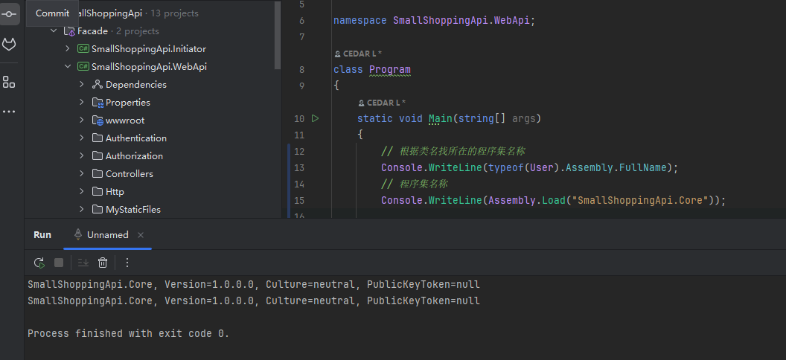


项目之间可以直接引用，编译时就会绑定和加载，但有些场景下，你无法提前“引用”，必须在运行时动态加载，这时候才需要 Assembly.Load。


可能需要手动加载程序集的典型场景：
- 允许用户或第三方开发者写自己的插件（DLL），你在运行时加载这些程序集并调用其类型/方法
    ```cs
    // 加载插件
    var asm = Assembly.LoadFrom("Plugins/MyPlugin.dll");
    // 查找实现了 IPlugin 接口的类
    var type = asm.GetTypes().First(t => typeof(IPlugin).IsAssignableFrom(t));
    // 实例化并调用
    var plugin = (IPlugin)Activator.CreateInstance(type);
    plugin.Execute();
    ```
- 加载第三方 DLL（部署时才决定）
- 反射框架 / 脚本引擎 / IoC 容器实现
    ```cs
    var asm = Assembly.Load("MyApp.Handlers");
    var types = asm.GetTypes().Where(t => t.Name.EndsWith("Handler"));
    ```

在内部，Load导致CLR向程序集应用一个版本绑定重定向策略，并在GAC（全局程序集缓存）中查找程序集。如果没有找到，就直接去应用程序的基目录、私有路径子目录和codebase位置查找。

如果Load找到，会已加载的那个程序集的一个Assembly对象的引用，如果没找到，会抛出System.IO.FileNotFoundException异常。

Assembly的Load方法时将程序集加载到AppDomain的首选方式。还有一直方式是LoadForm方法（内部也是调用Load方法）。

```cs
// 通过路径加载程序集
Assembly.LoadFrom("绝对路径/MyLibrary.dll");
```

如果LoadFrom传递的是一个Internet位置，CLR会下载文件，把它安装到用户的下载缓存中，再从那加载文件。还可以调用UnsafeLoadFrom，它能够加载从网上下载的程序集，同时绕过一些安全检查。

通过LoadFile加载程序集时，CLR不会自动解析任何依赖性问题：代码必须向AppDomain的AssemblyResolve事件登记，并让事件回调方法显示地加载任何依赖的程序集。
比如`var asm = Assembly.LoadFile(@"C:\MyPlugins\MyPlugin.dll");`这加载了 MyPlugin.dll ，但如果这个插件依赖了 Newtonsoft.Json.dll，不会自动去找和加载它。
我们必须 自己告诉 CLR：如果找不到依赖，我来帮你加载。
```cs
// ，当 CLR 找不到依赖时，就会触发这个事件，就可以用自己的逻辑来帮它找到并加载正确的依赖
AppDomain.CurrentDomain.AssemblyResolve += (sender, args) =>
{
    // 提取依赖程序集名
    var assemblyName = new AssemblyName(args.Name).Name;

    // 自定义逻辑去找对应的依赖 DLL 路径
    var path = Path.Combine(@"C:\Plugins\", assemblyName + ".dll");

    if (File.Exists(path))
    {
        return Assembly.LoadFrom(path);
    }

    return null;
};
```


如果构建的一个工具只想通过反射来分析程序集的元数据，并希望确保程序集中的任何代码都不会执行，那么加载程序集的最佳方式就是使用Assembly的ReflectionOnlyLoadFrom方法或使用Assembly的ReflectionOnlyLoad方法。

上面这两个已经不用了，官方推荐的方式是：System.Reflection.MetadataLoadContext
优点：
- 加载程序集进行反射分析
- 不会执行任何 IL
- 不会触发静态构造器 / JIT 编译
- 安全、可控

```cs
System.Reflection.MetadataLoadContext
```

### 23.2 使用反射构建动态可扩展应用程序
元数据是用一系列表来存储的。生成程序集或模块时，编译器会创建一个类型定义表、一个字段定义表、一个方法定义表以及其他表。利用System.Reflection命名空间中包含的类型，可以写代码来反射（解析）这些元数据表。

```cs
Type t = typeof(MyClass);
MethodInfo m = t.GetMethod("MyMethod");
object result = m.Invoke(myObject, new object[] { "arg1" });
```

### 23.3 反射的性能
反射两个缺点：
- 反射造成编译时无法保证类型安全性。由于反射严重依赖字符串，所以会丧失编译时的类型安全性
- 反射速度慢。使用反射时，类型及其成员的名称在编译时未知；你要用字符串名称标识每个类型及其成员，然后在运行时发现它们。而且通常字符串搜索执行的是不区分大小写的比较，这会进一步影响速度。

使用反射调用成员也会影响性能。最好避免利用反射来访问字段或调用方法/属性。应该利用以下两种技术之一开发应用程序来动态发现和构造类型实例：
- 让类型从编译时已知的基类型派生
- 让类型实现编译时已知的接口

使用基类:
```cs
// 抽象基类定义“契约”
public abstract class Animal
{
    public abstract void Speak();
}

// 派生类实现
public class Dog : Animal
{
    public override void Speak()
    {
        Console.WriteLine("Woof!");
    }
}

public class Cat : Animal
{
    public override void Speak()
    {
        Console.WriteLine("Meow!");
    }
}
```

```cs
public static void Main()
{
    string typeName = "Dog"; // 假设是动态传入的类型名

    // 使用 Activator 创建实例（仍需反射加载类，但不调用反射方法）
    Animal animal = (Animal)Activator.CreateInstance(Type.GetType(typeName)!);
    
    animal.Speak(); // 类型安全、无反射调用
}
```

使用接口:
```cs
public interface IPlugin
{
    void Execute();
}

public class MyPlugin : IPlugin
{
    public void Execute()
    {
        Console.WriteLine("Plugin executed!");
    }
}
```

```cs
public static void Main()
{
    string typeName = "MyPlugin";

    // 假设类型已加载（通常通过 Assembly.Load...）
    Type pluginType = Type.GetType(typeName)!;

    // 实例化并转型为接口（仍使用反射创建对象，但调用是类型安全的）
    IPlugin plugin = (IPlugin)Activator.CreateInstance(pluginType)!;

    plugin.Execute(); // 类型安全
}
```

直接反射：
```cs
// 反射方式（不推荐）
object obj = Activator.CreateInstance(Type.GetType("MyPlugin")!);
obj.GetType().GetMethod("Execute")!.Invoke(obj, null); // 性能差 + 易错
```

面向接口或基类的调用是“编译时绑定 + JIT 优化”，而反射是“运行时查找 + 无优化 + 无类型安全”。

#### 23.3.1 发现程序集中定义的类型
Assembly.ExportedTypes：表示当前程序集中“公开（public）导出”的所有类型

```cs
public class Program
{
    public static void Main()
    {
        Assembly asm = Assembly.Load("MyLibrary");

        Console.WriteLine("Exported types:");
        foreach (Type t in asm.ExportedTypes)
        {
            Console.WriteLine(t.FullName);
        }
    }
}
```

#### 23.3.2 类型对象的准确含义
上面遍历的 asm.ExportedTypes 是一个 IEnumerable\<Type\>，也就是由多个 System.Type 对象组成的集合。

Ststem.Type对象代表一个类型的引用（而不是类型的定义）。由于在一个AppDomain中，每个类型只有一个Type对象，所以可以使用相等和不等操作符判断两个对象是不是相同类型。

```cs
Type t1 = typeof(string);
Type t2 = "hello".GetType();

Console.WriteLine(t1 == t2); // True
```

Type 对象是轻量级的对象引用。要更多地了解类型本身，必须获取一个 TypeInfo 对象，后者才代表类型定义。
```cs
Type typeReference = ...;       // 例如： o.GetType() 或者 typeof(Object)
TypeInfo typeDefinition = typeReference.GetTypeInfo();
```

还可调用 TypeInfo 的 AsType 方法将 TypeInfo 对象转换成 Type 对象。

```cs
TypeInfo typeDefinition = ...;
Type typeReference = typeDefinition.AsType();
```


#### 23.3.4 构造类型的实例

获得对 Type 派生对象的引用之后，就可以构造该类型的实例了。FCL 提供了以下几个机制:
- System.Activator 的 CreateInstance 方法
- System.Activator 的 CreateInstanceFrom 方法
- System.AppDomain 的方法
- System.Reflection.ConstructorInfo 的 Invoke 实例方法

| 方法                             | 类型来源                          | 是否需要构造函数信息    | 是否支持跨程序集  | 性能            | 备注             |
| ------------------------------ | ----------------------------- | ------------- | --------- | ------------- | -------------- |
| `Activator.CreateInstance`     | `Type`                        | ❌ 不需要手动指定构造函数 | ✅ 是       | 🚀 快          | 常用，适合默认构造      |
| `Activator.CreateInstanceFrom` | `assembly path` + `type name` | ❌ 不需要         | ✅ 是       | 🐢 慢          | 用于跨程序集、未加载的类型  |
| `AppDomain.CreateInstance*`    | `assembly name` + `type name` | ❌ 不需要         | ✅ 是（另一个域） | 🐢 慢          | .NET Core 中已淘汰 |
| `ConstructorInfo.Invoke`       | `ConstructorInfo`             | ✅ 需要          | ✅ 是       | 🚀 快（略慢于 new） | 最灵活，可调用任意构造函数  |


```cs
internal sealed class Dictionary<Tkey, TValue> { }

public static class Program {
    public static void Main() {
        // 获取对泛型类型的类型对象的引用
        Type openType = typeof(Dictionary<,>);

        // 使用 TKey=String、TValue=Int32 封闭泛型类型 ①
        Type closedType = openType.MakeGenericType(typeof(String), typeof(Int32));

        // 构造封闭类型的实例
        Object o = Activator.CreateInstance(closedType);

        // 证实能正常工作
        Console.WriteLine(o.GetType());
    }
}
```

`Object o = Activator.CreateInstance(closedType);` 功能上等价于：`var o = new Dictionary<string, int>();`

- Activator.CreateInstance(closedType) 和 new 的效果一样（调用无参构造函数）；
- 但反射方式是 运行时动态构造，用于类型不确定的情况；
- 如果知道类型，用 new 更快更安全；
- 如果要支持插件、泛型、配置驱动类型，那 MakeGenericType + CreateInstance 非常有用。

### 23.5 使用反射发现类型的成员
#### 23.5.1 发现类型的成员
字段、构造器、方法、属性、事件和嵌套类型都可以定义成类型的成员。FCL 包含抽象基类 System.Reflection.MemberInfo ，封装了所有类型成员都通用的一组属性。MemberInfo 有许多派生类，每个都封装了与特定类型成员相关的更多属性。


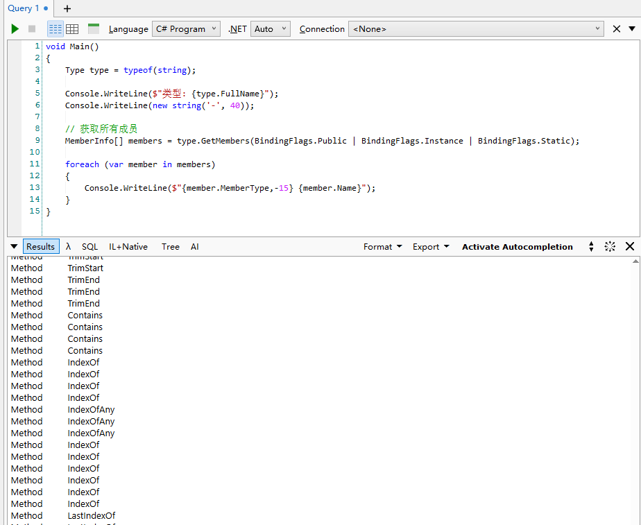


基于 AppDomain，可发现其中加载的所有程序集。基于程序集，可发现构成它的所有模块。基于程序集或模块，可发现它定义的所有类型。基于类型，可发现它的嵌套类型、字段、构造器、方法、属性和事件。命名空间不是这个层次结构的一部分，因为它们只是从语法角度将相关类型聚集到一起。CLR 不知道什么是命名空间。要列出程序集中定义的所有命名空间，需枚举程序集中的所有类型，并查看其 Namespace 属性。

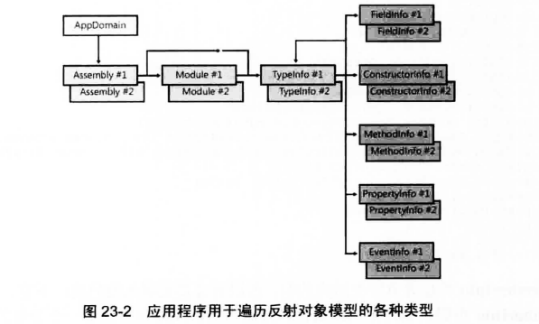


基于类型发现它实现的接口：
```cs
Type type = typeof(MyClass);
Type[] interfaces = type.GetInterfaces();
```
从构造器、方法、属性访问器、事件添加/删除方法获取参数信息:
```cs
MethodInfo method = type.GetMethod("MyMethod");
ParameterInfo[] parameters = method.GetParameters();
```
对属性的访问器（get_XXX 或 set_XXX 方法）和事件的添加/删除方法（add_XXX、remove_XXX）也可以通过类似方式获取参数：
```cs
PropertyInfo prop = type.GetProperty("MyProperty");
MethodInfo getter = prop.GetGetMethod();
ParameterInfo[] getterParams = getter.GetParameters();
```
查询只读属性 ReturnParameter 获得返回参数信息:
```cs
ParameterInfo returnParam = method.ReturnParameter;
Type returnType = returnParam.ParameterType;
```
对于泛型类型或方法，可调用 GetGenericArguments 获取类型参数集合:
```cs
Type genericType = typeof(List<>);
Type[] typeArgs = genericType.GetGenericArguments();

MethodInfo genericMethod = typeof(MyClass).GetMethod("GenericMethod");
Type[] methodTypeArgs = genericMethod.GetGenericArguments();
```
查询 CustomAttributes 获取自定义特性集合:
所有的 MemberInfo 派生类型（包括 Type、MethodInfo、PropertyInfo 等）都提供 CustomAttributes 属性，返回自定义特性的集合：
```cs
foreach (var attrData in method.CustomAttributes)
{
    Console.WriteLine(attrData.AttributeType.Name);
}
```

#### 23.5.2 调用类型的成员
| 成员类型                | 调用成员的方法                                                                                              | 作用说明                  |
| ------------------- | ---------------------------------------------------------------------------------------------------- | --------------------- |
| **FieldInfo**       | `GetValue(object obj)` 和 `SetValue(object obj, object value)`                                        | 获取和设置字段的值             |
| **ConstructorInfo** | `Invoke(object[] parameters)`                                                                        | 通过构造函数创建对象实例          |
| **MethodInfo**      | `Invoke(object obj, object[] parameters)`                                                            | 调用方法                  |
| **PropertyInfo**    | `GetValue(object obj)` 和 `SetValue(object obj, object value)`                                        | 调用属性的 getter 和 setter |
| **EventInfo**       | `AddEventHandler(object obj, Delegate handler)` 和 `RemoveEventHandler(object obj, Delegate handler)` | 添加或移除事件处理程序           |

```cs
void Main()
{
  Type type = typeof(MyClass);

        // 1. 使用 ConstructorInfo.Invoke 创建对象实例
        ConstructorInfo ctor = type.GetConstructor(Type.EmptyTypes);
        var instance = ctor.Invoke(null);
        Console.WriteLine("对象实例创建成功");

        // 2. 访问和修改字段
        FieldInfo field = type.GetField("NumberField");
        Console.WriteLine("初始字段值: " + field.GetValue(instance));
        field.SetValue(instance, 42);
        Console.WriteLine("修改后的字段值: " + field.GetValue(instance));

        // 3. 访问和修改属性
        PropertyInfo prop = type.GetProperty("Name");
        Console.WriteLine("初始属性值: " + prop.GetValue(instance));
        prop.SetValue(instance, "ReflectionUser");
        Console.WriteLine("修改后的属性值: " + prop.GetValue(instance));

        // 4. 调用方法
        MethodInfo method = type.GetMethod("SayHello");
        method.Invoke(instance, new object[] { "World" });

        // 5. 事件订阅和触发
        EventInfo evt = type.GetEvent("SomethingHappened");
        EventHandler handler = (sender, e) => Console.WriteLine("事件被触发了！");
        evt.AddEventHandler(instance, handler);

        // 触发事件
        MethodInfo raiseMethod = type.GetMethod("RaiseEvent");
        raiseMethod.Invoke(instance, null);

        // 取消事件订阅
        evt.RemoveEventHandler(instance, handler);

        // 再次触发事件不会输出任何东西
        raiseMethod.Invoke(instance, null);
}

public class MyClass
{
    public int NumberField;

    private string _name;

    public string Name
    {
        get => _name;
        set => _name = value;
    }

    public event EventHandler SomethingHappened;

    public MyClass()
    {
        NumberField = 10;
        _name = "InitialName";
    }

    public void SayHello(string message)
    {
        Console.WriteLine($"Hello, {message}! My name is {_name}.");
    }

    public void RaiseEvent()
    {
        SomethingHappened?.Invoke(this, EventArgs.Empty);
    }
}
```
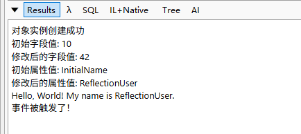

PropertyInfo类型代表与属性有关的元数据信息。
EventInfo类型代表与事件有关的元数据信息。

#### 23.5.3 使用绑定句柄减少进程的内存消耗
许多应用程序都绑定了一组类型(Type 对象)或类型成员(MemeberInfo 派生对象)，并将这些对象保存在某种形式的集合中。以后，应用程序搜索这个集合，查找特定对象，然后调用(invoke)这个对象。这个机制很好，只是有个小问题：Type 和 MemberInfo 派生对象需要大量内存。

CLR 内部用更精简的方式表示这种信息。CLR 之所以为应用程序创建这些对象，只是为了方便开发人员。CLR 不需要这些大对象就能运行。

如果需要保存/缓存大量 Type 和 MemberInfo 派生对象，开发人员可以使用运行时句柄(runtime handle)代替对象以减小工作集(占用的内存)。

FCL 定义了三个运行时句柄:
- RuntimeTypeHandle
- RuntimeFieldHandle 
- RuntimeMethodHandle

三个类型都是值类型，都只包含一个字段，也就是一个 IntPtr.

正常使用：
```cs
// 这段代码就用一次 Type，不占太多内存，完全没问题。
var type = typeof(MyClass);  // OK，这不会出大问题
Console.WriteLine(type.Name);
```

问题场景：大量缓存

```cs
List<Type> cachedTypes = new List<Type>();

foreach (var asm in AppDomain.CurrentDomain.GetAssemblies())
{
    foreach (var type in asm.GetTypes())
    {
        cachedTypes.Add(type); // 大量 Type 对象被缓存
    }
}
```

更好的做法（使用句柄）：

```cs
List<RuntimeTypeHandle> cachedHandles = new List<RuntimeTypeHandle>();

foreach (var type in someTypes)
{
    cachedHandles.Add(Type.GetTypeHandle(type));  // 只保存句柄，占用内存小
}

// 需要时再还原
Type restored = Type.GetTypeFromHandle(cachedHandles[0]);
```

| 操作                                 | 方法或属性                              |
| ---------------------------------- | ---------------------------------- |
| `Type → RuntimeTypeHandle`         | `Type.GetTypeHandle(type)`         |
| `RuntimeTypeHandle → Type`         | `Type.GetTypeFromHandle(handle)`   |
| `FieldInfo → RuntimeFieldHandle`   | `field.FieldHandle`                |
| `RuntimeFieldHandle → FieldInfo`   | `FieldInfo.GetFieldFromHandle()`   |
| `MethodInfo → RuntimeMethodHandle` | `method.MethodHandle`              |
| `RuntimeMethodHandle → MethodInfo` | `MethodInfo.GetMethodFromHandle()` |

## 24 运行时序列化
序列化是将对象或对象图转换成字节流的过程。反序列化是将字节流转换回对象图的过程。

一旦将对象序列化成内存中的字节流，就可方便地以一些更有用的方式处理数据，比如进行加密和压缩。

### 24.1 序列化和反序列化快速入门
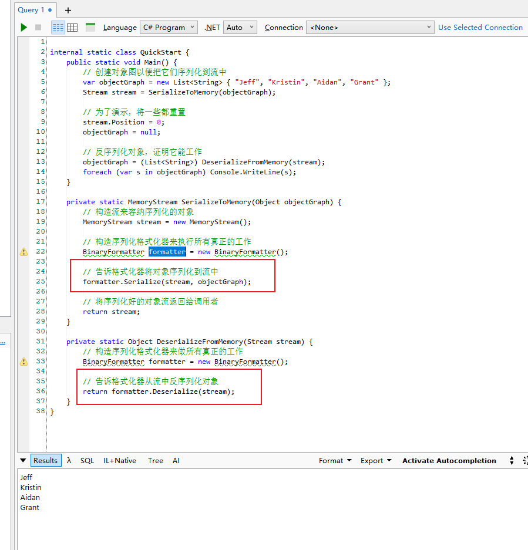

可以将多个对象图序列化到一个流中：
```cs
private static void SaveApplicationState(Stream stream) {
    // 构造序列化格式化器来执行所有实际的工作
    BinaryFormatter formatter = new BinaryFormatter();

    // 序列化我们的应用程序的完整状态
    formatter.Serialize(stream, s_customers);
    formatter.Serialize(stream, s_pendingOrders);
    formatter.Serialize(stream, s_processedOrders);
}

private static void RestoreApplicationState(Stream stream) {
    // 构造序列化格式化器来执行所有实际的工作
    BinaryFormatter formatter = new BinaryFormatter();

    // 反序列化应用程序的完整状态(和序列化时的顺序一样)
    s_customers = (List<Customer>)    formatter.Deserialize(stream);
    s_pendingOrders = (List<Order>)   formatter.Deserialize(stream);
    s_processedOrders = (List<Order>) formatter.Deserialize(stream);
}
```

序列化对象时，类型的全名和类型定义程序集的全名会被写入流。

### 24.2 使类型可序列化
设计类型时，设计人员必须珍重地决定是否允许类型的实例序列化。类型默认是不可序列化对的。

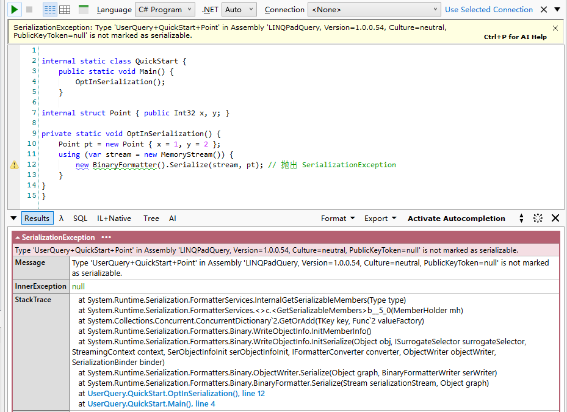

像下面这样向类型应用定制特性 System.SerializableAttribute才不会抛出错误。
```cs
[Serializable]
internal struct Point { public Int32 x, y; }
```

### 24.3 控制序列化和反序列化
将 SerializableAttribute 定制特性应用于类型，所有实例字段(public，private 和 protected等)都会被序列化。

使用 System.NonSerializedAttribute 定制特性指出类型中不应序列化的字段可限制哪些不可序列化。

```cs
[Serializable]
internal class Circle {
    private Double m_radius;

    [NonSerialized]
    private Double m_area;  

    public Circle(Double radius) {
        m_radius = radius;
        m_area = Math.PI * m_radius * m_radius;
    }

    ...
}
```

这个对象序列化时，只有 m_radius 字段的值(10) 才会写入流，但当流反序列化成 Circle 对象的 m_radius 字段会被设为 10，但它的 m_area 字段会被初始化成 0 .

```cs
[Serializable]
internal class Circle {
    private Double m_radius;            // 半径

    [NonSerialized]
    private Double m_area;              // 面积

    public Circle(Double radius) {
        m_radius = radius;
        m_area = Math.PI * m_radius * m_radius;
    }

    [OnDeserialized]
    private void OnDeserialized(StreamingContext context) {
        m_area = Math.PI * m_radius * m_radius;
    }
}
```

Circle 类包含一个标记了 System.Runtime.Serialization.OnDeserializedAttribute 定制特性的方法。每次反序列化类型的实例，格式化器都会检查类型中是否定义了应用了该特性的方法。如果是，就调用该方法。(就是说每次反序列化都会调用OnDeserialized这个方法)

除了 OnDeserializedAttribute 这个定制特性，System.Runtime.Serialization 命名空间还定义了包括 OnSerializingAttribute，OnSerializedAttribute 和 OnDeserializingAttribute 在内的其他定制特性。

```cs
[OnDeserializing]
private void OnDeserializing(StreamingContext context) {
    // 举例：在这个类型的新版本中，为字段设置默认值
}

[OnDeserialized]
private void OnDeserialized(StreamingContext context) {
    // 举例：根据字段值初始化瞬时状态(比如 sum 的值)
    sum = x + y;
}

[OnSerializing]
private void OnSerializing(StreamingContext context) {
    // 举例：在序列化前，修改任何需要修改的状态
}

[OnSerialized]
private void OnSerialized(StreamingContext context) {
    // 举例：在序列化后，恢复任何需要恢复的状态
}
```

如果序列化类型的实例，在类型中添加新字段，然后试图反序列化不包含新字段的对象，格式化器会抛出 SerializationException 异常。

### 24.4 格式化器如何序列化类型实例
FCL 在 System.Runtime.Serialization 命名空间提供了一个 FormatterServices 类型。该类型只包含静态方法，而且该类型不能实例化。

格式化器靠 FormatterServices 获取哪些字段要序列化，再通过反射读取这些字段的值，再把类型名+字段+值写入流中，完成序列化：
- 获取可序列化字段列表
    - 调用 FormatterServices 的 GetSerializableMembers 方法，这个方法利用反射获取类型的 public 和 private 实例字段
    - 方法返回由 MemberInfo 对象构成的数组，其中每个元素都对应一个可序列化的实例字段
- 获取字段的值
    - System.Reflection.MemberInfo 对象数组传给 FormatterServices 的静态方法 GetObjectData
    - 返回对应的字段值数组 object[]
    - 上个方法得到的MemberInfo[]和这个方法得到的object[]两个数组是“一一对应”的
    - 
- 把类型信息写入流
    - 将程序集标识和类型的完整名称写入流中
- 写入字段数据到流
    - 格式化器遍历两个数组中的元素，将每个成员的名称和值写入流中

CLR 在反序列化时，通过 跳过构造函数 的方式，分配对象并手动填充字段值，整个过程绕开了正常的对象初始化逻辑：
- 确定反序列化的类型
    - 格式化器从流中读取程序集标识和完整类型名称。
    - 将程序集标识信息和类型全名传给 FormatterServices 的静态方法 GetTypeFromAssembly
    - 这个方法返回一个 System.Type 对象，它代表要反序列化的那个对象的类型
- 创建未初始化的对象（跳过构造函数）
    - 格式化器调用 FormmatterServices 的静态方法 GetUninitializedObject
    - 这个方法为一个新对象分配内存，但不为对象调用构造器
- 找出需要填充的字段
    - - 格式化器现在构造并初始化一个 MemberInfo 数组，具体做法和前面一样，都是调用 FormatterServices 的 GetSerializableMembers 方法。这个方法返回序列化好、现在需要反序列化的一组字段。
- 读取字段的值
    - 格式化器根据流中包含的数据创建并初始化一个 Object 数组
- 把字段值“灌入”到新对象中
    - 将新分配对象、MemberInfo 数组以及并行 Object 数组(其中包含字段值)的引用传给 FormatterServices 的静态方法 PopulateObjectMembers
    - 这个方法遍历数组，将每个字段初始化成对应的值

### 24.5 控制序列化/反序列化的数据
控制序列化和反序列化过程的最佳方式就是使用 OnSerializing，OnSerialized，OnDeserializing，OnDeserialized，NonSerialized 和 OptionalField 等特性。

然而，在一些极少见的情况下，这些特性不能提供想要的全部控制。此外，格式化器内部使用的是反射，而反射的速度比较慢。

为了对序列化/反序列化的数据进行完全的控制，并避免使用反射，自定义类型可实现System.Runtime.Serialization.ISerializable接口，定义如下：

```cs

public interface ISerializable {
    void GetObjectData(SerializationInfo info, StreamingContext context);
}
```

ISerializable 接口和特殊构造器旨在由格式化器使用。但其他代码可能调用 GetObjectData 来返回敏感数据。另外，其他代码可能构造对象，并传入损坏的数据。因此，建议向 GetObjectData 方法和特殊构造器应用以下特性：

`[SecurityPermissionAttribute(SecurityAction.Demand, SerializationFormatter = true)]`

```cs
using System.Runtime.Serialization;
using System.Runtime.Serialization.Formatters.Binary;
void Main()
{
        Person person = new Person("Alice", 30);

        // 序列化
        // formatter是格式化器
        IFormatter formatter = new BinaryFormatter();
        using (FileStream stream = new FileStream("D:/Cedar/linqpad/person.bin", FileMode.Create, FileAccess.Write))
        {
            formatter.Serialize(stream, person);
        }

        // 反序列化
        using (FileStream stream = new FileStream("D:/Cedar/linqpad/person.bin", FileMode.Open, FileAccess.Read))
        {
            Person deserialized = (Person)formatter.Deserialize(stream);
            Console.WriteLine(deserialized);
        }
}

[Serializable]
public class Person : ISerializable
{
    public string Name;
    public int Age;

    public Person(string name, int age)
    {
        Name = name;
        Age = age;
    }

    // 序列化方法
    public void GetObjectData(SerializationInfo info, StreamingContext context)
    {
        Console.WriteLine("Serializing...");
        info.AddValue("Name", Name);
        info.AddValue("Age", Age);
    }

    // 反序列化构造函数
    protected Person(SerializationInfo info, StreamingContext context)
    {
        Console.WriteLine("Deserializing...");
        Name = info.GetString("Name");
        Age = info.GetInt32("Age");
    }
}
```
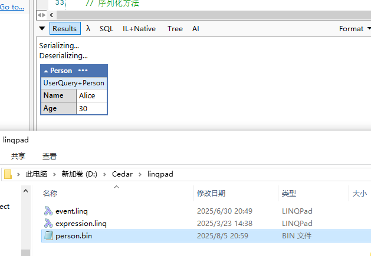

格式化器序列化对象图时会检查每个对象。如果发现一个对象的类型实现了 ISerializable 接口，就会忽略所有定制特性，改为构造新的 System.Runtime.Serialization.SerializationInfo 对象。


执行`formatter.Serialize(stream, person);`的时候会发生
```cs
var info = new SerializationInfo(typeof(Person), new FormatterConverter());
person.GetObjectData(info, context);
```

构造 SerializationInfo 对象时，格式化器要传递两个参数：Type 和 System.Runtime.Serialization.IFormatterConverter
- Type参数标识要序列化的对象
- IFormatterConverter类型转换器，在读取/写入数据时做类型转换


GetObjectData 方法决定需要哪些信息来序列化对象，并将这些信息添加到 SerializationInfo 对象中。GetObjectData 调用 SerializationInfo 类型提供的 AddValue 方法的众多重载版本之一指定要序列化的信息。

格式化器获取已经添加到 SerializationInfo 对象的所有值，并把它们都序列化到流中。

反序列化流程：
- 格式化器从流中提取一个对象时，会为新对象分配内存
- 格式化器检查类型是否实现了 ISerializable 接口。如果存在这个接口，格式化器就尝试调用一个特殊构造器，它的参数和 GetObjectData 方法的完全一致（如果自定义类是密封类，强烈建议将这个特殊构造器声明为 private。这样可防止任何代码不慎调用它，从而提升安全性）
- 构造器获取一个 SerializationInfo 对象引用。在这个 SerializationInfo 对象中，包含了对象序列化时添加的所有值
- 特殊构造器可调用 GetBoolean，GetChar 等任何一个方法，向它传递与序列化一个值所用的名称对应的字符串
- 如果值在流中的类型和试图获取(Get)的类型不符，格式化器会尝试用一个 IFormatterConverter 对象将流中的值转型成你指定的类型


当你的类型继承了一个实现 ISerializable 的基类时，为了确保完整的序列化和反序列化，你的 GetObjectData 和特殊构造器中必须调用基类对应方法；否则，如果派生类没有新增数据，完全可以不用实现 ISerializable，格式化器会自动沿继承链查找基类的反序列化构造器。

```cs
using System;
using System.Runtime.Serialization;

// 基类实现 ISerializable
[Serializable]
public class BasePerson : ISerializable
{
    public string Name;

    public BasePerson() { }

    // 反序列化构造器
    protected BasePerson(SerializationInfo info, StreamingContext context)
    {
        Name = info.GetString("Name");
    }

    // 序列化方法
    public virtual void GetObjectData(SerializationInfo info, StreamingContext context)
    {
        info.AddValue("Name", Name);
    }
}

// 派生类也实现 ISerializable，且有新增字段 Age
[Serializable]
public class Person : BasePerson, ISerializable
{
    public int Age;

    public Person() { }

    // 派生类的反序列化构造器
    protected Person(SerializationInfo info, StreamingContext context) : base(info, context)
    {
        // 先调用基类构造器，再反序列化自己的字段
        Age = info.GetInt32("Age");
    }

    // 派生类重写序列化方法
    public override void GetObjectData(SerializationInfo info, StreamingContext context)
    {
        // 先调用基类的序列化方法，序列化基类字段
        base.GetObjectData(info, context);
        // 再序列化派生类字段
        info.AddValue("Age", Age);
    }
}
```

**要实现 ISerializable 但基类型没有实现怎么办？**

当基类未实现 ISerializable 时，派生类实现该接口必须自己手动序列化和反序列化基类字段，且这通常只对基类字段不是私有的情况下可行，否则很难保证完整的序列化。

```cs
using System;
using System.Runtime.Serialization;
using System.IO;
using System.Runtime.Serialization.Formatters.Binary;

// 基类未实现 ISerializable
[Serializable]
public class BasePerson
{
    public string Name;

    public BasePerson() { }

    public BasePerson(string name)
    {
        Name = name;
    }
}

// 派生类实现 ISerializable
[Serializable]
public class Person : BasePerson, ISerializable
{
    public int Age;

    public Person() { }

    public Person(string name, int age) : base(name)
    {
        Age = age;
    }

    // 反序列化构造器，必须手动反序列化基类字段
    [SecurityPermissionAttribute(SecurityAction.Demand, SerializationFormatter = true)]
    protected Person(SerializationInfo info, StreamingContext context)
    {
        // 手动从 SerializationInfo 读取基类字段
        Name = info.GetString("Name");
        Age = info.GetInt32("Age");
    }

    // 手动序列化基类字段
    [SecurityPermissionAttribute(SecurityAction.Demand, SerializationFormatter = true)]
    public void GetObjectData(SerializationInfo info, StreamingContext context)
    {
        // 手动添加基类字段
        info.AddValue("Name", Name);
        // 添加派生类字段
        info.AddValue("Age", Age);
    }
}
```


### 24.6 流上下文
一组序列化好的对象可以有许多目的地：同一个进程、同一台机器上的不同进程、不同机器上的不同进程等。

StreamingContext 结构中包含两个成员：
| 成员名称      | 类型                       | 说明                                                           |
| --------- | ------------------------ | ------------------------------------------------------------ |
| `State`   | `StreamingContextStates` | 一个枚举的位标志，表示对象的序列化/反序列化用途或来源（比如是为了跨 AppDomain 传输、为了持久化、为了克隆等） |
| `Context` | `object`                 | 任何你想传递给序列化过程的上下文信息。可以是 `null`，也可以是你自定义的对象                    |


StreamingContextStates创建枚举：
| 枚举值                          | 说明               |
| ---------------------------- | ---------------- |
| `StreamingContextStates.All` | 所有可能的上下文（默认）     |
| `Clone`                      | 当前序列化是为了克隆对象     |
| `CrossAppDomain`             | 用于跨 AppDomain 传输 |
| `CrossProcess`               | 用于跨进程传输          |
| `CrossMachine`               | 用于网络传输           |
| `File`                       | 用于保存到文件          |
| `Persistence`                | 用于持久化保存          |
| `Remoting`                   | 用于远程通信           |
| `Other`                      | 其他未指定用途          |

state使用比如：
```cs
public void GetObjectData(SerializationInfo info, StreamingContext context)
{
    if (context.State == StreamingContextStates.Clone)
    {
        // 克隆时的序列化逻辑
    }
    else
    {
        // 其他序列化逻辑
    }
}
```
Context 是一个 object 类型,可以传入的任何附加数据:
```cs
var myInfo = new MySerializationHint { SomeFlag = true };
var context = new StreamingContext(StreamingContextStates.Clone, myInfo);
formatter.Context = context;

// 然后在序列化代码里用：
var hint = (MySerializationHint)context.Context;
if (hint.SomeFlag) {
    // 根据提示做特殊处理
}
```

### 24.7 类型序列化为不同类型以及对象反序列化为不同对象
Microsoft 强烈推荐使用更安全、跨平台的序列化器，比如：
- System.Text.Json（推荐，默认 JSON 序列化器）
- Newtonsoft.Json
- XmlSerializer
- ataContractSerializer
- protobuf-net 等第三方库

有一种场景：单例模式（Singleton） 的序列化/反序列化，在反序列化过程中，如果已经存在某个对象实例，希望反序列化后返回这个已存在的实例，而不是创建新对象。

```cs
using System;
using System.Runtime.Serialization;
using System.Security.Permissions;
using System.Runtime.Serialization.Formatters.Binary;

void Main()
{
    var original = Singleton.GetSingleton();

    using var ms = new MemoryStream();
    var formatter = new BinaryFormatter();

    formatter.Serialize(ms, original);

    ms.Position = 0;
    var deserialized = (Singleton)formatter.Deserialize(ms);

    Console.WriteLine(ReferenceEquals(original, deserialized)); // True
}

[Serializable]
public class Singleton : ISerializable
{
    // 这是该类型的一个实例
    private static readonly Singleton s_theOneObject = new Singleton();
    
    // 这些是实例字段
    public String Name = "cedar";
    public DateTime Date = DateTime.Now;
    
    // 私有构造器，允许这个类型构造单实例
    private Singleton(){}
    
    // 该方法返回对单实例的引用
    public static Singleton GetSingleton(){
        return s_theOneObject;
    }
    
    // 序列化一个singleton时调用的方法
    // 建议在这里使用一个显示接口方法实现（EIMI）ISerializable.GetObjectData
    [SecurityPermissionAttribute(SecurityAction.Demand, SerializationFormatter = true)]
    void ISerializable.GetObjectData(SerializationInfo info, StreamingContext context){
        /*
        告诉序列化器：
            不要按照当前对象的类型（Singleton）去反序列化，
            而是反序列化成 SingletonSerializationHelper 类型的对象。
        */
        info.SetType(typeof(SingletonSerializationHelper));
        // 不需要添加其他值
    }
    
    [Serializable]
    private sealed class SingletonSerializationHelper : IObjectReference{
        // 这个方法在对象反序列化后调用
        public Object GetRealObject(StreamingContext context){
            return Singleton.GetSingleton();
        }
    }
    // 注意：特殊构造器是不必要的，因为它永远不会调用
    /*
    因为根本不打算反序列化 Singleton 本身，
    而是通过 info.SetType(...) 把反序列化转给了 SingletonSerializationHelper，
    所以 Singleton 的那个“反序列化构造器”根本不会用到
    */
}
```

### 24.8 序列化代理
有一些情况比如：
- 类型未标记为可序列化
- 类型中包含无法序列化的成员
- 类型设计上不支持序列化
- 版本不兼容

等场景导致格式化器（比如 .NET 中的 BinaryFormatter、SoapFormatter 或 JSON 序列化器）不会或不能正确序列化/反序列化某个类型。

这时需要用到序列化代理，可以理解“代理”就像是一个替身或“翻译官”，帮格式化器处理那些它本身“不会”或者“不能”正确序列化/反序列化的类型。

序列化代理的核心思想：不直接序列化原始对象本身，而是序列化一个“代理对象”（代理类型），在反序列化时，通过代理对象返回真正的目标对象。

序列化代理类型必须实现 System.Runtime.Serialization.ISerializationSurrogate 接口，它在 FCL 中像下面这样定义：
```cs
public interface ISerializationSurrogate {
    void GetObjectData(Object obj, SerializationInfo info, StreamingContext context);

    Object SetObjectData(Object obj, SerializationInfo info, StreamingContext context,
        ISurrogateSelector selector);
}
```

例子：
```cs
void Main()
{
    var person = new Person { Name = "Alice", Age = 30 };
     
    var formatter = new BinaryFormatter();
     // 创建代理选择器
    var surrogateSelector = new SurrogateSelector();
     // 告诉代理选择器为Person对象使用我们的代理
    surrogateSelector.AddSurrogate( // AddSurrogate可多次调用登记多个代理
            typeof(Person),                         // 代理针对的类型
            formatter.Context,
            new PersonSerializationSurrogate());  // 代理类
    // 告诉格式化器使用代理选择器
    formatter.SurrogateSelector = surrogateSelector;
     
    // 序列化
    using (var ms = new MemoryStream())
    {
        formatter.Serialize(ms, person);
        ms.Position = 0;

        // 反序列化
        var deserializedPerson = (Person)formatter.Deserialize(ms);

        Console.WriteLine($"Name: {deserializedPerson.Name}, Age: {deserializedPerson.Age}");
    }

}

// 这是一个没有标记 [Serializable] 的类
public class Person
{
    public string Name;
    public int Age;
}

// 序列化代理，实现 ISerializationSurrogate
public class PersonSerializationSurrogate : ISerializationSurrogate
{
    // 序列化时调用
    public void GetObjectData(object obj, SerializationInfo info, StreamingContext context)
    {
        Person p = (Person)obj;
        info.AddValue("Name", p.Name);
        info.AddValue("Age", p.Age);
    }

    // 反序列化时调用，重建对象
    public object SetObjectData(object obj, SerializationInfo info, StreamingContext context, ISurrogateSelector selector)
    {
        Person p = (Person)obj;
        p.Name = info.GetString("Name");
        p.Age = info.GetInt32("Age");
        return p;
    }
}
```

**代理选择器链**
“代理选择器链”（Surrogate Selector Chain）是 .NET 中的一种机制，允许将多个序列化代理选择器（ISurrogateSelector）链接起来，逐级查找合适的序列化代理。

就是统一入口，然后让程序自己找到对应的代理。

```cs
void Main()
{
    var formatter = new BinaryFormatter();

    var selector1 = new SurrogateSelector();
    var selector2 = new SurrogateSelector();

    // selector2 注册 Person 类型的代理
    selector2.AddSurrogate(
        typeof(Person),
        new StreamingContext(StreamingContextStates.All),
        new PersonSerializationSurrogate());

    // 将 selector2 添加到 selector1 的链上
    selector1.ChainSelector(selector2);

    // 设置给 formatter
    formatter.SurrogateSelector = selector1;

    // 测试对象
    var person = new Person { Name = "Bob", Age = 40 };

    using var ms = new MemoryStream();
    formatter.Serialize(ms, person);
    ms.Position = 0;

    var result = (Person)formatter.Deserialize(ms);
    Console.WriteLine($"{result.Name}, {result.Age}");

}

// 没有标记 [Serializable]
public class Person
{
    public string Name;
    public int Age;
}

public class PersonSerializationSurrogate : ISerializationSurrogate
{
    public void GetObjectData(object obj, SerializationInfo info, StreamingContext context)
    {
        var p = (Person)obj;
        info.AddValue("Name", p.Name);
        info.AddValue("Age", p.Age);
    }

    public object SetObjectData(object obj, SerializationInfo info, StreamingContext context, ISurrogateSelector selector)
    {
        var p = (Person)obj;
        p.Name = info.GetString("Name");
        p.Age = info.GetInt32("Age");
        return p;
    }
}
```

formatter --> selector1 --> selector2 --> selector3 ... etc.

上面的例子selector1不匹配，所以传递给selector2。

### 24.9 反序列化对象时重写程序集和/或类型
序列化对象时，格式化器输出类型及其定义程序集的全名。反序列化对象时，格式化器根据这个信息确定要为对象构造并初始化什么类型。

有些场景有必要将对象反序列化成和序列化时不同的类型：
- 开发人员可能想把一个类型的实现从一个程序集移动到另一个程序集
- 开发人员创建了类型的新版本，想把已序列化的对象反序列化成类型的新版本

利用 System.Runtime.Serialization.SerializationBinder 类，假设版本 1.0.0.0 的程序集定义了名为 Ver1 的类，并假定程序集的新版本定义了 Ver1ToVer2SerializationBinder 类，还定义了名为 Ver2 的类：
```cs
void Main(){
    var formatter = new BinaryFormatter();
    formatter.Binder = new Ver1ToVer2SerializationBinder();

    var obj = formatter.Deserialize(stream);  // Ver1 对象将变成 Ver2 实例
}
internal sealed class Ver1ToVer2SerializationBinder : SerializationBinder {
    // 序列化器在反序列化时会调用BindToType
    public override Type BindToType(String assemblyName, String typeName) {
        // assemblyName：序列化数据中记录的定义该类型的程序集的名称（带版本号等信息）
        // 将任何 Ver1 对象从版本 1.0.0.0 反序列化成一个 Ver2 对象

        // 计算定义 Ver1 类型的程序集名称
        // 获取当前正在执行的程序集的名称，并手动将版本号设为 1.0.0.0
        AssemblyName assemVer1 = Assembly.GetExecutingAssembly().GetName();
        assemVer1.Version = new Version(1, 0, 0, 0);

        // 如果反序列化流中记录的是来自 "1.0.0.0" 版本的 Ver1 类型，强制返回当前程序集中的 Ver2 类型来代替 Ver1
        if (assemblyName == assemVer1.ToString() && typeName == "Ver1")
            return typeof(Ver2);

        // 否则，就只返回请求的同一个类型
        return Type.GetType(String.Format("{0}, {1}", typeName, assemblyName));
    }
}
```

