# 线程处理
## 26 线程基础
### 26.1 Window为什么要支持线程
在早期的操作系统中，整个系统只有一个执行线程，操作系统代码和应用程序代码共用这个线程，导致长时间运行的任务（如打印）会阻塞系统，造成整个机器冻结。

微软意识到16位Windows不足以满足现代需求，决定设计一个新的操作系统内核——Windows NT。新内核采用多进程架构，每个进程拥有独立的虚拟地址空间，防止进程间互相干扰和访问操作系统内核。

不过，单个CPU执行死循环仍会导致系统某些部分冻结。为此，微软引入了线程的概念，虚拟化CPU资源，使每个进程拥有自己的线程。这样，即使某个进程死循环“冻结”，其他进程的线程仍能运行。

**总的来说：进程虚拟化的是“空间”（内存和资源），线程虚拟化的是“时间”和“执行”能力（CPU调度）。**

### 26.2 线程开销
以下讨论基于早起单CPU计算机。

线程不仅是CPU执行的基本单位，还需要占用一定的内存资源，包括内核对象、线程环境块、用户栈和内核栈等：
- 线程内核对象
  - 每个线程对应一个内核对象，保存一组对线程进行描述的线程的属性和包含线性上下文（包含CPU寄存器集合的内存块）
- 线程环境块 TEB
  - 位于用户模式，占用一个内存页（4KB），包含线程异常处理链、线程本地存储（TLS）以及图形接口（GDI/OpenGL）使用的数据结构
- 用户模式栈
  - 用于存储函数调用的局部变量、参数和返回地址（指出当前方法返回时，线程应该从什么地方接着执行）。Windows默认保留1MB地址空间，实际物理内存按需分配。
- 内核模式栈
  - 用于线程执行内核代码时存储参数、局部变量和返回地址。
- DLL 线程连接(attach)和线程分离(detach)通知
  - 创建或销毁线程时，Windows会通知所有非托管DLL，让它们执行线程初始化或清理操作

现在随便一个进程可能加载几百个DLL。意味着新建一个进程和销毁一个进行都会调用着几百个DLL函数。严重影响性能。


单CPU一次只能执行一个线程，Windows通过时间片（quantum）让多个线程轮流使用CPU。时间片结束，就会发生上下文切换。上下文切换步骤：
  - 保存当前线程的寄存器状态到该线程的内核对象中的上下文结构
  - 选择下一个要运行的线程，如果它属于另一个进程，还需要切换CPU所使用的虚拟地址空间
  - 恢复新线程的寄存器状态，让CPU从新线程的执行点继续运行


Windows 大约每 30 毫秒执行一次上下文切换。上下文切换是净开销。

执行一个线程时，线程的代码和数据在CPU高速缓存（cache）中，使CPU不必经常访问RAM（速度比cache慢很多），当Window切换到新线程时，新线程访问的是不同数据，所以需要访问RAM来填充它的高速缓存，但是在30毫秒后一次新的上下文切换又发生了。

**一个时间片结束，Window决定再次调用同一线程，那么就不会执行上下文切换。**

**要创建高性能应用程序和组件，应该尽量避免上下文切换。**

执行垃圾回收时，CLR必须挂起所有线程，遍历它们的栈查找根以便对堆中的对象进行标记，再次遍历栈更新根，再恢复所有线程。**所以减少线程的数量也会显著提升垃圾回收器的性能。**

**根据上述讨论，结论是必须尽量避免使用线程，因为它们要耗用大量内存，而且需要相当多的时间来创建、销毁和管理。Windows 在线程之间记性上下文切换，以及在发生垃圾回收的时候，也会浪费不少时间。**


线程好处：
- 如果某个应用程序的线程陷入死循环，Windows 会抢占它，把 CPU 分配给其他线程。这样，“任务管理器”的线程就能运行，用户可以用它终止出问题的进程。被终止的进程会结束，相关数据丢失，但其他进程不会受影响，系统也无需重启


**根据上述讨论，我们还得出了另一个结论，那就是有时必须使用线程，因为它们使 Windows 变得更健壮，响应更灵敏**(就是说线程是必要的，但应该在需要的地方用、并且数量要合理控制)

安装了多个 CPU(或者一个多核 CPU)的计算机可以真正同时运行几个线程，这提升了应用程序的可伸缩性(用更少的时间做更多的工作)。Windows 为每个 CPU 内核都分配一个线程，每个内核都自己执行到其他线程的上下文切换。Windows 确保单个线程不会同时在多个内核上调度，因为这会带来巨大的混乱。

### 26.3 停止疯狂
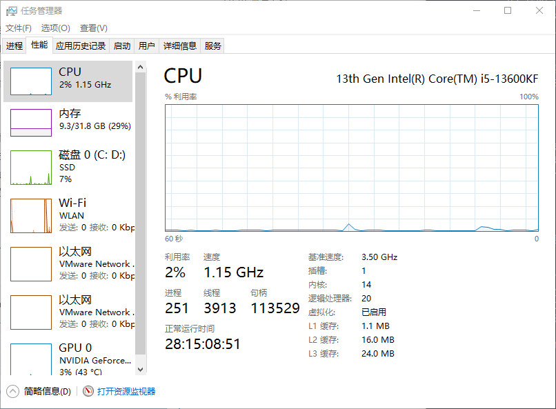

机器正在运行 251 个进程，有3913个线程。看 CPU 利用率读数：它显示我的 CPU “忙” 的时间是 2%，这意味着在 98% 的时间里，这 3913 个线程什么事情都没做————它们白白霸占着内存。线程未运行时，这些内存是不会使用的。

这些应用程序不需要这些在 98% 的时间里什么事情都不做的线程。

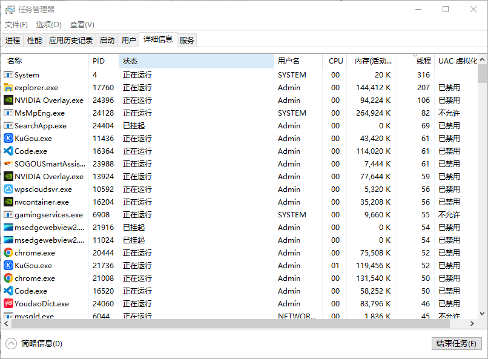

System 创建了 316 个线程，CPU 利用率却为 0%，在 Windows 中，进程是十分 ”昂贵“ 的。创建一个进程通常要花几秒钟的时间，必须分配大量内存，这些内存必须初始化， EXE 和 DLL 文件必须从磁盘上加载，等等。所以，开发人员决定停止创建进程，改为创建线程。这正是我们看到有这么多线程的原因。但是，虽然线程比进程廉价，它们和其他系统资源相比仍然十分昂贵，所以还是应该省着用，而且要用得恰当。

可以肯定地说，上面的所有这些应用程序都在以效率低下的方式使用线程。所有这些线程在系统中都没有存在的必要。在应用程序中分配资源是十分正常的一件事件，但分配了又不用纯属浪费！另外，为线程栈分配这么多内存，意味着一些更重要的数据(比如用户的文档)获得的内存变少了。

### 26.4 CPU 发展趋势
CPU 厂商过去只知道一味地提高 CPU 速度，但高速运行的CPU 会产生大量热量，用不了多久，CPU 和主板便会烧坏。

今天的计算机使用了以下三种 CPU 技术：
- 多个CPU（多路处理器）
  - 主板上有多个CPU插座，每个插入一个独立CPU
  - 体积大、成本高、功耗高，因此普通用户中不常见
- 超线程
  - Intel专利技术，一个物理CPU在操作系统中表现为两个逻辑CPU
  - 有两套架构状态（寄存器等），但共用一套执行单元，当一个线程因缓存未命中、分支预测错误或数据依赖而停顿时，硬件自动切换执行另一个线程。
  - 对操作系统透明，看似两个线程并发运行，实际共享执行资源
- 多核CPU
  - 一个芯片上集成多个独立的处理核心，每个核心能真正并行执行线程
  - 多核可与超线程结合，进一步提升并发性能

### 26.6 使用专用线程执行异步的计算限制操作
以下内容将讨论Thread显示创建线程执行计算限制操作。当然大多数创建下建议用线程池，只有在极少数需要特殊线程行为时（前台、长时间运行、特殊优先级、需强制终止）才显示使用Thread来创建专用线程。

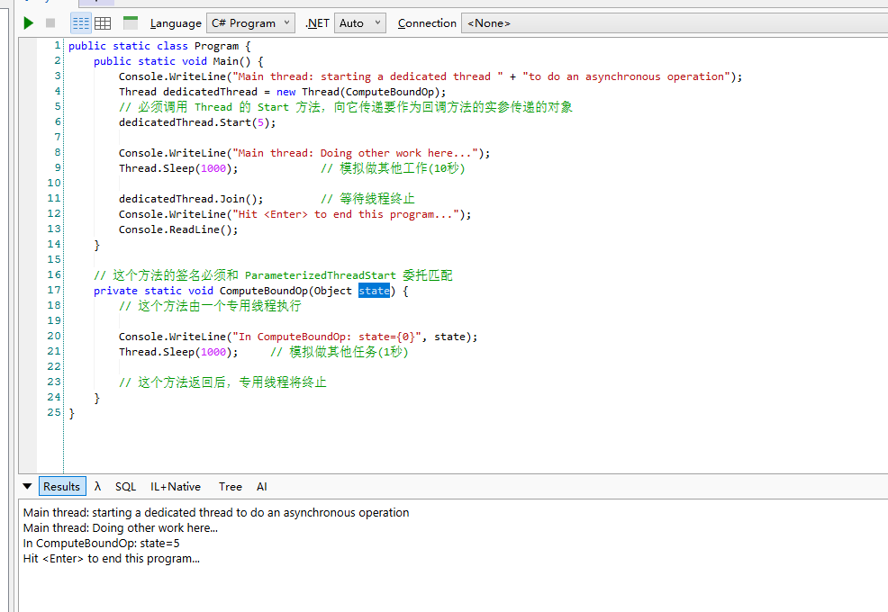

构造 Thread 对象是轻量级的操作，因为它并不实际创建一个操作系统线程。要实际创建操作系统线程，并让它开始执行回调方法，必须调用 Thread 的 Start 方法，向它传递要作为回调方法的实参传递的对象(状态)。

### 26.8 线程调度和优先级
抢占式操作系统必须使用算法判断在什么时候调度哪些线程多长时间。

- 每个线程的内核对象都包含一个上下文结构。上下文(context)结构反映了线程上一次执行完毕后 CPU 寄存器的状态
- 一个时间片之后， Windows 检查现在的所有线程内核对象
- 这些对象中，只有哪些没有正在等待什么的线程才适合调度。Windows 选择一个可调度的线程内核对象，并上下文切换到它，只有哪些没有正在等待什么的线程才适合调度
- 然后，线程开始执行代码，并在其进程的地址空间处理数据
- 过了一个时间片之后， Windows 执行下一次上下文切换。 Windows 从系统启动开始便一直执行上下文切换，直到系统关闭为止

Windows 之所以被称为抢占式多线程操作系统，是因为线程可在任何时间停止(被抢占)并调度另一个线程。

不能保证自己的线程一直运行，你阻止不了其他线程的运行。

<hr>

- 怎样保证线程在发生某个事件后的一段时间内开始运行?
- 怎样保证一个线程在网络有数据传来的 1 毫秒内开始运行?


实时操作系统能做出这样的保证，但 Windows 不是实时操作系统。

实时操作系统（RTOS）是一类操作系统，它最重要的目标不是“速度快”，而是 保证任务在严格的时间限制内完成。
换句话说，RTOS 强调 可预测性，而不是单纯的吞吐量。

实时操作系统应用场景：
- 汽车 ECU（发动机控制、刹车控制）
- 航空航天（飞控系统、卫星）
- 工业控制系统（机器人、数控机床）
- 医疗设备（心率监控、呼吸机）

当前较为广泛使用的 RTOS：
- VxWorks：广泛用于航空航天、防务和工业自动化领域
- RTEMS：开源，专为高性能嵌入式系统设计，常用于航空、通信和机器人领域


<hr>

每个线程都分配了从 0(最低)到 31(最高)的优先级。系统决定为 CPU 分配哪个线程时，首先检查优先级 31 的线程，并以一种轮流方式调度它们。

只要存在可调度的优先级 31 的线程，系统就永远不会将优先级 0~30 的任何线程分配给 CPU。这种情况称为饥饿。多处理器机器发生饥饿的可能性要小得多，因为这种机器上优先级为 31 的线程和优先级为 30 的线程可以同时运行。

系统启动时会创建一个特殊的零页线程。该线程的优先级是 0，而且是整个系统唯一优先级为 0 的线程。在没有其他线程需要“干活儿”的时候，零页线程将系统 RAM 的所有空闲页清零。

Microsoft 知道开发人员在为线程分配优先级时很难做到完全合理，为了解决这个问题，Windows 公开了优先级系统的一个抽象层。

设计应用程序时，要决定自己的应用程序需要比机器上同时运行的其他应用程序更大还是更小的响应能力，选择一个**进程优先级类**来反映：
- Idle
  - 在系统什么事情都不做的时候运行的应用程序(比如屏幕保护程序)适合分配 Idle 优先级类
- Below Normal
- Normal
- Above Normal
- High 
  - 只有绝对必要的时候才应使用 High 优先级类
- Realtime
  - Realtime优先级类要尽可能地避免
  - 甚至可能干扰操作系统任务，比如阻碍一些必要的磁盘 I/O 和网络传输
  - 用于需要响应延迟很短的硬件事件，或者要执行一些不能中断的“短命”任务

<hr>

优先级类和优先级是两个概念。

根据定义，每个线程的优先级取决于两个标准：
- 它的进程的优先级类
- 在其进程的优先级类中，线程的优先级

<hr>

选好优先级类之后将所有注意力放在应用程序的关系。Windows 支持 7 个相对线程优先级：
- Idle
- Lowest
- Below Normal
- Normal
- Above Normal
- Highest 
- Time-Critial

应用程序开发人员不直接操作0-31的线程优先级，而是通过设置进程优先级类 + 线程相对优先级，让系统将进程的优先级类和其中的一个线程的相对优先级映射成一个优先级(0~31)：


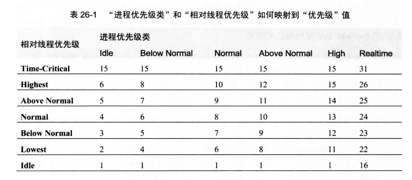

High 优先级进程中的 Normal 线程的优先级是 13。将进程优先级类更改为 Idle，线程的优先级变成 4。

表中没有值为 0 的线程优先级。这是因为 0 优先级保留给零页线程了，系统不允许其他线程的优先级为0。

以下优先级也不可获得：17，18，19，20，21，27，28，29 或者 30。以内核模式运行的设备驱动程序才能获得这些优先级；用户模式的应用程序不能。

<p style="color:gray">注意 “进程优先级类”的概念容易引起混淆。人们可能以为 Windows 在调度进程。事实上 Windows 永远不会调度进程，它只调度线程。“进程优先级类”是 Microsoft 提出的抽象概念，旨在帮助你理解自己的应用程序和其他正在运行的应用程序的关系，它没有别的用途。</p>

最好是降低一个线程的优先级，而不是提升另一个线程的优先级。如果线程要执行长时间的计算限制任务，一般应降低该线程的优先级。如果线程要快速响应某个事件，运行短暂时间，再回复为等待状态，则应提高该线程的优先级。

高优先级线程在其生存期的大多数时间里都应出于等待状态，这样才不至于影响系统的总体响应能力。

### 26.9 前台线程和后台线程
CLR 线程分为：
- 前台线程
  - 只要有前台线程在运行，CLR 就不会让进程结束
  - 前台线程执行确实想完成的任务，比如将数据从内存缓冲区 flush 到磁盘
- 后台线程
  - 如果进程里只剩下后台线程在运行，CLR 会强制结束整个进程
  - 非关键性任务则使用后台线程，比如重新计算电子表格的单元格，或者为记录建立索引等

  
```cs
public static class Program {
    public static void Main() {
        // 创建新线程(默认为前台线程)
        Thread t = new Thread(Worker);

        // 使线程称为后台线程
        t.IsBackground = true;

        t.Start();    // 启动线程
        // 如果 t 是前台线程，则应用程序大约 10 秒后才终止
        // 如果 t 是后台线程，则应用程序立即终止
        Console.WriteLine("Returning from Main");
    }

    private static void Worker() {
        Thread.Sleep(10000);        // 模拟做 10 秒钟的工作

        // 下面这行代码只有在由一个前台线程执行时才会显示
        Console.WriteLine("Returning from Worker");
    }
}
```

在线程的生存期中，任何时候都可以从前台变成后台，或者从后台变成前台。

应用程序的主线程以及通过构造一个 Thread 对象来显式创建的任何线程都默认为前台线程。

线程池线程默认为后台线程。另外，由进入托管执行环境的本机代码创建的任何线程都被标记为后台线程。

| 类型            | 默认 IsBackground | 是否阻止进程退出 |
| ------------- | --------------- | -------- |
| ThreadPool 线程 | true            | 否        |
| Task / async  | true            | 否        |
| new Thread()  | false           | 是        |

<hr>

- 当你启动 Web API（例如 dotnet run 或 IIS/Kestrel 托管）时，宿主进程（Host）会有一个 Main 线程或者类似的主线程
- 这个主线程是 前台线程，它负责：
  - 启动 Kestrel HTTP 服务器
  - 保持 Web Host 生命周期
  - 等待进程退出信号（Ctrl+C 或 StopHost）

Web API 进程至少有一个前台线程，保证应用不会因为线程池线程都是后台线程而意外退出。

<hr>

## 27 计算限制的异步操作
计算限制操作（Compute-bound operation）就是主要消耗 CPU 资源的操作。

Compute-bound = 计算限制

“限制”是指：这个任务的执行速度受 CPU 计算能力限制。

| 操作类型     | 是否 CPU 密集 | 是否 I/O 密集 |
| -------- | --------- | --------- |
| 大数组求和    | ✅         | ❌         |
| 图像处理     | ✅         | ❌         |
| 加密运算     | ✅         | ❌         |
| 从数据库读取数据 | ❌         | ✅         |
| HTTP 请求  | ❌         | ✅         |

| 维度       | 说明                                   | 示例                                  |
| -------- | ------------------------------------ | ----------------------------------- |
| **瓶颈类型** | CPU-bound（计算限制） vs I/O-bound（I/O 限制） | CPU-bound：矩阵运算<br>I/O-bound：HTTP 请求 |
| **执行方式** | 同步 vs 异步                             | 同步：调用线程阻塞等待<br>异步：调用线程不阻塞，任务完成后通知   |


| 瓶颈类型      | 同步              | 异步                         |
| --------- | --------------- | -------------------------- |
| CPU-bound | 调用线程自己做计算，阻塞    | 放到线程池或专用线程上执行，调用线程可继续做其他事  |
| I/O-bound | 调用线程阻塞等待 I/O 完成 | 用 async/await 异步等待，调用线程不阻塞 |


### 27.1 CLR 线程池基础

NET Core/现代 .NET 取消了 AppDomain 的大部分功能，所以每个应用程序进程就是 一个 CLR 实例，线程池、垃圾回收等都是全局共享的。

前面说过线程创建和销毁代价高，所以解决方法时使用线程池。

线程池的基本概念：
- 线程池是 CLR 管理的一组可重用线程
- 线程池初始化时没有线程，只有一个任务队列

线程池的工作机制：
- 任务入队：应用程序执行异步操作时，将任务记录项加入线程池队列
- 线程分配：线程池从队列取任务，派发给空闲线程执行
  - 如果没有线程就创建，执行后线程回到线程池
  - 如果程序发出的请求速度超过线程池处理速度，就会创建新的线程
- 线程复用：完成任务后，线程回到线程池空闲等待，不立即销毁
- 动态调整：
  - 如果任务太多，线程池会创建新线程、- 如果线程闲置时间过长，会自我终止释放资源

### 27.2 执行简单的计算限制操作
**流程：QueueUserWorkItem 提交任务 → 线程池线程执行 → 回调方法运行**

要将一个异步的计算限制操作放到线程池的队列中，通常可以调用 ThreadPool 类定义的以下方法之一：
```cs
static bool QueueUserWorkItem(WaitCallback callBack);
static bool QueueUserWorkItem(WaitCallback callBack, Object state);
```
ThreadPool 是 管理 CLR 全局线程池。

```cs
public static class Program {
    public static void Main() {
        Console.WriteLine("Main thread: queuing an asynchronous operation");
        // 向线程池的队列添加一个“工作项”(work item)以及可选的状态数据
        // 可向方法传递一个 state 实参(状态数据),对应回调的Object state
        ThreadPool.QueueUserWorkItem(ComputeBoundOp, 5);
        Console.WriteLine("Main thread: Doing other work here...");
        Thread.Sleep(10000);    // 模拟其他工作(10秒)
        Console.WriteLine("Hit <Enter> to end this program...");
        Console.ReadLine();
    }

// 回调方法必须匹配 delegate void WaitCallback(Object state);

    private static void ComputeBoundOp(Object state) {
        // 这个方法由一个线程池线程执行

        Console.WriteLine("In ComputeBoundOp: state={0}", state);
        Thread.Sleep(1000);             // 模拟其他工作(1秒)

        // 这个方法返回后，线程回到池中，等待另一个任务
    }
}
```

### 27.3 执行上下文

每个线程都关联了一个执行上下文数据结构。

执行上下文包括的东西有：
- 安全设置(压缩栈、Thread 的 Principal属性和 Windows 身份)
- 宿主设置(参见 System.Threading.HostExecutionContextManager)
- 逻辑调用上下文数据(参见System.Runtime.Remoting.Messaging.CallContext 的 LogicalSetData 和 LogicalGetData方法)

线程执行它的代码时，一些操作会受到线程执行上下文设置(尤其是安全设置)的影响。理想情况下，每当一个线程(初始线程)使用另一个线程(辅助线程)执行任务时，前者的执行上下文应该流向(复制到)辅助线程。

这会对性能造成一定影响。这是因为执行上下文中包含大量信息，而收集所有这些信息，再把它们复制到辅助线程，要耗费不少时间。

System.Threading命名空间有一个 ExecutionContext 类，它允许你控制线程的执行上下文如何从一个线程“流”向另一个。

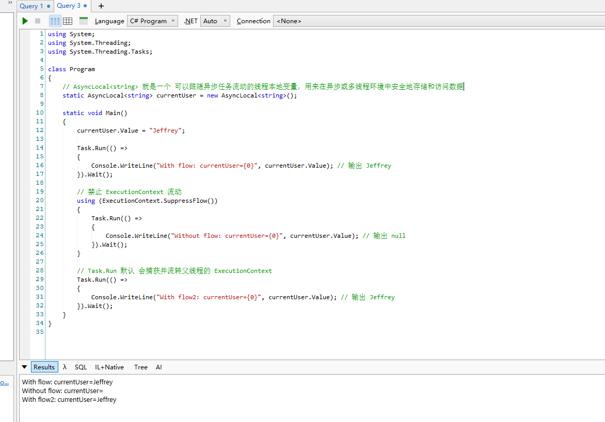

可用这个类阻止执行上下文流动以提升应用程序的性能。对于服务器应用程序，性能的提升可能非常显著。但客户端应用程序的性能提升不了多少。

用Task和用ThreadPool.QueueUseWorkItem阻止执行上下文流动是一样的。

- Task.Run = 对线程池 + ExecutionContext + 异常/返回值处理的封装
- ThreadPool.QueueUserWorkItem = 直接排工作项到线程池，比较底层，功能简单


### 27.4 协作式取消和超时
Microsoft .NET 提供了标准的取消操作模式。这个模式是协作式的，意味着要取消的操作必须显式支持取消。

取消操作首先要创建一个 System.Threading.CancellationTokenSource 对象。

构造好一个 CancellationTokenSource(一个引用类型)之后，可从它的 Token 属性获得一个或多个CancellationToken(一个值类型)实例，并传给你的操作，使操作可以取消。

CancellationToken 实例是轻量级值类型，包含单个私有字段，即对其 CancellationTokenSource 对象的引用。

在计算限制操作的循环中，可定时调用 CancellationToken 的 IsCancellationRequested 属性，了解循环是否应该提前终止。

```cs
using System.Threading.Tasks;

var cts = new CancellationTokenSource();

// 多个CancellationToken实例
Task.Run(async () =>
{
    await Task.Delay(2000, cts.Token);
    Console.WriteLine("Task1 done");
}, cts.Token);

Task.Run(async () =>
{
    await Task.Delay(3000, cts.Token);
    Console.WriteLine("Task2 done");
}, cts.Token);

Thread.Sleep(1000);
cts.Cancel(); // 两个任务都会被取消
```

 要执行一个不允许被取消的操作，可向该操作传递通过调用CancellationToken.None,该属性返回一个特殊的CancellationToken实例，它不和任何CancellationTokenSource对象关联，所以没有代码能调用 Cancel。

default(CancellationToken) 与 CancellationToken.None 在语义上一样，表示“不可取消的 token”。

可调用 CancellationTokenSource 的 Register 方法登记一个或多个在取消一个 CancellationTokenSource 时调用的方法。
- 传递一个 Action\<Object\> 委托
- 传递一个Boolean值(名为useSynchronizationContext)，指明是否要使用调用线程的 SynchronizationContext 来调用委托
  - false 调用Cancel 的线程会顺序调用已登记的所有方法 （在线程池继续执行）也就是回调在 Cancel 的线程执行
  - true 回调(方法)会被 send(而不是post)给已捕捉的 SynchronizationContext 对象 （回到调用线程的 上下文） 也就是回调在捕获的上下文中执行，并且是同步（Send），所以 Cancel 会等到执行完才返回
  - ASP.NET Core 默认没有 SynchronizationContext，所以即使你传 true，也不会切回 UI/请求线程，大多数情况表现跟 false 一样

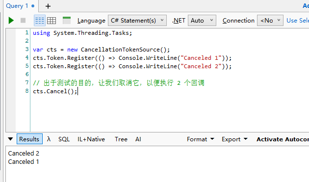


一个关联其他CancellationTokenSource的demo:

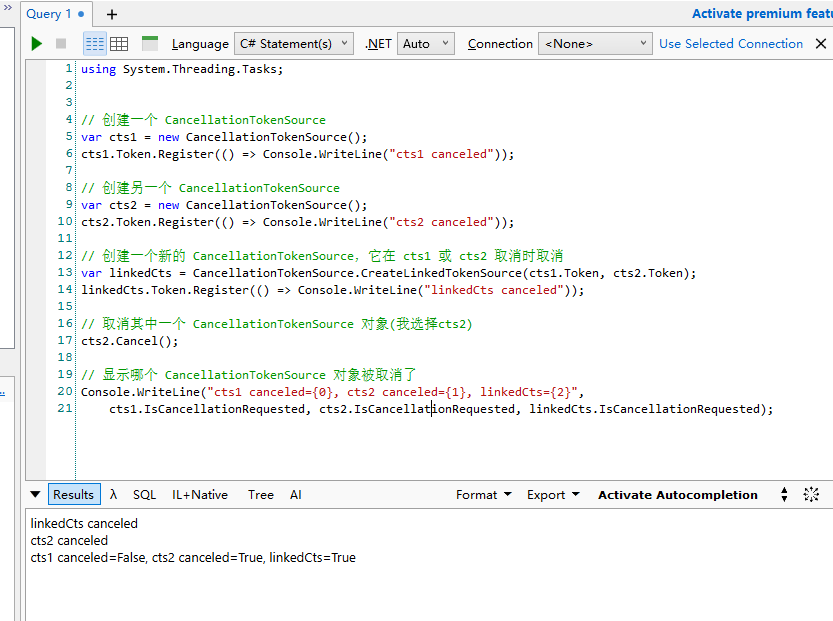


### 27.5 任务
用 QueueUserWorkItem 时的困境：
```cs
ThreadPool.QueueUserWorkItem(_ =>
{
    Thread.Sleep(1000);
    Console.WriteLine("工作完成");
    return 42; // <-- 这个返回值丢了，调用方拿不到
});

Console.WriteLine("主线程继续");
```

Task 就是为了解决这个问题设计的。

```cs
Task<int> t = Task.Run(() =>
{
    Thread.Sleep(1000);
    return 42;
});

int result = t.Result; // 等待任务完成并拿到返回值
Console.WriteLine($"工作完成，结果={result}");
```

QueueUserWorkItem它的回调是“fire-and-forget”（发出去就不管了），调用方没有办法 等待、取消、拿返回值，除非你自己造一堆额外的同步工具。而 Task 把这些都 内建 进来，不需要开发者重复造轮子。

```cs
ThreadPool.QueueUserWorkItem(ComputeBoundOp, 5);    // 调用 QueueUserWorkItem
new Task(ComputeBoundOp, 5).Start();                // 用 Task 来做相同的事情
Task.Run(() => ComputeBoundOp(5));                  // 另一个等价的写法
```

Task参数：
- Action 或 Action\<Object\> 委托，new Task还可传递传给操作的实参
- 调用 Run 时可以传递一个 Action 或 Func\<TResult\> 委托来指定想要执行的操作
- 可选择传递一个 CancellationToken
- 可选择向构造器传递一些 TaskCreationOptions 标志来控制 Task 的执行方式
  ```cs
  public enum TaskCreationOptions {
    None           = 0x0000,      // 默认
    
      // 提议 TaskScheduler 你希望该任务尽快执行
    PreferFairness = 0x0001,
    
      // 提议 TaskScheduler 应尽可能地创建线程池线程
    LongRunning    = 0x0002,
    
      // 该提议总是被采纳：将一个 Task 和它的父 Task 关联(稍后讨论)
    AttachedToParent = 0x0004,
    
      // 该提议总是被采纳：如果一个任务试图和这个父任务连接，它就是一个普通任务，而不是子任务
    DenyChildAttach = 0x0008,
    
      // 该提议总是被采纳：强迫子任务使用默认调度器而不是父任务的调度器
    HideScheduler = 0x0010
  }
  ```
  - 有的标志只是“提议”，TaskScheduler 在调度一个 Task 时，可能会、也可能不会采纳这些提议


```cs
using System.Threading.Tasks;

Task t = new Task(
    () => Console.WriteLine("工作中..."),
    CancellationToken.None,
    TaskCreationOptions.LongRunning | TaskCreationOptions.DenyChildAttach
);
t.Start();
```


#### 27.5.1 等待任务完成并获取结果
```cs
// 创建一个 Task(现在还没有开始运行)
Task<Int32> t = new Task<Int32>(n => Sum((Int32)n), 1000000000);

// 可以后再启动任务
t.Start();

// 可选择显式等待任务完成
t.Wait();   // 注意：还有一些重载的版本能接受 timeout/CancellationToken 值

// 可获得结果(Result 属性内部会调用 Wait)
Console.WriteLine("The Sum is: " + t.Result);   // 一个 Int32 值
```

线程调用 Wait 方法时，系统检查线程要等待的 Task 是否已开始执行
- 如果 Task 已经在运行，Wait() 会阻塞，直到 Task 完成
- 如果 Task 已经完成，Wait() 会立即返回，不阻塞
- 如果 Task 还没开始执行, 系统可能让调用 Wait() 的线程直接去执行这个 Task（内联执行）

AggregateException 类型封装了异常对象的一个集合。当 父任务有多个子任务抛出异常 时，异常会被封装成一个 AggregateException 对象。
- InnerExceptions 属性：返回所有子异常的只读集合
- InnerException属性：是AggregateException 类从 System.Exception 基类继承的，只返回第一个异常
- 提供辅助方法：
  - Flatten()：把嵌套的 AggregateException 展平成一个平坦的集合
  - Handle(Func\<Exception, bool\>)：为每个异常调用回调方法，返回 true 表示处理完成，否则重新抛出未处理的异常
  - GetBaseException()：返回最底层的根本异常

Task 异常观察
- 如果不调用 Wait() / Result / Exception，Task 异常可能被忽略
- 为了捕获未观察到的异常，可以注册 TaskScheduler.UnobservedTaskException 事件
- 当 Task 被垃圾回收且异常未被观察时，会触发该事件，传入 UnobservedTaskExceptionEventArgs，包含异常对象

等待 Task
- 单个 Task：调用 Wait() 或读取 Result，线程会阻塞直到 Task 完成
- 多个 Task：提供两个静态方法：
  - WaitAny(Task[] tasks, …)：阻塞直到任意一个 Task 完成，返回完成的 Task 索引
  - WaitAll(Task[] tasks, …)：阻塞直到所有 Task 完成，返回 true/false 表示是否完成

<p style="color:grey">调用Wait()和在Task前面加await是不一样的，当遇到 await 时，如果任务还没完成，当前方法会“挂起”，把控制权还给调用方，线程不会阻塞，可以继续执行其他任务。</p>

#### 27.5.2 取消任务
看前面的demo，就是把CancellationToken传给Task

#### 27.5.3 任务完成时自动启动新任务
伸缩性好的软件不应该使线程阻塞。调用 Wait，或者在任务尚未完成时查询任务的 Result 属性，极有可能造成线程池创建新线程，这增大了资源的消耗，也不利于性能和伸缩性。

更好的办法可以知道一个任务在什么时候结束运行。任务完成时可启动另一个任务。

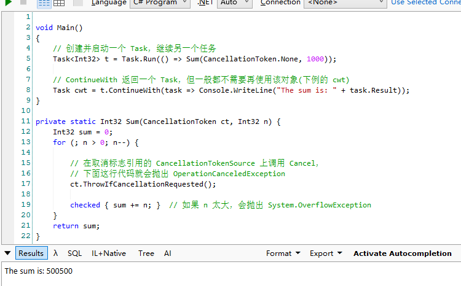

上面的代码当前线程不会阻塞，但委托默认可能在线程池线程里运行（不是当前上下文），所以也不想await，更像是事件回调。

执行 Sum 的任务完成时会启动另一个任务(也在某个线程池线程上)以显示结果。

Task 对象内部包含了 ContinueWith 任务的一个集合。所以，实际可以用一个 Task 对象来多次调用 ContinueWith。任务完成时，所有ContinueWith 任务都会进入线程池的队列中。

可在调用 ContinueWith 时传递对一组 TaskContinuationOptions 枚举值进行按位 OR 运算的结果。前 6 个标志(None，PreferFairness，LongRunning，AttachedToParent，DenyChildAttach 和 HideScheduler)与之前描述的 TaskCreationOptions 枚举类型提供的标志完全一致。

默认情况下，如果不指定上述任何标志，则新任务无论如何都会运行，不管第一个任务如何完成。一个 Task 完成时，它的所有未运行的延续任务都被自动取消。

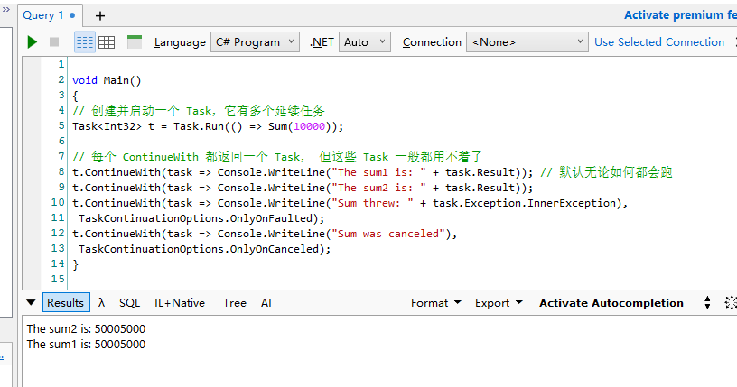

#### 27.5.4 任务可以启动子任务

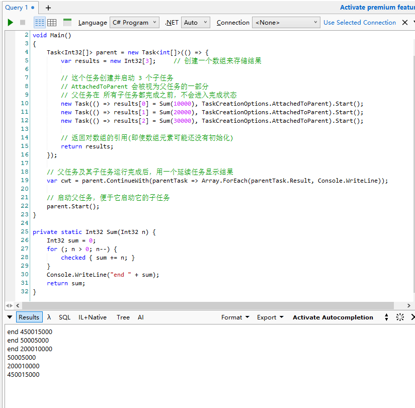


这里的 parent 只是一个 还没启动的 Task。

只有当对 parent 调用 Start() 或者 parent.RunSynchronously() 的时候，里面的委托才会被执行。而“里面的委托”负责 创建并启动子任务。也就是说：子任务的创建和启动逻辑根本没有机会运行，因为父任务还没跑。

#### 27.5.5 任务内部揭秘
Task 对象的组成,每个 Task 内部维护一堆字段:
- ID（首次访问 Id 属性时分配，调试器里用来区分任务）
- 状态（TaskStatus 枚举）
- 父任务的引用（支持附加子任务）
- TaskScheduler 的引用（控制如何调度执行）
- 回调方法和参数（即要执行的委托与 AsyncState）
- ExecutionContext（捕获调用线程的执行上下文）
- ManualResetEventSlim（用于 Wait() 等场景阻塞等待）
- 补充状态（例如 CancellationToken、continuation 集合、异常集合等）


Task 的生命周期,Status属性返回一个TaskStatus:
- WaitingForActivation → 框架创建的，等内部触发（例如 ContinueWith）。
- WaitingToRun → 已经调度，等线程池分配线程。
- Running → 正在执行。
- WaitingForChildrenToComplete → 本身完成了，但要等子任务结束。
- 结束态（3 种之一）：
  - RanToCompletion
  - Canceled
  - Faulted

ContinueWith(...) 创建的新任务一开始是 WaitingForActivation 状态。

Task 和 Task\<TResult\> 实现了 IDisposable，但默认只用来清理内部的 ManualResetEventSlim。

一般不需要手动调用 Dispose()，让 GC 自己清理就好。

除非派生自 Task 并分配了额外资源，那才需要显式释放。

如果只需要最轻量级的后台执行，可以直接用 ThreadPool.QueueUserWorkItem，开销更小。但绝大多数业务场景，还是推荐用 Task，因为它和 async/await、异常处理等更好集成。

#### 27.5.6 任务工厂
有时需要创建一组共享相同配置的 Task 对象。为避免机械地将相同的参数传给每个 Task 的构造器。可使用TaskFactory 和 TaskFactory\<TResult\> 类型。

```cs
Task parent = new Task(() => {
    var cts = new CancellationTokenSource();
    var tf = new TaskFactory<Int32>(cts.Token,
        TaskCreationOptions.AttachedToParent,
        TaskContinuationOptions.ExecuteSynchronously,
        TaskScheduler.Default);

    // 这个任务创建并启动 3 个子任务
    var childTasks = new[] {
        tf.StartNew(() => Sum(10000)),
        tf.StartNew(()=> Sum(20000)),
        tf.StartNew(()=> Sum(Int32.MaxValue)) // 太大，抛出 OverflowException
    };

    // 任何子任务抛出异常，就取消其余子任务
    for (Int32 task = 0; task < childTasks.Length; task++)
        childTasks[task].ContinueWith(
            t => cts.Cancel(), TaskContinuationOptions.OnlyOnFaulted);

    // 所有子任务完成后，从未出错/未取消的任务获取返回的最大值，
    // 然后将最大值传给另一个任务来显示最大结果
    tf.ContinueWhenAll(
        childTasks,
        completedTasks => completedTasks.Where(t => !t.IsFaulted && !t.IsCanceled).Max(t => t.Result),
        CancellationToken.None)
            .ContinueWith(t => Console.WriteLine("The maximum is: " + t.Result),
                TaskContinuationOptions.ExecuteSynchronously);                        
});

// 启动父任务，使它能启动子任务
parent.Start();
```

#### 27.5.7 任务调度器
Task 的灵活性主要来自于 TaskScheduler，它决定了“任务在哪里、怎样跑”。

FCL提供两个派生自TaskScheduler的类型：
- 线程池任务调度器 (Thread Pool Task Scheduler) web api默认用的
  - 默认的调度器：TaskScheduler.Default
  - 所有 Task.Run()、Task.Factory.StartNew() 默认都走这个
  - 本质就是把任务放到 CLR 线程池，线程池会动态分配工作线程去跑。
- 同步上下文任务调度器 (Synchronization Context Task Scheduler)
  - 通过 TaskScheduler.FromCurrentSynchronizationContext() 获取
  - 常用于 UI 应用（WinForms、WPF、UWP）
  - 不是线程池线程，而是把任务排到 UI 消息循环里
    - 在 Windows GUI 程序（WinForms、WPF 等）里，只有一个主线程负责绘制界面、响应用户事件。
    - 这个线程运行着一个 消息循环，不断取出消息（鼠标点击、键盘输入、重绘事件等），然后调用对应的回调
    - 所有控件（按钮、文本框等）的更新，都必须在这个 UI 线程里执行
  - UI 同步上下文调度器是怎么做
    - 当用 TaskScheduler.FromCurrentSynchronizationContext() 获取 UI 调度器时
      - continuation 不会去线程池，而是被放入 UI 消息循环里作为一个消息
      - 消息循环最终会在 UI 线程 上取出消息，执行 continuation 的代码
      - 这样保证了 UI 更新总是在正确的线程里运行

错误示例（跨线程更新 UI，抛异常）
```cs
Task.Run(() =>
{
    button.Text = "更新"; // 在后台线程，直接操作 UI 控件会抛异常
});
```

正确示例（回到 UI 消息循环）
```cs
var uiScheduler = TaskScheduler.FromCurrentSynchronizationContext();

Task.Run(() =>
{
    return "更新成功";
})
.ContinueWith(t =>
{
    button.Text = t.Result; // 在 UI 线程执行，可以安全修改控件
}, uiScheduler);
```

这里 ContinueWith 的第二个参数 uiScheduler 就是 同步上下文任务调度器，它会把 continuation 任务排到 UI 消息循环中，所以最终由 UI 线程来运行。

### Parallel 的静态 For，ForEach 和 Invoke方法
一些常见的编程情形可通过任务提升性能。

```cs
// 一个线程顺序执行这个工作(每次迭代调用一次 DoWork)
for (Int32 i = 0; i < 1000; i++) DoWork(i);

// 线程池的线程并行处理工作
Parallel.For(0, 1000, i => DoWork(i));

// 一个线程顺序执行这个工作(每次迭代调用一次 DoWork)
foreach (var item in collection) DoWork(item);

// 线程池的线程并行处理工作
Parallel.ForEach(collection, item => DoWork(item));
```

**如果既可以使用 For， 也可以使用 ForEach， 那么建议使用 For，因为它执行得更快。**

Parallel.For 或 Parallel.ForEach每个迭代都是独立任务，如果某个迭代抛异常,其他迭代仍然继续执行，不会被立刻中断,但所有异常会被收集，在 Parallel 退出时统一抛出 AggregateException。

调用 Parallel 的方法时有一个很重要的前提条件：
- 工作项必须能并行执行
- 要避免会修改任何共享数据的工作项，否则多个线程同时处理可能会损坏数据，解决这个问题一般的办法是围绕数据访问添加线程同步锁，这样也无法享受并行带来的好处，所以还不如不用

Parallel 的方法本身也有开销；委托对象必须分配，而针对每个工作项都要调用一次这些委托。如果有大量可由多个线程处理的工作项，那么也许能获得性能的提升。另外，如果每一项都涉及大量工作，那么通过委托来调用所产生的性能损失是可以忽略不计的。但如果只为区区几个工作项使用 Parallel 的方法，或者为处理得非常快的工作项使用 Parallel 的方法，就会得不偿失，反而降低性能。

<hr>

**下面的知识点非常重要！！！**
一个是否选择Parallel的方法：
- CPU 密集 → Parallel 并行
- IO 密集 → async/await 异步并发

Parallel 的执行方式
- Parallel.For / Parallel.ForEach 会把迭代任务分发到 线程池线程
- 默认情况下，线程数大约 = CPU 核心数 × 1~2
- 每个迭代占用一个线程直到完成（阻塞线程）
- 所以适合 CPU 密集型任务，因为希望多个核心同时做计算

IO 密集型任务的问题
- IO 操作（HTTP 请求、数据库访问）大部分时间是 等待
- 如果用 Parallel：
  - 每个迭代都阻塞线程等待 IO 完成
  - 线程池线程被占用 → 其他任务排队
  - 并行化带来的 CPU 利用率提升非常小

IO 密集 可以使用Task.WhenAll
- Task.WhenAll 发起的是 异步任务（非阻塞线程）
- 同时可以创建成百上千个异步任务，但线程不会被阻塞
- CPU 核心只在处理回调和结果计算时才占用

Parallel本身就可以限制同时运行的线程，而对异步 Task，可以用 信号量 限制同时执行数量：
```cs
SemaphoreSlim sem = new SemaphoreSlim(4); // 同时最多 4 个任务
var tasks = urls.Select(async url =>
{
    await sem.WaitAsync();
    try
    {
        await httpClient.GetStringAsync(url);
    }
    finally
    {
        sem.Release();
    }
});
await Task.WhenAll(tasks);
```

<hr>

### 27.7 并行语言集成查询(PLINQ)
顺序 LINQ vs 并行 LINQ
- 顺序 LINQ：使用 IEnumerable 遍历数据，单线程顺序处理数据项
- 并行 LINQ（PLINQ）：使用 ParallelEnumerable 类，将数据项分发到多个线程并行处理，从而加速 CPU 密集型任务

- AsParallel() 将顺序查询转换成并行查询
- AsSequential() 从执行并行操作切换回执行顺序操作
- ForAll() 多个线程同时处理结果
  - 若执行涉及线程不安全操作（如 Console.WriteLine），可能损害性能
- AsOrdered() 让 PLINQ 保持数据项的顺序 
  - 调用这个方法时，线程会成组处理数据项。然后，这些组被合并回去，同时保持顺序。这样会损害性能
  - 以下操作符生成不排序的操作：Distinct，Except，Intersect，Union，Join，GroupBy，GroupJoin 和 ToLookup
  - 在这些操作符之后要再次强制排序，只需调用AsOrdered 方法
  - 要再次恢复不排序的处理，只需调用 AsUnordered 方法

```cs
void Main()
{
        // 准备数据
        int[] numbers = Enumerable.Range(1, 20).ToArray();

        Console.WriteLine("===== 顺序 LINQ =====");
        var sequentialQuery = numbers
            .Where(x => x > 10)
            .Select(x => x * x);

        foreach (var item in sequentialQuery)
        {
            Console.WriteLine($"Thread {Thread.CurrentThread.ManagedThreadId} - {item}");
        }

        Console.WriteLine("\n===== 并行 PLINQ =====");
        var parallelQuery = numbers.AsParallel()
                                   .Where(x => x > 10)
                                   .Select(x => x * x);

        // 注意：foreach 默认顺序遍历结果（顺序处理），计算已经并行
        foreach (var item in parallelQuery)
        {
            Console.WriteLine($"Thread {Thread.CurrentThread.ManagedThreadId} - {item}");
        }

        Console.WriteLine("\n===== PLINQ ForAll 并行处理结果 =====");
        // ForAll 允许多个线程同时处理结果
        parallelQuery.ForAll(item =>
        {
            Console.WriteLine($"Thread {Thread.CurrentThread.ManagedThreadId} - {item}");
        });

        Console.WriteLine("\n===== PLINQ 保持顺序 AsOrdered =====");
        var orderedQuery = numbers.AsParallel()
                                  .AsOrdered()       // 保持顺序
                                  .Where(x => x > 10)
                                  .Select(x => x * x);

        orderedQuery.ForAll(item =>
        {
            Console.WriteLine($"Thread {Thread.CurrentThread.ManagedThreadId} - {item}");
        });

        Console.WriteLine("\n===== PLINQ 控制并行度 WithDegreeOfParallelism(2) =====");
        var limitedParallel = numbers.AsParallel()
                                     .WithDegreeOfParallelism(2)
                                     .Where(x => x > 10)
                                     .Select(x => x * x);

        limitedParallel.ForAll(item =>
        {
            Console.WriteLine($"Thread {Thread.CurrentThread.ManagedThreadId} - {item}");
        });

        Console.WriteLine("\n===== 演示结束 =====");
}
```

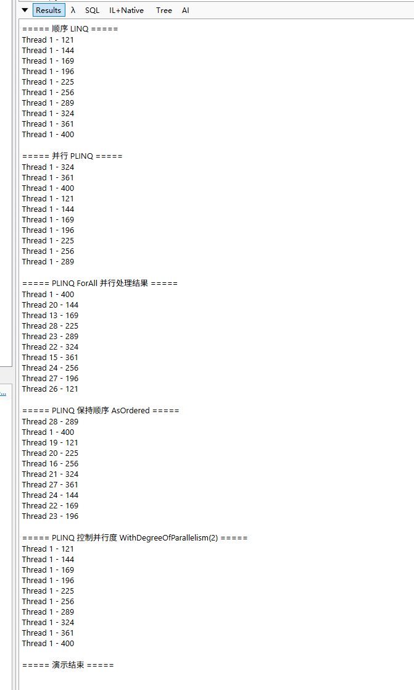

PLINQ 提供多个扩展方法控制执行方式：
| 方法                                         | 功能                                               |
| ------------------------------------------ | ------------------------------------------------ |
| `WithCancellation(CancellationToken)`      | 支持提前取消查询                                         |
| `WithDegreeOfParallelism(int)`             | 限制最大并行线程数（一般不超过 CPU 核心数）                         |
| `WithExecutionMode(ParallelExecutionMode)` | 强制并行或让系统选择（Default/ForceParallelism）             |
| `WithMergeOptions(ParallelMergeOptions)`   | 控制结果缓冲策略（NotBuffered/AutoBuffered/FullyBuffered） |


适用场景：处理大量数据项且每项操作耗时明显（CPU 密集型任务），并行能获得显著性能提升

不适用场景：
- 数据项少或操作非常快 → 并行开销可能抵消收益
- 包含同步 I/O 操作 → 线程被阻塞，影响性能

<hr>

```cs
var query = collection.AsParallel()
                      .Where(x => x > 10)
                      .Select(x => x * x);
```

PLINQ 会做以下事情：
- 数据分块
  - 假设 CPU 有 4 核心，集合有 1000 个元素
  - PLINQ 会把集合分成 4 份，每份大约 250 个元素
  - 每块数据独立处理，不依赖其他块
- 分配线程（线程池）
  - 每个数据块被分配到 线程池线程，多个块可以同时处理
  - 线程池线程并行执行 Where 和 Select 里的逻辑
- 合并结果
  - 每个线程得到自己块的查询结果
  - PLINQ 最终将结果合并成一个 ParallelQuery 对象
  - 默认是无序合并，如果调用 AsOrdered() 会保持原顺序，但可能牺牲一点性能


<hr>

### 27.8 执行定时的计算限制操作
System.Threading 命名空间定义了一个 Timer 类，可用它让一个线程池线程定时调用一个方法。

Timer定义：
```cs
public sealed class Timer : MarshalByRefObject, IDisposable {
    public Timer(TimerCallback callback, Object state, Int32    dueTime, Int32 period);
    public Timer(TimerCallback callback, Object state, UInt32   dueTime, UInt32 period);
    public Timer(TimerCallback callback, Object state, Int64    dueTime, Int64 period);
    public Timer(TimerCallback callback, Object state, TimeSpan dueTime, TimeSpan period)
}
```

- 写的回调方法必须和System.Threading.TimerCallback 委托类型匹配 `delegate void TimerCallback(Object state);`
- state 参数允许在每次调用回调方法时都向它传递状态数据
- dueTime参数告诉CLR 在首次调用回调方法之前要等待多少毫秒
- period指定了以后每次调用回调方法之前要等多少毫秒。如果为这个参数传递 Timeout.Infinite(-1)，线程池线程只调用回调方法一次

在内部，线程池为所有 Timer 对象只使用了一个线程。这个线程知道下一个 Timer 对象在什么时候到期(计时器还有多久触发)。下一个 Timer 对象到期时，线程就会唤醒，在内部调用 ThreadPool 的 QueueUserWorkItem， 将一个工作项添加到线程池的队列中，使回调方法得到调用。

如果回调方法的执行时间很长，计时器可能(在上个回调还没有完成的时候)再次触发。这可能造成多个线程池线程同时执行这个回调方法，解决方法是：构造 Timer 时，为 period 参数指定 Timeout.Infinite。这样，计时器就只触发一次。然后，在回调方法中，调用 Change 方法来指定一个新的 dueTime，并再次为 period 参数指定 Timeout.Infinite

```cs
using System;
using System.Threading;

class TimerDemo
{
    // 保持 Timer 引用，防止被垃圾回收
    private static Timer _timer;

    static void Main()
    {
        Console.WriteLine("Timer demo: 每 2 秒执行一次任务，避免重叠\n");

        // 创建 Timer，但暂不启动
        _timer = new Timer(TimerCallbackMethod, null, Timeout.Infinite, Timeout.Infinite);

        // 启动 Timer，首次立即执行
        _timer.Change(0, Timeout.Infinite);

        Console.WriteLine("按回车退出...");
        Console.ReadLine();

        // 停止并释放 Timer
        _timer.Dispose();
    }

    private static void TimerCallbackMethod(object state)
    {
        Console.WriteLine($"[{DateTime.Now:HH:mm:ss.fff}] 开始执行回调，线程ID: {Thread.CurrentThread.ManagedThreadId}");

        // 模拟耗时操作
        Thread.Sleep(1500);  // 1.5 秒

        Console.WriteLine($"[{DateTime.Now:HH:mm:ss.fff}] 回调完成，线程ID: {Thread.CurrentThread.ManagedThreadId}");

        // 2 秒后再次触发 Timer（避免回调重叠）
        _timer.Change(2000, Timeout.Infinite);
    }
}

```

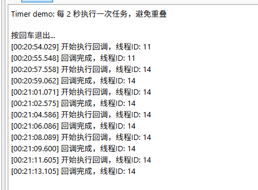

Timer 对象被垃圾回收时，它的终结代码告诉线程池取消计时器，使它不再触发。所以，使用 Timer 对象时，要确定有一个变量在保持 Timer 对象的存活，否则对你的回调方法的调用就会停止。

<hr>

问题：对于一个服务器，CPU一般很少吧，但一般一个服务器有很多应用程序，线程数远远大于CPU数

线程数远大于 CPU 核心数是正常的，特别是服务器环境
关键是任务类型：
- CPU 密集 → 控制线程数
- IO 密集 → 可以多线程或异步
程池和操作系统调度机制可以让少量 CPU 核心高效处理大量并发请求

总结：CPU密集就是长时间运行的任务，所以需要控制线程数约等于线程数，因为实际运行就是CPU核心数，只是通过时间轮片调度多个线程的，如果是长时间任务过多线程就会减低效率。

<hr>

##  28  I/O 限制的异步操作
异步执行 I/O 限制的操作，允许将任务交由硬件设备处理，期间完全不占用线程和 CPU 资源。

### 28.1 Windows 如何执行 I/O 操作

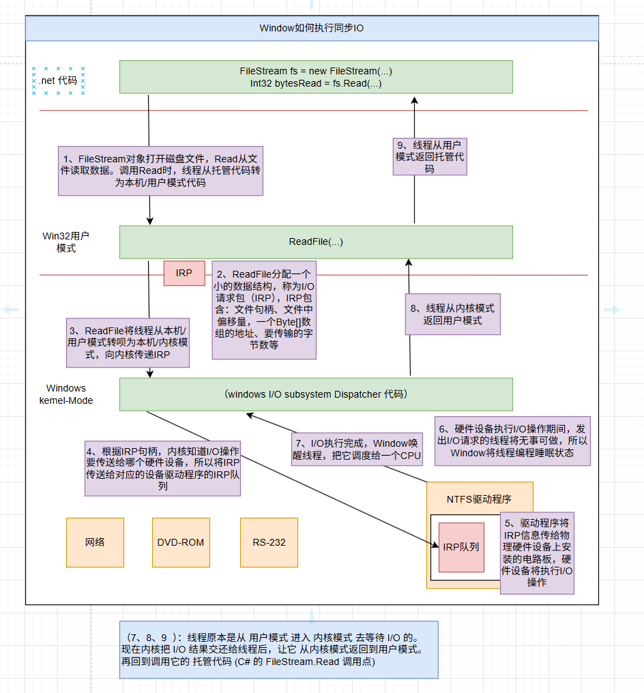

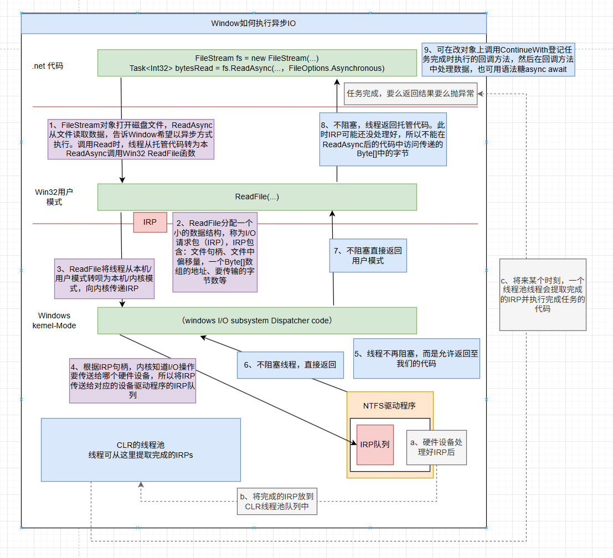

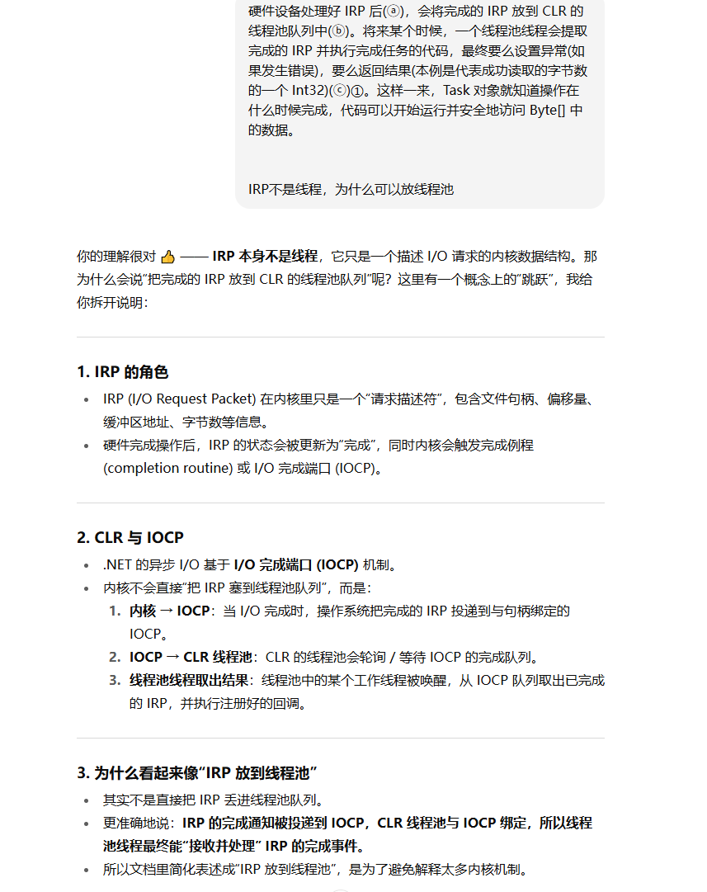

### 28.2 C# 的异步函数
```cs
private static async Task<String> IssueClientRequestAsync(String serverName, String message) {
    using(var pipe = new NamedPipeClientStream(serverName, 'PipeName', PipeDirection.InOut, PipeOptions.Asynchronous | PipeOptions.WriteThrough)) {
        pipe.Connect();     // 必须在设置 ReadMode 之前连接
        pipe.ReadMode = PipeTransmissionMode.Message;

        // 将数据异步发送给服务器
        Byte[] request = Encoding.UTF8.GetBytes(message);
        await pipe.WriteAsync(request, 0, request.Length);

        // 异步读取服务器的响应
        Byte[] response = new Byte[1000];
        Int32 butesRead = await pipe.ReadAsync(response, 0, response.Length);
        return Encoding.UTF8.GetString(response, 0, butesRead);
    } // 关闭管道
}
```
原理：
- 用 async 修饰的方法会被编译器改写成一个状态机
- 方法返回一个 Task 或 Task\<TResult\>，代表“未来某时完成的结果”
- await 关键字会
  - 调用 Task.ContinueWith 注册一个“继续执行”的回调
  - 方法提前返回（挂起），把控制权还给调用者
- 当底层 I/O 完成时，线程池线程会触发回调，状态机恢复执行，继续从 await 之后的代码运行

以上面代码为例，解析I/O 异步执行过程：
- IssueClientRequestAsync 被调用 → 创建流、连接管道、发消息
- WriteAsync 返回一个 Task，方法遇到 await → 挂起 → 返回给调用者
- 管道写入完成 → 驱动程序通知内核 → IOCP 通知 CLR → 线程池线程恢复状态机
- 方法继续执行，调用 ReadAsync
- ReadAsync 返回 Task\<int\> → 方法再次挂起 → 返回给调用者
- 管道读完成 → IOCP → 线程池线程恢复状态机
- 方法继续执行，取出结果，关闭管道，返回字符串

异步函数存在以下限制：
- 不能把 Main 方法、构造函数、属性访问器、事件访问器标记为 async
- 不能使用 out/ref 参数
- catch、finally、unsafe 块里不能用 await
- 不能在 lock 块里 await（因为 await 前后可能在不同线程恢复，会破坏锁语义）
- 在查询表达式中，await 只能用于初始 from 或 join 子句的集合表达式

### 28.3 编译器如何将异步函数转换成状态机
https://sharplab.io/

```cs
using System;
using System.Threading.Tasks;

class Program
{
    static async Task Main()
    {
        Console.WriteLine("Before await");
        await SayHelloAsync();
        Console.WriteLine("After await");
    }

    static async Task SayHelloAsync()
    {
        await Task.Delay(1000);
        Console.WriteLine("Hello, world!");
    }
}
```

```cs
using System;
using System.Diagnostics;
using System.Reflection;
using System.Runtime.CompilerServices;
using System.Security;
using System.Security.Permissions;
using System.Threading.Tasks;

[assembly: CompilationRelaxations(8)]
[assembly: RuntimeCompatibility(WrapNonExceptionThrows = true)]
[assembly: Debuggable(DebuggableAttribute.DebuggingModes.Default | DebuggableAttribute.DebuggingModes.IgnoreSymbolStoreSequencePoints | DebuggableAttribute.DebuggingModes.EnableEditAndContinue | DebuggableAttribute.DebuggingModes.DisableOptimizations)]
[assembly: SecurityPermission(SecurityAction.RequestMinimum, SkipVerification = true)]
[assembly: AssemblyVersion("0.0.0.0")]
[module: UnverifiableCode]
[module: RefSafetyRules(11)]

[NullableContext(1)]
[Nullable(0)]
internal class Program
{
  // 生成状态机类，实现IAsyncStateMachine接口
    [CompilerGenerated]
    private sealed class <Main>d__0 : IAsyncStateMachine
    {
        public int <>1__state;

        // 用 AsyncTaskMethodBuilder 管理 Task 的完成/异常
        public AsyncTaskMethodBuilder <>t__builder;

        private TaskAwaiter <>u__1;

        // 核心逻辑在 MoveNext()
        private void MoveNext()
        {
            int num = <>1__state;
            try
            {
                TaskAwaiter awaiter;
                if (num != 0)  // 第一次执行
                {
                    Console.WriteLine("Before await");
                    awaiter = SayHelloAsync().GetAwaiter();
                    if (!awaiter.IsCompleted)
                    {
                         // 保存状态，挂起
                        num = (<>1__state = 0);
                        <>u__1 = awaiter;
                        <Main>d__0 stateMachine = this;
                        <>t__builder.AwaitUnsafeOnCompleted(ref awaiter, ref stateMachine);
                        return;  // 这里方法“退出”，等待 SayHelloAsync 完成，回到线程池
                    }
                }
                else // 任务完成，恢复执行
                {
                    awaiter = <>u__1;
                    <>u__1 = default(TaskAwaiter);
                    num = (<>1__state = -1);
                }
                // 继续执行 await 之后的代码
                awaiter.GetResult();
                Console.WriteLine("After await");
            }
            catch (Exception exception)
            {
                <>1__state = -2;
                <>t__builder.SetException(exception);
                return;
            }
            <>1__state = -2;
            <>t__builder.SetResult();
        }

        void IAsyncStateMachine.MoveNext()
        {
            //ILSpy generated this explicit interface implementation from .override directive in MoveNext
            this.MoveNext();
        }

        [DebuggerHidden]
        private void SetStateMachine(IAsyncStateMachine stateMachine)
        {
        }

        void IAsyncStateMachine.SetStateMachine(IAsyncStateMachine stateMachine)
        {
            //ILSpy generated this explicit interface implementation from .override directive in SetStateMachine
            this.SetStateMachine(stateMachine);
        }
    }


    [CompilerGenerated]
    private sealed class <SayHelloAsync>d__1 : IAsyncStateMachine
    {
        public int <>1__state;

        public AsyncTaskMethodBuilder <>t__builder;

        private TaskAwaiter <>u__1;

        private void MoveNext()
        {
            int num = <>1__state;
            try
            {
                TaskAwaiter awaiter;
                if (num != 0)
                {
                    awaiter = Task.Delay(1000).GetAwaiter();
                    if (!awaiter.IsCompleted)
                    {
                        num = (<>1__state = 0);
                        <>u__1 = awaiter;
                        <SayHelloAsync>d__1 stateMachine = this;
                        <>t__builder.AwaitUnsafeOnCompleted(ref awaiter, ref stateMachine);
                        return;
                    }
                }
                else
                {
                    awaiter = <>u__1;
                    <>u__1 = default(TaskAwaiter);
                    num = (<>1__state = -1);
                }
                awaiter.GetResult();
                Console.WriteLine("Hello, world!");
            }
            catch (Exception exception)
            {
                <>1__state = -2;
                <>t__builder.SetException(exception);
                return;
            }
            <>1__state = -2;
            <>t__builder.SetResult();
        }

        void IAsyncStateMachine.MoveNext()
        {
            //ILSpy generated this explicit interface implementation from .override directive in MoveNext
            this.MoveNext();
        }

        [DebuggerHidden]
        private void SetStateMachine(IAsyncStateMachine stateMachine)
        {
        }

        void IAsyncStateMachine.SetStateMachine(IAsyncStateMachine stateMachine)
        {
            //ILSpy generated this explicit interface implementation from .override directive in SetStateMachine
            this.SetStateMachine(stateMachine);
        }
    }

    [AsyncStateMachine(typeof(<Main>d__0))]
    [DebuggerStepThrough]
    private static Task Main()
    {
        <Main>d__0 stateMachine = new <Main>d__0();
        stateMachine.<>t__builder = AsyncTaskMethodBuilder.Create();
        stateMachine.<>1__state = -1;
        stateMachine.<>t__builder.Start(ref stateMachine);
        return stateMachine.<>t__builder.Task;
    }

    [AsyncStateMachine(typeof(<SayHelloAsync>d__1))]
    [DebuggerStepThrough]
    private static Task SayHelloAsync()
    {
        <SayHelloAsync>d__1 stateMachine = new <SayHelloAsync>d__1();
        stateMachine.<>t__builder = AsyncTaskMethodBuilder.Create();
        stateMachine.<>1__state = -1;
        stateMachine.<>t__builder.Start(ref stateMachine);
        return stateMachine.<>t__builder.Task;
    }
}
```

编译器会把它拆成：
- 检查任务是否完成
  - 如果完成了，就直接取结果，继续往下执行。
  - 如果没完成，就保存当前状态（相当于“打断点”），然后挂起。
- 当任务完成时
  - 通过回调机制恢复状态机。
  - 从保存的断点继续往下执行。
- 整个方法返回一个 Task，这个 Task 会在 MoveNext 最后调用 SetResult 或 SetException 时完成。

async/await 是语法糖，C# 编译器看到 async/await 会自动展开成状态机 + Task/awaiter 机制，所以生成的代码量非常多。
如果方法体只是一行 return SomeOtherTask();，就直接返回 Task。更加高效。


### 28.4 异步函数扩展性
task是一个任务，一个将来会完成的操作，await task 的本质是：挂起，等这个 Task 标记为完成后再恢复。

await 的核心：挂起 + 恢复，所以await并不是只用于task，我们可以自定义awaiter，可以是事件、信号、队列等。

- await Task → 等后台操作完成。
- await EventAwaiter → 等某个事件触发。
- await Anything → 等它定义的“完成条件”满足

```cs
using System;
using System.Collections.Concurrent;
using System.Runtime.CompilerServices;

public class EventAwaiter : INotifyCompletion
{
    private Action _continuation;
    private bool _eventOccurred = false;

    public EventAwaiter GetAwaiter() => this;

    public bool IsCompleted => _eventOccurred;

    public void OnCompleted(Action continuation)
    {
        _continuation = continuation;
    }

    public void GetResult() { }

    // 事件触发
    public void RaiseEvent()
    {
        _eventOccurred = true;
        Console.WriteLine("Event triggered on thread: " + Environment.CurrentManagedThreadId);
        _continuation?.Invoke(); // 恢复 async 方法
    }
}

class Program
{
    static async System.Threading.Tasks.Task Main()
    {
        var awaiter = new EventAwaiter();

        Console.WriteLine("Before await, thread: " + Environment.CurrentManagedThreadId);

        var task = WaitForEventAsync(awaiter);

        // CPU 线程继续做其他事情
        Console.WriteLine("CPU doing other work...");

        // 模拟事件稍后触发
        await System.Threading.Tasks.Task.Delay(1000);
        awaiter.RaiseEvent();

        await task;
    }

    static async System.Threading.Tasks.Task WaitForEventAsync(EventAwaiter awaiter)
    {
        Console.WriteLine("Async method waiting, thread: " + Environment.CurrentManagedThreadId);
        await awaiter; // 挂起状态机
        Console.WriteLine("Async method resumed, thread: " + Environment.CurrentManagedThreadId);
    }
}

```

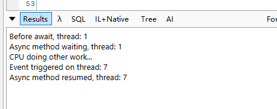

### 28.5 异步函数和事件处理程序
异步函数的返回类型一般是 Task 或 Task\<TResult\>，它们代表函数的状态机完成。但异步函数是可以返回 void 的。

async void
- 没有返回值
  - 调用方不能 await
  - 方法执行“fire-and-forget”，无法直接知道是否完成
- 异常处理困难
  - 异步方法内抛出的异常会直接在 同步上下文上传播
  - 在 UI 程序中，可能导致应用程序崩溃而不是被 try/catch 捕获
- 主要用途
  - 事件处理器（Event Handler）：`button.Click += async (s, e) => await DoSomethingAsync();`
  - 这类场景必须返回 void，因为事件委托签名是 void

### 28.7 异步函数和异常处理
Task 失败时，通常会包含一个 AggregateException（其 InnerExceptions 里保存真正的异常）。但是使用 await 时，编译器生成的代码会直接抛出 第一个内部异常，而不是 AggregateException。

好处：代码更简洁自然，开发者无需手动拆解 AggregateException。

### 28.8 异步函数和其他功能
异步函数本质上只对 I/O 有优势（因为 I/O 可真正异步），CPU 密集型操作如果在 GUI 线程直接运行，会造成界面卡死，所以可以把CPU密集逻辑丢到线程池线程中运行。(非异步包装成异步)

```cs
Task.Run(async () => {
    // CPU 密集操作（在后台线程执行）
    DoHeavyCalculation();

    // 真正的异步 I/O
    await SomeAsyncOperation();
});
```


异步 lambda 表达式:普通 () => {} lambda 不能用 await，因为它不是状态机。加上 async 就能用 await，返回类型自动变成 Task 或 Task\<T\>。async()=>{await ...}

如果调用异步方法前面没有用await，编译器会给警告：提示这个 Task 没有被等待。如果确定不需要等待方法执行完成，解决方法：
```cs
var _ = InnerAsyncFunction(); // 赋值给变量
InnerAsyncFunction.NoWarning() // 扩展方法.NoWarning()
```

并发 I/O:
- Task.WhenAll：等待所有任务完成后一次性处理结果
  - 如果一个以上抛出错误，whenAll重新抛出最后一个抛出的异常
  - 用for循环处理所有响应
- Task.WhenAny：等到任意一个完成就处理，然后继续等剩下的
  - 用while循环处理响应
  ```cs
  public static async Task Go() {
      // 启动服务器并立即返回，因为它异步地等待客户端请求
      StartServer();

      // 发起大量异步客户端请求；保存每个客户端的 Task<String>
      List<Task<String>> requests = new List<Task<String>>(10000);
      for (Int32 n = 0; n < requests.Capacity; n++) 
          requests.Add(IssueClientRequestAsync("localhost", "Request #" + n));

      // 每个任务完成都继续
      while (requests.Count > 0) {
          // 顺序处理每个完成的响应
          Task<String> response = await Task.WhneAny(requests);
          requests.Remove(response);      // 从集合中删除完成的任务

          // 处理一个响应
          Console.WriteLine(response.Result);
      }
  }
  ```

### 28.9 应用程序及其线程处理模型
.NET Framework 支持几种不同的应用程序模型，而每种模型都可能引入了它自己的线程处理模型。

控制台应用程序和 Windows 服务(实际也是控制台应用程序；只是看不见控制台而已)没有引入任何线程处理模型；换言之，任何线程可在任何时候做它想做的任何事情。

GUI 应用程序(包括 Windows 窗体、WPF、Silverlight 和 Windows Store 应用程序)引入了一个线程处理模型。在这个模型中，UI 元素只能由创建它的线程更新。在 GUI 线程中，经常都需要生成一个异步操作，使 GUI 线程不至于阻塞并停止响应用户输入。

通过线程池线程更新 UI 元素就会抛出异常。线程池线程必须以某种方式告诉 GUI 线程更新 UI 元素。

FCL 定义了一个名 System.Threading.SynchronizationContext 的基类，SynchronizationContext 派生对象将应用程序模型连接到它的线程处理模型。

等待一个 Task 时会获取调用线程的 SynchronizationContext 对象。线程池线程完成 Task 后，会使用该 SynchronizationContext 对象，确保为应用程序模型使用正确的线程处理模型。

当 GUI 线程等待一个 Task 时，await 操作符后面的代码保证在 GUI 线程上执行，使代码能更新 UI 元素。

下面是造成 WPF 应用程序死锁的一个例子：
```cs
private sealed class MyWpfWindow : Window {
    public MyWpfWindow() { Title = "WPF Window"; }

    protected override void OnActivated(EventArgs e) {
        // 查询 Result 属性阻止 GUI 线程返回；
        // 线程在等待结果期间阻塞
        String http = GetHttp().Result;     // 以同步方式获取字符串

        base.OnActivated(e);
    }

    private async Task<String> GetHttp() {
        // 发出 HTTP 请求，让线程从 GetHttp 返回
        HttpResponseMessage msg = await new HttpClient().GetAsync("http://Wintellect.com/");
        // 这里永远执行不到；GUI 线程在等待这个方法结束，
        // 但这个方法结束不了，因为 GUI 线程在等待它结束 --> 死锁！

        return await msg.Content.ReadAsStringAsync();
    }
}
```

- 在 GUI 线程（WPF 的 UI 线程）上调用了 GetHttp()，但没有 await，而是用了 .Result 去同步等待异步任务完成。UI 线程卡在那里，等着 GetHttp 完成
- GetHttp 内部发生
  - HttpClient.GetAsync 是异步 I/O，会立即返回一个尚未完成的 Task\<HttpResponseMessage\>
  - await 看到这个 Task 没完成，于是：
    - 暂停 GetHttp，把“后续要执行的代码”保存成一个 状态机
    - 然后把控制权还给调用者（也就是 UI 线程）
    - 等任务完成时，它会尝试在 捕获的同步上下文（WPF 的 UI 上下文）上恢复执行
- 为什么死锁
  - UI 线程正在 同步等待 GetHttp().Result 完成 → UI 线程被阻塞
  - GetHttp 的后半段代码必须回到 UI 线程执行 → 它永远拿不到机会执行
- 解决
  - GetAsync后面添加.ConfigureAwait(false)
    - 默认是true
    - 传递 false，await 操作符就不查询调用线程的 SynchronizationContext 对象。当线程池线程结束 Task 时会直接完成它，await 操作符后面的代码通过线程池线程执行
    - 后台逻辑 / 不涉及 UI 更新的时候使用它


### 28.11 取消 I/O 操作
Windows 一般没有提供取消未完成 I/O 操作的途径。
（在 Windows 内核里，异步 I/O 是通过 IRP (I/O Request Packet) 提交给驱动程序的。一旦 IRP 被提交，Windows 本身没有提供一个通用、统一的“取消按钮”。）

.NET 的 CancellationToken 提供了 编程模型上的取消语义，让调用者可以写一致的取消逻辑，但 并不能保证真正中止底层 I/O。有些取消背后未必真的中止了 I/O，而可能只是丢弃结果。

竞态条件————取消请求的请求可能正好在服务器发送响应的时候到来。这时应该怎么办？所以，要在代码中处理这种潜在的竞态条件，决定是丢弃还是使用数据。


## 29 基元线程同步构造
本章重点在于线程同步。

线程同步存在的问题：
- 编程复杂，易出错
  - 需要识别所有共享数据，并在访问时加锁
  - 忘记加锁的地方会导致数据损坏
  - 很难保证完全正确，只能依赖压力测试
- 性能损失
  - 获取和释放锁需要额外开销
  - 不同的 CPU 必须进行协调，以决定哪个线程先取得锁
- 阻塞导致更多线程
  - 阻塞一个线程会造成更多的线程被创建，假定一个线程池线程试图获取一个它暂时无法获取的锁，线程池就可能创建一个新线程，使 CPU 保持“饱和”
  - 创建线程时一个昂贵的操作，会耗费大量内存和时间
  - 当阻塞的线程再次运行时，它会和这个新的线程池线程共同运行。也就是说，Windows 现在要调度比 CPU 数量更多的线程，这会增大上下文切换的机率

应该尽可能地避免进行线程同步。具体就是避免使用像静态字段这样的共享数据。

如果所有线程都只是查询数据，那么所有线程都能同时查询，无需获取或释放一个锁。String 类型便是这样一个例子：一旦创建好 String 对象，它就是“不可变”的。所以，许多线程能同时访问一个 String 对象。

### 29.1 类库和线程安全
- Microsoft 的 Framework Class Library(FCL)保证所有静态方法都是线程安全的
  - 意味着假如两个线程同时调用一个静态方法，不会发生数据被破坏的情况
  - 使一个方法线程安全，并不是说它一定要在内部获取一个线程同步锁，线程安全的方法意味着在两个线程试图同时访问数据时，数据不会被破坏
  ```cs
  public static Int32 Max(Int32 val1, Int32 val2) {
      return (val1 < val2) ? val2 : val1;
  }
  // 这个方法是线程安全的，即使它没有获取任何锁。由于 Int32 是值类型，所以传给 Max 的两个 Int32 值会复制到方法内部
  // 多个线程互不干扰
  ```
- FCL 不保证实例方法是线程安全的
  - 假如全部添加锁定，会造成性能的巨大损失
  - 局部引用 / async 方法内部状态，程独占或状态机独占，不需要同步锁
  - 把它放到一个静态字段中作为共享实例状态的话FCL 不保证线程安全，需要考虑同步

建议自己的类库也遵循 FCL 的这个模式；也就是说，使自己的所有静态方法都线程安全，使所有实例方法都非线程安全。

### 29.2 基元用户模式和内核模式构造
本节是在讲 多个线程加锁时底层使用的同步构造。


基元是指可以在代码中使用的最简单的构造，有两种：
- 用户模式 (User-mode) 构造
  - 使用特殊 CPU 指令协调线程（硬件级别）
  - 速度快
  - 阻塞时间短，线程池不会察觉阻塞
  - 缺点：若线程无法取得资源，会一直“自旋”，浪费 CPU 时间 → 活锁
- 内核模式 (Kernel-mode) 构造
  - 由 Windows 内核提供
  - 线程阻塞时由操作系统挂起，不浪费 CPU
  - 切换用户态/内核态开销大 → 性能较慢
  - 阻塞导致线程无法运行，可能出现 死锁（浪费内存，但不浪费 CPU）

- 活锁（User-mode 自旋）
  - CPU 持续运行但没有进展
  - 浪费 CPU 时间和内存（线程栈）

- 死锁（Kernel-mode 阻塞）
  - 线程挂起等待资源
  - CPU 空闲，但内存被占用

- 原则：活锁比死锁更浪费资源，死锁更可控（至少 CPU 没浪费）

现在\.NET Core 跨平台，内核模式依旧存在，只是底层实现换成对应平台的操作系统。

### 29.3 用户模式构造
CLR 保证对以下数据类型的变量的读写是原子性的：Boolean，Char，(S)Byte，(U)Int16，(U)Int32，(U)IntPtr，Single 以及引用类型。(这里的引用类型时直接对引用类型赋值，而不是对引用类型的值赋值)

```cs
obj1.Value = 10;   // 这不是原子操作，可能被多个线程同时访问导致竞态条件
```

虽然对变量的原子访问可保证读取或写入操作一次性完成，但由于编译器和 CPU 的优化，不保证操作 什么时候 发生。

基元用户模式构造用于规划好这些原子性读取/写入 操作的时间。还可强制对 (U)Int64 和 Double 类型的变量进行原子性的、规划好了时间的访问。

有两种基元用户模式线程同步构造：
- 易变构造
  - 在特定的时间，它在包含一个简单数据类型的变量上执行原子性的读**或**写操作
- 互锁构造
  - 在特定的时间，它在包含一个简单数据类型的变量上执行原子性的读**和**写操作

#### 29.3.1 易变构造
C# 编译器将 C# 构造转换成中间语言(IL)。然后，JIT 将 IL 转换成本机 CPU 指令，然后由 CPU 亲自处理这些指令。此外，C# 编译器、JIT编译器、甚至 CPU 本身都可能优化你的代码。

```cs
private static void OptimizedAway() {
    // 常量表达式在编译时计算，结果是 0
    Int32 value = (1 * 100) - (50 * 2);

    // 如果 value 是0，循环永远不执行
    for (Int32 x = 0; x < value; x++) {
        // 不需要编译循环中的代码，因为永远都执行不到
        Console.WriteLine("Jeff");
    }
}
```

上面这个代码没有任何意义，所以优化后就没有了这个方法的代码。

从单线程的角度看，方法会做我们希望它做的事情，虽然做的方式可能有别于我们在源代码中描述的方式。但从多线程的角度看，我们的意图并不一定能得到保留。

```cs
internal static class StrangeBehavior {
    // 将这个字段标记成 volatile 可修正问题
    private static Boolean s_stopWorker = false;

    public static void Main() {
        Console.WriteLine("Main: letting worker run for 5 seconds");
        Thread t = new Thread(Worker);
        t.Start();
        Thread.Sleep(5000);
        s_stopWorker = true;
        Console.WriteLine("Main: waiting for worker to stop");
        t.Join();
    }

    private static void Worker(Object o) {
        Int32 x = 0;
        while (!s_stopWorker) x++;
        Console.WriteLine("Worker: stopped when x={0}", x);
    }
}
```

编译器优化
- 编译器看到 s_stopWorker 在 Worker 线程里没有写于是认为它的值 不会变化，可以做优化：
  - 缓存 s_stopWorker 到寄存器
  - 循环中不再每次读取内存
- 结果：
  - Worker 线程实际上只检查一次 s_stopWorker
  - 进入一个 无限循环，因为寄存器里值一直是 false

CPU 缓存 & 内存重排序
- 多线程环境下，每个线程可能有自己的 CPU 缓存
- 写入 s_stopWorker = true 可能还没刷新到 Worker 线程可见的缓存
- 即使编译器不优化，CPU 也可能让 Worker 线程看不到最新值


将上述代码放到一个 .cs 文件中，再用 C# 编译器(csc.exe)的 /platform:x86 和 /optimize+ 开关来编译。运行生成的 EXE 程序，会看到程序一直运行。


```cs
internal sealed class ThreadsSharingData {
    private Int32 m_flag = 0;
    private Int32 m_value = 0;

    // 这个方法由一个线程执行
    public void Thread1() {
        // 注意：以下两行代码可以按相反的顺序执行
        m_value = 5;
        m_falg = 1;
    }

    // 这个方法由另一个线程执行
    public void Thread2() {
        // 注意： m_value 可能先于 m_flag 读取
        if (m_flag == 1)
            Console.WriteLine(m_value);
    }
}
```

潜在问题
- 编译器或 CPU 为优化性能，可能重新排列 Thread1 的指令顺序
  - 例如先写 m_flag 再写 m_value
- Thread2 可能从寄存器中读取旧值，而不是最新的 RAM 中的值

结果
- Thread2 可能看到 m_flag == 1，但 m_value 仍是 0
- 导致输出不符合程序员预期

<hr>

CPU 寄存器：线程执行指令时用的超高速存储单元
CPU 缓存 (L1/L2/L3)：存储器与 CPU 之间的高速缓冲区
主内存 (RAM)：所有线程共享的数据存储

CPU 不会每次读取共享变量都直接访问 RAM，而是先从寄存器或缓存读取，提高性能

- CPU 核心 A 更新了 m_value 和 m_flag 到 RAM
- CPU 核心 B（Thread2 所在）可能 仍然使用寄存器中的旧值
  - 因为寄存器和缓存没有强制刷新到最新值
  - 没有内存屏障或 volatile，CPU 可能不会马上看到 RAM 中的更新
<hr>

为解决这个问题，静态 System.Threading.Volatile 类提供了两个静态方法：
```cs
public static class Volatile {
    //两个方法执行的都是原子性操作
    public static void Write(ref Int32 location, Int32 value);
    public static Int32 Read(ref Int32 location);
}
```

这些方法会禁止 C# 编译器、JIT 编译器和 CPU 平常执行的一些优化。

修改后的代码：
```cs
internal sealed class ThreadSharingData {
    private volatile Int32 m_flag = 0;
    private          Int32 m_value = 0;

    // 这个方法由一个线程执行
    public void Thread1() {
        // 注意：将 1 写入 m_flag 之前，必须先将 5 写入 m_value
        m_value = 5;
        m_flag = 1;
    }

    // 这个方法由另一个线程执行
    public void Thread2() {
        // 注意： m_value 必须在读取了 m_flag 之后读取
        if (m_flag == 1)
            Console.WriteLine(m_value);
    }
}
```

Volatile.Write 调用确保在它之前的所有写入操作都在将 1 写入 m_flag 之前完成。

Volatile.Read 调用确保在它之后的所有变量读取操作都必须在 m_flag 中的值读取之后开始。

**C# 对易变字段的支持**

为了简化编程，C# 编译器提供了 volatile 关键字，它可应用于以下任何类型的静态或实例字段：Boolean，(S)Byte，(U)Int16，(U)Int32,(U)IntPtr，Single 和 Char，还可将 volatile 关键字应用于引用类型的字段，以及基础类型为 (S)Byte，(U)Int16或(U)Int32的任何枚举字段。

不必显示调用 Volatile 的静态 Read 或 Write 方法。

volatile 关键字告诉 C# 和 JIT 编译器不将字段缓存到 CPU 的寄存器中，确保字段的所有读写操作都在 RAM 中进行。

```cs
internal sealed class ThreadSharingData {
    private volatile Int32 m_flag = 0;
    private          Int32 m_value = 0;
    // 后面的跟第一个例子一样
}
```

尽量不要用volatile，未优化的代码肯定会更大、更慢，而且C# 不支持以传引用的方式将 volatile 字段传给方法。

#### 29.3.2 互锁结构
静态 System.Threading.Interlocked 类提供的方法：
```cs
public static class Interlocked {
    // return (++location)

    public static Int32 Increment(ref Int32 location);

    // return (--location)
    public static Int32 Decrement(ref Int32 location);

    // return (location += value)
    // 注意： value 可能是一个负数，从而实现减法运算
    public static Int32 Add(ref Int32 location1, Int32 value);

    // Int32 old = location1; location1 = value; return old;
    public static Int32 Exchange(ref Int32 location1, Int32 value);

    // Int32 old = location1;
    // if (location1 == comparand) location1 = value;
    // return old;
    public static Int32 CompareExchange(ref Int32 location1, Int32 value, Int32 comparand);
    ...
}
```

Interlocked 类中的每个方法都执行一次原子读写以及写入操作。调用某个 Interlocked 方法之前的任何变量写入都在这个 Interlocked 方法调用之前执行；而这个调用之后的任何变量读取的都在这个调用之后读取。

底层实现：利用 CPU 提供的 原子指令（比如 x86 的 LOCK XADD、CMPXCHG 等），保证操作不可分割。当多个线程要同时 修改共享变量 时，避免加锁带来的性能损耗。


多线程环境下写代码会有竞态问题：
```cs
// 多个线程同时执行可能导致丢失更新
int counter = 0;

void Increment()
{
    counter++; // 不是原子操作：其实是 load → add → store
}
```

使用Interlocked:
```cs
int counter = 0;

void Increment()
{
    Interlocked.Increment(ref counter); // 原子递增，线程安全
}
```

一个场景：
假设有 3 个 HTTP 请求：
- 请求 A 在线程池线程 1 完成
- 请求 B 在线程池线程 2 完成
- 请求 C 在线程池线程 3 完成

这三个线程都会调用 m_ac.JustEnded()
- 假设计数器初始为 3
- A 完成 → 计数器变 2
- B 完成 → 计数器变 1
- C 完成 → 计数器变 0 → 触发 AllDone

问题是：
如果没有同步，可能 线程 B 和线程 C 都认为自己是最后一个，都去调用 AllDone。
结果 AllDone 被执行两次（或多次），程序逻辑就乱了。

可以利用Interlocked去做这个计数。

#### 29.3.3 实现简单的自旋锁
Interlocked 的方法很好用，但主要用于操作 Int32 值。如果需要原子性地操作类对象中的一组字段，需要采取一个办法阻止所有线程，只允许其中一个进入对字段进行操作的代码区域。

```cs
internal struct SimpleSpinLock {
    private Int32 m_ResourceInUse;      // 0=false(默认), 1=true

    public void Enter() {
        while (true) {
            // 总是将资源设为 "正在使用" 
            // 只有从 “未使用” 变成 “正在使用” 才会返回 
            if (Interlocked.Exchange(ref m_ReourceInUse, 1) == 0) return;
            // 在这里添加“黑科技” ...
        }
    }

    public void Leave() {
        // 将资源标记为 “未使用”
        Volatile.Write(ref m_ResourceInUse, 0);
    }
}
```

```cs
public sealed class SomeResource {
    private SimpleSpinLock m_sl = new SimpleSpinLock();

    public void AccessResource() {
        m_sl.Enter();
        // 一次只有一个线程才能进入这里访问资源...
        m_sl.Leave();
    }
}
```

自旋锁一般不要在单 CPU 机器上使用。容易造成活锁现象，为了解决这些问题，许多自旋锁内部都有一些额外的逻辑；将这些额外的逻辑称为“黑科技”(Black Magic)。FCL 提供了一个名为 System.Threading.SpinWait 的结构，它封装了人们关于这种“黑科技”的最新研究成果。

自旋锁只应该用于保护哪些会执行的非常快的代码区域。

黑科技 = 自旋锁内部的智能让步机制，让占锁线程先跑，避免自旋线程白白耗 CPU。

FCL 还包含了一个 System.Threading.SpinLock 结构，它和前面展示的 SimpleSpinLock 类相似，只是使用了 SpinWait 结构来增强性能。

SpinLock 是 FCL 提供的 自旋锁，用于轻量级线程同步。
- 它内部使用了 SpinWait 结构来优化自旋性能：
  - SpinWait 会智能地自旋一段时间
  - 然后让出 CPU（调用 Thread.Yield 或 Thread.Sleep(0/1)）
  - 避免纯忙等造成 CPU 浪费

```cs
private SpinLock _lock;  // 正确 不能用readonly  值类型

void Update()
{
    bool lockTaken = false;
    try
    {
        _lock.Enter(ref lockTaken);  // 修改内部状态
        // 临界区操作
    }
    finally
    {
        if (lockTaken) _lock.Exit();
    }
}

```

SpinWait/Thread.Sleep/Thread.Yield 的组合就是“黑科技”，用于在自旋或忙等待时引入延迟，让持锁线程运行、减少活锁、提高多线程效率。

#### 29.3.4 Interlocked Anything 模式
Interlocked 提供了一些基础原子操作（加减、交换等），但没有覆盖更复杂的操作（如最大值、最小值、按位运算等）。

想要在多线程环境中安全地执行复杂操作，需要 基于 CompareExchange 的模式。

乐观并发：假设大多数情况下不会冲突，如果发生冲突则重试。

demo:安全地更新一个整型变量为它和另一个值的最大值
```cs
public static Int32 Maximum(ref Int32 target, Int32 value) {
    //等价于Int32 currentVal = target;
      //Int32 startVal;
      //Int32 desiredVal;
    Int32 currentVal = target, startVal, desiredVal;

    // 不要在循环中访问目标(target)，除非是想要改变它时另一个线程也在动它
    do {
        // 记录这一次循环迭代的起始值(startVal)
        // 如果有线程执行到这个，那下个线程无法通过startVal != currentVal
        startVal = currentVal;

        // 基于 startVal 和 value 计算 desiredVal
        desiredVal = Math.Max(startVal, value);

        // 注意：线程在这里可能被 “抢占”，所以以下代码不是原子性的：
        // if (target == startVal) target = desiredVal;

        // 而应该使用以下原子性的 CompareExchange 方法，它
        // 返回在 target 在(可能)被方法修改之前的值
        currentVal = Interlocked.CompareExchange(ref target, desiredVal, startVal);

        // 如果 target 的值在这一次循环迭代中被其他线程改变，就重复
    } while (startVal != currentVal);

    // 在这个线程尝试设置它之前返回最大值
    return desiredVal;
}
```

乐观并发控制的核心思想是：
- 假设大多数情况下，多个线程不会冲突地修改同一个数据。
- 因此线程不在一开始就加锁，直接进行计算。
- 在提交结果时检查数据是否被其他线程改动：
  - 如果没有改动 → 提交成功
  - 如果被改动 → 放弃本次结果，重新计算并尝试提交

如果有非常频繁的冲突（多个线程同时写 target），循环可能多次失败会浪费 CPU，但最终总能收敛。

### 29.4 内核模式构造
内核模式的构造比用户模式的构造慢得多
- 它们要求 Windows 操作系统自身的配合
- 在内核对象上调用的每个方法都造成调用线程从托管代码转换为本机用户模式代码，再转换为本机内核模式代码。还要朝相反的方向一路返回

优点：
- 竞争资源时，操作系统会 阻塞线程，避免 CPU 自旋浪费
- 可在 托管线程与本机线程之间同步
- 可同步 不同进程中的线程
- 可设置 安全性，防止未授权访问
- 支持 阻塞等待集合中的所有或任意对象
- 可指定 超时值，超时后线程解除阻塞执行其他任务

System.Threading 命名空间提供了一个名为 WaitHandle 抽象基类。包装一个 Windows 内核对象句柄。（以现在的\.net core 已经不局限Window了）FCL 提供了几个从 WaitHandle 派生的类
- WaitHandle
  - EventWaitHandle
      - AutoResetEvent
      - ManualResetEvent
  - Semaphore
    - Mutex

内核模式构造的典型用法：
```cs
using (new Semaphore(0, 1, "UniqueAppName", out createdNew)) {
    if (createdNew) {
        // 正常启动应用
    } else {
        // 已有实例，退出
    }
}
```
假定这个进程的两个实例同时启动。每个进程都有自己的线程，两个线程都尝试创建具有相同字符串名称(本例是 "SomeUniqueStringIdentifyingMyApp")的一个Semaphore。

创建对象的线程会将它的 createdNew 变量设为 true。

对于第二个线程，Windows 发现具有指定名称的内核对象已经存在了。因此，不允许第二个线程创建另一个同名的内核对象。不过，如果这个线程继续运行的话，它能访问和第一个进程的线程所访问的一样的内核对象。


基元内核模式线程同步构造：
- 事件
- 信号量

#### 29.4.1 Event 构造
事件(event)其实只是由内核维护的 Boolean 变量。事件为 false，在事件上等待的线程就阻塞；为 true，就解除阻塞。

两种事件：
- 自动重置事件
  - 事件为 true 时，它只唤醒一个阻塞的线程
  - 解除第一个线程的阻塞后，内核将事件自动重置回false，造成其余线程继续阻塞
- 手动重置事件
  - 一个手动重置事件为 true 时，它解除正在等待它的所有线程的阻塞
  - 内核不将事件自动重置回 false

```cs
internal sealed class SimpleWaitLock : IDisposable {
    private readonly AutoResetEvent m_available;

    public SimpleWaitLock() {
        m_available = new AutoResetEvent(true);     // 最开始可自由使用
    }

    public void Enter() {
        // 在内核中阻塞 ①，直到资源可用
        m_available.WaitOne();
    }

    public void Leave() {
        // 让另一个线程访问资源
        m_available.Set();
    }

    public void Dispose() {
        m_available.Dispose();
    }
}
```

#### 29.4.2 Semaphore 构造

信号量(semaphore)其实就是由内核维护的 Int32 变量。信号量为 0 时，在信号量上等待的线程会阻塞；信号量大于 0 时解除阻塞。

信号量内部有一个整数计数器（初始值 ≥0），表示“可用资源数”。
计数器 = n 时，表示还有 n 个线程可以直接进入资源而不被阻塞。


| 操作                  | 计数器变化                       |
| ------------------- | --------------------------- |
| WaitOne（成功获取资源）     | -1                          |
| WaitOne（被阻塞）        | 不变                          |
| Release（无阻塞线程）      | +1                          |
| Release（有阻塞线程被解除阻塞） | +1 → -1（效果相当于计数器不变，但线程获得资源） |


多个线程在一个信号量上等待时，释放信号量导致 releaseCount 个线程被解除阻塞(releaseCount 是传给 Semaphore 的 Release方法的实参)。

```cs
public sealed class Semaphore : WaitHandle {
    public Semaphore(Int32 initialCount, Int32 maximumCount);
    public Int32 Release();         // 调用 Release(1); 返回上一个计数
    public Int32 Release(Int32 releaseCount);   // 返回上一个计数
}
```

#### 29.4.3 Mutex 构造
互斥体(mutex)代表一个互斥的锁。它的工作方式和 AutoResetEvent 或者计数为 1 的 Semaphore 相似，三者都是一次只释放一个正在等待的线程。

- 互斥体保证一次只有一个线程拥有锁
- 支持递归获取：
  - 如果同一个线程多次获取 Mutex，内部维护递归计数
  - 释放时递减计数，只有计数为 0，锁才真正释放给其他线程
- 记录线程 ID：
  - 只有拥有锁的线程能调用 ReleaseMutex，否则会抛异常
  - 如果持有锁的线程异常终止，等待的线程会收到 AbandonedMutexException
- 性能较 AutoResetEvent 或 Semaphore 差，因为涉及内核模式调用和状态维护

当拥有 Mutex 的线程终止而没有释放锁时，内核会认为锁被“遗弃”。任何正在等待这个 Mutex 的线程会被唤醒，也就是说，它们不再阻塞，可以尝试继续执行。当这些被唤醒的线程尝试获取这个被遗弃的 Mutex 时，.NET 会抛出 AbandonedMutexException。这个异常是一个 警告信号：锁虽然被你获得了，但锁保护的数据可能已经被前一个线程破坏。

所以流程是：
线程被唤醒 → 尝试获得锁 → 抛出异常

## 30 混合线程同步构造
合并了用户模式和内核模式构造的是混合线程同步构造。

没有线程竞争时，混合构造提供了基元用户模式构造所具有的性能优势。多个线程竞争一个构造时，混合构造通过基元内核模式的构造来提供不“自旋”的优势(避免浪费 CPU 时间)。

由于大多数应用程序的线程都很少同时竞争一个构造，所以性能上的增强可以使应用程序表现得更出色。

### 30.1 一个简单的混合锁
```cs
internal sealed class SimpleHybridLock : IDisposable {
    // Int32 由基元用户模式构造 (Interlocked 的方法)使用
    private Int32 m_waiters = 0;

    // AutoResetEvent 是基元内核模式构造
    private readonly AutoResetEvent m_waiterLock = new AutoResetEvent(false);

    public void Enter() {
        // 指出这个线程想要获得锁
        if (Interlocked.Increment(ref m_waiters) == 1)
            return; // 锁可自由使用，无竞争，直接返回
                    
        // 另一个线程拥有锁(发生竞争)，使这个线程等待
        m_waiterLock.WaitOne(); // 这里产生较大的性能影响
        // WaitOne 返回后，这个线程拿到锁了
    }

    public void Leave() {
        // 这个线程准备释放锁
        if (Interlocked.Decrement(ref m_waiters) == 0)
            return; // 没有其他线程正在等待，直接返回

        // 有其他线程正在阻塞，唤醒其中一个
        m_waiterLock.Set(); // 这里产生较大的性能影响
    }

    public void Dispose() { m_waiterLock.Dispose(); }
}
```

检查用的是用户模式检查，如果需要等待就变成核心模式。

在实际应用中，任何线程可以在任何时间调用 Leave， 因为 Enter 方法没有记录哪一个线程成功获得了锁。事件和信号量都没有维护这种信息，只有互斥体才有维护。

### 30.2 自旋、线程所有权和递归
为了提升应用程序的总体性能，可以让一个线程在用户模式中“自旋”一小段时间，再让线程转换为内核模式。

以下构建支持自旋、线程所有权和递归的一个混合锁：

```cs
internal sealed class AnotherHybridLock : IDisposable {
    // Int32 由基元用户模式构造 (Interlocked 的方法)使用
    private Int32 m_waiters = 0;

    // AutoResetEvent 是基元内核模式构造
    private AutoResetEvent m_waiterLock = new AutoResetEvent(false);

    // 这个字段控制自旋，希望能提升性能
    private Int32 m_spincount = 4000; // 随便选择的一个计数

    // 这些字段指出哪个线程拥有锁，以及拥有了它多少次
    private Int32 m_owningThreadId = 0, m_recursion = 0;

    public void Enter() {
        // 如果调用线程已经拥有锁，递增递归计数并返回
        Int32 threadId = Thread.CurrentThread.ManagedThreadId;
        if (threadId == m_owningThreadId) { m_recursion++; return; }

        // 调用线程不拥有锁，尝试获取它
        SpinWait spinwait = new SpinWait();
        for (Int32 spinCount = 0; spinCount < m_spincount; spinCount++) {
            // 如果锁可以自由使用了，这个线程就获得它；设置一些状态并返回
            if (Interlocked.CompareExchange(ref m_waiters, 1, 0) == 0) goto GotLock;

            // 黑科技：给其他线程运行的机会，希望锁会被释放
            spinwait.SpinOnce();
        }

        // 自旋结束，锁仍未获得，再试一次
        if (Interlocked.Increment(ref m_waiters) > 1) {
            // 仍然是竞态条件，这个线程必须阻塞
            m_waiterLock.WaitOne(); // 等待锁：性能有损失
            // 等这个线程醒来时，它拥有锁；设置一些状态并返回
        }

    GotLock:
        // 一个线程获得锁时，我们记录它的 ID，并
        // 指出线程拥有锁一次
        m_owningThreadId = threadId; m_recursion = 1;
    }

    public void Leave() {
        // 如果调用线程不拥有锁，表明存在 bug
        Int32 threadId = Thread.CurrentThread.ManagedThreadId;
        if (threadId != m_owningThreadId)
            throw new SynchronizationLockException("Lock not owned by calling thread");
        
        // 递减递归技术。如果这个线程仍然拥有锁，那么直接返回
        if (--m_recursion > 0) return;

        m_owningThreadId = 0; // 现在没有线程拥有锁
                              
        // 如果没有其他线程在等待，直接返回
        if (Interlocked.Decrement(ref m_waiters) == 0)
            return;

        // 有其他线程正在等待，唤醒其中 1 个
        m_waiterLock.Set(); // 这里有较大的性能损失
    }
    
    public void Dispose() { m_waiterLock.Dispose(); }
}
```

### 30.3 FCL 中的混合结构

FCL 自带了许多混合构造，它们通过一些别致的逻辑将你的线程保持在用户模式，从而增应用程序的性能。

#### 30.3.1 ManualResetEventSlim类和 SemaphoreSlim类
这两个构造的工作方式和对应的内核模式构造完全一致，只是它们都在用户模式中“自旋”，而且都推迟到发生第一次竞争时，才创建内核模式的构造。它们的 Wait 方法允许传递一个超时值和一个 CancellationToken。

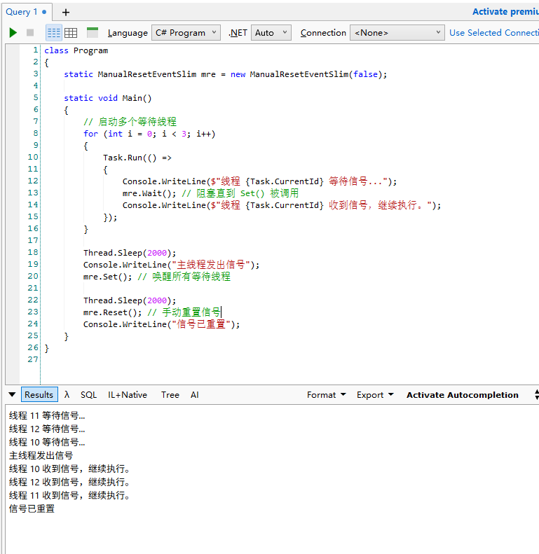

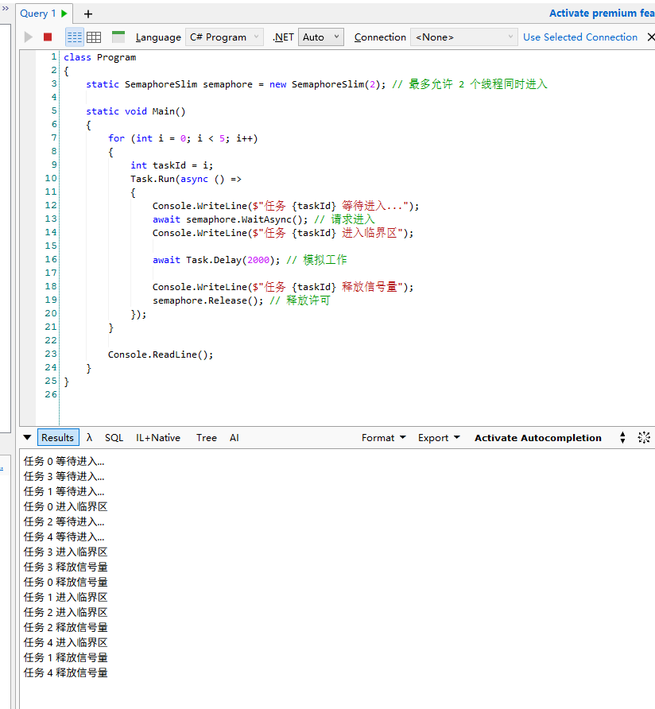


#### 30.3.2 Monitor类和同步块
或许最常用的混合型线程同步构造就是 Monitor 类，它提供了支持自旋、线程所有权和递归和互斥锁。

**但这个构造存在许多问题，用它很容易造成代码中出现 bug。**

堆中的每个对象都可关联一个名为 同步块 的数据结构。同步块包含对内核对象、拥有线程的 ID、递归计数以及等待线程计数提供了相应的字段。Monitor 是静态类，它的方法接收对任何堆对象的引用。

一个对象在构造时，它的同步块索引初始化为 -1，表明不引用任何同步块。然后，调用 Monitor.Enter 时，CLR 在数组中找到一个空白同步块，并设置对象的同步块索引，让它引用该同步块。

调用 Exit 时，会检查是否有其他任何线程正在等待使用对象的同步块。如果没有线程在等待它，Exit 将对象的同步块索引设回 -1


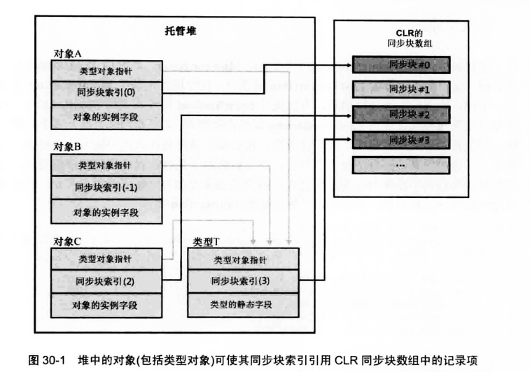

```cs
Type t = typeof(int);
```
类型对象本身也是一种对象。

Monitor 类原本的使用方式：
```cs
internal sealed class Transaction {
    private DateTime m_timeOfLastTrans;

    public void PerformTransaction() {
        Monitor.Enter(this);
        // 以下代码拥有对数据的独占访问权...
        m_timeOfLastTrans = DateTime.Now;
        Monitor.Exit(this);
    }

    public DateTime LastTransaction {
        get {
            Monitor.Enter(this);
            // 以下代码拥有对数据的独占访问权...
            DateTime temp = m_timeOfLastTrans;
            Monitor.Exit(this);
            return temp;
        }
    }
}
```

前面说的容易出现的bug：
```cs
public static void SomeMethod() {
    var t = new Transaction();
    Monitor.Enter(t); // 这个线程获取对象的公共锁

    // 让一个线程池线程显示 LastTransaction 时间
    // 注意：线程线程会阻塞，直到 SomeMethod 调用了 Monitor.Exit！
    ThreadPool.QueueUserWorkItem(o => Console.WriteLine(t.LastTransaction));

    // 这里执行其他一些代码...
    Monitor.Exit(t);
}
```

可能t.LastTransaction也用了Monitor.Enter(t)，所以造成线程会阻塞直到执行到SomeMethod方法里的Monitor.Exit(t);才可能执行线程。

建议是始终坚持使用私有锁：不对外暴露，也不作为参数传递

```cs
internal sealed class Transaction {
    private readonly Object m_lock = new Object(); // 现在每个 Transaction 对象都有私有锁
    private DateTime m_timeOfLastTrans;

    public void PerformTransaction() {
        Monitor.Enter(m_lock);  // 进入私有锁
        // 以下代码拥有对数据的独占访问权...
        m_timeOfLastTrans = DateTime.Now;
        Monitor.Exit(m_lock);  // 退出私有锁
    }

    public DateTime LastTransaction {
        get {
            Monitor.Enter(m_lock);  // 进入私有锁
            // 以下代码拥有对数据的独占访问权...
            DateTime temp = m_timeOfLastTrans;
            Monitor.Exit(m_lock);   // 退出私有锁
            return temp;
        }
    }
}
```

其他同步构造（比如 Mutex、SemaphoreSlim）都是实例化对象的
```cs
var m = new Mutex();
m.WaitOne();
m.ReleaseMutex();

```

锁状态绑定在实例上,创建几个实例，每个实例就是独立锁。

Monitor 则把锁挂在任意对象上，通过静态方法 Monitor.Enter(obj) 操作，锁的粒度和行为完全依赖外部对象，锁对象必须是引用类型，并且对象一旦传出去就变成“公开锁”。

一个很明显的结论是：Monitor 根本就不该实现成静态类；它应该像其他所有同步构造那样实现。

它还存在其他许多问题：
- 不要用代理对象或类型对象做锁
- 不要对字符串做锁
- 值类型不能直接作为锁
- 不要使用 [MethodImpl(Synchronized)] 特性
- 尽量避免复杂类型构造器

安全使用 Monitor 的原则：
- 永远使用私有锁对象，不要用业务对象、类型对象、字符串、或装箱值类型做锁。
- 不要把锁对象传递给外部线程或跨 AppDomain 使用。
- 不要使用 [MethodImpl(Synchronized)]，改用私有锁对象手动同步。
- 类型构造器应简单、短小，避免全局阻塞

除了上面这些问题，还有一个糟糕的情况：C# 语言通过 lock 关键字来提供了一个简化的语法
```cs
private void SomeMethod() {
    lock (this) {
        // 这里的代码拥有对数据的独占访问权...
    }
}
```
等价于：
```cs
private void SomeMethod() {
    Boolean lockTaken = false;
    try {
       // 这里可能发生异常(比如 ThreadAbortException)...
       Monitor.Enter(this, ref lockTaken);
       // 这里的代码拥有对数据的独占访问权... 
    }
    finally {
        if (lockTaken) Monitor.Exit(this);
    }
}
```

问题一：状态可能被破坏
- 如果 try 块中修改共享状态时发生异常，状态可能处于部分修改/损坏状态
- 当 finally 中 Monitor.Exit 释放锁后，另一个线程可能立刻进入 lock 块操作这个损坏状态
- 结果：
  - 状态不一致
  - 行为不可预测
  - 可能产生 安全漏洞
- 建议：与其让程序继续运行在损坏状态下，不如让程序挂掉，暴露问题，便于修复

问题二：try/finally 对性能的影响
- 进入/离开 try 块增加方法开销
- 结果
  - 代码执行速度下降
  - 多线程访问损坏状态的机会增加


#### 30.3.3 ReaderWriterLockSlim 类
当数据被普通互斥锁（如 Monitor、Mutex、SpinLock 等）保护时所有访问（读或写）都被串行化导致 应用程序伸缩性和吞吐量下降。但是如果只读的话是没必要上锁的。

ReaderWriterLockSlim读写锁的思想，允许并发读取，同时保证写操作的独占性
- 写线程独占访问：写线程进行写操作时，其他所有线程（读或写）都被阻塞
- 读线程共享访问：多个读线程可以同时访问数据，写线程仍被阻塞
- 写线程结束后：
  - 若有其他写线程等待，则解除其阻塞，进行写操作
  - 若没有写线程，则锁进入自由状态，供下一个读线程或写线程获取

总结使用原则：
- 总是传递 LockRecursionPolicy.NoRecursion
  - 避免性能开销
- 尽量避免线程从 reader 升级为 writer
  - 性能代价高
  - 升级过程可能导致阻塞
- 优先使用 ReaderWriterLockSlim 而不是旧的 ReaderWriterLock
  - 更快、更公平、更安全
- 只在“多读少写”的场景使用读写锁
  - 充分发挥并发读取的优势
  - 避免写线程长时间阻塞

#### 30.3.5 CountdownEvent 类
这个构造使用了一个 ManualResetEventSlim 对象。这个构造阻塞一个线程，直到它的内部计数器变成 0。

这个构造的行为和 Semaphore 的行为相反。(Semaphore 是在计数为 0 时阻塞线程。)

#### 30.3.6 Barrier 类
- 让一组线程按照 阶段（phase） 来推进工作：
  - 每个线程完成当前阶段的工作后，必须等待其他线程。
  - 当所有线程都完成阶段任务，才一起进入下一阶段。
- 适合用在 分阶段的并行算法（例如 CLR 的垃圾回收器：标记 → 压缩 → 修正根引用）。

常见场景：
- 垃圾回收（CLR GC 的并行阶段）。
- 大数据并行计算中分批合并结果。
- 多核算法分工（如矩阵运算的分块计算）。

不常用

#### 30.3.7 线程同步构造小结
避免阻塞线程的原则：
- 首选异步模型：通过 async/await 或任务延续（continuation）避免阻塞线程
- 线程池线程可复用：不要为线程打标签（如“拼写检查线程”），而是让线程池线程完成一批任务后继续处理别的工作
- 数据交接：并发访问时尽量用 Volatile、Interlocked，它们速度快、不阻塞，但仅适合简单类型。复杂操作可用 Interlocked Anything 模式

阻塞时的推荐做法
- 跨 AppDomain 或进程同步：用 内核对象（如 Mutex、EventWaitHandle）
- 原子状态操作：用 Monitor，必要时用 reader-writer 锁
- 性能考虑
  - SpinLock 更快但可能浪费 CPU，不常推荐。
  - Monitor 是递归的且性能不错。
  - 避免递归的 reader-writer 锁。
  - 避免在 finally 中释放锁（性能开销大）。
- 持锁时间要短：锁占用过长会增加阻塞风险。

### 30.4 著名的双检锁技术
双检锁(Double-Check Locking)是一个非常著名的技术，开发人员用它将单实例(singleton)对象的构造推迟到应用程序首次请求该对象时进行。这有时也称为延迟初始化。

用到才创建，创建一次后不会再创建。

CLR 很好地支持双检锁技术，这应该归功于 CLR 的内存模型以及 volatile 字段访问
```cs
internal sealed class Singleton {
    // s_lock 对象是实现线程安全所需要的。定义这个对象时，我们假设创建单实例对象的
    // 代价高于创建一个 System.Object 对象，并假设可能根本不需要创建单实例对象、
    // 否则，更经济、更简单的做法是在一个类构造器中创建单实例对象、
    private static readonly Object s_lock = new Object();

    // 这个字段引用一个单实例对象
    private static Singleton s_value = null;

    // 私有构造器阻止这个类外部的任何代码创建实例
    private Singleton() {
        // 把初始化单实例对象的代码放在这里...
    }

    // 以下公共静态方法返回单实例对象(如果必要就创建它)
    public static Singleton GetSingleton() {
        // 如果单实例对象已经创建，直接返回它(这样速度很快)
        if (s_value != null) return s_value;

        Monitor.Enter(s_lock); // 还没有创建，让一个线程创建它
        if (s_value == null) {
            // 仍未创建，创建它
            Singleton temp = new Singleton();

            // 将引用保存到 s_value 中(参见正文的详细讨论)
            Volatile.Write(ref s_value, temp);
        }
        Monitor.Exit(s_lock);

        // 返回对单实例对象的引用
        return s_value;
    }
}
```

双检锁技术背后的思路在于，对 GetSingleton 方法的一个调用可以快速地检查 s_value 字段，判断对象是否创建。如果是，方法就返回对它的引用。这里的妙处在于，如果对象已经构造好，就不需要线程同步；应用程序会运行得非常快。


Java 不能保证该技术在任何地方都能正确工作。Java 虚拟机(JVM)在 GetSingleton 方法开始的时候将 s_value 的值读入 CPU 寄存器。然后，对第二个  if 语句求值时，它直接查询寄存器，造成第二个 if 语句总是求值为 true，结果就是多个线程都会创建Singleton 对象。当然，只有多个线程恰好同时调用 GetSingleton 才会发生这种情况。

大多数时候，这个技术实际会损害效率。下面是 Singleton 类的一个简单得多的版本，它的行为和上一个版本相同:
```cs
internal sealed class Singleton {
    private static Singleton s_value = new Singleton();

    // 私有构造器防止这个类外部的任何代码创建一个实例
    private Singleton() {
        // 将初始化单实例对象的代码放在这里...
    }
    // 以下公共静态方法返回单实例对象 (如有必要就创建它)
    public static Singleton GetSingleton() { return s_value; }
}
```
由于代码首次访问类的成员时，CLR 会自动调用类型的类构造器，所以首次有一个线程查询 Singleton 的 GetSingleton 方法时，CLR 就会自动调用类构造器，从而创建一个对象实例。此外，CLR 已保证了对类构造器的调用是线程安全的。

缺点在于，首次访问类的任何成员都会调用类型构造器。所以，如果 Singleton 类型定义了其他静态成员，就会在访问其他任何静态成员时创建 Singleton 对象。

可以通过定义嵌套类来解决这个问题：
```cs
internal sealed class Singleton {
    private static Singleton s_value = null;

    // 私有构造器防止这个类外部的任何代码创建实例
    private Singleton() {
        // 将初始化单实例对象的代码放在这里...
    }

    // 以下公共静态方法返回单实例对象 (如有必要就创建它)
    public static Singleton GetSingleton() {
        if (s_value != null) return s_value;

        // 创建一个新的单实例对象，并把它固定下来(如果另一个线程还没有固定它的话)
        Singleton temp = new Singleton();
        Interlocked.CompareExchange(ref s_value, temp, null);

        // 如果这线程竞争失败，新建的第二个单实例对象会被垃圾回收
        return s_value; // 返回对单实例对象的引用
    } 
}
```

这个版本可能创建两个(或更多)Singleton 对象。然而，对 Interlocked.CompareExchange 的调用确保只有一个引用才会发布到 s_value 字段中。

虽然可能创建多个 Singleton 对象，但上述代码由多方面的优势
- 速度非常快
- 永不阻塞线程

FCL 有两个类型封装了延迟初始化
- System.Lazy\<T\>
- System.Threading.LazyInitializer

**System.Lazy\<T\>**

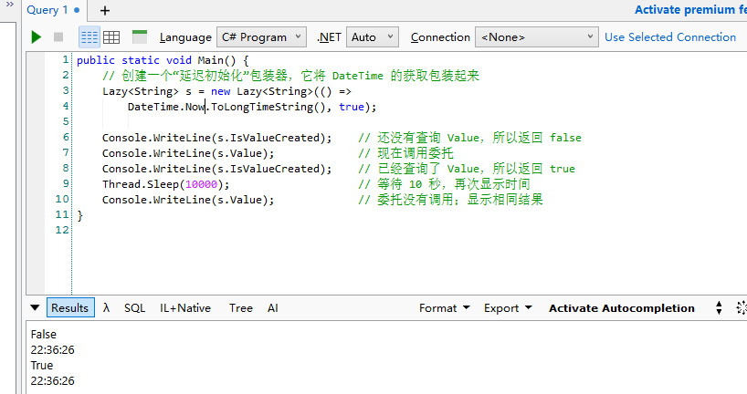


**System.Threading.LazyInitializer**
内存有限可能不想创建 Lazy 类的实例。这时可调用 System.Threading.LazyInitializer 类的静态方法。

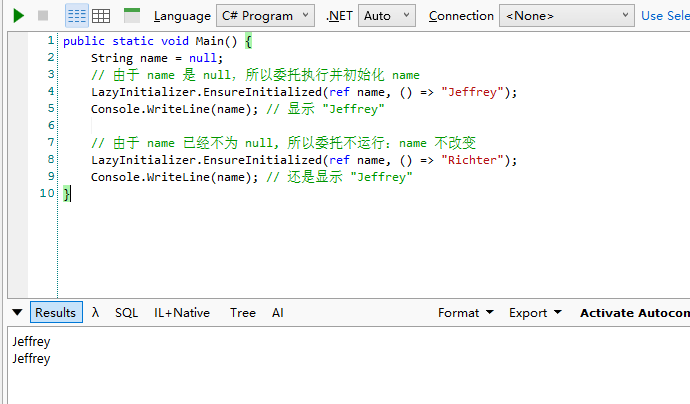

### 30.5 条件变量模式
假定一个线程希望在一个复合条件为 true 时执行一段代码，但是不可能对构成复合条件的多个变量进行原子性的测试，我们可以通过Monitor 类实现复合条件同步：

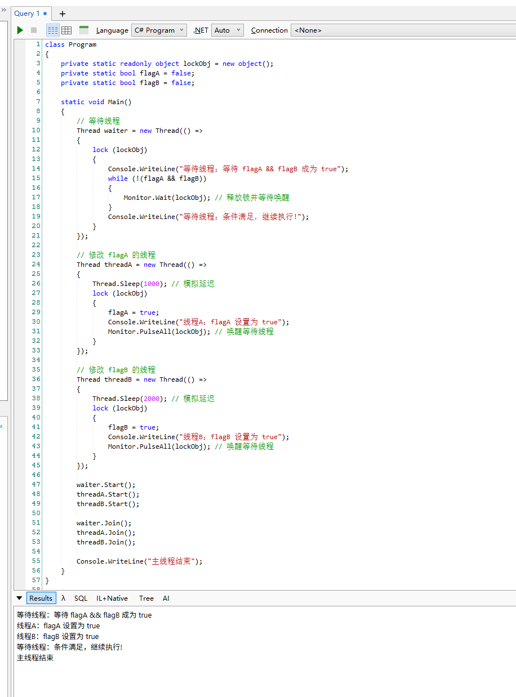

### 30.6 异步的同步构造
传统线程同步的问题
- 当一个线程等待锁（比如 ReaderWriterLock）时，它会被操作系统挂起
- 当一个线程等待锁（比如 ReaderWriterLock）时，它会被操作系统挂起
- 线程创建代价大，而且这些线程大多数是“白等”，浪费资源
- 假设一个 writer 长时间持有锁，很多 reader 阻塞在后面，writer 一释放锁，所有 reader 会同时被唤醒 → 同时去抢 CPU，但 CPU 核数有限，这会导致频繁的上下文切换，浪费性能，所以，阻塞线程的同步原语在高并发场景下非常不划算。

而上面的问题task可以解决，相比直接阻塞线程，异步模型带来了几个好处
- 更轻量：Task 对象比 Thread 占用更少的内存，创建销毁开销小
- 自动伸缩：线程池会根据 CPU 内核数和负载自动调度任务数量
- 不会“白等”：一个 Task 如果没拿到锁，它只是挂起自己（相当于“注册回调”），而不是让一个 OS 线程在那里闲等
- 减少上下文切换：因为线程池里线程总数会少很多，CPU 调度压力也小

异步锁的思路:用SemaphoreSlim
- SemaphoreSlim 可以设置最大并发数。
- 当 maxCount=1 时，就变成了一个互斥锁（类似 Monitor）。
- 用 WaitAsync 而不是 Wait，可以避免阻塞线程 → 如果拿不到锁，Task 就挂起，线程回线程池干别的

```cs
private static async Task AccessResourceViaAsyncSynchronization(AsyncOneManyLock asyncLock) {
    // TODO: 执行你想要的任何代码...

    // 为想要的并发访问传递 OneManyMode.Exclusive 或 OneManyMode.Shared
    await asyncLock.AcquireAsync(OneManyMode.Shared); // 要求共享访问
    // 如果执行到这里，表明没有其他线程在向资源写入；可能有其他线程在读取
    // TODO: 从资源读取...
    
    // 资源访问完毕就放弃锁，使其他代码能访问资源
    asyncLock.Release();

    // TODO: 执行你想要的任何代码...
}
```


SemaphoreSlim 只能做“互斥”，但有时候需要 多个 reader 并发访问，而 writer 独占访问。

ConcurrentExclusiveSchedulerPair是 TaskScheduler 层面的控制机制，用于决定哪些任务能“何时执行”，可以创建如下两种 Task 调度器
- ExclusiveScheduler：独占方式执行任务
- ConcurrentScheduler：允许多个任务并发执行

可以用这个特点自己设计异步锁。

### 30.7 并发集合类
FCL 自带 4 个线程安全的集合类，在System.Collections.Concurrent 命名空间中：ConcurrentQueue（先入先出），ConcurrentStack（后入先出），ConcurrentDictionary（无序 key/value 集合） 和 ConcurrentBag（无序数据项集合）

为什么要有并发集合类？
普通集合：
```cs
var list = new List<int>();

Parallel.For(0, 1000, i =>
{
    list.Add(i); // 多线程同时写 List
});

Console.WriteLine(list.Count); // 结果几乎不可能是 1000
```

并发集合：
```cs
var dict = new ConcurrentDictionary<int, string>();

Parallel.For(0, 1000, i =>
{
    dict.TryAdd(i, $"value{i}");
});

Console.WriteLine(dict.Count); // 结果稳定是 1000

```

- ConcurrentQueue\<T>
  - FIFO（先进先出）。
  - 用于典型的生产者-消费者场景。
  - 内部用 无锁算法（Interlocked），性能很好。

- ConcurrentStack\<T>
  - LIFO（后进先出）。
  - 适合“最近的元素优先被处理”的场景（比如回溯搜索）。
  - 也是用 无锁算法。

- ConcurrentBag\<T>
  - 无序集合，允许重复。
  - 设计思路：每个线程有自己的“小袋子（mini-collection）”，优先从自己袋子里取；如果没了，再去“偷”别人的。
  - 适合高并发但无顺序要求的场景（比如工作窃取 Work Stealing）。

- ConcurrentDictionary<\TKey,TValue>
  - 无序键值对集合。
  - 内部用 分段锁 + Monitor，保证线程安全。
  - 提供 TryAdd、AddOrUpdate、GetOrAdd 等 原子操作。
  - ConcurrentDictionary 的 GetEnumerator 方法不获取它的内容的快照。因此，在枚举字典期间，字典的内容可能改变

Count 属性返回的是查询时集合中的元素数量。如果其他线程同时正在集合中增删元素，这个计数可能马上就变得不正确了。

