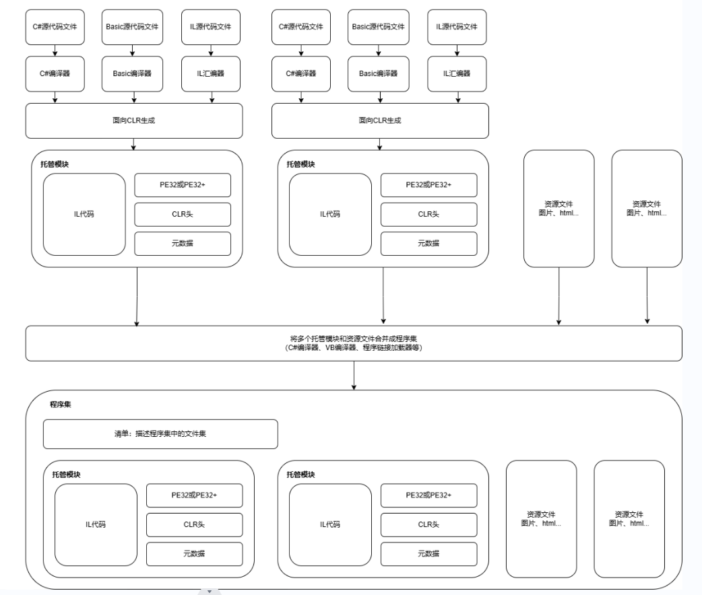
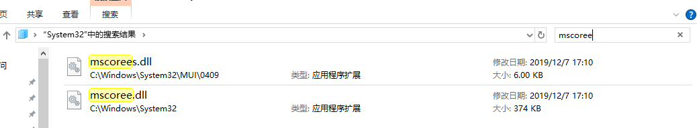

# CLR基础
虽然\.NET Framework已经逐渐淘汰了，转而被\.Net Core 替代，而\.Net Core使用的是CoreCLR，但CLR与CoreCLR有很多相似的地方，并且CLR有《CLR Via C#》讲解，所以先了解CLR再学习CoreCLR会方便很多。

## 1 CLR执行模型
CLR（Common Language Runtime， 公共语言运行时）是  .NET Framework  框架的核心组件，它为 .NET 应用程序提供了一个运行时环境。CLR 扮演了虚拟机的角色，主要负责内存管理、程序集加载、安全性、异常处理和线程同步等功能。

CLR 是 .NET 平台独有的，而不是 C# 独有的。它是为整个 .NET 生态系统设计的运行时环境，不局限于任何特定语言。CLR 支持多种 .NET 语言，包括：
- C#
- VB\.NET
- F#
- 其他 .NET 兼容语言

### 1.1 将源代码编译成托管模块

运行时CLR不关心开发人员用的哪一种语言写代码，意味着我们可以选择任何一种编程语言，只要编译器是面向CLR的。事实上，编译器可以视为是语法检查器和“正确代码”分析器。编译器检测源代码并根据我们的意图（我们自己写的代码）输出描述代码（中间代码/目标代码 等等）。编译过程中，无论选择哪个编译器，结果都是托管模块。

面向CLR的编译器除了生成IL，还在每个托管模块中生成完整的元数据（一个数据表集合，描述模块中定义了什么，引用了什么）。

### 1.2 将托管模块合并成程序集

托管模块与程序集概念理解：
一个开发团队有多个成员与一个负责人，外部人员只需要知道负责人即可，负责人知道团队内部一切情况。这时候：
团队 = 程序集、
负责人 = 托管主模块、
成员 = 普通托管模块

托管模块组成部分（以文件结构区分）：

### 1.3 加载公共语言运行时
生成的每个程序集可以是可执行应用程序，也可以是DLL。

由CLR管理程序集中的代码的执行，所以目标机器必须安装好\.NET Framework。一些版本的Windows在发售的时候就已经打包好了\.NET Framework。

如果程序集文件值包含类型安全的托管代码，代码在32位和64位Windows上都能正常工作，源代码无需任何改动。

Microsoft发布SDK命令行实用程序DumpBin.exe和CorFlags.exe，可用它们检查编译器生成的托管模块所嵌入的信息。

**CLR具体加载步骤：**

- Windows检查文件头
    - 判断需要32位还是64位空间
    - 检查嵌入的CPU架构信息，确保当前计算机CPU符合要求
- Windows的64位版本通过WoW64（Windows on Windows64）技术运行32位windows应用程序
- windows检查EXE文件头
    - 决定是32位还是64位进程后，会在检查地址空间加载MSCorEE.dll的x86，x64或ARM版本
        - x86/ARM版本：MSCorEE.dll的x86版本在`%SystemRoot%\System32`目录中
        - x64版本：MSCorEE.dll的x86版本在`%SystemRoot%\SysWow64`目录中，64位版本则在`%SystemRoot%\System32`目录中（为了向后兼容）
- 进程主线程调用MSCorEE.dll中定义的一个方法
    - 初始化CLR
    - 加载EXE程序集
    - 调用入口Main方法
- 托管应用程序启动并运行    

### 1.4 执行程序集的代码
托管程序集同时包含元数据和IL。

IL是与CPU无关的机器语言，能访问和操作对象类型，提供指令创建和初始化对象，调用对象上的虚方法以及直接操作数组元素。提供了抛出和捕捉异常指令实现错误处理。可将IL视为一种面向对象的机器语言。

高级语言通常只公开CLR全部功能的一个子集，而IL汇编语言允许开发人员访问CLR全部功能。（如果语言A隐藏我们需要的一个CLR功能，那么我们可以使用IL或提供了所需功能的语言B来写那部分代码，反正最后都转化为IL汇编语言）。`混合语言编程`是一个值得考虑的选择。

## 2 生成、打包、部署和管理应用类型及程序

## 3 共享程序集合强命名程序