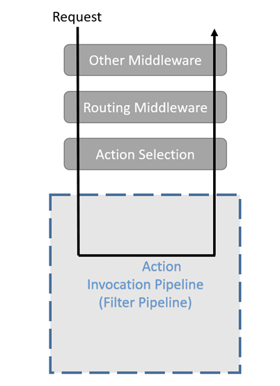
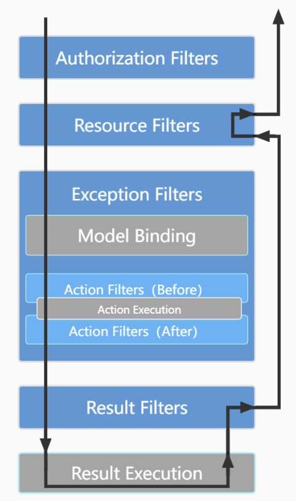
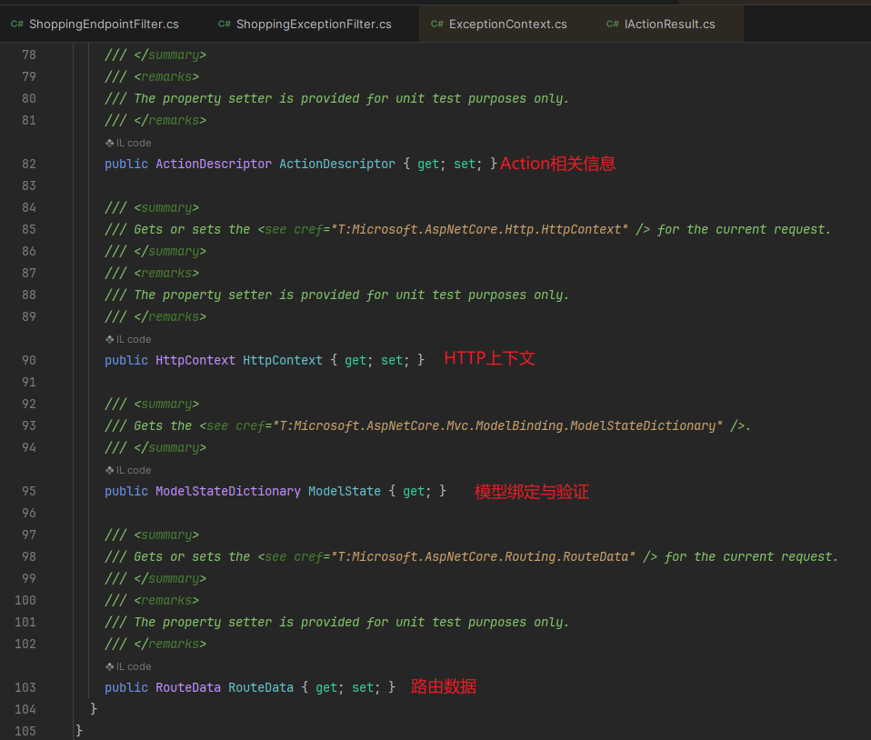
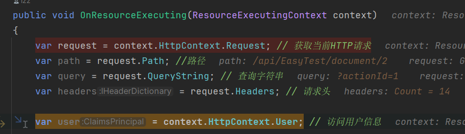
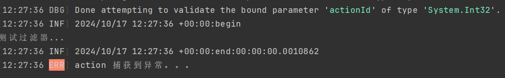

# 1-asp.net core-Filter-基础
## 1、原理
筛选器是可以在请求管道中的特定阶段之前或之后运行代码。



只有当路由选择了MVC Action之后，过滤器管道才有机会执行。

过滤器有多种：



- Authorization Filters（授权过滤器）
- Resource Filters（资源过滤器）
- Action Filters（操作过滤器）
- Exception Filters（异常过滤器）
- Result Filters（结果过滤器）

## 2、过滤器作用域
过滤器的作用域范围，可分为三种，从小到大是：
- 某个Controller中的某个Action上（不支持Razor Page中的处理方法）
- 某个Controller或Razor Page上
- 全局，应用到所有Controller、Action和Razor Page上

对于同一个过滤器，执行顺序（以IActionFilter为例）：
- 1、全局过滤器OnActionExecuting
- 2、Controller和Razor Page过滤器的OnActionExecuting
- 3、Action过滤器的OnActionExecuting
- 4、Action过滤器的OnActionExecuted
- 5、Controller和Razor Page过滤器的 OnActionExecuted
- 6、全局过滤器的 OnActionExecuted

## 3、过滤器注册方式
### 3.1 全局
```cs
services.AddControllers(options =>
{
    options.Filters.Add(typeof(ShoppingActionFilter)); // 全局过滤器
});
```

### 3.2 Controller、Razor Page 或 Action
作用域为 Controller、Razor Page 或 Action 在注册方式上来说，都是以特性的方式进行标注。
```cs
[ServiceFilter(typeof(ShoppingActionFilter))] //控制器级别
public class EasyTestController : ControllerBase{}
```

## 4、过滤器上下文
过滤器方法参数会继承FilterContext，而FilterContext继承ActionContext。

ActionContext：



下面对各个字段进行解释，不全，可以直接到编辑器看源代码。

### 4.1 ActionDescriptor
- Id : 标识该Action的唯一标识
- RouteValues : 路由字典，包含了controller、action的名字等
- AttributeRouteInfo : 特性路由的相关信息
- ActionConstraints : Action的约束列表
- EndpointMetadata : 终结点元数据
- Parameters : 路由中的参数列表，包含参数名、参数类型、绑定信息等
- FilterDescriptors : 过滤器管道中与当前Action有关的过滤器列表
- DisplayName : Action的个性化名称
- Properties : 共享元数据

### 4.2 HttpContext
- Request：表示当前 HTTP 请求的详细信息，包括请求方法、请求路径、请求头、查询字符串、请求体等
- Response：当前 HTTP 响应的信息，包括状态码、响应头、响应体等
- User：当前用户的身份信息
- Items：一个字典，用于存储请求级别的临时数据。这些数据在请求的生命周期内是有效的
- Connection：提供有关客户端连接的信息，如 IP 地址、端口号等

### 4.3 ModelState
- IsValid：指示模型状态是否有效。如果所有的验证都通过，则为 true；否则为 false
- ValidationState
    - Valid：模型有效
    - Invalid：模型无效
    - Skipped：模型未进行验证

### 4.4 RouteData
- DataTokens：存储与路由相关的额外数据，通常用于传递元数据。这些数据在路由匹配时可用，但不会参与路由的匹配逻辑
- Routers ：Microsoft.AspNetCore.Routing.IRouter 的实例列表，与当前请求相关联的路由信息，通常是与匹配的路由模板相关的信息
- Values：存储路由匹配的值，包括从 URL 路径、查询字符串和路由参数提取的值。键是参数名称，值是参数的实际值

```cs
public class ShoppingResourceFilter : IResourceFilter
{
    public void OnResourceExecuting(ResourceExecutingContext context)
    {
        var request = context.HttpContext.Request; // 获取当前HTTP请求
        var path = request.Path; //路径
        var query = request.QueryString; // 查询字符串
        var headers = request.Headers; // 请求头
        
        var user = context.HttpContext.User; // 访问用户信息

        var dbContext = context.HttpContext.RequestServices.GetService<ShoppingDbContext>(); // 访问依赖注入的服务
        
        // 访问和设置用户会话数据
        var session = context.HttpContext.Session;
        session.SetString("Key", "Value");
        var value = session.GetString("Key");

        context.Result = new BadRequestResult(); // 短路用的
    }

    public void OnResourceExecuted(ResourceExecutedContext context)
    {
        var response = context.HttpContext.Response;
        response.Headers.Add("X-Custom-Header", "value");
        response.StatusCode = 200; // 设置状态码
    }
}
```



## 5、过滤器类型
### 5.1 Authorization Filters
具有在它之前的执行的方法，但没有之后执行的方法。

自定义授权筛选器需要自定义授权框架。 建议配置授权策略或编写自定义授权策略，而不是编写自定义筛选器。

（不建议用的话就不写demo啦~老老实实按Authentication来）

### 5.2 Resource Filters
实现 IResourceFilter 或 IAsyncResourceFilter 接口（其他过滤器都有这两种类型的接口，如命名，一个同步一个异步）
#### 5.2.1 ResourceExecutingContext、ResourceExecutedContext
ResourceExecutingContext：
- Result:获取或设置该Action的执行结果
- ValueProviderFactories :Action参数绑定源提供器工厂，比如 Form、Route、QueryString、JQueryForm、FormFile等

ResourceExecutedContext:
- Canceled : 指示Action的执行是否已取消
- Exception : 如果捕获到未处理的异常，会存放到此处
- ExceptionDispatchInfo 
- ExceptionHandled : 指示异常是否已被处理
- Result : 获取或设置该Action的执行结果

一旦设置了Result，就可以使过滤器管道短路。
对于ResourceExecutedContext，有两种方式来处理异常：
- 将Exception或ExceptionDispatchInfo置为null
- 将ExceptionHandled置为true

#### 5.2.2 IResourceFilter
```cs
public class ShoppingResourceFilterV2 : IResourceFilter, IScopedDependency
{
    public void OnResourceExecuting(ResourceExecutingContext context)
    {
        if (context.RouteData.Values["action"] is "FilterTest")  // action是方法名
        {
            var id = context.RouteData.Values["id"];
            if (id != null)
            {
                if (id is not 1) // 获取的是"1"
                    context.Result = new BadRequestResult();
            }
        }
    }

    public void OnResourceExecuted(ResourceExecutedContext context)
    {
    }
}

```

#### 5.2.3 IAsyncResourceFilter
```cs
public class ShoppingResourceFilterSimpleV2 : IAsyncResourceFilter
{
    public async Task OnResourceExecutionAsync(ResourceExecutingContext context, ResourceExecutionDelegate next)
    {
        if (context.RouteData.Values["action"] is "document")
        {
            var id = context.RouteData.Values["id"];
            if (id != null)
            {
                if (id is not 1)
                    context.Result = new BadRequestResult();
            }
        }
        // 执行资源
        var executedContext = await next();

        if (executedContext.Exception != null)
        {
            Log.Error("nononononononono~");
        }
    }
}
```
### 5.3 Action Filters
IActionFilter或IAsyncActionFilter接口。
除了接口，由于操作过滤器使用率是最高的，所以框架还提供了一个抽象类ActionFilterAttribute，该抽象类实现了多个接口，还继承了Attribute，允许我们以特性的方式使用。

#### 5.3.1 ActionExecutingContext 、 ActionExecutedContext 
ActionExecutingContext：
- Result 
- ActionArguments ：Action的参数字典，key是参数名，value是参数值
- Controller ：获取该Action所属的Controller

ActionExecutedContext ：
- Canceled 
- Controller ：获取该Action所属的Controller
- Exception 
- ExceptionDispatchInfo 
- ExceptionHandled 
- Result ：获取或设置该Action的执行结果

#### 5.3.2 ActionFilterAttribute
```cs
public class ShoppingActionFilterAttribute : ActionFilterAttribute, IScopedDependency
{
    private readonly ILogger _logger;

    public ShoppingActionFilterAttribute(ILogger logger)
    {
        _logger = logger;
    }
    public override void OnActionExecuting(ActionExecutingContext context)
    {
        _logger.Information("action 执行前。。。");
    }

    public override void OnActionExecuted(ActionExecutedContext context)
    {
        _logger.Information("action 执行后。。。");
    }

    // 结果生成但尚未发送到客户端时被调用，用于在结果返回给客户端之前进行一些处理
    public override void OnResultExecuting(ResultExecutingContext context)
    {
        _logger.Information("return result 执行前。。。");
    }
    // 在结果（例如视图、JSON 数据等）已经生成并发送到客户端之后被调用
    public override void OnResultExecuted(ResultExecutedContext context)
    {
        Thread.Sleep(4000);
        _logger.Information("return result 执行后。。。");
    }
}
```

```cs
    [Route("document/{id:int}"), HttpGet]
    [ServiceFilter(typeof(ShoppingActionFilterAttribute))]
    public async Task<IActionResult> FilterTest(int actionId)
    {
        Console.WriteLine("测试过滤器...");
        //throw  new Exception("测试异常过滤器...");
        return Ok(new {id=1});
    }
```


ActionFilterAttribute同时实现了同步和异步接口，不过，我们在使用时，只需要实现同步或异步接口就可以了，不要同时实现。 如果在一个类中同时实现了异步和同步接口，则仅会调用异步接口。

#### 5.3.3 IActionFilter
```cs
public class ShoppingActionFilter: IActionFilter, IScopedDependency
{
    private readonly ILogger _log;
    private Stopwatch _stopwatch;

    public ShoppingActionFilter(ILogger log)
    {
        _log = log;
    }
    public void OnActionExecuting(ActionExecutingContext context)
    {
        _stopwatch = Stopwatch.StartNew();
        _log.Information($"{DateTimeOffset.Now}:begin");
        // if(context.ActionArguments["actionId"] is 1)
        //     context.Result = new BadRequestResult();
    }

    public void OnActionExecuted(ActionExecutedContext context)
    {
        _stopwatch.Stop();
        var elapsed = _stopwatch.Elapsed;
        _log.Information($"{DateTimeOffset.Now}:end:{elapsed}");
        if (!context.ExceptionHandled)
        {
            _log.Error("action 捕获到异常。。。");
            context.ExceptionHandled = true;
        }
    }
}
```
### 5.4 Exception Filters
异常过滤器，可以捕获Controller创建时（也就是只捕获构造函数中抛出的异常）、模型绑定、Action Filter和Action中抛出的未处理异常。

如果Action执行过程中或非首个操作过滤器中抛出异常，首先捕获到异常的是操作过滤器的OnActionExecuted，而不是异常过滤器。但是，如果在Controller创建时抛出异常，那首先捕获到异常的就是异常过滤器了。

实现接口IExceptionFilter或IAsyncExceptionFilter。
### 5.4.1 ExceptionContext 
- Exception ：捕获到的未处理异常
- ExceptionDispatchInfo 
- ExceptionHandled ：指示异常是否已被处理，true：表示异常已被处理，异常不会再向上抛出，false：表示异常未被处理，异常仍会继续向上抛出
- Result ：如果设置了结果，也表示异常已被处理，异常不会再向上抛出

#### 5.4.2 ShoppingExceptionFilter

```cs
public class ShoppingExceptionFilter : IExceptionFilter, IScopedDependency
{
    public void OnException(ExceptionContext context)
    {
        if (!context.ExceptionHandled)
        {
            Console.WriteLine("Exception filter 捕获。。。");
            context.Result = new BadRequestObjectResult("exception filter");
            // 标记异常已处理
            context.ExceptionHandled = true;
        }
    }
}
```
```cs
    [Route("document/{id:int}"), HttpGet]
    [ServiceFilter(typeof(ShoppingExceptionFilter))]
    public async Task<IActionResult> FilterTest(int actionId)
    {
        Console.WriteLine("测试过滤器...");
        throw  new Exception("测试异常过滤器...");
        return Ok(new {id=1});
    }
```
### 5.5 Result Filters
结果过滤器，包裹了操作结果的执行。操作结果的执行可以是Razor视图的处理操作，也可以是Json结果的序列化操作等。

实现IResultFilter或IAsyncResultFilter接口。

仅当Action或Action Filters生成Result时，才会执行结果过滤器。像授权、资源过滤器使管道短路或异常过滤器通过生成Result来处理异常等，都不会执行结果过滤器。

#### 5.5.1 ResultExecutingContext 、ResultExecutedContext 
ResultExecutingContext：
- Controller 
- Result 
- Cancel 

ResultExecutedContext：
- Canceled 
- Controller 
- Exception 
- ExceptionDispatchInfo 
- ExceptionHandled 
- Result 

#### 5.5.2 ResultFilterAttribute
```cs
public class ShoppingResultFilterAttribute : ResultFilterAttribute, IScopedDependency
{
    public override void OnResultExecuting(ResultExecutingContext context)
    {
        context.HttpContext.Response.Headers["merch"] = "cedar";
        Console.WriteLine(context.Result);
        var hasStarted = context.HttpContext.Response.HasStarted; // false
    }

    public override void OnResultExecuted(ResultExecutedContext context)
    {
        if (context.HttpContext.Response.HasStarted) // 用于检查 HTTP 响应是否已经开始发送到客户端 true
        {
            Console.WriteLine("Response has started");
        }
    }
}
```

## 6、内置筛选器属性
- ActionFilterAttribute
- ExceptionFilterAttribute
- ResultFilterAttribute
- FormatFilterAttribute
- ServiceFilterAttribute
- TypeFilterAttribute