# 0-asp.net core-中间件基础
## 1、request到response的历程


EndPoint（终结点）中间件一般为相应的应用类型，比如MVC。


中间件是ASP.NET CORE提供的功能，而Filter是ASP.NET CORE MVC提供的功能。

中间件是一种装配到应用管道以处理请求和响应的软件。 每个组件：
- 选择是否将请求传递到管道中的下一个组件
- 可在管道中的下一个组件前后执行工作

## 2、中间件管道
### 2.1 Run
该方法为HTTP请求管道添加一个中间件，并标识该中间件为管道终点，称为终端中间件。也就是说，该中间件就是管道的末尾，在该中间件之后注册的中间件将永远都不会被执行。这是单个请求委托。

将这个方法放在第一个注册的位置，然后执行项目，可以看到出现的不是swagger页面而是hello world。
```cs
app.Run(async context =>
{
    Console.WriteLine("hello world");
    await context.Response.WriteAsync("Hello world!");
});
```
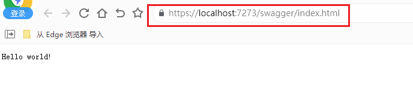


### 2.2 Use
需要多个委托执行中间件执行前后的逻辑的话，就使用Use。可以按过滤器的逻辑理解。

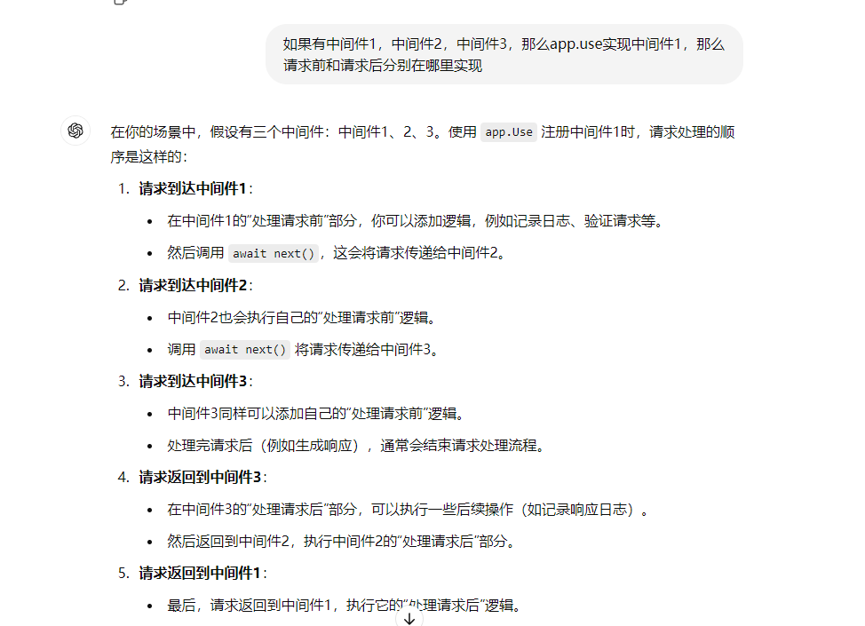

next 参数表示管道中的下一个委托。 可通过不调用 next 参数使管道短路。 通常可在 next 委托前后执行操作。

```cs
app.Use(async (context, next) =>
{
    Console.WriteLine("hello world1");
    await next.Invoke();
    Console.WriteLine("Hello world2!");
});
```

- 如果要将请求发送到管道中的下一个中间件，一定要记得调用next.Invoke / next()
- 如果已经开始给客户端发送Response，请千万不要调用next.Invoke / next()，也不要对Response进行任何更改，否则，将抛出异常
- 可以通过context.Response.HasStarted来判断响应是否已开始

```cs
app.Use(async (context, next) =>
{
    Console.WriteLine("hello world1");
    await context.Response.WriteAsync("Hello world!");
    await next.Invoke();
    Console.WriteLine("Hello world2!");
});
```
上面这样写是错误的，会报错。

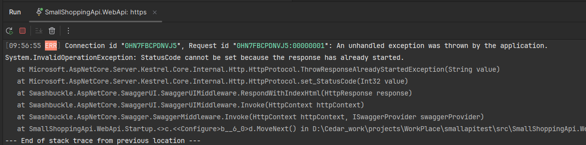

### 2.3 UseWhen
针对不同的逻辑条件创建管道分支。需要注意的是:
- 进入了管道分支后，如果管道分支不存在管道短路或终端中间件，则会再次返回到主管道
- 使用PathString时，路径必须以“/”开头，且允许只有一个'/'字符
- 支持UseWhen中嵌套UseWhen
- 支持同时匹配多个段

```cs
        app.UseWhen(context => context.Request.Path.StartsWithSegments("/get"), app =>
        {
            app.Use(async (context, next) =>
            {
                Console.WriteLine("UseWhen:Use");

                await next();
            });
        });
        
        app.Use(async (context, next) =>
        {
            Console.WriteLine("Use");

            await next();
        });

        app.Run(async context =>
        {
            Console.WriteLine("Run");

            await context.Response.WriteAsync("Hello World!");
        });
```

执行/get上面3个中间件都会执行，执行其他的，不会执行UseWhen的中间件。

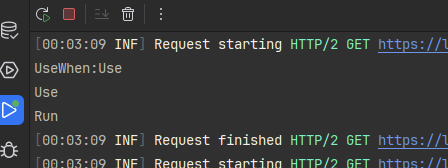
### 2.4 Map
针对不同的请求路径创建管道分支：
- 一旦进入了管道分支，则不会再回到主管道
- 使用该方法时，会将匹配的路径从HttpRequest.Path 中删除，并将其追加到HttpRequest.PathBase中
- 路径必须以“/”开头，且不能只有一个'/'字符
- 支持嵌套，即Map中嵌套Map、MapWhen
- 支持同时匹配多个段

```cs
        app.Map("/get", app =>
        {
            app.Use(async (context, next) =>
            {
                Console.WriteLine("Map get: Use");
                Console.WriteLine($"Request Path: {context.Request.Path}"); 
                Console.WriteLine($"Request PathBase: {context.Request.PathBase}");
        
                await next();
            });
        
            app.Run(async context =>
            {
                Console.WriteLine("Map get: Run");
        
                await context.Response.WriteAsync("Map Hello World!");
            });
        
        });
        app.Use(async (context, next) =>
        {
            Console.WriteLine("Use");

            await next();
        });
        app.Run(async context =>
        {
            Console.WriteLine("Run");

            await context.Response.WriteAsync("Hello World!");
        });
```

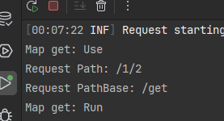


/get 的只会执行map, 其他的执行除map的两个中间件。

### 2.5 MapWhen
与Map类似，MapWhen是基于逻辑条件创建管道分支：
- 一旦进入了管道分支，则不会再回到主管道
- 当使用PathString时，路径必须以“/”开头，且允许只有一个'/'字符
- HttpRequest.Path和HttpRequest.PathBase不会像Map那样进行特别处理
- 支持嵌套
- 支持同时匹配多个段

```cs
app.MapWhen(context => context.Request.Path.StartsWithSegments("/get"), app =>
{
    app.MapWhen(context => context.Request.Path.ToString().Contains("user"), app =>
    {
        app.Use(async (context, next) =>
        {
            Console.WriteLine("MapWhen get user: Use");

            await next();
        });
    });

    app.Use(async (context, next) =>
    {
        Console.WriteLine("MapWhen get: Use");

        await next();
    });

    app.Run(async context =>
    {
        Console.WriteLine("MapWhen get: Run");

        await context.Response.WriteAsync("Hello World!");
    });
});
```

### 2.6 总结
- Run用于注册终端中间件(最后执行的)，Use用来注册匿名中间件，UseWhen、Map、MapWhen用于创建管道分支
- UseWhen进入管道分支后，如果管道分支中不存在短路或终端中间件，则会返回到主管道。Map和MapWhen进入管道分支后，无论如何，都不会再返回到主管道
- UseWhen和MapWhen基于逻辑条件来创建管道分支，而Map基于请求路径来创建管道分支，且会对HttpRequest.Path和HttpRequest.PathBase进行处理


## 3、常用内置中间件
微软文档建议顺序：
```cs
if (app.Environment.IsDevelopment())
{
    app.UseMigrationsEndPoint();
}
else
{
    app.UseExceptionHandler("/Error");
    app.UseHsts();
}

app.UseHttpsRedirection();
app.UseStaticFiles();
// app.UseCookiePolicy();

app.UseRouting();
// app.UseRateLimiter();
// app.UseRequestLocalization();
// app.UseCors();

app.UseAuthentication();
app.UseAuthorization();
// app.UseSession();
// app.UseResponseCompression();
// app.UseResponseCaching();
```
不是一定是这个顺序，但有些顺序是固定的：
- UseCors、UseAuthentication 和 UseAuthorization 必须按显示的顺序出现。
- UseCors 当前必须在 UseResponseCaching 之前出现
- UseRequestLocalization 必须在可能检查请求区域性的任何中间件（例如 app.UseStaticFiles()）之前出现。
### 3.1 异常处理中间件
分为两种，在开发环境中使用 UseDeveloperExceptionPage 生产环境使用UseExceptionHandler。

使用顺序是在生成错误的组件之前。异常终端或为新应用提供默认网页的终端。
#### 3.1.1 UseDeveloperExceptionPage 
```cs
if (env.IsDevelopment())  //在开发环境中使用Swagger  app.Environment.IsDevelopment()检测当前应用程序是否处于开发环境中
{
    app.UseSwagger();
    app.UseSwaggerUI();
    app.UseDeveloperExceptionPage(); //异常中间件，通过它捕获的异常会返回一个异常界面
}
```
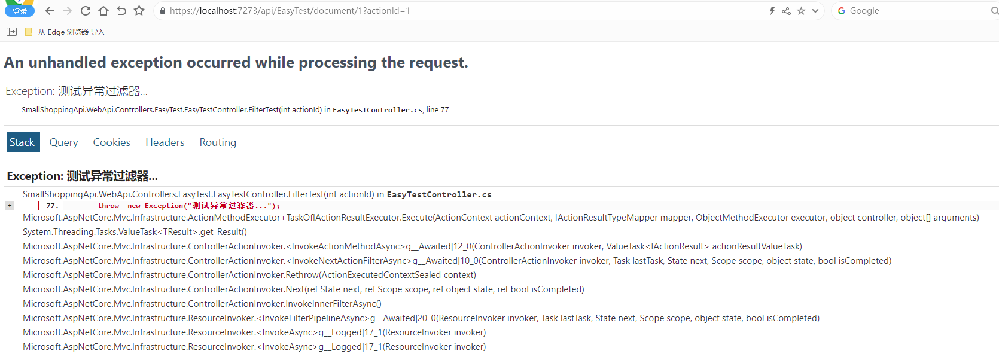
#### 3.1.2 UseExceptionHandler 
```cs
app.UseExceptionHandler(configure =>
{
    configure.Run(async context =>
    {
        var exceptionHandlerPathFeature = context.Features.Get<IExceptionHandlerPathFeature>();
        var ex = exceptionHandlerPathFeature?.Error;
        if (ex != null)
        {
            context.Response.ContentType = "text/plain;charset=utf-8";
            await context.Response.WriteAsync("这是错误的证据！");
            await context.Response.WriteAsync(ex.ToString());
        }
    });
});
```
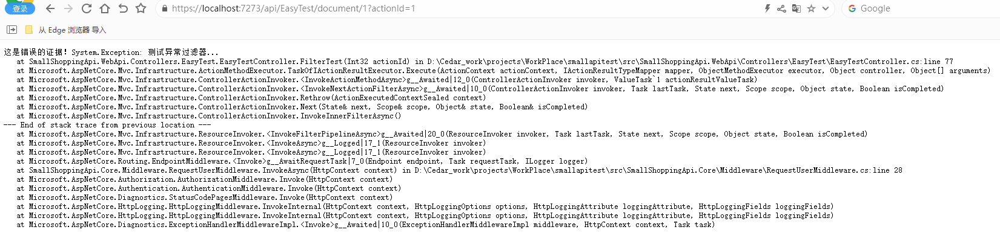
### 3.2 HTTPS重定向中间件
HTTPS重定向中间件（ UseHttpsRedirection ）能将HTTP请求重定向到HTTPS，非HTTPS的站点配置非常的方便。
```cs
app.UseHttpsRedirection(); //使用HTTPS重定向中间件，将所有的HTTP请求重定向为HTTPS请求
```

### 3.3 静态文件中间件
静态文件中间件（ UseStaticFiles ）返回静态文件，为提供静态文件和目录浏览提供支持。
```cs
app.UseStaticFiles(new StaticFileOptions // Web 根目录外的文件
{
    FileProvider = new PhysicalFileProvider(
        Path.Combine(env.ContentRootPath, "MyStaticFiles")),
    RequestPath = "/StaticFiles"
});
```
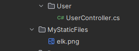
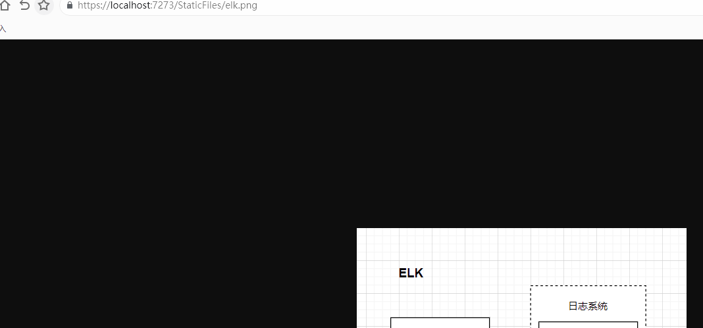

### 3.4 Cookie中间件
Cookie策略中间件（ UseCookiePolicy ）。跟踪用户是否同意存储个人信息，并强制实施 cookie 字段（如 secure 和 SameSite）的最低标准。使用顺序是在发出 cookie 的中间件之前。示例：身份验证、会话、MVC (TempData)。
```cs
 app.UseCookiePolicy();
```

### 3.5 路由中间件
路由中间件（ UseRouting ）用于定义和约束请求路由。
```cs
app.UseRouting(); // 启动路由功能，不用startup的话可以不显示用这个，将请求匹配到端点
```

### 3.6 身份认证中间件
执行顺序需要在 HttpContext.User 之前， OAuth 回叫的终端。
```cs
app.UseAuthentication();
```

### 3.7 授权中间件
执行顺序需要在 HttpContext.User 之前， OAuth 回叫的终端。
```cs
app.UseAuthentication();
```

### 3.8 会话中间件
会话中间件（ UseSession ）提供对管理用户会话的支持。应用程序使用会话状态，需要在Cookie策略中间件之后和MVC中间件之前调用会话中间件。

```cs
app.UseSession();
```

### 3.9 终结点路由中间件
终结点路由中间件（ UseEndpoints ）向中间件管道添加终结点执行。实际路径执行的。可以配置我们的默认路由等。注意UseEndpoints 跟UseRouting的区别。

```cs
app.UseEndpoints(endpoints =>
{
    endpoints.MapControllers();
    endpoints.MapHub<RealMessageHub>("/RealMessageHub"); 
    endpoints.MapGet("/example", async context =>
    {
        await context.Response.WriteAsync("Hello World!");
    }).AddEndpointFilter(async (context, next) =>
    {
        var filter = context.HttpContext.RequestServices.GetRequiredService<ShoppingEndpointFilter>();
        return await filter.InvokeAsync(context, next);
    });
});
```
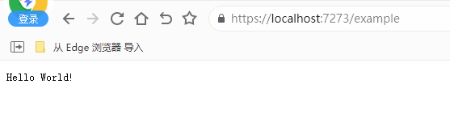

### 3.10 跨域请求中间件
跨域请求中间件（UseCors）可以配置跨域的网站，跨域请求策略可防止恶意站点从另一站点读取敏感数据。使用顺序是 UseCors 的调用必须放在 UseRouting 之后，但在 UseAuthorization 之前。

就是匹配域名白名单，只有在白名单内的域名才能访问站点接口。

```cs
services.AddCors(options =>
{
    // options.AddPolicy("AllowSpecificOrigin",
    //     builder => builder
    //         .SetIsOriginAllowed(_ => true)
    //         //.WithOrigins("http://localhost:3000") 
    //         .AllowAnyMethod()
    //         .AllowAnyHeader()
    //         .AllowCredentials());
    
    options.AddPolicy("AllowSpecificOrigin",
        builder => builder
            .WithOrigins("https://localhost:44337")
            .AllowAnyMethod()
            .AllowAnyHeader()
            .AllowCredentials());
});


app.UseCors("AllowSpecificOrigin"); //注册到中间件
```

## 4、自定义中间件
### 4.1 基于约定的中间件
- 拥有公共构造函数，该构造函数至少包含一个类型为RequestDelegate的参数
- 拥有名为Invoke或InvokeAsync的公共（public）方法，第一个参数类型为HttpContext的方法参数，另外该方法必须返回Task类型
- 构造函数中的其他参数可以通过依赖注入（DI）填充，也可以通过UseMiddleware传参进行填充
    - 通过DI填充时，只能接收 Transient 和 Singleton 的DI参数。这是由于中间件是在应用启动时构造的（而不是按请求构造），所以当出现 Scoped 参数时，构造函数内的DI参数生命周期与其他不共享，如果想要共享，则必须将Scoped DI参数添加到Invoke/InvokeAsync来进行使用
    - 通过UseMiddleware传参时，构造函数内的DI参数和非DI参数顺序没有要求，传入UseMiddleware内的参数顺序也没有要求，但是建议将非DI参数放到前面，DI参数放到后面
- Invoke/InvokeAsync的其他参数也能够通过依赖注入（DI）填充，可以接收 Transient、Scoped 和 Singleton 的DI参数

### 4.2 简单中间件实现
```cs
public class RequestUserMiddleware
{
    private readonly RequestDelegate _next;
    public RequestUserMiddleware(RequestDelegate next)
    {
        _next = next;
    }
    /// <summary>
    /// 名为 Invoke 或 InvokeAsync 的公共方法。 此方法必须：
    /// 1、返回 Task
    /// 2、接受类型 HttpContext 的第一个参数
    /// </summary>
    /// <param name="context"></param>
    public async Task InvokeAsync(HttpContext context)
    {
        var userQuery = context.Request.Query["user"];
        if (!string.IsNullOrWhiteSpace(userQuery))
        {
            Console.WriteLine(context.Request);
            Console.WriteLine("这是关于user的接口。。。");
        }
        // 调用下一个中间件
        await _next(context);
    }
}

public static class RequestUserMiddlewareExtensions
{
    public static IApplicationBuilder UseRequestUser(
        this IApplicationBuilder builder)
    {
        return builder.UseMiddleware<RequestUserMiddleware>();
    }
}

app.UseRequestUser(); // 启用自定义中间件
```
可以用UseMiddleware添加到管道中，但不推荐直接用，可以像上面一样做一层封装。


访问接口：https://localhost:7273/api/User/create/user?user=1

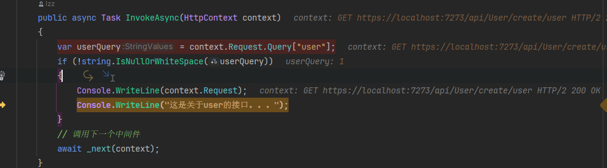


### 4.3 基于工厂的中间件
上面的例子中中间件实例是单例的，但是基于工厂中间件，可以在依赖注入时设置中间件实例的生命周期。

工厂的中间件使中间件强类型化（因为其实现了接口IMiddleware）。

UseMiddleware扩展方法会先检查中间件是否实现了IMiddleware接口。 如果实现了，则使用容器中注册的IMiddlewareFactory实例来解析该IMiddleware的实例。如果没实现，那么就使用基于约定的中间件逻辑来激活中间件。

**基于工厂的中间件，在应用的服务容器中一般注册为 Scoped 或 Transient 服务**

这样就可以放心的将 Scoped 服务注入到中间件的构造函数中了。

```cs
public class YourMiddleware : IMiddleware
{
    public async Task InvokeAsync(HttpContext context, RequestDelegate next)
    {
        // 下一个中间件处理之前的操作
        Console.WriteLine("YourMiddleware Begin");

        await next(context);

        // 下一个中间件处理完成后的操作
        Console.WriteLine("YourMiddleware End");
    }
}

public static class AppMiddlewareApplicationBuilderExtensions
{
    public static IApplicationBuilder UseYour(this IApplicationBuilder app) => app.UseMiddleware<YourMiddleware>();
}

// 在ConfigureServices中添加中间件依赖注入
services.AddTransient<YourMiddleware>();

// 在Configure中使用中间件
app.UseYour();
```

也可以直接使用微软提供的默认实现IMiddlewareFactory。

