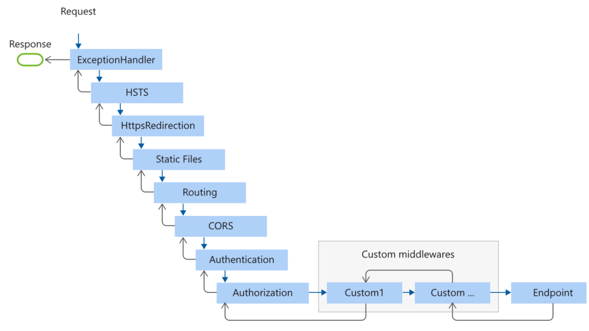
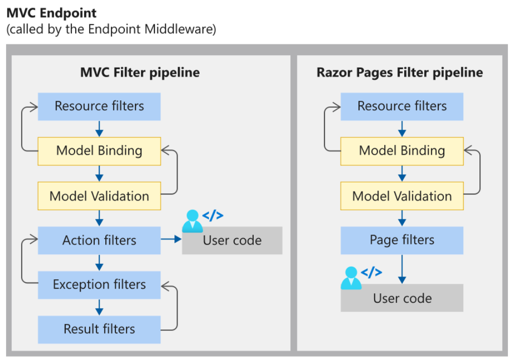

# 0-asp.net core-中间件基础
## 1、request到response的历程

EndPoint（终结点）中间件一般为相应的应用类型，比如MVC。

中间件是ASP.NET CORE提供的功能，而Filter是ASP.NET CORE MVC提供的功能。

中间件是一种装配到应用管道以处理请求和响应的软件。 每个组件：
- 选择是否将请求传递到管道中的下一个组件
- 可在管道中的下一个组件前后执行工作

