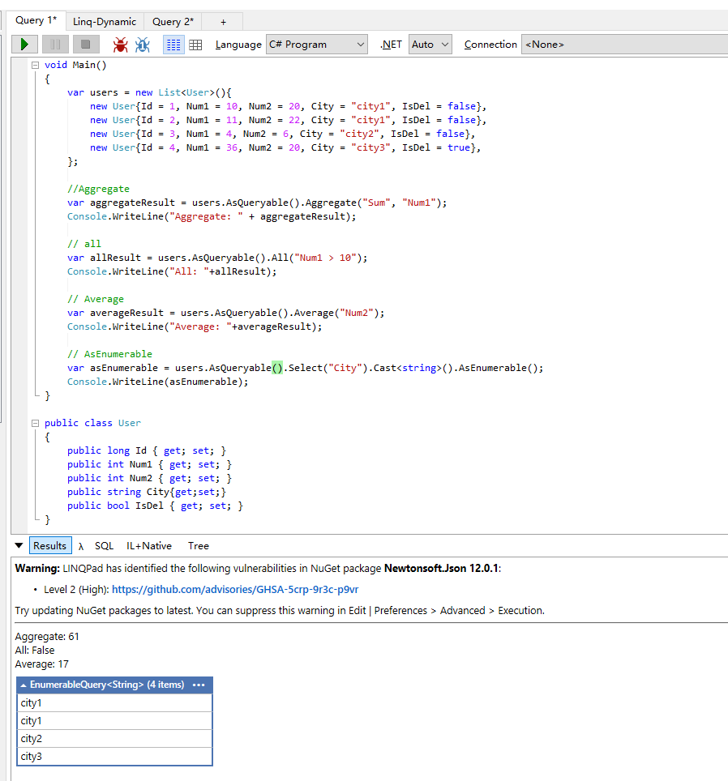
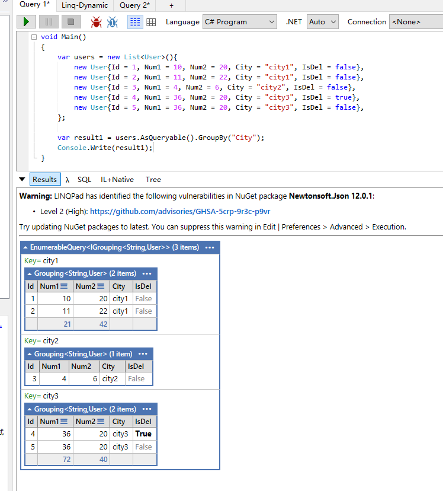

# System.Linq.Dynamic
- https://dynamic-linq.net/overview

动态构建LINQ查询（运行时生成条件）
- 通过 LINQ 提供程序进行基于动态字符串的查询
- 动态解析字符串以生成表达式树
- 使用 CreateType 方法动态创建数据类

```
Install-Package System.Linq.Dynamic.Core
```

简单查询：


```cs
var resultDynamic = users.AsQueryable()
.Where("City == @0", "city1") // 防 SQL 注入风格
.ToList();
```

```cs
var resultDynamic = users.AsQueryable()
.Where("City == @0 and num1 > @1", "city1", 10)
.ToList();
```

```cs
var resultDynamic = users.AsQueryable()
.Where("City == @0 and num1 > @1", "city1", 10)
.Select("new {City, IsDel}")
.ToDynamicList();
```

```cs
var resultDynamic = users.AsQueryable()
.Where("City == @0", "city1")
.OrderBy("Num1, Num2")
.ToList();

// 等价于

var resultDynamic = users.AsQueryable()
.Where(x=>x.City = "city1")
.OrderBy(x=>x.Num1).ThenBy(x=>x.Num2)
.ToList();
```

## Aggregate/All/Average/AsEnumerable



## Cast and OfType
- Cast\<T>()：强制转换所有元素，如果类型不匹配会抛出 InvalidCastException
- OfType\<T>()：只返回能成功转换为 T 的元素，跳过不匹配的（不会报错）

```cs
namespace DynamicLinqDemo
{
	public class Employee { }
	public class Worker : Employee { public int Value { get; set; } }
	public class Boss : Employee { }

	class Program
	{
		static void Main()
		{
			List<Employee> employees = new List<Employee>
			{
				new Worker { Value = 1 },
				new Worker { Value = 2 },
				new Boss()
			};

			var query = employees.AsQueryable();

			// OfType(Type)
			var workers = query.OfType(typeof(Worker));
			Console.WriteLine("Workers via OfType(Type):");
			foreach (var w in workers)
			{
				Console.WriteLine(w);
			}

			// Cast(Type)
			var casted = workers.Cast(typeof(Worker));
			Console.WriteLine("Workers via Cast(Type):");
			foreach (dynamic w in casted)
			{
				Console.WriteLine(w.Value);
			}

			// Dynamic: As() to nullable int
			var result = query.OfType(typeof(Worker));
			var count = result.Where("As(Value, \"int?\") != null").Count();
			Console.WriteLine($"Count of Workers with non-null Value: {count}");
		}
	}
}
```


## GroupBy

singleKey



composite key


single Key and with a single result


所有都支持异步查询，方法后缀加上Async。


## Expression Language  
动态 LINQ 表达式语言提供了一种简单、方便的方式来编写可解析为 LINQ 表达式树的表达式。

- 定义true，false，null的常量
- 标识符由一个字母或下划线后跟任意数量字母、数字或下划线组成，如果是关键字，标识符以@关键字 作为标识符 @true, x, m_1等
- 字面量
	- 整数： 0 、 123 、 10000 、 1L 、 2U 和 3UL 
	- 实数字面量由整数部分、小数部分和/或指数组成：1.0 、 2.25 、 10000.0 、 1e0 、 1e10 、 1.2345E-4 
	- 字符串字面量："hello", "", "\"quoted\"" and "'"
	- 字符字面量：'A', '1', '''' and '"'


**it**


**in**


还可以用`not in`或`not_in`

**条件运算**


**iif**

```cs
var baseQuery = new int[] { 1, 2, 3, 4, 5 }.AsQueryable();

var result = baseQuery.Select("iif(it % 2 = 0, true, false)"); // 条件表达式. x ? y : z 的替代语法

Console.WriteLine(result);
```

## 高级用法
### 配置
```cs
var config = new ParsingConfig
{
	// 控制 动态 LINQ 查询的参数化命名方式，主要影响生成的 SQL 语句中的参数命名规则
	UseParameterizedNamesInDynamicQuery = true
};

var result = users.AsQueryable().Where("City = @0", "city2");
Console.WriteLine(result);
```

ParsingConfig提供以下设置：
- AllowNewToEvaluateAnyType：控制动态 LINQ 是否允许在 new 表达式中创建任意类型的对象（包括匿名类型、非公开类型等）。
默认值为 false，即仅允许创建已知的公共类型。
- AreContextKeywordsEnabled：确定上下文关键字（如 it、parent 和 root）在动态 LINQ 字符串表达式中是否有效且可用，默认true
- DateTimeIsParsedAsUTC：默认情况下，DateTime（例如 Fri, 10 May 2019 11:03:17 GMT ）会被解析为本地时间，true解析为UTC时间
- DisableMemberAccessToIndexAccessorFallback："someProperty == \"value\"" 找不到改属性时并且目标对象实现了索引器（this[string key]），尝试以索引方式访问：`obj["someProperty"]`
- EvaluateGroupByAtDatabase:控制GroupBy操作是在数据库执行（优化模式）还是在内存中执行（兼容模式）默认false在内存中分组
- IsCaseSensitive：区分大小写
- NumberParseCulture：设置数字解析文化，默认值InvariantCulture
- RenameParameterExpression：控制动态 LINQ 参数表达式的命名行为
	```cs
		var config = new ParsingConfig {
			RenameParameterExpression = (origName, index) => $"param_{index}_{DateTime.Now.Ticks}"
	};

	var query = db.Products.Where(config, "Price > @0", 100);
	// SQL: WHERE Price > @param_0_638449632000000000
	```
- ResolveTypesBySimpleName:控制动态LINQ在解析类型名称时是否仅使用类名（忽略命名空间）
	```cs
	// 默认严格模式 (false)
	// 错误！ 必须包含完整命名空间
	var query = db.Queryable()
			.Where("MyApp.Models.Product.Price > 100"); 
	```

### 创建动态类
数据类是仅包含数据成员的类。静态 System.Linq.Dynamic.Core.DynamicClassFactory 类定义了以下用于动态创建类型的方法。

```cs
DynamicClassFactory.CreateType(IDictionary<string, Type> properties, bool createParameterCtor)
```

- properties：定义属性名称和类型的字典
- createParameterCtor
	- true：会自动生成一个构造函数接收所有字段
	- false：使用默认无参构造函数

创建动态类（Dynamic Class）通常用于 运行时才确定数据结构 的场景，也就是说，事先并不知道类的属性名、类型或结构，需要在程序运行过程中动态构建。

场景：根据前端用户选择的字段返回数据列表


