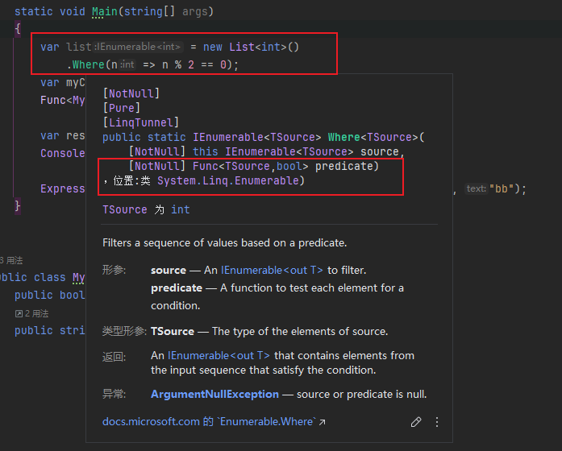
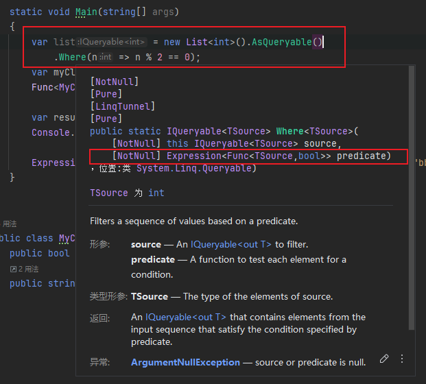

# Expression
- https://www.youtube.com/watch?app=desktop&v=Glfz0FDPfXk&t=0s
- https://learn.microsoft.com/zh-tw/dotnet/api/system.linq.expressions.expression?view=net-8.0





看起来表达式和方法差不多，但是函数可以调用，而表达式树只是一个代表代码的数据结构，可以对代码进行分析。

```cs
var myClass = new MyClass();

Func<MyClass, string> func = c=>c.MyMethod(42, "aa");
Expression<Func<MyClass, string>> expr = c=>c.MyMethod(44, "bb");

// 编译出来都一样的，func(myClass)是语法糖
func.Invoke(myClass);
func(myClass);

// expr不能调用
```

每个代码都是树结构。

```cs
// 查看每个结构
public class MyClass{
    public bool MyProperty{get;set;}
    public string MyMethod(int number, string text) => number + text;
}

public class Program
{
    static void Main(string[] args)
    {
        var list = new List<int>().AsQueryable()
            .Where(n => n % 2 == 0);
        var myClass = new MyClass();
        Func<MyClass, string> func = c=>c.MyMethod(42, "aa");
    
        // 表达式不是存储在内存的
        Expression<Func<MyClass, string>> expr = c=>c.MyMethod(44, "bb");
        Expression<Func<MyClass, bool>> propExpr = c => c.MyProperty;
        
        // 编译出来都一样的，func(myClass)是语法糖
        func.Invoke(myClass);
        func(myClass);

        // 编译
        var exprFunc = expr.Compile();
        Console.WriteLine(exprFunc.Invoke(myClass));
    }

    private static void ParseExpression(Expression expression)
    {
        if (expression.NodeType == ExpressionType.Lambda)
        {
            var lambdaExpression = (LambdaExpression)expression;
            Console.WriteLine("lambda expression");
            Console.Write(lambdaExpression.Body);
            Console.Write(lambdaExpression.Parameters[0]);
            ParseExpression(lambdaExpression.Body);
        }
        else if(expression.NodeType == ExpressionType.Call)
        {
            var methodCallExpression = (MethodCallExpression)expression;
            Console.WriteLine("method call expression");
            Console.WriteLine(methodCallExpression.Method.Name);
            Console.WriteLine(methodCallExpression.Arguments[0]);

            for (int i = 0; i < methodCallExpression.Arguments.Count; i++)
            {
                ParseExpression(methodCallExpression.Arguments[i]);
            }
        }
        else if (expression.NodeType == ExpressionType.MemberAccess)
        {
            var memberExpression = (MemberExpression)expression;
            Console.WriteLine("member expression");
            Console.WriteLine(memberExpression.Member.Name);
        }
        else if (expression.NodeType == ExpressionType.Constant)
        {
            var constantExpression = (ConstantExpression)expression;
            Console.WriteLine("constant expression");
            Console.WriteLine(constantExpression.Value);
        }
    }
}

```

怎么创建表达式：
```cs
static void Main(string[] args)
{
    Expression<Func<MyClass, string>> expr = c=>c.MyMethod(42, "Hello World");
    
    // 创建常量节点 42 和 Hello World
    var numberConstant = Expression.Constant(42);
    var textConstant = Expression.Constant(" Hello World");
    
    // 定义参数名和参数类型的参数节点
    var parameterExpression = Expression.Parameter(typeof(MyClass), "c");
    // 获取要调用的方法
    var methodInfo = typeof(MyClass).GetMethod(nameof(MyClass.MyMethod));
    // 创建方法调用的表达式树节点
    var callExpression = Expression.Call(parameterExpression, methodInfo, numberConstant, textConstant);
    // 将表达式树转化为可执行的表达式树对象（lambda表达式）
    var lambdaExpression = Expression.Lambda<Func<MyClass, string>>(callExpression, parameterExpression);
    Console.WriteLine(lambdaExpression.Compile()(new MyClass()));
}
```

## E.G.
常量表达式：
```cs
// ()=>5

// 一个常量表达式
var constant = Expression.Constant(5);

// 将常量包装为一个lambda表达式
var lambda = Expression.Lambda<Func<int>>(constant);

// 只有完整表达式LambdaExpression才能编译成委托
var func = lambda.Compile();
```

结合linq：
```cs
class User
{
	public string name{get;set;}
	public int age{get;set;}
	public bool isDelete{get;set;}
}

void Main()
{
	// users.Where(u=>u.age < 20 || u.isDelete = true)
	
	var users = new List<User>(){
		new User(){name = "a", age = 12, isDelete = false},
		new User(){name = "b", age = 18, isDelete = false},
		new User(){name = "c", age = 33, isDelete = false},
		new User(){name = "d", age = 40, isDelete = true}
	}.AsQueryable();
	
	// 定义形参
	var parameter = Expression.Parameter(typeof(User), "u");
	
	// 定义常量
	var ageConstant = Expression.Constant(20);
	var delConstant = Expression.Constant(true);
	
	// 定义属性
	var ageProperty = Expression.Property(parameter, nameof(User.age));
	var isDeleteProperty = Expression.Property(parameter, nameof(User.isDelete));

        // u.age < 20> 
	var ageBinary = Expression.LessThan(ageProperty, ageConstant);
        // u.isDelete = true
	var delBinary = Expression.Equal(isDeleteProperty, delConstant);
	// u.age < 20 || u.isDelete = true
	var contactBinary = Expression.OrElse(ageBinary, delBinary);
	// 结合为 u=> u.age < 20 || u.isDelete = true的lambda表达式
	var whereLambda = Expression.Lambda<Func<User, bool>>(contactBinary, parameter);
	
	// 方法表达式  .Where(xxx).Where(u=>u.age < 20 || u.isDelete = true)
	var whereCallExpr = Expression.Call(
	typeof(Queryable), //调用的对象类型
	"Where", // 指定用Where方法
	new[] { typeof(User) }, //  Queryable.Where<T>只需要一个泛型参数T
	users.Expression, // 调用方的expression
	whereLambda); // where里的表达式
	
	// 将构建好的表达式树转换为可执行的查询
	var resultQuery = users.Provider.CreateQuery<User>(whereCallExpr);
	
	var list = resultQuery.ToList();
	Console.WriteLine(list);
}
```