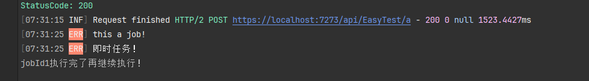

# Hangfire
hangfire是一个管理后台任务的，并且提供可靠机制，任务失败时自动重试。


主要由3部分组成：
- 客户端
- 作业存储
- 服务端

## 1 执行流程

```cs
BackgroundJob.Enqueue(() => Console.WriteLine("Hello, world!"));
```

客户端Enqueue执行：
- 1、序列化目标方法及其所有参数
- 2、根据序列化信息创建一个后台任务
- 3、将后台任务保存到持久化存储（数据库）
- 4、将后台任务入队
- 5、返回结果

Hangfire Server执行：
- 1、获取一个任务，并对其他worker（队列任务专门的工作线程）隐藏该任务（在分布式任务队列系统中，如果不隐藏任务，多个 worker 可能会争夺同一个任务，导致任务被重复执行，进而引发各种潜在问题。）
- 2、执行任务及其所有的扩展过滤器
- 3、处理成功后，从队列中删除该任务

每种持久存储各有各自的步骤和补偿逻辑机制：
- SQL Server 使用常规SQL事务，因此在进程终止的情况下，后台作业ID立即放回队列
- Redis 实现使用阻塞的 BRPOPLPUSH 命令，入队后几乎立即获取作业。但是在进程终止的情况下，只有在超时到期后（默认为30分钟）才重新排队

## 2 安装与配置
这里用的mysql作为持久化存储，需要的库有
```
Hangfire
Hangfire.Core
Hangfire.MySqlStorage
```

```cs
services.AddHangfire(c => // 配置 Hangfire 的存储和其他服务的初始化方法
{
    var str = "Server=localhost;Database=hangfire_db;Uid=root;Pwd=123456;Allow User Variables=true;";
    c.UseStorage(new MySqlStorage(str, new MySqlStorageOptions
    {
        TransactionIsolationLevel = IsolationLevel.ReadCommitted,
        QueuePollInterval = TimeSpan.FromSeconds(15),
        JobExpirationCheckInterval = TimeSpan.FromHours(1),
        CountersAggregateInterval = TimeSpan.FromMinutes(5),
        PrepareSchemaIfNecessary = true,
        DashboardJobListLimit = 50000,
        TransactionTimeout = TimeSpan.FromMinutes(1),
        TablesPrefix = "Hangfire"
    }));
});
services.AddHangfireServer(); // 配置并启动 Hangfire 的 后台作业处理服务
```


添加仪表盘：
```cs
app.UseHangfireDashboard(); // Map Dashboard to the `http://<your-app>/hangfire` URL.
```


## 3 快速使用

```cs
public async Task<IActionResult> EasyTest(TestCommand command, CancellationToken cancellationToken)
{
    var job1 = BackgroundJob.Enqueue(() => Log.Error( "即时任务！" ));
    var job2 = BackgroundJob.Schedule(() => Log.Error("延迟任务！"), TimeSpan.FromMilliseconds(10));
    RecurringJob.AddOrUpdate("recurringJob", () => Log.Error("重复任务！"), Cron.Minutely);
    BackgroundJob.ContinueJobWith(job1,() => Console.WriteLine("jobId1执行完了再继续执行！"));
    return Ok();
}
```


除了使用静态方法创建任务，也可以创建client对象创建：
```cs
var client = new BackgroundJobClient();
client.Enqueue(() => Console.WriteLine("Easy!"));
```
RecurringJob类是 RecurringJobManager 类的一个入口。如果想要更多的权力和责任，考虑使用它。

## 4 操作周期任务
```cs
//如果存在就删除周期任务
RecurringJob.RemoveIfExists("recurringJob");
//触发周期任务
RecurringJob.Trigger("recurringJob");
```

## 5 依赖注入问题
```cs
BackgroundJob.Enqueue(() => _logger.LogInformation("this a job!"));
```
执行上述代码，出现错误：


解决方法：
1、将实例作为参数传递到执行的方法中
```cs
BackgroundJob.Enqueue(() => ExecuteBackgroundJob(_logger));
```

2、使用 Hangfire 的 JobActivator 来手动处理依赖注入
```cs
public class JobActivatorCustom : Hangfire.JobActivator
{
    private readonly IServiceProvider _serviceProvider;
    public JobActivatorCustom(IServiceProvider serviceProvider) => _serviceProvider = serviceProvider;

    public override object ActivateJob(Type jobType)
    {
        return _serviceProvider.GetService(jobType);
    }
}
```

```cs
 // 使用自定义的 JobActivator
GlobalConfiguration.Configuration.UseActivator(new JobActivatorCustom(app.ApplicationServices));
```

```cs
BackgroundJob.Enqueue<ILogger>(logger => logger.Error("this a job!"));
```




