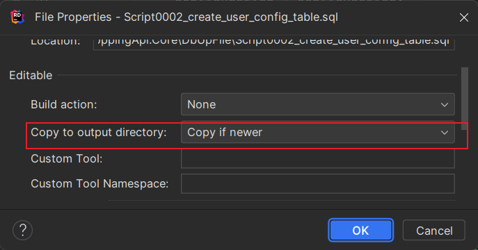

# DbUp
DbUp 是一个开源库，用于管理数据库迁移（schema migration），通常用于在应用程序启动时自动执行数据库升级操作。它通过执行一系列 SQL 脚本来升级数据库到期望的版本，避免了手动管理数据库脚本和版本控制的麻烦。
## 简介
DbUp 按照 SQL 脚本的文件名或配置顺序依次执行升级脚本。通常，文件名包含版本号或时间戳。

使用一个特殊的数据库表（默认名为 SchemaVersions）记录每次执行的脚本。该表会存储已执行过的 SQL 脚本的名称和执行时间等信息，以防止重复执行。

DbUp 的典型使用流程如下：
- 初始化 DbUp 实例，指向要升级的数据库
- 添加要执行的 SQL 脚本或脚本文件夹路径
- 执行升级操作 (UpgradeDatabase 方法)
- DbUp 检查已执行的脚本，并按顺序执行未执行的脚本

## 配置
```cs
var upGrader = DeployChanges.To
    .MySqlDatabase(_connectionString)
    .WithPreprocessor(new DbUpProcess())
    .WithScriptsFromFileSystem(Path.Combine(AppDomain.CurrentDomain.BaseDirectory, "DbUpFile"),
        new FileSystemScriptOptions()
        {
            IncludeSubDirectories = true,
        })
    .WithTransaction()
    .WithExecutionTimeout(TimeSpan.FromMinutes(3))
    .LogToConsole()
    .Build();
var databaseUpgradeResult = upGrader.PerformUpgrade();
```
- GetScriptsToExecute（）:获取将要执行的脚本 
- GetExecutedScripts（）:获取已执行的脚本 
- IsUpgradeRequired（）:检查是否需要升级 
- MarkAsExecuted:为任何新的迁移脚本创建版本记录，而不执行它们 
- TryConnect（）:尝试连接到数据库 
- PerformUpgrade（）:执行数据库升级
- LogScriptOutput（）:记录脚本输出 

架构降级未在 DbUp 中实现，因为它容易出错且难以正确实现。所以如过想要回退，只能创建新的脚本自己处理表。

在DotNet项目中写脚本，需要每次都这样配置，让脚本能复制到真正执行的目录里面。



每次都需要手动设置就很麻烦，所以可以在csproj文件里面做配置：
```cs
<!--
    ItemGroup 是 MSBuild 中的一个元素，用于对项目文件中的项目元素进行分组
    None 元素，用于指定项目文件中的非编译内容
    DbUpFile 文件不是需要编译的源代码，而是需要在构建时复制到输出目录的附加文件
    DbUpFile\**\* 是一个通配符模式，用于表示匹配指定目录结构下的所有文件和子目录
    PreserveNewest 是 MSBuild 中用于指定文件复制行为的一个属性，它表示保留最新版本的文件
-->
<ItemGroup> 
    <None Update="DbUpFile\**\*">
        <CopyToOutputDirectory>PreserveNewest</CopyToOutputDirectory>
    </None>
</ItemGroup>
```

## 获取脚本路径
查找嵌入在单个程序集中的脚本:
```cs
.WithScriptsEmbeddedInAssembly(Assembly.GetExecutingAssembly(), (string s) => s.StartsWith("Script"))
```

查找嵌入在一个或多个程序集中的脚本:
```cs
.WithScriptsFromFileSystem(Path.Combine(AppDomain.CurrentDomain.BaseDirectory, "DbUpFile"),
                  new FileSystemScriptOptions()
                  {
                      IncludeSubDirectories = true,
                  })

.WithScriptsEmbeddedInAssemblies(new[]
{
    Assembly.GetExecutingAssembly(),
    typeof(Something).Assembly
},
(string s) => s.StartsWith("Script"))
```

从文件系统上的路径读取升级脚本:
```cs
.WithScriptsFromFileSystem(path, sqlFilePath => sqlFilePath.Contains("good"), Encoding.UTF8)
```
还可自定义FileSystemScriptOptions选项。

## 脚本类型
SqlScriptOptions 中有属性ScriptType ，分别有两种类型：
- RunOnce - 默认，在数据库上运行脚本一次
- RunAlways - 将始终在数据库上运行脚本

## 事务
并非所有更改都可以回滚，但对于许多 DDL 和数据更改，除了 MySql 事务之外，其他数据库上的更改可以正常工作。
- builder.WithoutTransaction()：无事务
- builder.WithTransactionPerScript()：每个脚本单独一个事务
- builder.WithTransaction()：单个事务

## 预处理器
Script Pre-Processors 是 DbUp 的一个非常方便的扩展性钩子，它允许您在执行脚本之前对其进行修改。


在执行这个脚本的时候把aa改为bb。
```cs
public class DbUpProcess : IScriptPreprocessor 
{
    public string Process(string contents)
    {
        Console.WriteLine("我是预处理器，现在开始执行脚本。。。");
        var replacedContents = contents.Replace("\"aa\"", "\"bb\"");
        
        return replacedContents;
        // 返回原始的脚本内容，不做任何处理
        //return contents;
    }
}
```
```cs
.WithPreprocessor(new DbUpProcess())
```

## 生成HTML报告
通过GenerateUpgradeHtmlReport方法生成包含所有更改的 HTML 报告的功能。然后，可以将此报告作为构件上传到您选择的部署工具。
```cs
upGrader.GenerateUpgradeHtmlReport("D:\\UpgradeReport.html");
```
