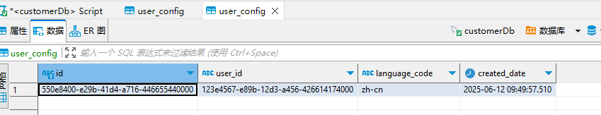
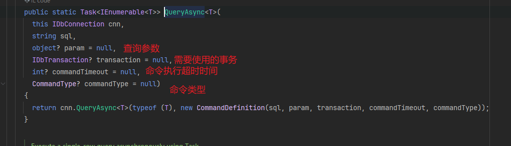
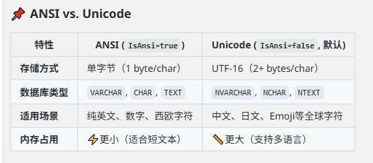
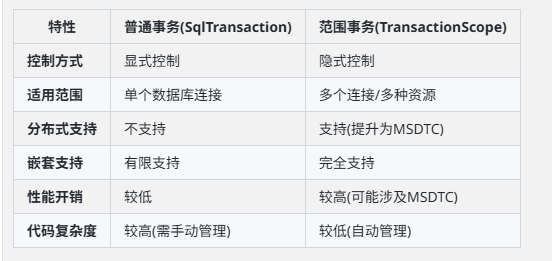

# Dapper
是简单的.NET对象映射器，几乎和原始的ADO\.NET（微软 .NET 平台中的数据访问技术框架） 数据读取器一样快。

Dapper vs DbContext

|对比项|Dapper|DbContext (Entity Framework Core)|
|---|---|---|
|类型|微型ORM（轻量级SQL映射工具）| 全功能ORM（对象关系映射框架）|
|设计目标|高性能、低开销的原始SQL操作|抽象数据库操作，支持LINQ、变更跟踪等高级功能|
|所属框架|StackExchange |Microsoft Entity Framework Core|

Dapper和DbContext是可以在同个项目中存在的。

Dapper通过扩展IDbConnection提供的一些有用扩展区查询数据库。

工作步骤：
- 创建一个IDbConnection接口对象
- 编写一个查询SQL执行CRUD
- 将SQL作为Execute方法的参数传递

```
 Install-Package Dapper
 Install-Package MySqlConnector //安装数据库驱动
```

## 方法
Dapper会用以下几个方法扩展IDbConnection接口
- Execute
- Query
- QueryFirst
- QueryFirstOrDefault
- QuerySingle
- QuerySingleOrDefault
- QueryMultiple

```cs
private async Task<MySqlConnection> GetConnection()
{
    var conn = new MySqlConnection(ConnectionStr);
    await conn.OpenAsync();
    return conn;
}
```
### Execute 
执行一个或多个命令并返回受影响的行数

- 存储过程
需要先创建一个存储过程：
```sql
USE dotnet_small_shopping_api;


DELIMITER //
CREATE PROCEDURE InsertUserConfig(
    IN p_Id CHAR(36),
    IN p_LanguageCode VARCHAR(10),
    IN p_UserId CHAR(36),
    IN p_CreatedDate DATETIME(3)
)
BEGIN
    INSERT INTO user_config (id, language_code, user_id, created_date)
    VALUES (p_Id, p_LanguageCode, p_UserId, p_CreatedDate);
    
    SELECT ROW_COUNT() AS AffectedRows;
END //
DELIMITER ;

```



<span style="color:red">这里有个卡位：不知道为什么写集成测试的时候没有报错也没有插入数据，但是从api执行的时候就能正常插入数据。</span>


- insert
```cs
public async Task ExecuteInsert()
{
    var sql =
        "INSERT INTO user_config (id, language_code, user_id, created_date) VALUES (@Id, @Language, @UserId, @CreatedDate);";
    await using var conn = await GetConnection();
    var affectedRows = await conn.ExecuteAsync(sql, // 执行多次存储过程就是new[]{}
        new { Id = Guid.NewGuid(), Language = "zh-cn", UserId = Guid.NewGuid(), CreatedDate = DateTime.Now });

    Console.WriteLine(affectedRows);
}
```
- update
```cs
public async Task ExecuteUpdate()
{
    var sql = "UPDATE user_config SET language_code = @Language WHERE id = @Id";
    await using var conn = await GetConnection();
    var affectedRows =
        await conn.ExecuteAsync(sql, new { Id = "63167579-a53e-4d54-a5e8-ae39ab9f34dd", Language = "en-sh" });
    Console.WriteLine(affectedRows);
}
```
- delete
```cs
public async Task ExecuteDelete()
{
    var sql = "DELETE FROM user_config WHERE id = @Id";
    await using var conn = await GetConnection();
    var affectedRows =
        await conn.ExecuteAsync(sql, new { Id = "63167579-a53e-4d54-a5e8-ae39ab9f34dd"});
    Console.WriteLine(affectedRows);
}
```

### Query
执行查询并映射结果。
```cs
public async Task QueryMethod1()
{
    var sql = "SELECT id As Id, language_code AS LanguageCode, user_id AS UserId FROM user_config";
    await using var conn = await GetConnection();
    // var result = await conn.QueryAsync(sql); // 匿名类型 结果映射到动态类型列表
    var result = await conn.QueryAsync<UserConfigDto>(sql);
    Console.WriteLine(result);
}
```
如果是直接select * 那么user_id和language_code都没有映射到UserConfigDto里面。使用column注解也没有用。



```cs
public async Task QueryMethod2()
{
    var sql =
        "SELECT user.id, user.phone AS Phone, user_config.language_code AS LanguageCode FROM user INNER JOIN user_config ON user.id = user_config.user_id";
    await using var conn = await GetConnection();
    // <UserDto, UserConfigDto, UserResult> T1=主表类型, T2=关联表类型, TReturn=最终返回类型	
    var results = await conn.QueryAsync<UserDto, UserConfigDto, UserResult>(sql, (dto, configDto) =>
    {
        return new UserResult
        {
            Id = dto.Id,
            Phone = dto.Phone,
            LanguageCode = configDto.LanguageCode
        };
    }, splitOn: "LanguageCode"); // splitOn SQL结果中第二个对象configDto(UserConfigDto)开始的列名

    Console.WriteLine(results);
}
```

### QueryFirst
```cs
public async Task QueryFirstMethod()
{
    var sql = "SELECT * FROM user WHERE id = @Id;";
    await using var conn = await GetConnection();
    var result = await conn.QueryFirstAsync(sql, new { Id = "123e4567-e89b-12d3-a456-426614174000" });
    Console.WriteLine(result);
}
```
QueryFirst, QueryFirstOrDefault, QuerySingle,QuerySingleOrDefault是一样的做法，不再赘述。

### QueryMultiple
在相同的命令和映射结果中执行多个查询。

```cs
public async Task QueryMultipleMethod()
{
    var sql = "SELECT * FROM user WHERE id=@UserId; SELECT * FROM user_config WHERE user_id=@UserId";
    await using var conn = await GetConnection();
    var result = await conn.QueryMultipleAsync(sql, new { UserId = "123e4567-e89b-12d3-a456-426614174000" });
    var first = (await result.ReadAsync()).First();
    var second = (await result.ReadAsync()).First();
    Console.WriteLine(first);
    Console.WriteLine(second);
}
```

QueryMultiple并不会马上把所有结果都加载到内存，而是返回一个 SqlMapper.GridReader 对象,这个对象类似于“游标”，允许按需读取每个结果集。

Read\<T>() 并不是根据数据内容去判断类型，而是根据调用顺序依次读取数据库返回的结果集。
也就是说第一次调用read就一定是user表的数据
## 参数
### 匿名类型
上面的例子用的都是匿名类型的参数。`new { UserId = "123e4567-e89b-12d3-a456-426614174000" }`

### 动态类型
使用DynamicParameters添加参数。
```cs
public async Task QueryMultipleMethod()
{
    var sql = "SELECT * FROM user WHERE id=@UserId; SELECT * FROM user_config WHERE user_id=@UserId";
    var parameter = new DynamicParameters();
    parameter.Add("@UserId", "123e4567-e89b-12d3-a456-426614174000");
    
    await using var conn = await GetConnection();
    var result = await conn.QueryMultipleAsync(sql, parameter);
    var first = (await result.ReadAsync()).First();
    var second = (await result.ReadAsync()).First();
    Console.WriteLine(first);
    Console.WriteLine(second);
    }
```

如果是多次的话那就是传入`list<DynamicParameters>`

### 列表类型
使用列表在IN子句中指定多个参数。
```cs
public async Task QueryIn()
{
    var sql = "SELECT * from user WHERE id IN @Ids";
    await using var conn = await GetConnection();
    var result = await conn.QueryAsync(sql,
        new { Ids = new[] { "123e4567-e89b-12d3-a456-426614174000", "550e8400-e29b-41d4-a716-446655440000" } });
    Console.WriteLine(result);
}
```
### 字符串类型
```cs
public async Task ParamQuery()
{
    var sql = "SELECT * FROM user WHERE display_name = @Name;";
    await using var conn = await GetConnection();
    var result = await conn.QueryAsync(sql, new {Name = new DbString { Value = "cedar", IsFixedLength = false, Length = 20, IsAnsi = true}});
    Console.WriteLine(result);
}
```
- Value：实际值（"Invoice_1"）。
- IsFixedLength：是否为固定长度字符串（这里设为 false）。
- Length：字符串长度（9），用于预分配缓冲区。
- IsAnsi：是否为 ANSI（非Unicode）字符串。

后三个主要是起到一个优化性能同时确保类型安全的作用



## 结果
- 匿名类型
    - 上面的Query类型的方法，没有指定\<>的查询结果就是动态类型映射的结果。
- 强类型
    - 有指定\<>的结果
- 多映射
    - 一对一
    - 一对多

## 其他
### 缓冲
缓冲查询一次返回整个读取器，这在大多数情况下是理想的。所以默认值是true。
非缓冲查询与流式传输等效，只需按需加载对象，这对于一个非常大的查询来减少内存使用情况可能很有用。
```sc
conn.Query<UserDto>(sql, buffered: false).ToList();
```

QueryAsync就相当于buffered: false了，所以没有对应的buffered参数。

### 事务
普通事务：
操作需与创建的事务关联。
```cs
public async Task NormalTransaction()
{
    var sql =
        "INSERT INTO user_config (id, language_code, user_id, created_date) VALUES (@Id, @Language, @UserId, @CreatedDate);";
    await using var conn = await GetConnection();
    await using var transaction = await conn.BeginTransactionAsync();
    
    var affectedRows = await conn.ExecuteAsync(sql, 
        new { Id = Guid.NewGuid(), Language = "zh-cn", UserId = Guid.NewGuid(), CreatedDate = DateTime.Now },
        transaction:transaction);
    Console.WriteLine(affectedRows);
    await transaction.CommitAsync();
}
```

范围事务：
```cs
public async Task ScopeTransaction()
{
    // TransactionScopeAsyncFlowOption.Enabled 允许 TransactionScope 跨异步等待点（await）保持事务上下文。没有它时，在 async/await 代码中事务可能会丢失
    // 没有添加时，不等transaction.Complete()数据就已经插入了
    using var transaction = new TransactionScope(TransactionScopeAsyncFlowOption.Enabled);
    var sql =
        "INSERT INTO user_config (id, language_code, user_id, created_date) VALUES (@Id, @Language, @UserId, @CreatedDate);";
    await using var conn1 = await GetConnection();
    var affectedRows1 = await conn1.ExecuteAsync(sql,
        new { Id = Guid.NewGuid(), Language = "zh-cn", UserId = Guid.NewGuid(), CreatedDate = DateTime.Now });
    
    await using var conn2 = await GetConnection();
    var affectedRows2 = await conn2.ExecuteAsync(sql, 
        new { Id = Guid.NewGuid(), Language = "zh-cn", UserId = Guid.NewGuid(), CreatedDate = DateTime.Now });
    transaction.Complete(); //不提交而是标记"可提交" Dispose时才真正决定提交或回滚
}
```

