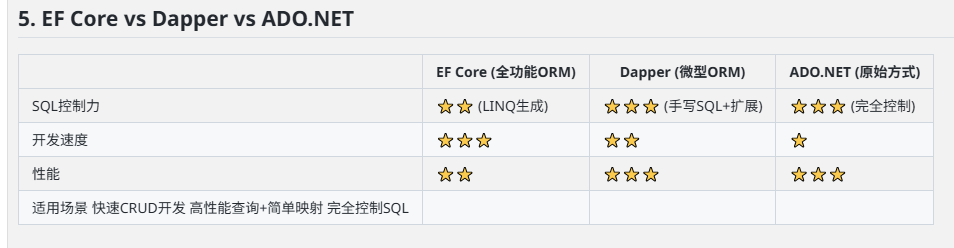
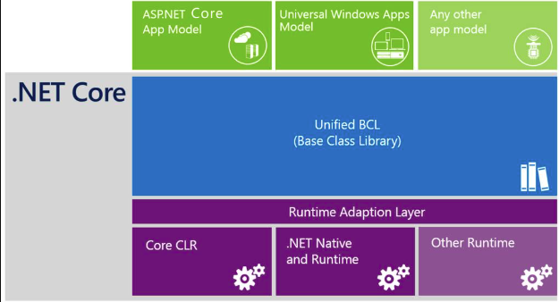

# ADO\.NET
协作关系：
应用程序->EF CORE->ADO.NET->数据库驱动

可以看出ADO\.NET是更加底层的数据访问层，不依赖任何ORM。

\.net Core构成体系：

-  Runtime 在\.NET Core 中有实现两种RunTime，NativeRuntime 和 CoreCLR
  - NativeRuntime 将C# 或 VB\.net 代码直接转换为原生机器码
  - CoreCLR是一个开源的JIT运行时，会将代码编译成中间语言（IL）在最终运行时再转换机器码
- Unified BCL Base Classlibrary 基础类，例如 File、System、Console、XML、ADO\.NET、日期时间等类库
-  Windows Store AppModel & ASP\.NET Core 1.0   提供上层应用产品开发，Web应用、游戏开发、桌面程序、物联网集成应用等

