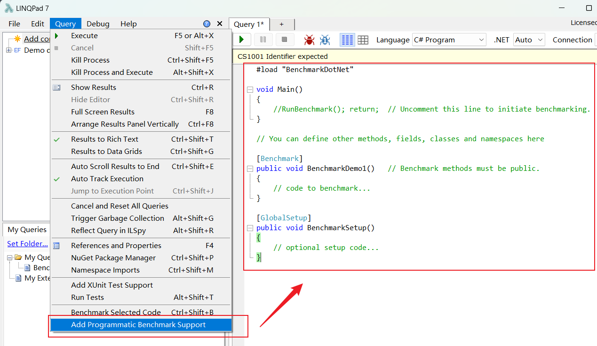
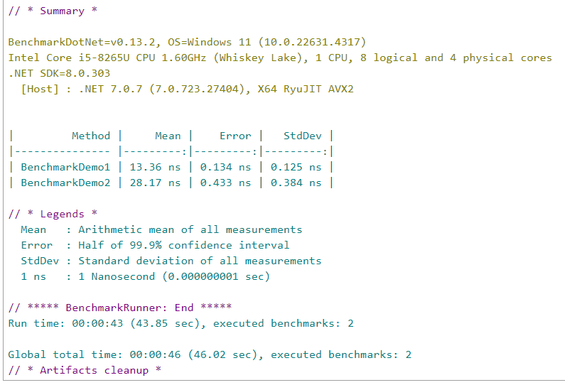

# BenchmarkDotNet
专门用于测量和比较代码的性能。

## 1、工作流程
- 1、项目生成：BenchmarkDotNet会创建一个临时项目，其中包含我们定义的基准测试代码以及所需的依赖项。这个项目会被构建为发布模式，这意味着编译器会进行优化，以便代码运行得更快。
- 2、多次运行基准测试：采用每种方法/作业/参数组合，并尝试通过多次启动基准测试过程来测量其性能（LaunchCount）
- 3、操作和迭代：一次调用就是一次操作。一组操作就是一次迭代。如果你有一个IterationSetup方法，它将在每次迭代之前被调用，但不会在操作之间被调用。我们有以下类型的迭代：
    - Pilot：选择最佳操作数
    - OverheadWarmup，OverheadWorkload：评估BenchmarkDotNet的开销，确保结果不受测试框架本身的影响
    - ActualWarmup：执行实际工作负载的预热，以确保方法已经准备好进行测量
    - ActualWorkload：实际的测量阶段，记录性能数据
- 4、结果计算：Result= ActualWorkload-\<MedianOverhead\>
- 5、生成结果：
    - Summary
    - 摘要文件
    - 图表

## 2、demo
以下用linqpad进行实践。



```cs
#load "BenchmarkDotNet"
void Main()
{
	BenchmarkRunner.Run(typeof(BenchmarkTests));
	//BenchmarkRunner.Run<BenchmarkTests>(); 
}

public class BenchmarkTests
{
	List<int> dataList;
	IEnumerable<int> dataEum;
	[Benchmark] //基准测试1
	public void BenchmarkDemo1()
	{
		var b = dataList.Any();
		var b2 = dataList.Any();
	}

	[Benchmark] //基准测试2
	public void BenchmarkDemo2()
	{
		var b = dataEum.Any();
		var b2 = dataEum.Any();
	}

	[GlobalSetup] //初始化数据
	public void BenchmarkSetup()
	{
		dataEum = Enumerable.Range(0, 100);
		dataList = dataEum.ToList();
	}
}
```


- Mean (平均值)：
    - BenchmarkDemo1的平均执行时间为13.36纳秒。
    - BenchmarkDemo2的平均执行时间为28.17纳秒。
    - 这表示BenchmarkDemo1的性能优于BenchmarkDemo2，每次执行更快。
- Error (误差)：
    - 误差是99.9%置信区间的一半。较小的误差值表示结果更稳定。
    - BenchmarkDemo1的误差为0.134纳秒，而BenchmarkDemo2的误差为0.433纳秒，显示BenchmarkDemo1的结果更可靠。
- StdDev (标准偏差)：
    - 标准偏差表示测量结果的离散程度。较低的值表示测试结果的一致性
    - BenchmarkDemo1的标准偏差为0.125纳秒，而BenchmarkDemo2的标准偏差为0.384纳秒，同样表明BenchmarkDemo1更一致。
- Run time: 总的基准测试运行时间为43.85秒，包括所有基准测试的准备和清理时间。
- Global total time: 全局总时间为46.02秒，这是所有基准测试和清理操作所需的总时间。

## 3、Attribute
### 3.1 提供参数
- `[Params]`:标记类中的一个或多个字段或属性,指定一组值。每个值都必须是编译时常量。
    ```cs
    [Params(100, 200)]
    public int A { get; set; }
    ```
    有属性 Property。优先级范围是[Int32.MinValue;Int32.MaxValue]，优先级越低，列顺序越靠前。默认优先级设置为0。
    ```cs
    [Params(10, Priority = -100)]
    public int B { get; set; }
    ```

- `[ParamsSource]`:指定将提供值的公共方法/属性的名称（实现的某些东西IEnumerable）
    ```cs
    [ParamsSource(nameof(ValuesForA))]
    public int A { get; set; }
    public IEnumerable<int> ValuesForA => new[] { 100, 200 };
    ```

- `[ParamsAllValues]`:想要使用某个类型的所有可能值enum，或者值数量较少的其他类型,这样不用手动列出
    ```cs
    [ParamsAllValues]
    public CustomEnum E { get; set; }
    ```
