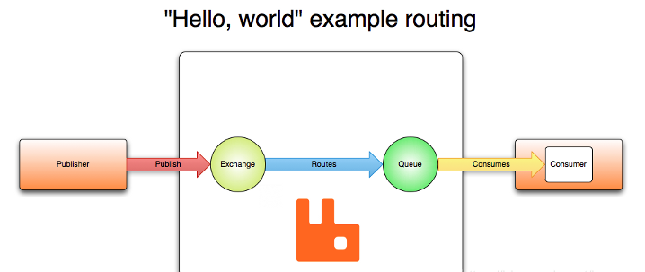

# 0-资料合集

## 查漏补缺
### AMQP
AMQP（Advanced Message Queuing Protocol）是一种开放标准的消息协议，用于在不同的应用程序之间传输消息。它定义了一套通信规则和格式，确保消息可以在不同的系统和平台之间可靠地传递。

## 参考资料
rabbitMQ
- 界面介绍：https://www.cnblogs.com/ZhuChangwu/p/14093107.html
- 中文文档：https://rabbitmq.mr-ping.com/description.html
- 视频：https://www.bilibili.com/video/BV1Am4y1z7Tu?spm_id_from=333.788.videopod.episodes&vd_source=c3939bba6fb53dcccb38ed988f16994c&p=4

azure service bus
- 微软文档：https://learn.microsoft.com/zh-cn/azure/service-bus-messaging/service-bus-dotnet-get-started-with-queues?tabs=passwordless

MassTransit
- 快速使用：https://easy-dotnet.com/pages/93aa11/#%E7%AE%80%E4%BB%8B
- 官方文档：https://masstransit.io/documentation/concepts/messages
- 概念理解：https://www.cnblogs.com/sheng-jie/p/MassTransit-NET-Distributed-Application-Framework.html
- saga:https://www.cnblogs.com/sheng-jie/p/17019926.html

