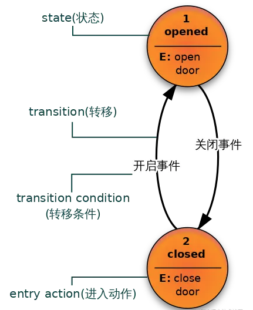

# 0-资料合集

## 查漏补缺
### AMQP
AMQP（Advanced Message Queuing Protocol）是一种开放标准的消息协议，用于在不同的应用程序之间传输消息。它定义了一套通信规则和格式，确保消息可以在不同的系统和平台之间可靠地传递。

### 状态机
状态机是一种程序开发范例。有很多的应用场景，其中.NET 中的async/await 的核心底层实现就是基于状态机机制。状态机分为两种：有限状态机和无限状态机。

有限状态机：
表示有限个状态以及在这些状态之间的转移和动作等行为的数学计算模型。

- state(状态) ：将一个系统离散化，可以得到很多种状态，当然这些状态是有限的。

- transition(转移) ：一个状态接收一个输入执行了某些动作到达了另外一个状态的过程就是一个transition。定义transition就是在定义状态机的转移流程。

- transition condition(转移条件) ：也叫做Event(事件)，在某一状态下，只有达到了transition condition，才会按照状态机的转移流程转移到下一状态，并执行相应的动作。

- action(动作)：在状态机的运转过程中会有很多种动作。如：进入动作(entry action)[在进入状态时进行]、退出动作(exit action)[在退出状态时进行]、转移动作[在进行特定转移时进行]。

无限状态机：
无限状态机只是一种理论上的模型。所以一般提到状态机都是指有限状态机。

## 参考资料
rabbitMQ
- 界面介绍：https://www.cnblogs.com/ZhuChangwu/p/14093107.html
- 中文文档：https://rabbitmq.mr-ping.com/description.html
- 视频：https://www.bilibili.com/video/BV1Am4y1z7Tu?spm_id_from=333.788.videopod.episodes&vd_source=c3939bba6fb53dcccb38ed988f16994c&p=4

azure service bus
- 微软文档：https://learn.microsoft.com/zh-cn/azure/service-bus-messaging/service-bus-dotnet-get-started-with-queues?tabs=passwordless

MassTransit
- 快速使用：https://easy-dotnet.com/pages/93aa11/#%E7%AE%80%E4%BB%8B
- 官方文档：https://masstransit.io/documentation/concepts/messages
- 概念理解：https://www.cnblogs.com/sheng-jie/p/MassTransit-NET-Distributed-Application-Framework.html
- saga:https://www.cnblogs.com/sheng-jie/p/17019926.html

