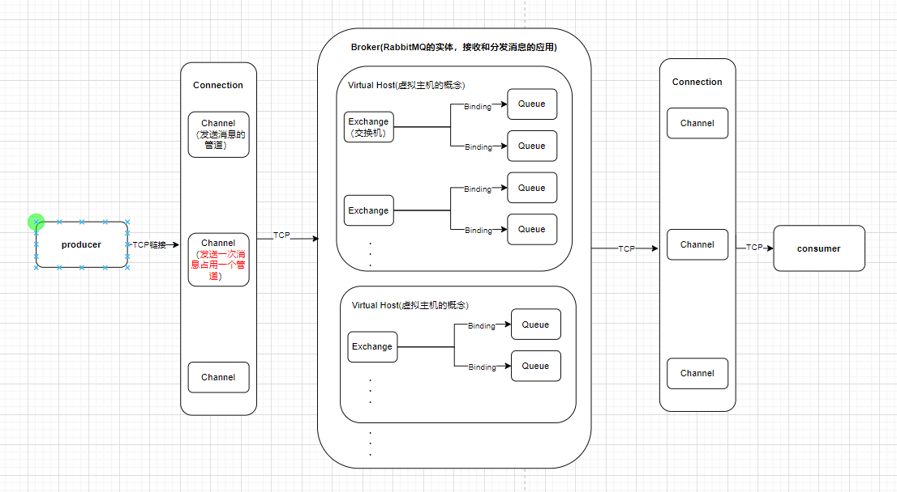

# 1-RabbitMQ
## 1、简介
基于AMQP协议用于软件之间通信的中间件。允许软件、应用相互连接和扩展。这些应用可以相互链接起来组成一个更大的应用，或者将用户设备和数据进行连接．消息系统通过将消息的发送和接收分离来实现应用程序的异步和解偶。

- 消息队列（Message Queue，简称MQ），本质是个队列，FIFO先入先出，队列中存放的内容是message。
- RabbitMQ是开源的，在AMQP基础上完整的，可复用的企业消息系统

可以直接在docker创建RabbitMQ容器。（初始用户密码是guest guest）


RabbitMQ四大核心:
- 生产者
- 消费者
- 队列
- 交换机（rabbitmq消息路由的一个核心组件，生产者发送消息先到达交换机，交换机根据配置路由到相应队列中）

AMQP是一种二进制协议，定义一组规则和标准，确保消息可以在不停应用和平台之间传递和解释，AMQP协议包含四个核心组件：
- 消息
- 交换机
- 队列
- 绑定（交换机和队列的绑定）



- virtual host：虚拟主机
- Connection：publisher/Consumer和borker之间的TCP连接
- Channel：发送消息的管道，如果每次访问RabbitMQ都建立一个Connection，消息量大的时候开销巨大，Channel是在Connection内部建立的逻辑连接，如果应用程序支持多线程，通常每个Thread创建单独的Channel进行通讯。AMQP method包含Channel id帮助客户端和message broker识别Channel，所以Channel之间完全隔离。Channel作为轻量级Connection极大减少操作系统建立TCP Connection的开销
- Exchange：message到达broker第一站，根据分发规则匹配查询表中的routing key，分发消息到queue中，常用类型有direct，topic，fanout
- queue：存放消息的队列
- binding：Exchange和queue之间虚拟连接，binding中可以包含routing key，binding消息被保存到Exchange中的查询表中，用于message的分发依据

## 2、dotnet实现
### 2.1 注册容器
```cs
private void RegisterRabbitMQ(ContainerBuilder builder)
{
    builder.Register(context =>
    {
        var factory = new ConnectionFactory()
            { UserName = "guest", Password = "guest", HostName = "localhost", Port = 5672 };
        return factory.CreateConnection();
    }).As<IConnection>().InstancePerLifetimeScope();
}
```
### 2.2 生产者
```cs
public async Task PublishSendMessage()
{
    var exchangeName = "exchange_name";
    var queueName = "queue_name";
    var channel = _connection.CreateModel(); // 创建信道
    /*
        * 创建交换机
        * 1、交换机名称
        * 2、交换机类型：direct、topic、fanout、headers
        * 3、指定交换机是否需要持久化,为true时，交换机的元数据要持久化
        * 4、指定交换机在没有队列绑定时，是否需要剔除，false表示不删除
        * 5、map<string, Object>类型，指定交换机其他的一些机构化参数
        */
    channel.ExchangeDeclare(exchangeName, ExchangeType.Direct, true, false, null);
    
    /*
        * 生成一个队列
        * 1、队列名称
        * 2、队列是否需要持久化，这里注意的是持久化知识队列名称等这些元数据持久化，不是队列中消息持久化
        * 3、队列是否是私有的，如果是私有，只有创建他的应用程序才能消费信息
        * 4、队列在没有消费者订阅的情况下是否自动删除
        * 5、队列的一些结构化信息，比如声明死性队列，磁盘队列会用到
        */
    channel.QueueDeclare(queueName, true, false, false, null);
    
    /*
        * 交换机与队列绑定
        * 1、队列名称
        * 2、交换机名称
        * 3、路由键，在直连模式下，可以为队列名称
        */
    channel.QueueBind(queueName, exchangeName, queueName);
    
    var message = "hello rabbitMq";
    
    /*
        * 发送消息
        * 1、发送到哪个交换机
        * 2、队列名称
        * 3、其他参数信息
        * 4、发送消息的消息体
        */
    channel.BasicPublish(exchangeName, queueName,null, Encoding.UTF8.GetBytes(message));
    channel.Close();
    _connection.Close();
}
```


### 2.3 消费者
```cs
public async Task ConsumerGetMessage()
{
    var queueName = "queue_name";
    var channel = _connection.CreateModel();
    // 创建消费者实例
    var consumer = new EventingBasicConsumer(channel);
    /*
        * consumer.Received 是一个事件（Event），用来订阅消息队列中的消息接收事件
        * 如果使用 = 赋值操作符，那么将会覆盖之前可能已经订阅的事件处理程序。
        * 使用 += 则是将这个匿名函数添加到已有的事件处理程序列表中，而不是替换掉它们。
        * ch 是 BasicDeliverEventArgs 类的一个实例。尽管通常不会在事件处理程序中直接使用 ch，但它表示的是 RabbitMQ 通道（Channel）的相关信息。
        * ea 是 BasicDeliverEventArgs 类的一个实例，包含很多属性
        *      Body：消息的主体内容，以字节数组的形式表示。
        *      DeliveryTag：消息的唯一标识符，用于确认消息。
        *      Exchange：消息来自的交换机。
        *      RoutingKey：消息的路由键。
        */
    consumer.Received += (ch, ea) =>
    {
        try
        {
            var body = ea.Body.ToArray();
            Console.WriteLine(Encoding.UTF8.GetString(ea.Body.ToArray()));
            /*
                * 1、DeliveryTag，即消息的唯一标识符，用于告诉 RabbitMQ 哪条消息已被确认处理。
                * 2、指定是否批量确认消息。false 表示只确认单条消息，true 表示批量确认所有小于等于 DeliveryTag 的消息
                */
            channel.BasicAck(ea.DeliveryTag, false);// 确认消息已被成功处理
        }
        catch (Exception e)
        {
            // 如果消息处理失败，记录日志或者执行其他操作
            Console.WriteLine($"消息处理失败: {e.Message}");

            /*
                * 拒绝消息并重新排队
                * 2、false 表示不是批量操作
                * 3、true 表示重新排队
                */
            channel.BasicNack(ea.DeliveryTag, false, true); 
        }

    };
    /*
        * 2、autoAck：false，表示手动消息确认模式。消息接收后，需要显式调用 BasicAck 方法来确认消息已被处理。
        * 如果设为 true，则表示自动确认模式，消息接收到后会立即被认为已经处理，无需调用 BasicAck
        * 3、EventingBasicConsumer：定义了接收到消息时的处理逻辑。通过订阅 consumer.Received 事件，可以定义消息到达时要执行的操作
        */
    channel.BasicConsume(queueName, false, consumer);
}
```


## 3、交换机类型
### 3.1 direct
路由键与队列名完全匹配的交换机，通过routingKey路由键键交换机和队列进行绑定，消息被发送到exchange时根据消息的routingKey进行匹配，只将消息发送到完全匹配到此routingKey的队列。


```cs
public async Task PublishSendMessageDirect()
{
    var exchangeName = "exchange_name";
    var queueName1 = "queue_name1";
    var queueName2 = "queue_name2";
    var queueName3 = "queue_name3";
    var queueName4 = "queue_name4";
    var key1 = "key1";
    var key3 = "key3";
    var key4 = "key4";
    var channel = _connection.CreateModel(); 
    channel.ExchangeDeclare(exchangeName, ExchangeType.Direct, true, false, null);
    channel.QueueDeclare(queueName1, true, false, false, null);
    channel.QueueDeclare(queueName2, true, false, false, null);
    channel.QueueDeclare(queueName3, true, false, false, null);
    channel.QueueDeclare(queueName4, true, false, false, null);
    channel.QueueBind(queueName1, exchangeName, key1);
    channel.QueueBind(queueName2, exchangeName, key1);
    channel.QueueBind(queueName3, exchangeName, key3);
    channel.QueueBind(queueName4, exchangeName, key4);
    channel.BasicPublish(exchangeName, key1,null, Encoding.UTF8.GetBytes("key1 message"));
    channel.BasicPublish(exchangeName, key3,null, Encoding.UTF8.GetBytes("key3 message"));
    channel.BasicPublish(exchangeName, key4,null, Encoding.UTF8.GetBytes("key4 message"));
    channel.Close();
    _connection.Close();
}
```
### 3.2 fanout
将消息分发给所有绑定此交换机的队列，此时routingKey无效。


```cs
public async Task PublishSendMessageFanout()
{
    var exchangeName = "exchange_name_fanout";
    var queueName1 = "fancout_queue_name1";
    var queueName2 = "fanout_queue_name2";
    var queueName3 = "fanout_queue_name3";
    var queueName4 = "fanout_queue_name4";
    var key1 = "key1";
    var key3 = "key3";
    var key4 = "key4";
    var channel = _connection.CreateModel(); 
    channel.ExchangeDeclare(exchangeName, ExchangeType.Fanout, true, false, null);
    channel.QueueDeclare(queueName1, true, false, false, null);
    channel.QueueDeclare(queueName2, true, false, false, null);
    channel.QueueDeclare(queueName3, true, false, false, null);
    channel.QueueDeclare(queueName4, true, false, false, null);
    channel.QueueBind(queueName1, exchangeName, key1);
    channel.QueueBind(queueName2, exchangeName, key1);
    channel.QueueBind(queueName3, exchangeName, key3);
    channel.QueueBind(queueName4, exchangeName, key4);
    channel.BasicPublish(exchangeName, key1,null, Encoding.UTF8.GetBytes("key1 fanout message"));
    channel.Close();
    _connection.Close();
}
```

### 3.3 topic
主题类型交换机，与direct类似，但topic可以进行模糊匹配。


- 用.分为多个部分
- 用*代表一个部分
- 用#代表0个或多个部分
- 如果绑定的路由键位#，表示接受所有消息，因为路由键都匹配

发送一条消息，routingkey是“key1.key2.key3.key4”这个路由键将会匹配：
- key1.key2.key3.*:匹配成功，*可以代表一个部分
- key1.#:匹配成功，#可以代表0或多个部分
- *.key2.*.key4:匹配成功，第一和第三部分分别是key1和key3，刚好匹配
- #.key3.key4：成功匹配，#刚好匹配key1与key2

```cs
public async Task PublishSendMessageTopic()
{
    var exchangeName = "exchange_name_topic";
    var queueName1 = "topic_queue_name1";
    var queueName2 = "topic_queue_name2";
    var queueName3 = "topic_queue_name3";
    var queueName4 = "topic_queue_name4";
    var key1 = "key1.key2.key3.*";
    var key2 = "key2.#";
    var key3 = "*.key2.*.key4";
    var key4 = "#.key3.key4";
    var channel = _connection.CreateModel(); 
    channel.ExchangeDeclare(exchangeName, ExchangeType.Topic, true, false, null);
    channel.QueueDeclare(queueName1, true, false, false, null);
    channel.QueueDeclare(queueName2, true, false, false, null);
    channel.QueueDeclare(queueName3, true, false, false, null);
    channel.QueueDeclare(queueName4, true, false, false, null);
    channel.QueueBind(queueName1, exchangeName, key1);
    channel.QueueBind(queueName2, exchangeName, key2);
    channel.QueueBind(queueName3, exchangeName, key3);
    channel.QueueBind(queueName4, exchangeName, key4);
    channel.BasicPublish(exchangeName, "key1",null, Encoding.UTF8.GetBytes("key1 topic message"));
    channel.Close();
    _connection.Close();
}
```

### 3.4 header
headers匹配AMQP消息的header而不是路由键，此外headers交换器和direct交换器完全一致，但性能差很多，目前几乎用不到。（所以不实现啦，有需要再说~）

消费方指定的headers中必须包含一个x-match键，x-match的值有2个：
- x-match=all：表示所有键值对都匹配才能接受消息
- x-match=any：表示只要有键值对匹配就能接受到消息


