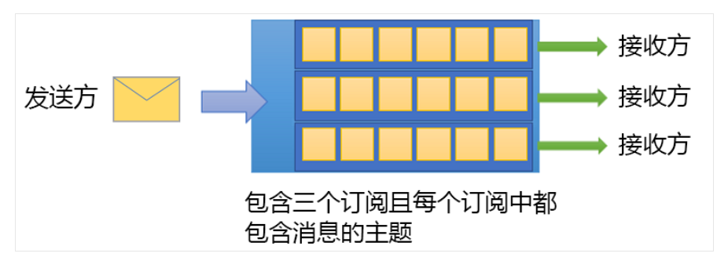
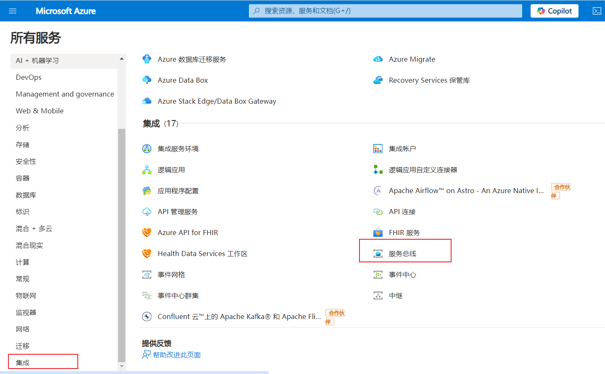
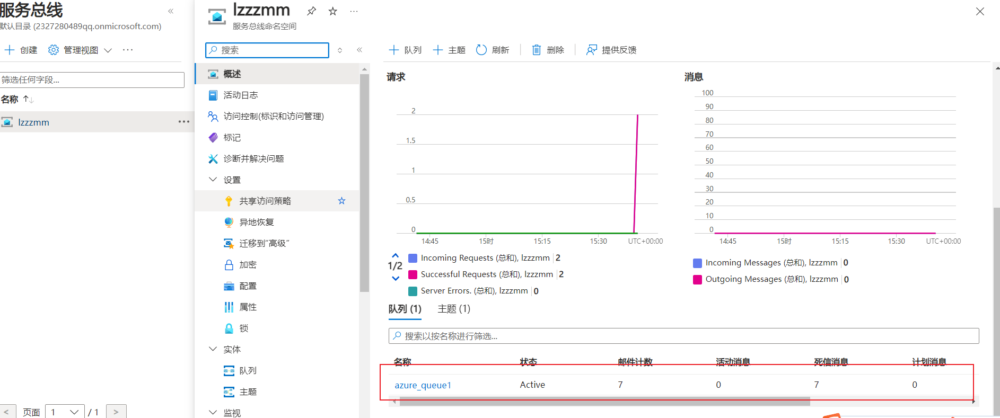
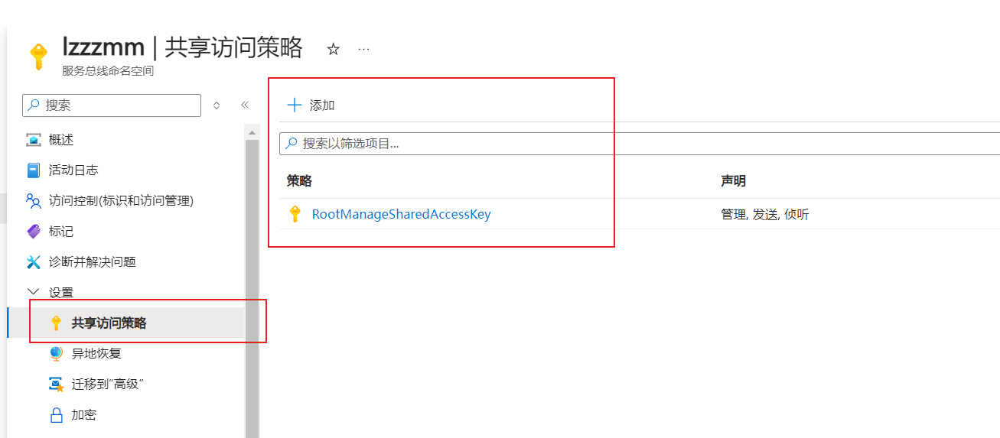

# 2-Azure Service Bus
## 1、概念
Azure 服务总线是一个完全托管的企业消息代理，其中包含消息队列和发布订阅主题。

数据通过消息在不同的应用程序和服务之间传输。 消息是用元数据修饰的容器，它包含数据。 数据可以是任何类型的信息，包括以常用格式编码的结构化数据，例如：JSON、XML、Apache Avro 和纯文本。

### 1.1 队列


- 队列中的消息会排队，并在到达时加盖时间戳。 在该代理接受消息后，消息将始终长期保留在三重冗余存储中
- 如果命名空间启用了区域，则这些冗余存储会分布在多个可用性区域中。 服务总线将消息保留在内存或易失存储中，直到客户端报告它们已被接受。
- **消息以拉取模式传送**，即仅按请求传送消息。 拉取操作可能会长期存续，消息可用时才会完成。

### 1.2 主题


- 主题可以有多个独立的订阅
- 主题的订阅者可以收到发送到该主题的每个消息的副本
- 订阅默认持久存续，但可为其配置过期时间，并在过期后自动将其删除
- 可以定义订阅的规则。 订阅规则有一个筛选器，用于定义要复制到订阅中的消息应满足的条件，以及可以修改消息元数据的可选操作

### 1.3 命名空间
命名空间是一个适用于所有消息组件（队列和主题）的容器。 命名空间可以有一个或多个队列和主题，通常充当应用程序容器。
创建一个服务总线就是一个命名空间。


## 2、在azure门户创建服务
创建azure账户，第一次创建用虚拟信用卡可以免费使用一年：



创建azure Service bus空间，并创建队列：



生成秘钥，项目链接需要用到：



## 2、基础接收实现
### 2.1 注册容器
```cs
private void MassTransitByAzureBus(ContainerBuilder builder)
{
    var connectionString =
        @"Endpoint=sb://xxx.servicebus.windows.net/;SharedAccessKeyName=***;SharedAccessKey=***;EntityPath=azure_queue1";
    builder.Register(c =>
    {
        return Bus.Factory.CreateUsingAzureServiceBus(x =>
        {
            x.Host(connectionString, h=>h.ConnectionString = connectionString);
        });
    }).As<IBusControl>()
    .As<IBus>()
    .As<IPublishEndpoint>()
    .As<ISendEndpointProvider>()
    .SingleInstance().AutoActivate()
    .OnActivated(async c => await c.Instance.StartAsync());
}
```

### 2.2 send

发送单条消息：
```cs
public async Task PublishSendMessage()
{
    // 创建 Service Bus 客户端
    await using var client = new ServiceBusClient("Endpoint=sb://xxx.servicebus.windows.net/;SharedAccessKeyName=***;SharedAccessKey=***;EntityPath=azure_queue1");
    // 创建消息发送者
    var sender = client.CreateSender("azure_queue1");
    try
    {
        var message = new List<ServiceBusMessage>()
        {
            new ServiceBusMessage("消息1"),
            new ServiceBusMessage("消息2")
        };
        // 发送消息
        await sender.SendMessagesAsync(message);
    }
    catch (Exception e)
    {
        Console.WriteLine(e);
        throw;
    }
    finally
    {
        await sender.DisposeAsync();         
    }
}
```

批量发送消息：
```cs
public async Task PublishSendMessageBatch()
{
    var clientOptions = new ServiceBusClientOptions()
    { 
        TransportType = ServiceBusTransportType.AmqpWebSockets
    };
    
    var client = new ServiceBusClient("Endpoint=sb://xxx.servicebus.windows.net/;SharedAccessKeyName=***;SharedAccessKey=***;EntityPath=azure_queue1", clientOptions);
    var sender = client.CreateSender("azure_queue1");
    // 消息批处理
    using ServiceBusMessageBatch messageBatch = await sender.CreateMessageBatchAsync();
    for (int i = 1; i <= 4; i++)
    {
        // try adding a message to the batch
        if (!messageBatch.TryAddMessage(new ServiceBusMessage($"Message {i}")))
        {
            // if it is too large for the batch
            throw new Exception($"The message {i} is too large to fit in the batch.");
        }
    }
    await sender.SendMessagesAsync(messageBatch);
    Console.WriteLine($"A batch of messages has been published to the queue.");
    await sender.DisposeAsync();
    await client.DisposeAsync();
}
```

### 2.3 get
接收单条消息：
```cs
public async Task ConsumerGetMessage()
{
    await using var client = new ServiceBusClient("Endpoint=sb:;SharedAccessKeyName=;SharedAccessKey=;EntityPath=azure_queue1");
    // 创建消息接收者
    var receiver = client.CreateReceiver("azure_queue1");
    try
    {
        // 查看队列中的消息而不将它们从队列中移除
        var peekedMessage = await receiver.PeekMessageAsync();
        if (peekedMessage != null)
        {
            // 从队列中接收消息 1条
            var receivedMessage = await receiver.ReceiveMessageAsync();
            Console.WriteLine($"Received message: {receivedMessage.Body}");
            await receiver.CompleteMessageAsync(receivedMessage);
        }
    }
    catch (Exception e)
    {
        Console.WriteLine(e);
        throw;
    }
    finally
    {
        await receiver.DisposeAsync();
    }
}
```

批量接收消息：
```cs
public async Task ConsumerGetMessageBatch()
{
    var clientOptions = new ServiceBusClientOptions()
    { 
        TransportType = ServiceBusTransportType.AmqpWebSockets
    };
    
    var client = new ServiceBusClient("Endpoint=sb:;SharedAccessKeyName=;SharedAccessKey=;EntityPath=azure_queue1", clientOptions);
    var processor = client.CreateProcessor("azure_queue1");
    processor.ProcessMessageAsync += MessageHandler;
    processor.ProcessErrorAsync += ErrorHandler;
    // 启动处理器，开始执行
    await processor.StartProcessingAsync();
    Console.WriteLine("Wait for a minute and then press any key to end the processing");
    Console.ReadKey();

    // stop processing 
    Console.WriteLine("\nStopping the receiver...");
    await processor.StopProcessingAsync();
    Console.WriteLine("Stopped receiving messages");
    await processor.DisposeAsync();
    await client.DisposeAsync();
}

async Task MessageHandler(ProcessMessageEventArgs args)
{
    string body = args.Message.Body.ToString();
    Console.WriteLine($"Received: {body}");

    // complete the message. message is deleted from the queue. 
    await args.CompleteMessageAsync(args.Message);
}

// handle any errors when receiving messages
Task ErrorHandler(ProcessErrorEventArgs args)
{
    Console.WriteLine(args.Exception.ToString());
    return Task.CompletedTask;
}
```

## 3、高级功能
- 消息会话：若要保证在处理服务总线队列或订阅中的消息时实现先入先出 (FIFO)，请使用会话。 会话还可用于实现“请求-响应”模式。 通过“请求-响应”模式，发送方应用程序可以发送请求并为接收方提供将响应正确发送回发送方应用程序的方法
- 自动转发：可将队列或订阅连接到作为相同命名空间组成部分的另一个队列或主题
- 死信：死信队列可存放无法传递给任何接收方的消息或无法处理的消息
- 计划的传递：可以将消息提交到队列或主题，以便进行延迟处理
- 消息延迟：队列或订阅客户端收到一条它愿意处理，但由于应用程序中出现特殊状况而目前无法处理的消息时，该实体可将消息的检索延迟到将来的某个时间点。 该消息将保留在队列或订阅中，但会搁置处理
- 事务：一个事务将两个或更多操作组合成执行作用域
- 筛选器和操作
- 出现空闲队列时自动删除
- 重复检测：如果出现错误，导致客户端怀疑某个发送操作的结果，则可使用重复项检测，此功能支持发送方重新发送相同的消息，并让队列或主题放弃任何重复的副本，这样就消除了这些情况下的怀疑
- 批量删除消息
- 支持排序
- 异地灾难恢复
- 异地复制

