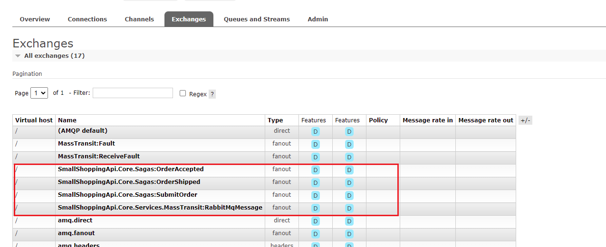

# 3-MassTransit
MassTransit 是一个基于 .NET 的开源消息传递框架，用于在分布式应用程序中使用消息传递进行异步通信。它是一个可扩展的框架，支持多种传输协议和序列化格式，包括 RabbitMQ、Azure Service Bus、Amazon SQS、In-Memory、JSON、XML 等。MassTransit 还提供了许多其他功能，例如生产者-消费者模型、重试、分布式事务等。

其实可以理解成dbContext，dbContext是对数据库操作的进一步封装，而MassTransit就是一个对于消息队列操作的进一步封装。

前面已经有对RabbitMQ和Azure Service Bus进行介绍，接下来也会以这两种作为demo。

MassTranist为了实现消息代理的透明化和应用间消息的高效传输，抽象以下概念：
- Message：消息契约，定义消息生产者和消费者之间的契约
- Producer：生产者，发送消息的一方
- SendEndpoint：发送端点，用于将消息内容序列化并发送到传输模块
- Transport：传输模块，消息代理透明化的核心，用于和消息代理通信，负责发送和接收消息
- ReceiveEndpoint：接收端点，用于从传输模块接收消息，反序列化消息内容，将消息路由到消费者
- Consumer：消费者，消费消息


## 1 Message
Message：消息，可以使用class、interface、struct和record来创建，消息作为一个契约，需确保创建后不能篡改。消息应仅由属性、方法组成，不应包含其他行为。

不建议使用 的属性private set;，因为使用时它们默认不会被序列化System.Text.Json。


```cs
public class AzureBusMessage
{
    public string Property  { get; set; }
}
```
```cs
public class RabbitMqMessage
{
    public string Text { get; set; }
}
```
## 2 Producer


- ISendEndpoint：提供了Send方法，用于发送命令。
- IPublishEndpoint：提供了Publish方法，用于发布事件。

可以通过IBus、ISendEndpointProvider和ConsumeContext进行命令的发送；通过IBus和IPublishEndpointProvider进行事件的发布。

### 2.1 注入容器
对于RabbitMQ：
```cs
private void MassTransitByRabbitMQ(ContainerBuilder builder)
{
    builder.Register(c =>
    {
        return Bus.Factory.CreateUsingRabbitMq(cfg =>
        {
            cfg.Host(new Uri("rabbitmq://localhost/"), h =>
            {
                h.Username("guest");
                h.Password("guest");
            });
            // 配置接收端点（队列）
            cfg.ReceiveEndpoint("queue_name", ep =>
            {
                // 注册消费者到接收端点
                ep.Consumer<RabbitMqConsumer>();
            });
        });
    }).As<IBusControl>()
        .As<IBus>()
        .As<IPublishEndpoint>()
        .SingleInstance().AutoActivate()
        .OnActivated(async c => await c.Instance.StartAsync());
}
```

对于Azure Service bus：
```cs
private void MassTransitByAzureBus(ContainerBuilder builder)
{
    var connectionString =
        @"Endpoint=sb:;SharedAccessKeyName=;SharedAccessKey=;EntityPath=";
    builder.Register(c =>
    {
        return Bus.Factory.CreateUsingAzureServiceBus(x =>
        {
            x.Host(connectionString, h=>h.ConnectionString = connectionString);
            /*x.ReceiveEndpoint("azure_queue1", ep =>
            {
                // 注册消费者到接收端点
                ep.Consumer<AzureBusConsumer>();
            });*/
        });
    }).As<IBusControl>()
    .As<IBus>()
    .As<IPublishEndpoint>()
    .As<ISendEndpointProvider>()
    .SingleInstance().AutoActivate()
    .OnActivated(async c => await c.Instance.StartAsync());
}
```
### 2.2 发送命令
#### 2.2.1 IBus
```cs
EndpointConvention.Map<RabbitMqMessage>(new Uri("queue:queue_name")); //通过以下方式配置对应消息类型的目标地址
await _bus.Send(message);
```

因为前面配置了cfg.ReceiveEndpoint，所以点击发送后，程序自动接收到消息。
#### 2.2.2 ISendEndpointProvider
```cs
var serviceAddress = new Uri("queue:queue_name");
var endpoint = await _sendEndpointProvider.GetSendEndpoint(serviceAddress);
await endpoint.Send(message);
```

#### 2.2.3 ConsumeContext
IConsumer是消费者，但是消费者处理消息后可继续发送消息，这时候又变成了生产者。
```cs
public class RabbitMqConsumer : IConsumer<RabbitMqMessage>
{
    public Task Consume(ConsumeContext<RabbitMqMessage> context)
    {
        Console.WriteLine($"Received message: {context.Message.Text}");
        var command = new { NewMessage = "message" };
        context.Send(command);
        return Task.CompletedTask;
    }
}
```

```cs
public class AzureBusConsumer: IConsumer<AzureBusMessage>, IScopedDependency
{
    public Task Consume(ConsumeContext<AzureBusMessage> context)
    {
        Console.WriteLine($"Received message: {context.Message.Property }");
        var command = new { NewMessage = "message" };
        context.Send(command);
        return Task.CompletedTask;
    }
}
```

创建后进行配置，这样可以监听消息：
```cs
cfg.ReceiveEndpoint("queue_name", ep =>
{
    // 注册消费者到接收端点
    ep.Consumer<RabbitMqConsumer>();
});
```
### 2.3 发布事件
```cs
 _publishEndpoint.Publish(message);
```

## 3 Consumer
MassTransit 包括多种消费者类型，主要分为无状态和有状态两种消费者类型。

### 3.1 无状态消费者
无状态消费者，即消费者无状态，消息消费完毕，消费者就释放。主要的消费者类型有：IConsumer\<TMessage\>、JobConsumer、IActivity和RoutingSlip等。

JobConsumer\<TMessage\>主要是对IConsumer\<TMessage\>的补充，其主要应用场景在于执行耗时任务。

IActivity和RoutingSlip则是MassTransit Courier的核心对象，主要用于实现Saga模式的分布式事务。

### 3.2 有状态消费者
有状态消费者，即消费者有状态，其状态会持久化，代表的消费者类型为MassTransitStateMachine。

MassTransitStateMachine是MassTransit Automatonymous 库定义的，Automatonymous 是一个.NET 状态机库，用于定义状态机，包括状态、事件和行为。

通过MassTransitStateMachine可以将事件的执行顺序逻辑编排在一个集中的状态机中，通过发送命令和订阅事件来推动状态流转，而这也正是Saga编排模式的实现。

## 4、Saga
saga是一种设计模式，用于管理长时间运行的业务流程和复杂的状态转换。Saga 负责协调多个服务之间的交互，确保在分布式系统中实现最终一致性。

 saga是由协调器管理的长期事务。saga是由事件发起的，saga编排事件，维护整个事务的状态。

<hr>
 一个帮助理解Saga概念的例子：
 现在有一个在线商店，用户下单后要经过一下步骤：
 - 1、创建订单
 - 2、处理付款
 - 3、发货

那么对于Saga来说有以下状态与事件：
- 状态
    - orderCreated
    - PaymentSucceeded
    - orderShipped
- 事件
    - orderCreated事件触发创建订单过程
    - PaymentSucceeded事件在付款成功时触发
    - OrderShipped 事件在发货时触发

步骤：
- 当用户下单时，Saga 接收 OrderCreated 事件，状态变为 OrderCreated。
- Saga 向付款服务发送请求，等待 PaymentSucceeded 事件。
- 一旦收到 PaymentSucceeded，状态变为 PaymentProcessed，然后触发发货。
- 发货后，Saga 接收 OrderShipped 事件，最终状态为 Completed


如果在付款处理阶段失败，Saga 可以执行补偿逻辑，例如发送退款请求，确保系统的一致性。（补偿机制）

 <hr>

### 4.1 定义消息
定义消息传递的结构，用CorrelationId作为唯一标识。
```cs
public record SubmitOrder : CorrelatedBy<Guid>
{
    public Guid CorrelationId { get; init; }
    public DateTime OrderDate { get; init; }
}

public record OrderAccepted : CorrelatedBy<Guid>
{
    public Guid CorrelationId { get; init; }
    public DateTime Timestamp { get; init; }
}
```

```cs
public record OrderShipped
{
    public Guid OrderId { get; init; }
    public DateTime ShipDate { get; init; }
}
```

### 4.2 定义Saga类
```cs
public class OrderSaga :
    ISaga,
    InitiatedBy<SubmitOrder>,
    Orchestrates<OrderAccepted>,
    Observes<OrderShipped, OrderSaga>
{
    public Guid CorrelationId { get; set; }

    public DateTime? SubmitDate { get; set; }
    public DateTime? AcceptDate { get; set; }
    public DateTime? ShipDate { get; set; }

    public async Task Consume(ConsumeContext<SubmitOrder> context)
    {
        SubmitDate = context.Message.OrderDate;
    }

    public async Task Consume(ConsumeContext<OrderAccepted> context)
    {
        AcceptDate = context.Message.Timestamp;
    }
    public async Task Consume(ConsumeContext<OrderShipped> context)
    {
        ShipDate = context.Message.ShipDate;
    }

    public Expression<Func<OrderSaga, OrderShipped, bool>> CorrelationExpression =>
        (saga,message) => saga.CorrelationId == message.OrderId;
}
```
- ISaga：这是一个基本接口，表示该类是一个 Saga，用于管理状态和业务流程。
- InitiatedBy\<SubmitOrder\>：表示该 Saga 是由 SubmitOrder 消息触发的。这意味着当系统接收到 SubmitOrder 消息时，Saga 会被启动。
- Orchestrates\<OrderAccepted\>：表示该 Saga 负责处理 OrderAccepted 消息。这通常是在 Saga 中更新状态或触发后续操作的逻辑。
- Observes\<OrderShipped, OrderSaga\>：表示该 Saga 观察 OrderShipped 消息，通常用于处理与该消息相关的业务逻辑并更新 Saga 状态。

OrderShipped不需要继承CorrelatedBy是因为：OrderShipped 事件通常是在 Saga 运行的过程中被观察到的。它不需要直接与 Saga 实例相关联。

### 4.3 配置
```cs
services.AddMassTransit(x =>
{
    x.AddSaga<OrderSaga>()
        .InMemoryRepository(); // 使用 InMemory 存储 Saga 状态

    x.UsingRabbitMq((context, cfg) =>
    {
        cfg.Host(new Uri("rabbitmq://localhost/"), h =>
        {
            h.Username("guest");
            h.Password("guest");
        });
        // 配置接收端点（队列）
        cfg.ReceiveEndpoint("queue_name2", ep =>
        {
            // 注册消费者到接收端点
            ep.ConfigureSaga<OrderSaga>(context);
        });
    });
});
```



### 4.4 测试
```cs
[Route("masstransit/saga/submit-order"), HttpGet]
public async Task<IActionResult> RunMassTransitSaga()
{
    var submitOrder = new SubmitOrder
    {
        CorrelationId = Guid.NewGuid(),
        OrderDate = DateTime.UtcNow
    };

    await _bus.Publish(submitOrder);
    return Ok(submitOrder.CorrelationId);
}

[Route("massTransit/saga/update-order/{correlationId:guid}"), HttpGet]
public async Task<IActionResult> RunMassTransitSagaUpdate([FromRoute] Guid correlationId)
{
    var orderAccepted = new OrderAccepted
    {
        CorrelationId = correlationId,
        Timestamp = DateTime.UtcNow
    };
    await _bus.Publish(orderAccepted);
    return Ok();
}
```


