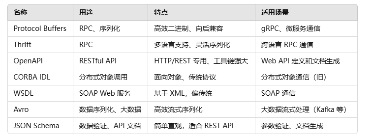
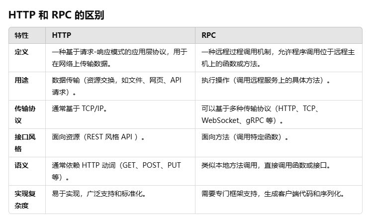

# 资料合集

## 查漏补缺
### IDL
接口描述语言(Interface description language, IDL)，用于描述软件组件接口的一种计算机语言。通过一种独立于变成语言的方式描述接口，使得在不同平台上运行的对象和用不同语言编写的程序可以相互通信交流。

IDL不是一种固定的语法，因为IDL是根据框架不同，编写的语法不一样，可以认为IDL是一种跨平台的接口规范。

场景：
- 假设有两个服务，一个是 C++ 开发的订单服务，另一个是 Java 开发的支付服务。
- 两个服务需要通信，但它们的编程语言、运行时环境完全不同，直接交互非常困难。
- 通过 IDL 描述：
    - 定义一个接口，比如 CreateOrder 方法和对应的数据结构。
    - 生成两种语言（C++ 和 Java）的代码：
    - 服务端用 C++ 实现 CreateOrder。
    - 客户端用 Java 调用这个接口。
- 通信时，双方依赖 IDL 描述的协议，传递数据无缝对接。

几种常见的IDL：

### RPC
RPC（Remote Procedure Call）远程过程调用协议是一个用于建立适当框架的协议。从本质上讲，它使一台机器上的程序能够调用另一台机器上的子程序，而不会意识到它是远程的。

RPC分为两部分：
- 用户调用接口（开发者关心的）
- 具体网络协议（框架实现的）

RPC是一种范式，HTTP是一种协议，两者不是一个类别的技术：

### XMLHttpRequest 
XMLHttpRequest 是一个内建的浏览器对象，它允许使用 JavaScript 发送 HTTP 请求。

现如今有一个更为现代的方法叫做 fetch，它的出现使得 XMLHttpRequest 在某种程度上被弃用。

在现代 Web 开发中，出于以下三种原因，我们还在使用 XMLHttpRequest：
- 历史原因：需要支持现有的使用了 XMLHttpRequest 的脚本
- 需要兼容旧浏览器，并且不想用 polyfill（例如为了使脚本更小）
- 需要做一些 fetch 目前无法做到的事情，例如跟踪上传进度

## 参考资料
SignalR：
- 微软文档：https://learn.microsoft.com/zh-cn/aspnet/core/signalr/introduction?view=aspnetcore-9.0&WT.mc_id=dotnet-35129-website
- 原理：https://www.cnblogs.com/yangxu-pro/p/9515516.html
- RPC：https://www.cnblogs.com/kevinwan/p/14830073.html
- IDL维基百科：https://zh.wikipedia.org/wiki/%E6%8E%A5%E5%8F%A3%E6%8F%8F%E8%BF%B0%E8%AF%AD%E8%A8%80
- XMLHttpRequest：https://zh.javascript.info/xmlhttprequest

