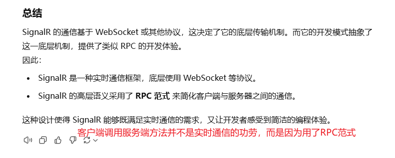
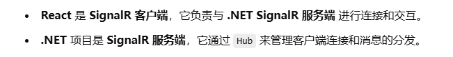
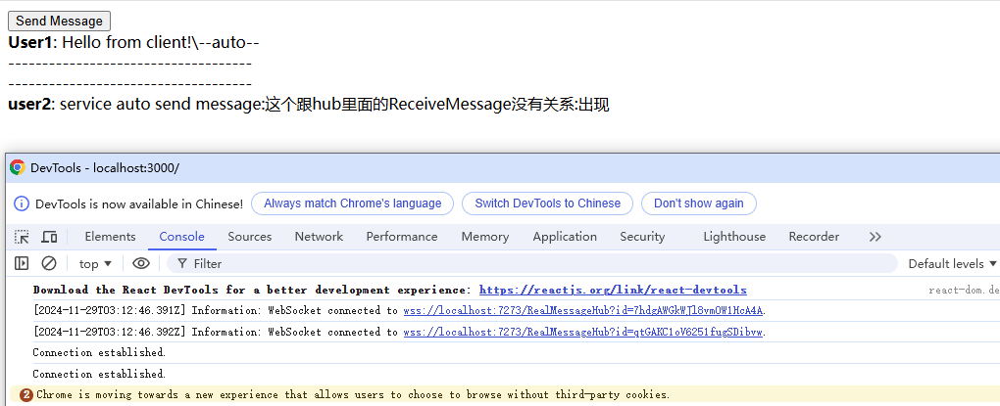

# SignalR
SignalR用于实时双向通信，是一个\.NET Core/.NET Framework的开源实时框架. SignalR的可使用Web Socket, Server Sent Events 和 Long Polling作为底层传输方式。


## 1 不同实时通信技术
SignalR使用的三种底层传输技术分别是Web Socket, Server Sent Events 和 Long Polling。默认采用回落机制，从最优开始选择，如果不符合条件再往下选传输方式。也可以自己选择一种传输方式。

一旦建立连接, SignalR就会开始发送keep alive消息, 检查连接是否还正常. 如果有问题, 就会抛出异常。

### 1.1 WebSocket
一种全双工通信协议，允许客户端和服务器之间建立长时间的连接，进行实时、双向数据传输。

特点：
- 高效：通信过程中开销较小，适合高频率的实时通信
- 双向：支持服务器主动向客户端推送数据（全双工）
- 依赖：要求客户端和服务器都支持 WebSocket（需要现代浏览器和支持 WebSocket 的服务器）

SignalR 首选的传输方式，如果环境支持，SignalR 会优先使用 WebSocket

### 1.2 Server-Sent Events (SSE)
 一种单向通信协议，服务器可以通过 HTTP 向客户端推送数据，但客户端无法主动向服务器发送数据（需要单独的请求实现）。

特点：
- 单向：仅服务器向客户端推送数据
- 易用性：SSE 是基于标准的 HTTP 协议，浏览器支持良好（不支持 IE）
- 长连接：保持一个持续的 HTTP 连接，通过该连接发送数据流

当 WebSocket 不可用且客户端支持 SSE 时，SignalR 会使用它。

### 1.3 Long Polling
一种模拟实时通信的技术，客户端定期向服务器发送请求，服务器在有数据时才返回响应；如果没有数据，服务器会保持连接，直到超时。

特点:
- 模拟实时：本质上是 HTTP 请求，但通过延迟响应来实现实时效果
- 开销大：频繁的 HTTP 请求和连接建立，效率低于 WebSocket
- 兼容性好：适用于几乎所有浏览器和服务器环境

当 WebSocket 和 SSE 都不可用时，SignalR 会回退到 Long Polling。



## 2 Hub
SignalR 使用中心在客户端和服务器之间进行通信。
Hub是SignalR的一个组件, 它运行在ASP\.NET Core应用里，是服务器端的一个类。
在Hub类里面可以调用所有客户端上的方法，同样客户端也可以调用Hub类里的方法。

提供两种内置中心协议：
- 基于JSON的文本协议
- 基于MessagePack的二进制协议（ 与 JSON 相比，MessagePack 通常会创建更小的消息。 旧版浏览器必须支持 XHR 级别 2 才能提供 MessagePack 协议支持）

## 3 demo-客户端通过Hub获取消息
### 3.1 创建Hub

```cs
public class RealMessageHub : Hub
{
    // 将 public 方法添加到类，这个方法就能够被客户端调用
    // 可以通过客户端1发送消息给客户端2，然后这个过程是借助服务端定义的方法
    public async Task SendMessage(string user, string message)
        => await Clients.All.SendAsync("ReceiveMessage", user, message, "--auto--",cancellationToken:default); // 将消息发送到所有连接的客户端
    
    // 从客户端请求结果
    public async Task<string> WaitForMessage(string connectionId)
    {
        var message = await Clients.Client(connectionId).InvokeAsync<string>("GetMessage", default);
        return message;
    }
    
}
```
Hub 类管理连接、组和消息。可通过已连接客户端调用 SendMessage，以向所有客户端发送消息。

### 3.2 配置SignalR
```cs
services.AddSignalR(); 
app.UseEndpoints(endpoints =>
{
    endpoints.MapHub<RealMessageHub>("/RealMessageHub"); 
});
```



记得配置cors让react可以连接到dotnet项目。

### 3.3 react客户端
从Hub获取消息，走SendMessage方法

```js
import React, { useEffect, useState } from 'react';
import * as signalR from "@microsoft/signalr";

function App() {
    const [connection, setConnection] = useState(null);
    const [messages, setMessages] = useState([]);

    useEffect(() => {
        const newConnection = new signalR.HubConnectionBuilder()
            .withUrl("https://localhost:7273/RealMessageHub")
            .build();

        setConnection(newConnection);
    }, []);

    useEffect(() => {
        if (connection) {
            connection.start()
                .then(() => {
                    console.log("Connection established.");
                })
                .catch(err => console.error(err));

            connection.on("ReceiveMessage", (user, message, data) => {
                setMessages([...messages, { user, message, data }]);
            });
        }
    }, [connection]);

    const sendMessage = async () => {
        if (!connection || connection.state !== signalR.HubConnectionState.Connected) {
            console.log(connection);
            console.log("Connection is not in the 'Connected' state.");
            return;
        }
        try {
            await connection.invoke("SendMessage", "User1", "Hello from client!");
        } catch (error) {
            console.error(error);
        }
    };

    return (
        <div>
            <button onClick={sendMessage}>Send Message</button>
            <div>
                {messages.map((msg, index) => (
                    <div key={index}>
                        <strong>{msg.user}</strong>: {msg.message}\{msg.data}
                    </div>
                ))}
            </div>
        </div>
    );
}

export default App;
```

## 4 dotnet项目推送消息给react客户端
### 4.1 dotnet创建Handler
使用 IHubContext 直接向客户端发送消息时，不会经过 Hub 类中的方法逻辑。

```cs
public class TestSignalCommand : ICommand
{
    
}

public class TestSignalCommandHandler : ICommandHandler<TestSignalCommand>
{
    private readonly IHubContext<RealMessageHub> _hubContext; // builder.Services.AddSignalR(); 已经注册了
    public TestSignalCommandHandler(IHubContext<RealMessageHub> hubContext)
    {
        _hubContext = hubContext;
    }
    
    public async Task Handle(IReceiveContext<TestSignalCommand> context, CancellationToken cancellationToken)
    {
        await _hubContext.Clients.All.SendAsync("ReceiveMessageAuto", "user2", "service auto send message", 
            "这个跟hub里面的ReceiveMessage没有关系", "出现", cancellationToken:cancellationToken);
    }
}
```

### 4.2 react接收消息
```js
import React, { useEffect, useState } from 'react';
import * as signalR from "@microsoft/signalr";

function App() {
    const [connection, setConnection] = useState(null);
    const [messages, setMessages] = useState([]);

    useEffect(() => {
        const newConnection = new signalR.HubConnectionBuilder()
            .withUrl("https://localhost:7273/RealMessageHub")
            .build();

        setConnection(newConnection);
    }, []);

    useEffect(() => {
        if (connection) {
            connection.start()
                .then(() => {
                    console.log("Connection established.");
                })
                .catch(err => console.error(err));

            connection.on("ReceiveMessageAuto", (user, message, data, data2) => {
                setMessages([...messages, { user, message, data, data2 }]);
            });
        }
    }, [connection]);
    

    return (
        <div>
            <div>
                {messages.map((msg, index) => (
                    <div key={index}>
                        <strong>{msg.user}</strong>: {msg.message}:{msg.data}:{msg.data2}
                    </div>
                ))}
            </div>
        </div>
    );
}

export default App;

```
