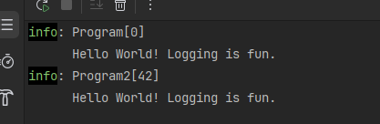
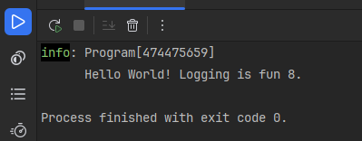
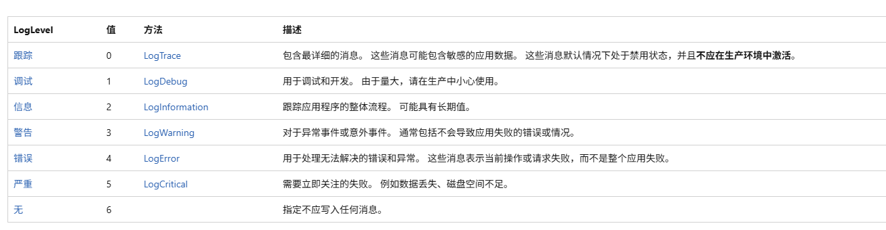
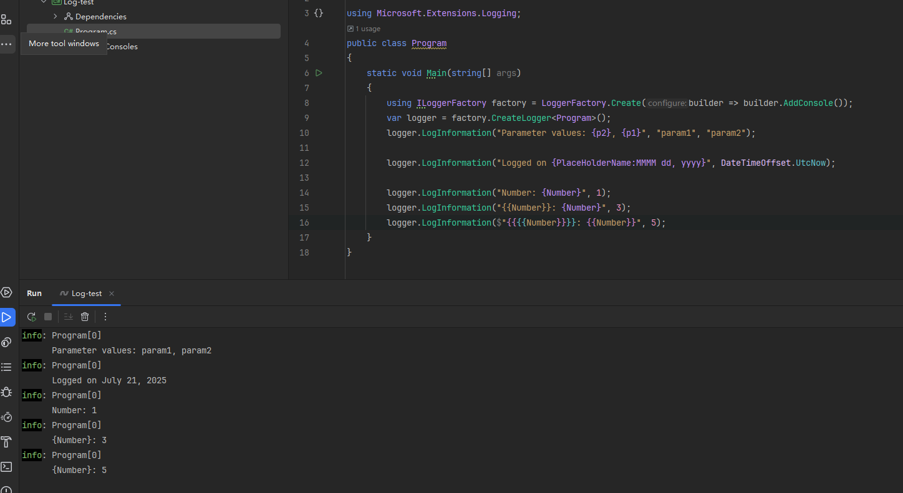
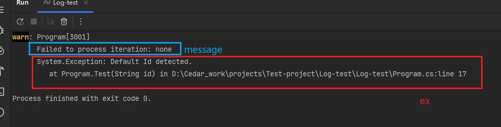
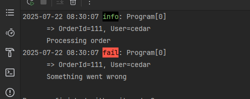
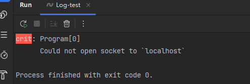
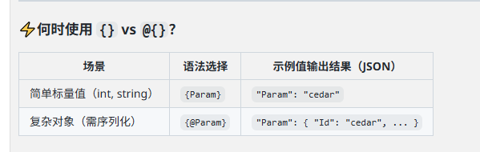
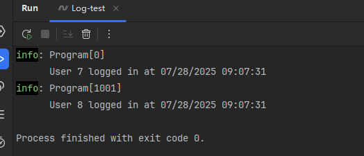

# Microsoft.Extensions.Logging
```
Microsoft.Extensions.Logging
Microsoft.Extensions.Logging.Console
```

日志没有异步记录器方法，日志记录会很快，不值得牺牲性能来使用异步代码。 如果日志记录数据存储很慢，不要直接写入它。考虑先将日志消息写入快速存储，然后再将其移至慢速存储。

## 快速使用

1、普通用法
```cs
using Microsoft.Extensions.Logging;
/*
 * 创建 ILoggerFactory。 ILoggerFactory 可存储用于确定发送日志消息的位置的所有配置
 * 创建类别名称为“Program”的 ILogger。 类别 是与 string 对象记录的每个消息关联的 ILogger
 * 调用 LogInformation 以在 Information 级别记录消息
 */
using var factory = LoggerFactory.Create(builder => builder.AddConsole());
var logger = factory.CreateLogger("Program");
logger.LogInformation("Hello World! Logging is {Description}.", "fun");

// 创建类别名称为“Program2”的 ILogger ，指定 Event ID（事件 ID），默认是 0
var logger2 = factory.CreateLogger("Program2");
logger2.LogInformation(new EventId(42), "Hello World! Logging is {Description}.", "fun");
```




2、.NET 的 Source Generators 日志功能（LoggerMessageAttribute），结合了 Microsoft.Extensions.Logging 来进行高性能结构化日志记录

```cs
// partial 是 Source Generator 的生成入口
/*
 * 1、在编译期发现这个 partial 方法
 * 2、根据属性（如 Message, Level, EventId）生成一个对应的实现
 * 3、注入到编译后的程序集中
 */
internal partial class Program
{
    static void Main(string[] args)
    {
        using ILoggerFactory factory = LoggerFactory.Create(builder => builder.AddConsole());
        // ILogger logger = factory.CreateLogger("Program");
        ILogger logger = factory.CreateLogger<Program>();
        LogStartupMessage(logger, "fun", 8);
    }

    // LoggerMessage 特性 + Partial Method
    // LoggerMessage 是一个属性，用来告诉编译器生成日志方法的实现
    [LoggerMessage(Level = LogLevel.Information, Message = "Hello World! Logging is {Description} {A}.")]
    static partial void LogStartupMessage(ILogger logger, string description, int a);
}
```



3、日志输出到seq
使用 Serilog + Seq
```
dotnet add package Serilog.AspNetCore
dotnet add package Serilog.Sinks.Seq
```
用了Serilog 的话可以直接用Log.Information ...
```cs
Log.Logger = new LoggerConfiguration()
    .WriteTo.Seq("http://localhost:5341")  // Seq 实例地址
    .CreateLogger();

var builder = Host.CreateDefaultBuilder(args)
    .UseSerilog()  // 将 Serilog 接入 .NET 日志系统
    .ConfigureServices((context, services) =>
    {
        // 注册服务
    });
```

4、从 DI 获取 ILogger
```cs
public class Program
{
    static void Main(string[] args)
    {
        using ILoggerFactory factory = LoggerFactory.Create(builder => builder.AddConsole());
        var logger = factory.CreateLogger<ExampleHandler>();
        var handler = new ExampleHandler(logger);
        handler.HandleRequest();
    }
}

partial class ExampleHandler(ILogger<ExampleHandler> logger)
{
    public string HandleRequest()
    {
        LogHandleRequest(logger);
        return "Hello World";
    }

    [LoggerMessage(LogLevel.Information, "ExampleHandler.HandleRequest was called")]
    public static partial void LogHandleRequest(ILogger logger);
}
```


## 配置日志记录
1、用配置文件
```json
{
  "Logging": {
    "LogLevel": {
      "Default": "Information",
      "Microsoft": "Warning",
      "Microsoft.Hosting.Lifetime": "Information"
    }
  }
}
```
表示Microsoft.Hosting.Lifetime会打印Information或更高级别的日志。

`Microsoft.Hosting.Lifetime`类别是` var logger = factory.CreateLogger("Microsoft.Hosting.Lifetime");`这样创建的。

2、用代码
本质上就是过滤啦

```cs
using var loggerFactory = LoggerFactory.Create(static builder =>
{
    builder
        .AddFilter("Microsoft", LogLevel.Warning)
        .AddFilter("System", LogLevel.Warning)
        .AddFilter("LoggingConsoleApp.Program", LogLevel.Debug)
        .AddConsole();
});

ILogger logger = loggerFactory.CreateLogger<Program>();
```

## 日志级别




## 日志消息模板
自定义日期和时间格式字符串：https://learn.microsoft.com/zh-cn/dotnet/standard/base-types/custom-date-and-time-format-strings



## 记录异常
```cs
public class Program
{
    static void Main(string[] args)
    {
        Test("none");
    }
    
    public static void Test(string id)
    {
        try
        {
            if (id is "none")
            {
                throw new Exception("Default Id detected.");
            }
        }
        catch (Exception ex)
        {
            using ILoggerFactory factory = LoggerFactory.Create(builder => builder.AddConsole());
            var logger = factory.CreateLogger<Program>();
            logger.LogWarning(
                AppLogEvents.Error, ex,
                "Failed to process iteration: {Id}", id);
        }
    }
}
// 自定义日志事件ID
internal static class AppLogEvents
{
    internal static EventId Create = new(1000, "Created");
    internal static EventId Read = new(1001, "Read");
    internal static EventId Update = new(1002, "Updated");
    internal static EventId Delete = new(1003, "Deleted");

    internal const int Details = 3000;
    internal const int Error = 3001;

    internal static EventId ReadNotFound = 4000;
    internal static EventId UpdateNotFound = 4001;
}
```




## 日志作用域
给一组相关日志临时附加一些上下文信息，在该作用域内自动包含这些信息，而不需要在每条日志中手动写。

```cs
public class Program
{
    static void Main(string[] args)
    {
        var host = Host.CreateDefaultBuilder(args)
            .ConfigureLogging(logging =>
            {
                logging.ClearProviders();
                logging.AddSimpleConsole(options => 
                {
                    options.IncludeScopes = true;
                    options.TimestampFormat = "yyyy-MM-dd HH:mm:ss "; 
                });
            })
            .Build();

        var logger = host.Services.GetRequiredService<ILogger<Program>>();
        
        using (logger.BeginScope("OrderId=111, User=cedar"))
        {
            logger.LogInformation("Processing order");
            logger.LogError("Something went wrong");
        }
    }
}
```




还可以在appsettings配置`"IncludeScopes": true`


## 编译时日志记录源生成
编译时日志记录源生成是一种高性能日志记录方式，它利用 C# 源生成器在编译时生成优化的日志代码，相比传统反射方式能显著提升性能（减少装箱、字符串分配等）。

用 LoggerMessageAttribute，使用的类和方法必须为 partial。

```cs
public class Program
{
    static void Main(string[] args)
    {
        using ILoggerFactory factory = LoggerFactory.Create(builder => builder.AddConsole());
        var logger = factory.CreateLogger<Program>();
        Log.CedarCustomMethod(logger, "localhost");
    }
}

public static partial class Log
{
    [LoggerMessage(
        EventId = 0,
        Level = LogLevel.Critical,
        Message = "Could not open socket to `{HostName}`")]
    
    public static partial void CedarCustomMethod(ILogger logger, string hostName);
}
```






推荐用结构化参数而不是字符串拼接：
```cs
// Good - 结构化参数
_logger.LogInformation("User {UserId} accessed resource {ResourceId}", userId, resourceId);

// Bad - 字符串拼接
_logger.LogInformation($"User {userId} accessed resource {resourceId}");为什么拼接不行
```

结构化参数：
- 日志库（如 Serilog、ElasticSearch、Datadog、Application Insights）会将日志内容转化成键值对结构，这样可以在日志分析平台中按字段搜索、聚合、筛选
- 字符串拼接时即使日志不会被输出（如当前是 Warning 级别），这段 $"" 字符串还是会构建 —— 浪费性能，而结构化参数在禁用时参数不会被处理，更高效
- LoggerMessageAttribute只能用结构化方式，不支持拼接字符串

## 高性能日志记录
LoggerMessage 是 .NET 提供的一个 静态工厂方法系统，用于缓存日志模板并避免装箱操作（boxing），以减少 GC 压力和提升性能。适合频繁写日志的场景。

可以使用 .NET 6 及更高版本中的 LoggerMessage 属性（属性的例子上面有），而不是使用 LoggerMessage 类来创建高性能日志。 

```cs
public class Program
{
    static void Main(string[] args)
    {
        using ILoggerFactory factory = LoggerFactory.Create(builder => builder.AddConsole());
        var logger = factory.CreateLogger<Program>();

        // 标准写法（存在装箱与模板重复解析）
        logger.LogInformation("User {UserId} logged in at {LoginTime}", 7, DateTime.UtcNow);
        
        // 高性能 LoggerMessage 写法
        UserLoggedIn(logger, 8, DateTime.Now);
    }
    
    // 定义记录器消息
    private static readonly Action<ILogger, int, DateTime, Exception?> _userLoggedIn =
        LoggerMessage.Define<int, DateTime>(
            LogLevel.Information,
            new EventId(1001, nameof(UserLoggedIn)),
            "User {UserId} logged in at {LoginTime}");

    public static void UserLoggedIn(ILogger logger, int userId, DateTime loginTime)
    {
        _userLoggedIn(logger, userId, loginTime, null);
    }
}

```




## 日志采样
是一种日志生成控制策略，用于在高吞吐量系统中有选择地记录部分日志，以减少磁盘/网络/CPU负载，同时保留足够的数据进行排查和分析。

采样策略：
- 基于跟踪的采样：基于当前跟踪的采样决策采样日志。
- 随机概率采样：基于配置的概率规则对日志进行采样。
- 自定义采样：实现自己的自定义采样策略。

```
dotnet add package Microsoft.Extensions.Telemetry
```

**基于跟踪的采样**

 一个 Trace 通常包含：
- 请求开始时间、结束时间
- 调用了哪些服务、组件
- 每个步骤持续了多久
- 错误在哪发生
- 服务与服务之间的上下文传递


```cs
builder.Logging.AddTraceBasedSampler();
```

```cs
// 推荐先判断再记录，避免额外开销
if (Activity.Current?.Recorded == true)
{
    // 记录日志
}
else
{
    // 丢弃日志（因为这个 Trace/Activity 没被采样）
}
```

**配置随机概率采样**

可以定义以下特定规则：
- 日志类别
- 日志级别
- 事件编号

```cs
builder.Logging.AddRandomProbabilisticSampler(options =>
{
    options.Rules.Add(
        new RandomProbabilisticSamplerFilterRule(
            probability: 0.05d,
            eventId : 1001));
});
```
上面配置的意思是：包含事件 ID 为 1001 的所有类别和级别日志的示例 5%，从所有其他日志中采样 100%

## 日志缓冲
日志系统在写入日志时，不是每条日志都立即写入磁盘或外部系统，而是先暂存在内存中的一个缓冲区（buffer），积累到一定条件后（如数量、时间、大小）再统一写入。

缓冲策略：
- 全局缓冲：全应用程序的日志缓冲
- 按请求缓冲：如果可用，针对每个 HTTP 请求缓冲日志；否则，缓冲到全局缓冲区

```cs
dotnet add package Microsoft.Extensions.Telemetry
dotnet add package Microsoft.AspNetCore.Diagnostics.Middleware
```


<hr>

- https://learn.microsoft.com/zh-cn/dotnet/core/extensions/logging?tabs=command-line