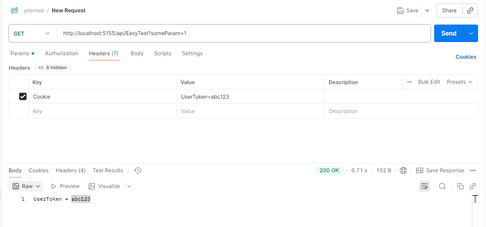
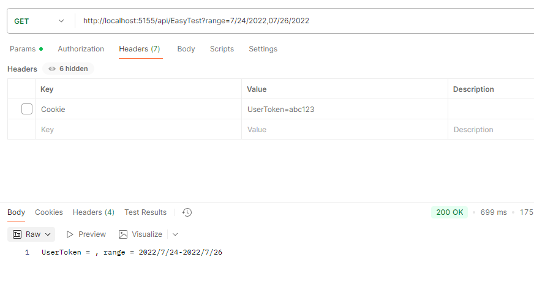
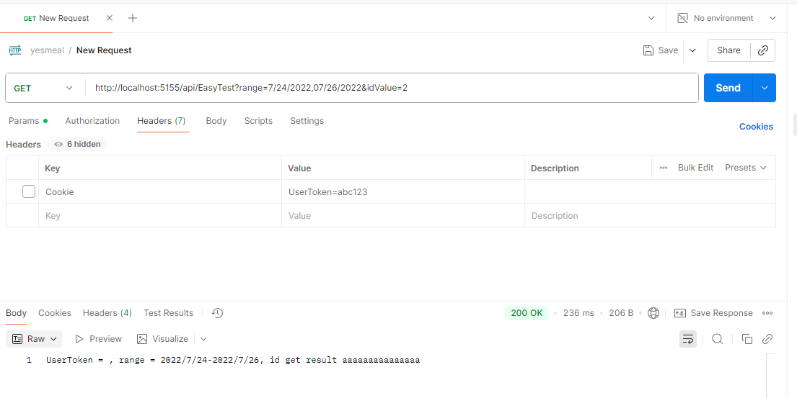

# 模型绑定
控制器和 Razor Pages 处理来自 HTTP 请求的数据。比如Controller工具HTTP请求的数据，将这些值从字符串转换为dotnet类型，这个过程是必须实现但是又很繁琐，所以利用模型绑定自动化这个过程。

模型绑定的主要功能：
- 从各种源中检索数据
  - 模型绑定系统会自动在以下位置查找数据：
    - 路由数据（RouteData）
    - 查询字符串（QueryString）
    - 表单字段（Form）
    - 请求体（如 JSON）
    - 上传的文件（IFormFile）
    - HTTP 头（Header）
    - Cookies
- 将数据提供给控制器和 Razor Pages 的方法参数与属性
- 将字符串数据转换为 .NET 类型
- 更新复杂类型的属性

1、从各种源中检索数据
```cs
// https://contoso.com/api/pets/2?keyword="aaa"
[HttpGet("{id}")] // id 来自路由  keyword来自查询字符串
public ActionResult<Pet> GetById(int id, string keyword)
```

2、将数据提供给控制器和 Razor Pages 的方法参数与属性
```cs
[HttpPost]
public IActionResult Register(UserModel user)
{
    // 表单字段自动绑定到 user 对象的属性
    ...
}

```

3、将字符串数据转换为 .NET 类型
```cs
[HttpGet]
public IActionResult Get(int age)  // “age” 将从字符串 "25" 转为 int 25
{
    ...
}
```
4、更新复杂类型的属性
对于复杂类型（如类或结构体），模型绑定会递归绑定内部属性。
```cs
public class Address
{
    public string City { get; set; }
    public string Street { get; set; }
}

public class User
{
    public string Name { get; set; }
    public Address Address { get; set; }
}

[HttpPost]
public IActionResult Create(User user)
{
    // 请求体中如果有 "Address.City"、"Address.Street"，
    // 模型绑定会自动填充 user.Address 对象
    ...
}

```

## 模型绑定的目标（Targets）
模型绑定会尝试为以下三种对象类型查找并提供值：
1、控制器操作方法的参数
```cs
public IActionResult Edit(int id)  // id 从路由、查询字符串或表单中绑定
{
    ...
}

```

2、Razor Pages 处理程序方法的参数
```cs
public class EditModel : PageModel
{
    public void OnGet(int id)  // id 自动绑定
    {
        ...
    }
}
```

3、控制器或 PageModel 类的公共属性（若由特性指定）
- [BindProperty]  单个属性绑定
- [BindProperties]  整类绑定
- [BindProperty(SupportsGet = true)] HTTP GET 请求的模型绑定 

### [BindProperty] 
MVC 控制器里的模型绑定（不需要 [BindProperty]）只要参数名匹配（或者是对象的属性名匹配），模型绑定系统就会自动创建对象并赋值。

而Razor Pages 的模型绑定（默认不会绑定属性）Razor Pages 是基于 PageModel 的，它的处理方法（OnPost、OnGet）默认是这样的：
```cs
public class EditModel : PageModel
{
    public Instructor Instructor { get; set; }  //  默认不会绑定

    public void OnPost()
    {
        // 此时 Instructor == null
    }
}

```
因为 Razor Pages 的模型绑定系统默认只绑定方法参数，不绑定 PageModel 的属性。这时就需要 [BindProperty]
```cs
public class EditModel : PageModel
{
    [BindProperty]
    public Instructor Instructor { get; set; }

    public void OnPost()
    {
        //  Instructor 已自动填充
    }
}

```
Razor Pages 框架看到 [BindProperty]，就会告诉模型绑定系统：这个属性也要参与绑定。这样它才会去请求体、表单、查询字符串中找数据填充 Instructor。

### [BindProperties] 属性
```cs
// 使模型绑定以该类的所有公共属性为目标
[BindProperties]
public class CreateModel : PageModel
{
    public Instructor? Instructor { get; set; }

    // ...
}
```

### [BindProperty(SupportsGet = true)] HTTP GET 请求的模型绑定 
```cs
// GET /Index?ai_user=abc123
public class IndexModel : PageModel
{
    [BindProperty(Name = "ai_user", SupportsGet = true)]
    public string? ApplicationInsightsCookie { get; set; }

    public void OnGet()
    {
        // ApplicationInsightsCookie 的值将从 "ai_user" 这个键绑定
    }
}

// 最终效果ApplicationInsightsCookie == "abc123" 不写name就根据属性名匹配
```

## 模型绑定简单和复杂类型
ASP.NET Core 在执行模型绑定时，会根据绑定目标的类型分为两种情况：
- 简单类型
  - 单个字符串值  int, string, bool, DateTime, Guid, enum
    - 存在 TypeConverter 
    - 存在静态 TryParse(string, out T) 方法
- 复杂类型
  - 多个键值对（多个字段）， 自定义类对象、集合、嵌套类型

## Sources

Sources（数据源）：数据从哪里来
Targets（目标）：数据要绑定到哪里去

对于每个目标参数或属性，按照之前“模型绑定系统会自动在以下位置查找数据” 的列表循序扫描源，但是又几个例外情况
- 路由数据和查询字符串值仅用于 简单 类型。
- 上传的文件仅绑定到实现 IFormFile 或 IEnumerable<IFormFile> 的目标类型。

如果默认源不正确，请使用下列属性之一来指定源：
- [FromQuery] - 从查询字符串中获取值。
- [FromRoute] - 从路由数据中获取值。
- [FromForm] - 从发布的表单域中获取值。
- [FromBody] - 从请求正文中获取值。
- [FromHeader] - 从 HTTP 标头中获取值。

这些属性添加到模型属性（而不是模型类）

```cs
public void OnGet([FromHeader(Name = "Accept-Language")] string language)
```

### 其他源
值提供程序是 模型绑定系统从各种 Source（请求数据）获取值的接口。
ASP.NET Core 内置了一些值提供程序：
- RouteValueProvider → 从路由数据读取
- QueryStringValueProvider → 从查询字符串读取
- FormValueProvider → 从表单读取
- HeaderValueProvider → 从请求头读取

模型绑定系统会按顺序调用这些值提供程序，直到找到匹配的键，然后将值绑定到 Target。

有些场景，默认值提供程序不能满足需求，例如：
- 从 Cookie 读取数据绑定到属性
- 从 Session 获取值
- 从自定义存储（Redis、数据库临时表）读取值

这时就可以自己实现一个 ValueProvider + ValueProviderFactory
```cs
public class CookieValueProvider : IValueProvider
{
    private readonly IRequestCookieCollection _cookies;

    public CookieValueProvider(IRequestCookieCollection cookies)
    {
        _cookies = cookies;
    }

    public bool ContainsPrefix(string prefix)
    {
        return _cookies.ContainsKey(prefix);
    }

    public ValueProviderResult GetValue(string key)
    {
        if (_cookies.TryGetValue(key, out var value))
        {
            return new ValueProviderResult(value);
        }
        return ValueProviderResult.None;
    }
}
```
```cs
public class CookieValueProviderFactory : IValueProviderFactory
{
    public Task CreateValueProviderAsync(ValueProviderFactoryContext context)
    {
        var provider = new CookieValueProvider(context.ActionContext.HttpContext.Request.Cookies);
        context.ValueProviders.Add(provider);
        return Task.CompletedTask;
    }
}
```

```cs
    [BindProperty(SupportsGet = true)]
    public string? UserToken { get; set; }
    
    [HttpGet]
    public IActionResult Index([FromQuery] string? someParam)
    {
        // 如果 Cookie 中有 "UserToken" 键，
        // 模型绑定系统会通过 CookieValueProvider 自动填充 UserToken
        return Content($"UserToken = {UserToken}");
    }
```

```cs
// start up
        services.AddControllers(options =>
        {
            // 添加到内置值提供程序之后
            //options.ValueProviderFactories.Add(new CookieValueProviderFactory());

            // 或者放在首位，优先匹配
            options.ValueProviderFactories.Insert(0, new CookieValueProviderFactory());
        }).AddFluentValidation();
```




### 不存在模型属性的源
默认情况下，如果找不到模型属性的值，该属性设置为 NULL 或默认值：
- 可空是null
- 不为null是default(T)
- 复杂类型，模型绑定使用默认构造函数来创建实例，而不设置属性
- 数组设置为 Array.Empty<\T>()，但 byte[] 数组设置为 null

如果在模型属性的表单域中找不到任何内容时，模型状态应无效，使用 [BindRequired] 属性。([BindRequired] 行为适用于来自已发布表单数据的模型绑定，不适用于请求正文中的 JSON 或 XML 数据。)

### 简单类型
模型绑定器可以将源字符串转换为以下简单类型：
- Boolean
- 字节、 SByte
- Char
- DateOnly
- DateTime
- DateTimeOffset
- Decimal
- Double
- Enum
- Guid
- Int16、 Int32、 Int64
- Single
- TimeOnly
- TimeSpan
- UInt16、 UInt32、 UInt64
- Uri
- Version

#### 通过 IParsable<T>.TryParse 绑定
```cs
public class DateRange : IParsable<DateRange>
{
    public DateOnly? From { get; init; }
    public DateOnly? To { get; init; }

    public static DateRange Parse(string value, IFormatProvider? provider)
    {
        if (!TryParse(value, provider, out var result))
        {
            throw new ArgumentException("Could not parse supplied value.", nameof(value));
        }

        return result;
    }

    public static bool TryParse(string? value,
        IFormatProvider? provider, out DateRange dateRange)
    {
        var segments = value?.Split(',', StringSplitOptions.RemoveEmptyEntries 
                                         | StringSplitOptions.TrimEntries);

        // IFormatProvider? provider 用来告诉 DateOnly.TryParse 按什么文化/格式来解析字符串
        if (segments?.Length == 2
            && DateOnly.TryParse(segments[0], provider, out var fromDate)
            && DateOnly.TryParse(segments[1], provider, out var toDate))
        {
            dateRange = new DateRange { From = fromDate, To = toDate };
            return true;
        }

        dateRange = new DateRange { From = default, To = default };
        return false;
    }
}
```

```cs
    [HttpGet]
    public IActionResult Index([FromQuery] string? someParam, [FromQuery] DateRange range)
    {
        // 如果 Cookie 中有 "UserToken" 键，
        // 模型绑定系统会通过 CookieValueProvider 自动填充 UserToken
        return Content($"UserToken = {UserToken}, range = {range.From}-{range.To}");
    }
```


#### 通过 TryParse 绑定
和上面的类似，直接参考文档就好了

### 复杂类型
复杂类型必须具有要绑定的公共默认构造函数和公共可写属性。 进行模型绑定时，将使用公共默认构造函数来实例化类。

复杂类型是以下 Instructor 类：
```cs
public class Instructor
{
    public int ID { get; set; }
    public string LastName { get; set; }
    public string FirstName { get; set; }
}
```

```cs
public IActionResult OnPost(int? id, Instructor instructorToUpdate)
```
模型绑定从查找键 instructorToUpdate.ID 的源开始操作。 如果未找到，它将查找不含前缀的 ID。

自定义前缀：
```cs
public IActionResult OnPost(
    int? id, [Bind(Prefix = "Instructor")] Instructor instructorToUpdate)
```
模型绑定从查找键 Instructor.ID 的源开始操作。 如果未找到，它将查找不含前缀的 ID。

#### 复杂类型目标的属性
#####  [Bind]
只绑定 Instructor 模型的指定属性

  ```cs
  [Bind("LastName,FirstMidName,HireDate")]
  public class Instructor

  // or

  [HttpPost]
  public IActionResult OnPost(
    [Bind("LastName,FirstMidName,HireDate")] Instructor instructor)
  ```
##### [ModelBinder] 
应用于类型、属性或参数。 它允许指定用于绑定特定实例或类型的模型绑定器的类型。 

假设有一个 Instructor 类，需要用一个自定义的绑定器来将数据绑定到这个类：
```cs
public class Instructor
{
    // 从instructor_id获取值赋值到Id
    [ModelBinder(Name = "instructor_id")]
    public string Id { get; set; }

    public string Name { get; set; }
}

public class MyInstructorModelBinder : IModelBinder
{
    public Task BindModelAsync(ModelBindingContext bindingContext)
    {
        var idValue = bindingContext.HttpContext.Request.Query["instructor_id"];
        var nameValue = bindingContext.HttpContext.Request.Query["name"];

        var instructor = new Instructor
        {
            Id = idValue,
            Name = nameValue
        };

        bindingContext.Result = ModelBindingResult.Success(instructor);
        return Task.CompletedTask;
    }
}

[HttpPost]
public IActionResult OnPost([ModelBinder(MyInstructorModelBinder)] Instructor instructor)
{
    // 使用自定义绑定器处理数据
    return Ok(instructor);
}

```

##### [BindRequired]
如果无法对模型属性进行绑定，则会导致模型绑定添加模型状态错误。
```cs
public class InstructorBindRequired
{
    // ...

    [BindRequired]
    public DateTime HireDate { get; set; }
}
```
##### [BindNever]
用于属性或类型。 防止模型绑定设置模型的属性。 在应用于类型时，模型绑定系统将排除该类型定义的所有属性。 
```cs
public class InstructorBindNever
{
    [BindNever]
    public int Id { get; set; }

    // ...
}
```

就是不赋值给Id的意思

### Collections
对于简单类型的集合的目标

假设要绑定的参数是名为 selectedCourses 的数组:
```cs
public IActionResult OnPost(int? id, int[] selectedCourses)
```

表单或查询字符串数据可以采用以下某种格式：
```
selectedCourses=1050&selectedCourses=2000 

// or

selectedCourses[0]=1050&selectedCourses[1]=2000

// or

[0]=1050&[1]=2000

// or

selectedCourses[a]=1050&selectedCourses[b]=2000&selectedCourses.index=a&selectedCourses.index=b

// or

[a]=1050&[b]=2000&index=a&index=b
```

### Dictionaries
对于 Dictionary 目标

假设目标参数是名为 Dictionary<\int, string> 的 selectedCourses：
```cs
public IActionResult OnPost(int? id, Dictionary<int, string> selectedCourses)
```

发布的表单或查询字符串数据可以类似于以下某一示例：
```
selectedCourses[1050]=Chemistry&selectedCourses[2000]=Economics

// or

[1050]=Chemistry&selectedCourses[2000]=Economics

// or

selectedCourses[0].Key=1050&selectedCourses[0].Value=Chemistry&
selectedCourses[1].Key=2000&selectedCourses[1].Value=Economics

// or

[0].Key=1050&[0].Value=Chemistry&[1].Key=2000&[1].Value=Economics
```

# 自定义模型绑定
默认模型绑定器的限制：
- 不支持复杂的数据转换：比如想基于某些条件从外部数据源（数据库或缓存）提取数据填充到模型属性中，默认模型绑定无法做到
- 类型转换的复杂性：如果请求数据需要复杂的转换（例如字符串到自定义对象的转换），默认的模型绑定器可能不适用

## IModelBinder

```cs
public class AuthorEntityBinder : IModelBinder
{
    public Task BindModelAsync(ModelBindingContext bindingContext)
    {
        if (bindingContext == null)
        {
            throw new ArgumentNullException(nameof(bindingContext));
        }

        var modelName = bindingContext.ModelName;

        //从 ValueProvider 获取请求参数的值
        var valueProviderResult = bindingContext.ValueProvider.GetValue(modelName);

        if (valueProviderResult == ValueProviderResult.None)
        {
            return Task.CompletedTask;
        }

        bindingContext.ModelState.SetModelValue(modelName, valueProviderResult);

        var value = valueProviderResult.FirstValue;

        // 如果请求中没有该值，直接返回
        if (string.IsNullOrEmpty(value))
        {
            return Task.CompletedTask;
        }

        if (!int.TryParse(value, out var id))
        {
            // Non-integer arguments result in model state errors
            bindingContext.ModelState.TryAddModelError(
                modelName, "Author Id must be an integer.");

            return Task.CompletedTask;
        }

        // Model will be null if not found, including for
        // out of range id values (0, -3, etc.)
        var model = "aaaaaaaaaaaaaaa";
        bindingContext.Result = ModelBindingResult.Success(model);
        return Task.CompletedTask;
    }
}
```

```cs
    [HttpGet]
    public IActionResult Index([FromQuery] string? someParam, [FromQuery] DateRange range,
        [ModelBinder(BinderType = typeof(AuthorEntityBinder))]
        string idValue)
    {
        // 如果 Cookie 中有 "UserToken" 键，
        // 模型绑定系统会通过 CookieValueProvider 自动填充 UserToken
        return Content($"UserToken = {UserToken}, range = {range.From}-{range.To}, id get result {idValue}");
    }
```



IModelBinder：负责执行实际的模型绑定工作。它知道如何从请求中获取数据并将其转换为指定的模型类型。

IModelBinderProvider：负责为特定类型的模型提供一个绑定器。它决定哪个 IModelBinder 应该用于某个请求中的模型绑定操作。

IModelBinderProvider使用直接看文档


| 接口                         | 作用                            | 典型实现                                 |
| -------------------------- | ----------------------------- | ------------------------------------ |
| **`IValueProvider`**       | 从请求中获取键值对（数据来源）               | QueryString、Form、Route、Header、Cookie |
| **`IModelBinder`**         | 使用 `IValueProvider` 提供的数据构造模型 | 从请求参数生成对象                            |
| **`IModelBinderProvider`** | 告诉系统该模型类型应该使用哪个绑定器            | 绑定器选择逻辑                              |

# 模型验证
模型状态表示两个子系统的错误：模型绑定和模型验证。

模型绑定和模型验证都在执行控制器操作或 Razor Pages 处理程序方法之前进行。

于具有控制器和视图的 ASP.NET Core MVC，以下示例演示如何在控制器操作内部检查 ModelState.IsValid：
```cs
// controller
public async Task<IActionResult> Create(Movie movie)
{
    if (!ModelState.IsValid)
    {
        return View(movie);
    }

    return ok();
}
```

验证自动进行，但是可能需要手动进行重复验证。 例如，可能为属性计算一个值，并且希望将属性设置为所计算的值后，再重新运行验证。
```cs
ModelState.ClearValidationState(nameof(Movie));
if (!TryValidateModel(Movie, nameof(Movie)))
{
    return Page();
}
```

## 验证属性
通过验证特性可以为模型属性指定验证规则。

常用内置属性:
```cs
public class Instructor
{
    [Required]                   // 必填
    public string Name { get; set; }

    [Range(18, 65)]              // 年龄必须在 18~65
    public int Age { get; set; }

    [EmailAddress]                // 必须是合法邮箱
    public string Email { get; set; }

    [StringLength(50, MinimumLength = 3)]
    public string Department { get; set; }
}
```

## 自定义验证
### ValidationAttribute
```cs
using System;
using System.ComponentModel.DataAnnotations;

public class ValidateEmailDomainAttribute : ValidationAttribute
{
    private readonly string _domain;

    // 构造函数，传入要求的邮箱域名
    public ValidateEmailDomainAttribute(string domain)
    {
        _domain = domain;
    }

    // 实现自定义的验证逻辑
    protected override ValidationResult IsValid(object value, ValidationContext validationContext)
    {
        if (value == null)
        {
            return ValidationResult.Success;  // 如果值为空，跳过验证（可以根据需求更改）
        }

        var email = value.ToString();

        // 检查邮箱的域名是否符合要求
        if (!email.EndsWith($"@{_domain}", StringComparison.OrdinalIgnoreCase))
        {
            // 返回自定义错误消息
            return new ValidationResult($"The email must be from the '{_domain}' domain.");
        }

        return ValidationResult.Success;  // 如果验证通过，返回成功
    }
}
```

```cs
public class RegisterViewModel
{
    [Required]
    [EmailAddress]
    [ValidateEmailDomain("example.com")]  // 使用自定义验证特性
    public string Email { get; set; }
}

```

在控制器中进行验证时，与字段验证类似：

```cs
public IActionResult Register(RegisterViewModel model)
{
    if (!ModelState.IsValid)
    {
        return View(model);
    }

    return RedirectToAction("Index");
}
```

### IValidatableObject
上面ValidationAttribute是用于属性， 类级别验证的另一方式是在模型类中实现 IValidatableObject。就是一个类继承IValidatableObject，然后在Validate方法中写验证逻辑。

### IModelValidator
全局的
```cs
using Microsoft.AspNetCore.Mvc.ModelBinding.Validation;
using System.ComponentModel.DataAnnotations;

public class CustomModelValidator : IModelValidator
{
    public IEnumerable<ModelValidationResult> Validate(ModelValidationContext context)
    {
        var results = new List<ModelValidationResult>();

        // 执行你的自定义验证逻辑
        var model = context.Model as RegisterViewModel;

        if (model != null && model.Email.Contains("example.com") && model.Password.Length < 8)
        {
            results.Add(new ModelValidationResult("Password", "Password must be at least 8 characters when using example.com email."));
        }

        return results;
    }
}
```
需要在启动时注册你的自定义验证器：
```cs
public void ConfigureServices(IServiceCollection services)
{
    services.AddControllersWithViews(options =>
    {
        options.ModelValidatorProviders.Add(new CustomModelValidatorProvider());
    });
}
```