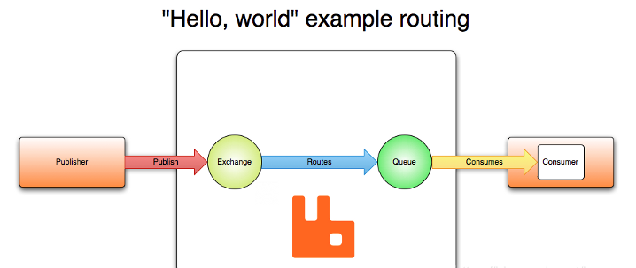

# 0-资料合集

## 查漏补缺
### AMQP
AMQP（Advanced Message Queuing Protocol）是一种开放标准的消息协议，用于在不同的应用程序之间传输消息。它定义了一套通信规则和格式，确保消息可以在不同的系统和平台之间可靠地传递。

## 参考资料
rabbitMQ
- 界面介绍：https://www.cnblogs.com/ZhuChangwu/p/14093107.html
- 中文文档：https://rabbitmq.mr-ping.com/description.html

