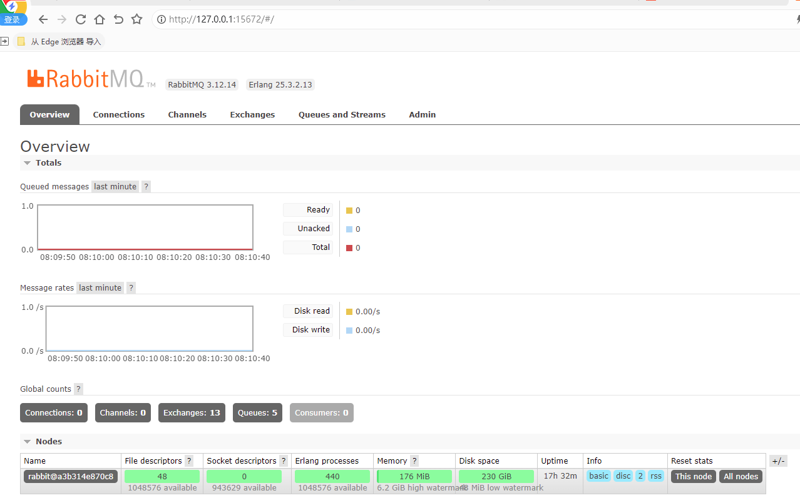

# 1-RabbitMQ
## 1、简介
消息系统允许软件、应用相互连接和扩展。这些应用可以相互链接起来组成一个更大的应用，或者将用户设备和数据进行连接．消息系统通过将消息的发送和接收分离来实现应用程序的异步和解偶。

- 消息队列（Message Queue，简称MQ），本质是个队列，FIFO先入先出，队列中存放的内容是message。
- RabbitMQ是开源的，在AMQP基础上完整的，可复用的企业消息系统

可以直接在docker创建RabbitMQ容器。（初始用户密码是guest guest）

