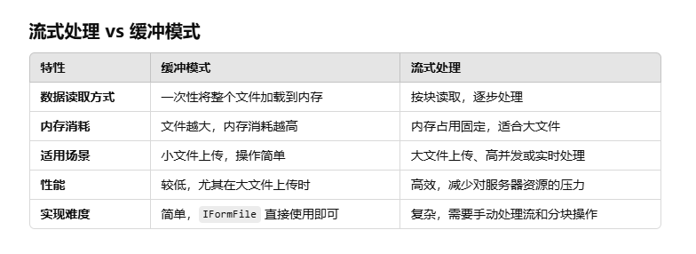

# 文件
## 存储方案
- 数据库
    - 将文件存储为数据库的 BLOB 数据（如 SQL Server、MySQL 的 VARBINARY(MAX)）
    - 对于小型文件上传，数据库通常快于物理存储
    - 相对于使用数据存储服务，数据库的成本可能更低
- 物理存储（文件系统或网络共享）
    - 将文件存储在服务器的文件系统中或通过网络共享（如 NFS、SMB）进行管理
- 数据存储服务
    - Azure Blob Storage, AWS S3, Google Cloud Storage等

## 文件上传方案

### 1、 缓冲
特点：
- 文件被完全读取到内存或磁盘的临时存储中，然后进行处理。
- 上传完成后才处理文件内容。

优点：
- 简单易用：常见框架（如 ASP.NET Core）的默认配置多采用此模式
- 操作方便：可以直接访问完整文件数据，无需考虑流式读取的复杂性
- 适用于小文件：上传的文件较小时，内存和存储占用可以忽略不计

缺点：
- 内存占用高：文件数据需要存储在内存或磁盘的临时目录中，大文件会造成压力
- 效率低：对于大文件上传，会出现较长时间的延迟，因为需要等到整个文件接收完毕
- 不适合大文件上传：容易导致内存溢出或磁盘空间不足

适用场景
- 小文件上传（例如文档、图片）
- 文件上传频率低，服务器资源充足
- 需要对完整文件进行校验（如 MD5 检验）

对于C# ，整个文件读入 IFormFile，它是文件的 C# 表示形式，用于处理或保存文件。

### 2、 流式

特点：
- 文件被逐块读取（如按字节或固定大小块），一边读取一边处理，上传完成后可能只需要部分存储文件
- 适合处理长时间上传的文件流

优点：
- 低内存占用：仅存储当前正在处理的文件块，内存占用量小
- 性能更好：可以支持大文件的上传，且传输效率更高
- 实时性强：可以在文件尚未上传完成时就开始处理数据

缺点：
- 复杂性高：需要开发者自行管理流的读取、错误处理等
- 代码复杂：开发时需要关注流的关闭、异常处理、上传中断等情况
- 适用范围有限：对部分需要完整文件内容的场景（如校验）并不适用

适用场景：
- 大文件上传（如 >1GB）（如视频、音频、大型压缩包）
- 高并发场景，需要节省内存占用
- 需要边上传边处理的场景（如音视频流处理）

对于C#，流式处理直接从 HttpRequest.Body 或者类似的 Stream 读取数据，并逐块处理数据。

