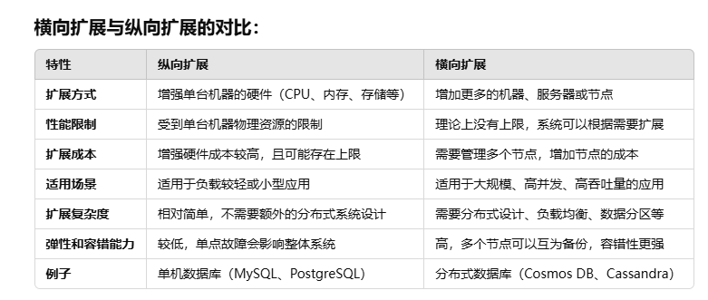

# 资料合集

## 查漏补缺
### NoSQL
NoSQL 是一个非关系型数据库的统称，它并不依赖于传统的表格结构和 SQL 查询语言。NoSQL 数据库有多种类型，包括键值存储、文档存储、列存储和图形存储。常见的 NoSQL 数据库有 MongoDB、Cassandra、Redis、Azure Cosmos DB 等。

## ACID
ACID (atomicity, consistency, isolation, durability) ：原子性、一致性、隔离性、持久性。

## LLM
LLM 是 "Large Language Model"（大型语言模型） 的缩写。

## 横向扩展 vs 纵向扩展

## 参考资料
- 可以通过下载本地模拟器进行练习：https://learn.microsoft.com/zh-cn/azure/cosmos-db/emulator-release-notes
- 微软文档：https://learn.microsoft.com/zh-cn/azure/cosmos-db/introduction （吐槽一下，写的实在是难理解）
- 矢量数据库：https://www.cnblogs.com/abclife/p/17993022
- 矢量数据库对比和选择指南：https://cloud.tencent.com/developer/article/2319360（推荐先看一下这个）