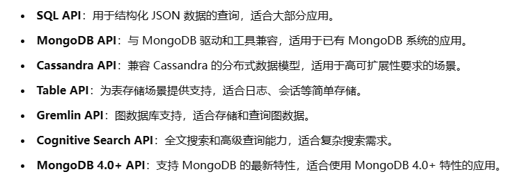
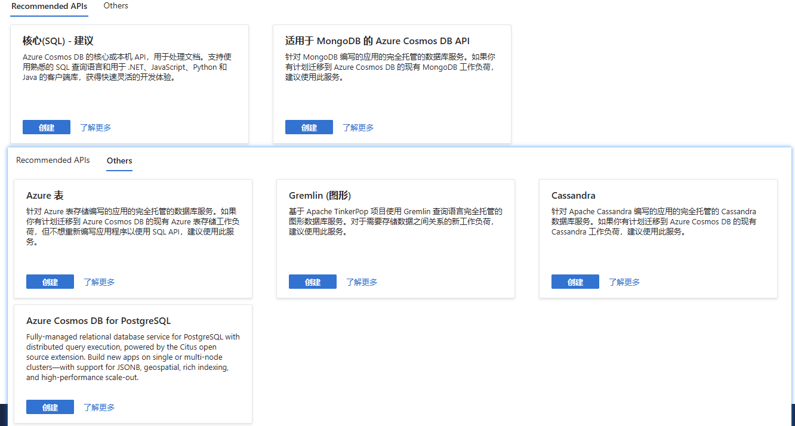
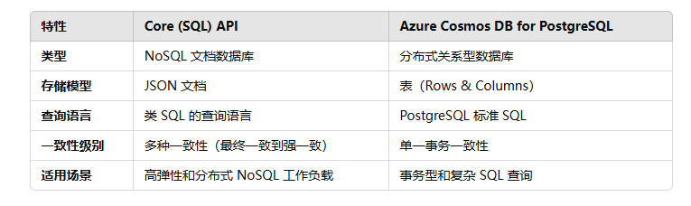
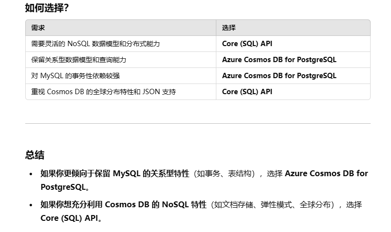
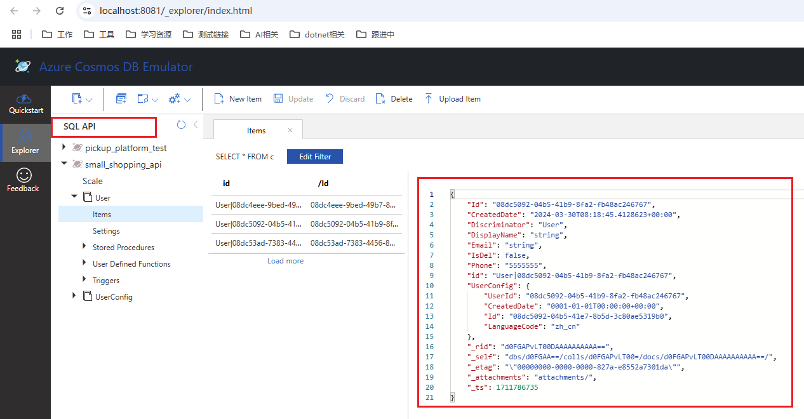

# cosmos基础
## 1 理解cosmos
Azure Cosmos DB 是由微软提供的 分布式多模型数据库服务，适用于任何规模的 NoSQL 和关系数据库。

背景：应用如果想要实现低延迟和高可用性，需要在靠近用户的数据中心部署这些应用程序的实例。如果应用集成大量的数据存储，同时连接到 MongoDB、Postgres、Redis 和 Gremlin等，这些数据库在时间工作流和操作性能方面不一样，为应用程序缩放带来复杂性。

azure cosmos db 通过集中使用一个数据库瞒住操作需求，适用于所有操作数据模型，包括关系、文档、矢量、键值、图形和表。非常适合需要以近实时响应时间处理全球规模的海量数据、读取和写入的解决方案。

适用cosmos的例子：适合用于 Web、移动、游戏和 IoT 用例。 在这些用例中，自动缩放、可预测的性能、毫秒响应时间的快速排序，以及查询无架构数据的能力非常重要。 

Azure Cosmos DB 提供多种数据库 API，应用程序可以通过这些 API 将 Azure Cosmos DB 视为如同其他各种数据库技术一样，并消除管理和缩放方法所产生的开销。也就是说我们可以用熟悉的方式（如 SQL、MongoDB、Cassandra 等）与它交互，同时享受 Cosmos DB 提供的全托管服务和自动扩展的能力，省去了传统数据库管理的复杂性。

<b>并不是说哪种数据库就一定用哪种api，主要是看数据库要以什么格式传输并存储在cosmos去选择api的。（这个一开始看文档的时候就被误导了）</b>

可以看下Core (SQL) API与Azure Cosmos DB for PostgreSQL的对比：

对于Mysql中的数据是如何选择的？

上面的cosmos管理平台，因为一开始我是用Mysql数据传输的数据，发现标记了SQL API，所以一直以为SQL API是关系型数据库的形式存储，其实不是，SQL API类型是NoSQL文档数据库，存储模型是JSON文档。这也是为什么上面说是根据cosmos的存储形式去选择API的原因。

## 2 矢量数据库
### 2.1 矢量数据库的理解
首先需要声明一点就是cosmos不是矢量数据库，但是它可以支持矢量的相关功能。（官方文档真的很多说的云里雾里，有疑惑的地方多查几篇文章结合GPT理解）

矢量数据库用于分析和生成式 AI 中的许多领域和情况，包括自然语言处理、视频和图像识别、推荐系统、搜索等。

创建向量也就是“**嵌入**”，比如一张小狗图嵌入就变成了（颜色：黄色，是否有毛：是，长度：40cm，...）这样一组向量（这是文字描述，实际是一组数字向量[0.3, 2, 0.5, ...]）。

矢量数据库本身不具备生成嵌入的能力，需要我们先用嵌入API或模型生成嵌入，然后再将这些嵌入存储到数据库中。

借助**矢量搜索**，可根据数据特征而不是属性字段上的精确匹配项来查找相似的项。

Azure Cosmos DB for NoSQL 是世界上首个无服务器 NoSQL 矢量数据库。（这里并不是实际上没有用服务器，而是说将服务器这个概念抽象隐藏，我们不用管理底层服务器资源）。它结合了 NoSQL 数据库 和 矢量数据库 的特性：
- NoSQL功能
    - 存储非结构化数据，如JSON文档
    - 提供灵活模式，横向扩展等NoSQL特性
- 矢量数据库功能
    - 支持存储和查询高纬嵌入向量
    - 实现向量相似性搜索，用于如推荐系统、图像搜索和自然语言处理等

### 2.2 Azure Cosmos DB for NoSQL中的矢量数据库
Azure Cosmos DB for NoSQL提供高效的矢量索引和搜索功能。

