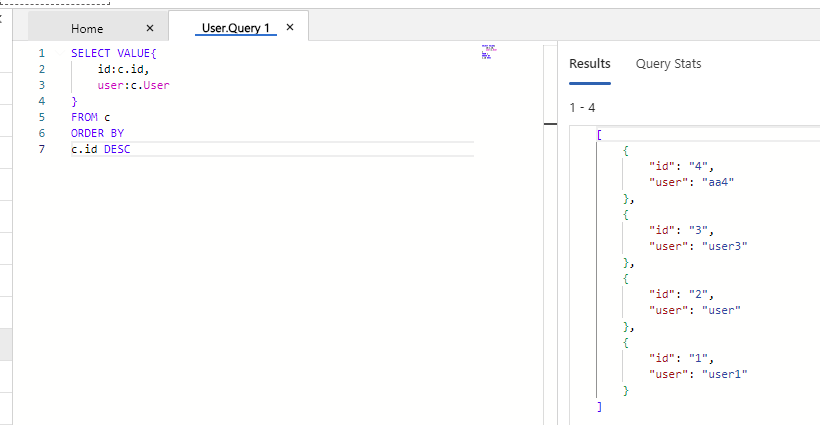

# NoSQL
## 1 概念
cosmos DB账户中实体层次结构：

## 2 NoSQL查询
类似SQL但这并不是传统的关系型数据库中的 SQL，而是针对 JSON 数据模型 设计的查询语言。

### 2.1 查询语法
1、查询两个静态变量值，返回一个数组，其中有一个对象包含着两个值， 由于值未命名，因此使用连续生成的数字来命名等效 json 字段。

2、对静态变量给定两个值的命名，外部 JSON 对象仍未命名，因此使用生成的数字 ($1) 来命名此字段。

3、 使用 VALUE 关键字来防止结果包装到另一个 JSON 对象中

4、容器中有数据时，查询全部数据

5、用Where筛选

6、Order BY 排序 

