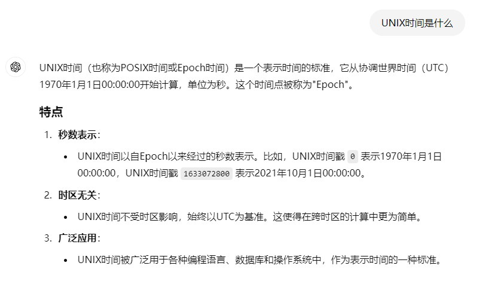
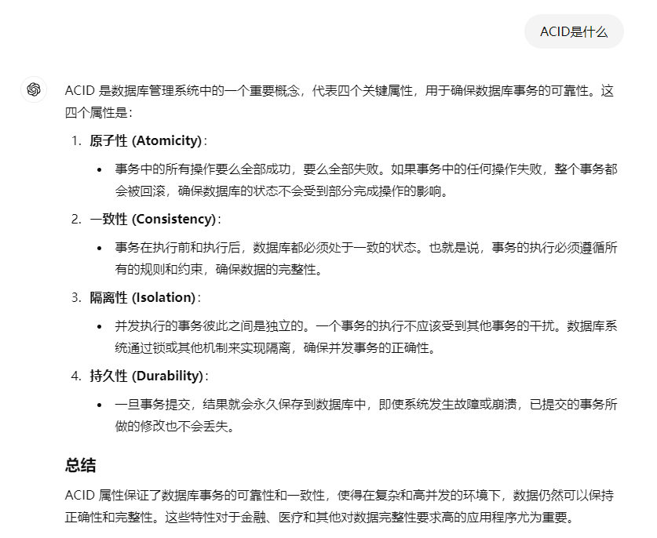

# 0-资料合集
## redis tip
基本准备，直接在docker desktop 下载redis即可，进入Terminal并输入redis-cli获取命令窗口。

Redis命令关键字不区分大小写，但为了区别自定义的键值，所以redis命令一律使用大写。

redis键的格式命名比较常用的有以下几种：
- 用冒号：article::\<id\>::\<attribute\>
- 用句号：article.\<id\>.\<attribute\>
- 用->：article->\<id\>->\<attribute\>

数据库键数量最多带来的问题：
- redis每创建一个键就需要消耗一定的额外资源（overhead）对键进行维护，所以键数量越多，消耗额外资源就会越多。对于单个数据库键来说，这些额外内存消耗几乎可以忽略不计，但当数量达到上百万，上千万时，这些额外内存消耗会变得可观。
- 散列包含的字段数比较少时，redis会用特殊内存优化结构存储散列中的字段和值。与字符串键相比，这种内存优化结构存储相同数据需要的内存要少的多。
- 除了需要消耗更多内存之外，数据库键也需要占用更多的cpu。数据库键越多，Redis处理所需的cpu资源会越多，耗时也越长。典型情况包括：
    - 统计数据库和数据库键使用情况
    - 对数据库执行持久化操作或根据持久化文件还原数据库
    - 通过模式匹配在数据库中查找某个键或执行类似的查找操作

## 查漏补缺
### 1、UNIX

### 2、ACID

## 学习资料
redis:
- redis使用手册：https://weread.qq.com/web/reader/75732070719551157574079kc81322c012c81e728d9d180

