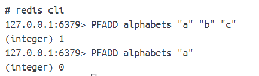
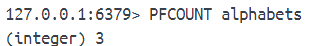
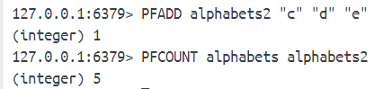
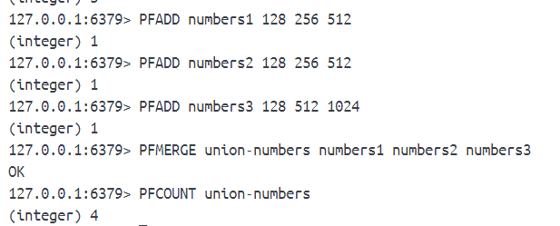

# 6-redis-HyperLogLog算法
有一个场景：我们的网站需要计算访问过网站的ip（唯一的），用set来存储唯一ip时有一个问题，随着使用人数的增加，计数元素不断增加，占用的内存会越来越大。

HyperLogLog是专门为了计算集合的基数而创建的概率算法。对于一个给定的集合，HyperLogLog可以计算出这个集合的近似基数。这个近似基数会比实际基数小一点或大一点，误差处在合理范围内。对于那些不需要知道实际基数或因为条件限制无法计算出实际基数的程序可以把近似基数当做集合的基数使用。

HyperLogLog优点是计算近似基数所需内存不会因为集合的大小而改变。而且用到的内存非常少。

redis每个HiperLogLog只需要使用12KB内存空间就可以对接近$2^{64}$个元素进行技术，算法的标准误差为0.81%，因此它计算出的近似基数是可信的。

对于redis提供的操作命令，我们可以：
- 对集合的元素进行技术
- 获取集合当前近似基数
- 合并多个HyperLogLog，合并后的HyperLogLog记录所有被计数集合的并集的近似基数

## 1、PFADD
**PFADD hyperloglog element [element ...]**

对给定的一个或多个集合元素进行计数。

- 如果给定所有元素都已经进行过计数，PFADD返回0，表示HyperLogLog计算出的近似基数没有发生变化
- 如果给定元素出现了至少一个之前没有进行过计数的元素，导致HyperLogLog计算出的近似基数发生变化，PFADD返回1

## 2、PFCOUNT
**PFCOUNT hyperloglog [hyperloglog ...]**

使用PFADD对元素进行计数后，通过PFCOUNT可以获取HyperLogLog为集合计算出的近似基数。

给定HyperLogLog不存在时返回0。

## 3、PFMERGE
**PFMERGE destination hyperloglog [hyperloglog ...]**

对多个给定hyperloglog执行并集计算，把计算得出的并集HyperLogLog保存到指定键中。

如果指定键存在，将会被覆盖。

