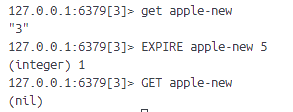
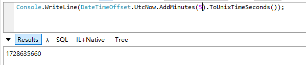
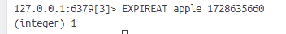
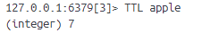

# 11-redis-自动过期
redis提供自动的键过期功能(key expiring)。避免需要在指定时间内手动执行删除操作的麻烦。

## 1、EXPIRE、PEXPIRE
秒级精度：**EXPIRE key seconds**
毫秒级精度：**PEXPIRE key milliseconds**

设置生存时间。在TTL内执行时更新TTL。

## 2、SET命令的EX选项和PX选项
SET命令和EXPIRE/PEXPIRE的组合很常见，所以在redis2.6.12版本开始为SET命令提供EX/PX选项。

**SET key value [EX seconds] [PX milliseconds]**

使用EX/PX选项的SET命令除了可以减少命令的调用次数外，更重要的是保证操作的原子性。

## 3、EXPIREAT、PEXPIREAT
**EXPIREAT key seconds_timestamp**
**PEXPIREAT key milliseconds_timestamp**

处理设置生存时间让键在指定秒数/毫秒数之后自动被移除以外，可以设置过期时间（expire time）让redis在指定UNIX时间来临之后自动移除给定键。（同样也是更新过期时间的命令）

生存时间和过期时间的设置都只能根据某个键，不能根据某个元素，比如只能针对集合设置过期时间，不能针对集合中某个元素设置过期时间。

## 4、TTL，PTL
**TTL key**

**PTL key**

获取键的剩余生存时间。

如果给定键存在但是没有设置生存时间，命令返回-1，如果给定键不存在，命令返回-2。

