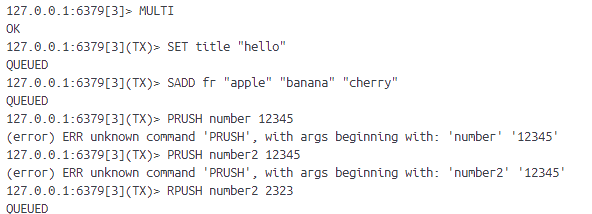
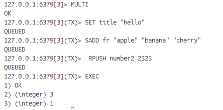
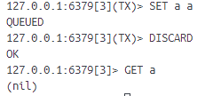
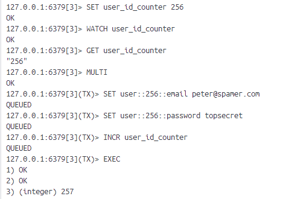

# 12-redis-流水线与事务
流水线可以有效提升redis程序的性能，事务可以避免单独执行命令时可能出现的一些错误。

## 1、流水线
一般情况下，用户每执行一个redis命令，redis客户端和redis服务器需要执行以下步骤：
- 客户端向服务器发送命令请求
- 服务器接收命令请求并执行，产生结果
- 服务器向客户端返回命令执行结果
- 客户端接收命令执行结果，向用户展示

与大多数网络程序一样，执行redis命令所消耗的大部分时间都用在发送命令请求和接收命令结果上面。所以命令越多，时间越长。

为了解决这个问题redis提供流水线特性：允许客户端把任意多条redis命令请求打包在一次，然后一次性发送给服务器，服务器处理后一次性返回所有执行结果。

redis服务器提供流水线特性，这个特性还需要客户端支持才能用。对于C#来说StackExchange.Redis是支持流水线的。具体可查看后面关于C#的篇章。

redis服务器不会限制客户端在流水线中包含的命令数，但会为客户端输入缓冲区设置默认值为1GB的体积上限，如果客户端发送的数据量超过这个上限，服务器将强制关闭客户端。另外，很多客户端本身也带有隐含的缓冲区大小限制。

## 2、事务
### 2.1 MULTI
**MULTI**
MULTI开启一个新的事务。成功返回OK。

（因为命令错误了，所以这个执行事务是失败的）

### 2.2 EXEC
**EXEC**
执行事务。

### 2.3 DISCARD

**DISCARD**
放弃事务。

### 2.4 事务的安全性
一般根据ACID性质的支持程度判断数据库的事务是否安全。
redis事务总是有ACID事务中的A、C、I性质。redis服务器运行在特定的持久化模式下时，事务也具有D性质。

### 2.5 事务对服务器的影响
事务在执行时会独占服务器，所以用户应该避免在事务中执行过多命令，以免造成阻塞。（因为redis是单线程的）

### 2.6 流水线与事务
流水线和事务概念上有些相似但作用不同：流水线是网络层面打包多个命令，执行时还是一个个执行的。事务是服务器层面多个命令打包，一并执行的。

很多客户端会使用流水线包裹事务命令并缓存到本地，等用户输入EXEC后再将所有事务命令通过流水线一并发送到服务器，达到【打包发送，打包执行】的效果。

## 3、带有乐观锁的事务
实现锁可以用字符串键值对实现（SET key value NX），但是释放锁是不安全的。

我们需要一种机制：锁键的值在GET命令执行之后发生了变化，DEL命令将不会被执行。在redis中，这种机制被称为乐观锁。

### 3.1 WATCH
**WATCH key [key ...]**

客户端通过执行WATCH命令，要求服务器对一个或多个数据库键进行监视。如果客户端尝试执行事务之前，这些键发送了变化，服务器将拒绝执行事务并返回空值。

这是个执行成功的例子，如果在事务执行之前，另外一个客户端修改了user_id_counter的值，那么该客户端执行EXRC时执行失败。

### 3.2 UNWATCH
**UNWATCH**
取消对所有键的监视。

